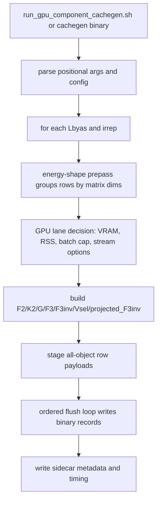
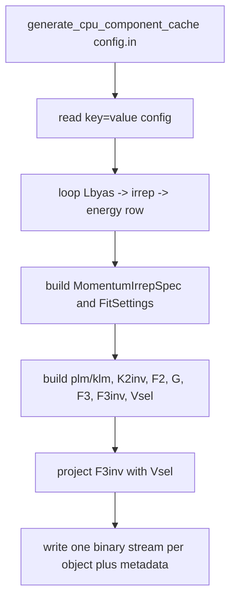
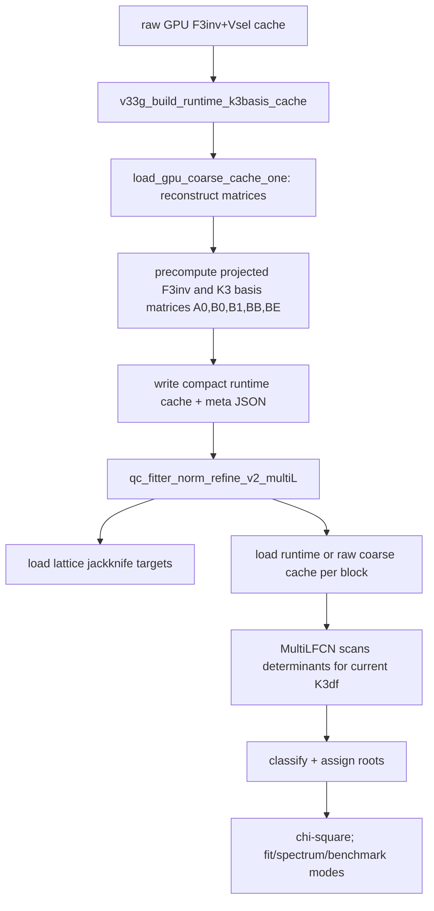

# KKpi Codebase Map for Codex

This guide is a static map of the uploaded KKpi code packages. It is meant to be the first file Codex reads before making any edits. It explains the package roles, physics/data flow, build/run commands, configuration options, change-routing rules, and a mechanically extracted function inventory.

## Uploaded package roles

| Package | Role | Use when |
| --- | --- | --- |
| `full_cache_generator_package_20260629-main` | v33d CPU/GPU component cache generator. Contains the production GPU cachegen plus CPU OpenMP reference generator and legacy source history. | Building F2, K2inv, G, F3, F3inv, Vsel, projected_F3inv caches. |
| `KKpi_v33o_production_fitter-main` | v33o production fitter snapshot. Contains source, configs, scripts, reports, and validation evidence for the v33n/v33o production workflow. | Running multi-L K3df fits, cutoff scans, QC spectra, benchmark FCN, plots, reports. |
| `kkpi-v33n-corrected-gpu-cache-reader-main` | Corrected GPU raw-cache reader package. It is almost the same production tree but explicitly documents the combined raw F3inv+Vsel cache-reader fix. | Debugging or modifying raw GPU cache reading/scaling/hermiticity/determinant logic. |

## Codex start-here prompt

Use this exact instruction when starting a new Codex session in this repo:

```text
Read CODEX_CODEBASE_GUIDE.md first. Before editing, identify which workflow you are touching: cache generation, raw-cache reader, runtime-cache builder, fitter FCN, classifier, plotting, or packaging. Preserve the invariants in the "Critical invariants" section. After editing, run the smallest validation command listed for that workflow and report files changed, commands run, and pass/fail evidence.
```

## Critical invariants that should not be broken

1. **Correct matrix scaling**: after projection use exactly `scaled_projected_QC = projected_QC / pow(Lbyas * xi, 6.0)`. Do not add determinant-level `Nproj` scaling.

2. **QC construction**: `QC = F3inv + K3df`; `projected_QC = Vsel.adjoint() * QC * Vsel`; determinant is taken after matrix-level scaling.

3. **Vsel convention**: the canonical Vsel procedure follows the CPU source path `generate_swave_cpu_cache_qc.cpp` and `fv_projector_cartesian_l1_v30m.hpp`; GPU Vsel must match this convention.

4. **Raw GPU cache reader**: the combined raw `F3inv+Vsel` cache stores raw `cuDoubleComplex` payloads and must be reconstructed format-aware. Bad reconstruction causes hermiticity error near 2 and imaginary determinant artifacts.

5. **Production fitter target logic**: targets are lattice jackknife levels under `Ecm_cutoff`; k-th lattice level maps to k-th accepted true zero for the same `(Lbyas, irrep)`.

6. **Classifier state**: v3 classifier is coarse-grid shoulder logic; exact/refined v2 behavior is an oracle/validation reference, not the production speed path unless explicitly requested.

7. **Large caches are external**: do not package or commit `bin/`, `build/`, `cache/`, `output*/`, `plots/`, or large generated binaries.

## High-level physics/data flow

```mermaid
flowchart TD
  A[Input physics constants and lattice targets] --> B[Momentum shells / plm_config / klm_config]
  B --> C[Two-body pieces: K2inv, F2, G]
  C --> D[F3 construction]
  D --> E[F3inv solve]
  B --> F[Irrep projector Vsel]
  E --> G[Raw or runtime cache]
  F --> G
  G --> H[Build K3df from K3iso0, K3iso1, K3B, K3E]
  H --> I[QC = F3inv + K3df]
  G --> I
  I --> J[projected_QC = Vsel^dagger QC Vsel]
  J --> K[scaled_projected_QC = projected_QC / (L xi)^6]
  K --> L[determinant scan on Ecm grid]
  L --> M[classifier: true_zero / pole / uncertain]
  M --> N[target assignment: lattice level k to true zero k]
  N --> O[chi2 and Minuit fit or spectrum-only output]
  O --> P[QC spectra, assignment files, plots, reports]
```

## Workflow diagrams

### GPU component cache generator



### CPU component cache generator



### v33g runtime cache builder and fitter



### Digonto classifier v3

```mermaid
flowchart TD
  A[adjacent determinant sign flip i,i+1] --> B[collect six points i-2..i+3]
  B --> C[scale by max absolute value in window]
  C --> D[left shoulder far-to-near: i-2,i-1,i]
  C --> E[right shoulder far-to-near: i+3,i+2,i+1]
  D --> F[dynamic three-to-two trimming if local extremum or internal sign issue]
  E --> F
  F --> G[zero-like: abs(y) decreases toward flip]
  F --> H[pole-like: abs(y) rises toward flip]
  G --> I{classification}
  H --> I
  I -->|zero-like and not pole-like| J[true_zero]
  I -->|pole-like and zero failed| K[pole]
  I -->|otherwise| L[uncertain]
```

## Canonical build and run commands

Run from the package root, using repo-relative paths.

### Production fitter

```bash
bash scripts/compile_v33g_all.sh
python3 scripts/validate_fitter_target_counts_v33k.py
stdbuf -oL -eL bin/v33f_k3df_fitter_multiL_v33e configs/config_v33m_multiL_all_irreps_fastest_production.in benchmark-fcn --repeat 10 --warmup 2
python3 scripts/run_v33n_cutoff_scan_fits.py
```

Useful fitter modes:

| Mode | Command shape | Purpose |
| --- | --- | --- |
| `fit` | `bin/v33f_k3df_fitter_multiL_v33e <config> fit` | Runs Minuit fit using current config. |
| `spectrum-only` / `spectrum` / `find-spectrum` | `bin/v33f_k3df_fitter_multiL_v33e <config> spectrum-only` | Skips Minuit and uses K3df guesses as fixed parameters; writes QC spectra. |
| `benchmark-fcn` | `bin/v33f_k3df_fitter_multiL_v33e <config> benchmark-fcn --repeat 10 --warmup 2` | Measures FCN phases and classifier timing. |
| `fcn-once` / `fcn` | `bin/v33f_k3df_fitter_multiL_v33e <config> fcn-once` | One FCN evaluation at starting K3df. |
| `dump-targets` | `bin/v33f_k3df_fitter_multiL_v33e <config> dump-targets` | Dumps target levels to diagnostics/reports. |
| `pipeline-test` | `bin/v33f_k3df_fitter_multiL_v33e <config> pipeline-test` | Tests block loading/classifier pipeline without fitting. |

### GPU component cache generator

```bash
bash gpu_component_cachegen/scripts/compile_gpu_component_cachegen.sh
bash gpu_component_cachegen/scripts/run_gpu_component_cachegen.sh gpu_component_cachegen/configs/config_gpu_component_cachegen_sep_f2k2_coarse20000.sh
```

Direct binary shape:

```bash
gpu_component_cachegen/bin/cachegen_gpu_v32zu_allobj_qc <Lbyas> <xi> <Ecm_min> <Ecm_max> <coarseN> <output_dir> [debug] [max_batch_energies] [gpu_memory_safety_fraction] [use_fused_f2k2] [validate_fused_f2k2] [use_kinematic_precompute] [use_stream_pipeline] [use_multi_gpu] [use_mixed_precision_f2k2] [use_concurrent_streams] [concurrent_streams_safety_fraction] [irreps_csv]
```

### CPU component cache generator

```bash
bash cpu_component_cachegen/scripts/compile_cpu_component_cachegen.sh
cpu_component_cachegen/bin/generate_cpu_component_cache cpu_component_cachegen/configs/config_cpu_component_cachegen.in
```

## Change-routing table for Codex

| User asks to change... | Start in these files | Minimum validation |
| --- | --- | --- |
| Raw GPU cache reader, row reconstruction, hermiticity, `F3inv+Vsel` payload | `source/qc_fitter_norm_refine_v2_multiL.cpp`, `source/v33g_build_runtime_k3basis_cache.cpp`, `source/extract_F3inv_isotropic_from_gpu_cache_v33a.cpp` | Re-run corrected determinant scan/reader validation; confirm `max |det_imag| = 0` or roundoff. |
| Runtime K3-basis cache format | `source/v33g_runtime_k3basis_cache.hpp`, `source/v33g_build_runtime_k3basis_cache.cpp`, `source/v33g_validate_runtime_vs_v33f.cpp` | `bash scripts/run_v33g_validate_runtime_vs_v33f.sh`. |
| FCN speed, target assignment, multi-L fit logic | `source/qc_fitter_norm_refine_v2_multiL.cpp` and `source/K3df_minuit_fit_v32f_fullF3inv_QCfull_cached_classifier.hpp` | `benchmark-fcn --repeat 10 --warmup 2` and target parity script. |
| Classifier rules | `source/digonto_classifier_v3.hpp`, `scripts/verify_classifier_dispatch_v33m.py`, `scripts/plot_classifier_algorithm_sweep_v33l.py` | classifier dispatch audit + target count parity + benchmark. |
| Cutoff scan or production reporting | `scripts/run_v33n_cutoff_scan_fits.py`, `configs/v33n_cutoff_scan/*.in`, `reports/v33n_cutoff_scan/*` | Run one cutoff first, then full scan. |
| Plot appearance only | `scripts/plot_*.py` | Recreate one PNG/PDF and compare labels/legend/ranges. |
| GPU cache generation kernels/scheduling | `gpu_component_cachegen/source/F3_gpu_cachegen_v32zu.cu`, GPU helper `.cuh` files | Small coarseN smoke, then target irrep, then production coarseN. |
| CPU reference cache generation | `cpu_component_cachegen/source/generate_cpu_component_cache.cpp`, `legacy_source/generate_swave_cpu_cache_qc.cpp` | Small CPU cache, compare selected rows/matrices to GPU. |

## Configuration option map

Detected options from config/scripts are listed below. The most important options have explicit meanings; rare build variables are marked as inspect-before-change.

| Option | Meaning / how Codex should treat it | Count |
| --- | --- | ---: |
| `coarseN` | number of coarse energy rows/grid points. | 121 |
| `omp_threads` | OpenMP thread count. | 116 |
| `waves_vec_1` | partial waves for pair channel 1; production uses 0 1 for s+p. | 114 |
| `waves_vec_2` | partial waves for pair channel 2; production uses 0. | 114 |
| `atmpi` | pion mass in temporal lattice units; active default 0.06906. | 114 |
| `atmK` | kaon mass in temporal lattice units; active default 0.09698. | 114 |
| `eta_1` | flavor/symmetry factor for pair-1 channel; default 1.0. | 114 |
| `eta_2` | flavor/symmetry factor for pair-2 channel; default 0.5. | 114 |
| `alpha` | smooth cutoff/form-factor alpha; default 0.5. | 114 |
| `epsilon_h` | H-function regulator epsilon; default 0. | 114 |
| `max_shell_num` | maximum spectator shell count for basis/config generation. | 114 |
| `tolerance` | numeric shell/config tolerance. | 114 |
| `parity` | projector parity; production default -1 for A*m/A2 path. | 114 |
| `eig_tol` | projector/eigenvalue acceptance tolerance. | 114 |
| `norm_tol` | normalization tolerance for Vsel/projector vectors. | 114 |
| `proj_tol` | projection tolerance for Vsel/projector basis. | 114 |
| `list_of_mom` | irrep/momentum labels for fitter scans. | 114 |
| `xival` | anisotropy xi; active default 3.444. | 114 |
| `output_dir` | main output directory. | 114 |
| `scatter1_00` | two-body scattering parameter for pair channel 1 s-wave; production default 4.04. | 112 |
| `scatter2_00` | two-body scattering parameter for pair channel 2 s-wave; production default 4.12. | 112 |
| `scan_E0` | scan lower Ecm. | 112 |
| `scan_E1` | scan upper Ecm. | 112 |
| `output_tag` | output file prefix/tag. | 112 |
| `debug` | debug verbosity flag. | 106 |
| `scatter1_10` | two-body scattering parameter for pair channel 1 p-wave; production default -43.2. | 88 |
| `Lval` | single-L value for older scans. | 72 |
| `refineN` | refinement grid count in older workflows. | 68 |
| `use_lattice_covariance` | use covariance/correlation matrix from jackknife targets. | 64 |
| `energy_cutoff` | older synonym/cutoff in some configs. | 64 |
| `chi_square_mode` | chi-square mode, e.g. covariance/correlation/diagonal handling. | 60 |
| `failure_penalty` | large FCN penalty when a target level cannot be matched. | 56 |
| `K3iso0_guess` | starting value for K3iso0. | 56 |
| `K3iso1_guess` | starting value for K3iso1. | 56 |
| `K3B_guess` | starting value for K3B. | 56 |
| `K3E_guess` | starting value for K3E. | 56 |
| `print_each_fcn_eval` | configuration/build option detected in configs/scripts; inspect the specific config file before changing. | 56 |
| `print_every_fcn_eval` | configuration/build option detected in configs/scripts; inspect the specific config file before changing. | 56 |
| `v2_refine_points` | old v2 exact/refined root points. | 56 |
| `v2_zero_ratio` | v2 true-zero ratio threshold. | 56 |
| `K3iso0_step` | Minuit step for K3iso0. | 54 |
| `K3iso1_step` | Minuit step for K3iso1. | 54 |
| `K3B_step` | Minuit step for K3B. | 54 |
| `K3E_step` | Minuit step for K3E. | 54 |
| `use_parameter_limits` | enable Minuit lower/upper bounds. | 54 |
| `const_norm_power` | configuration/build option detected in configs/scripts; inspect the specific config file before changing. | 52 |
| `v2_max_split_depth` | v2/refined split depth. | 52 |
| `nonint_nmax` | configuration/build option detected in configs/scripts; inspect the specific config file before changing. | 48 |
| `Lbyas_values` | list of spatial box sizes to run, normally 20 and 24. | 44 |
| `Q0norm` | normalization convention flag/value for Q0. | 44 |
| `sort_orbit_flag` | controls orbit sorting convention. | 44 |
| `plot_show` | display plots interactively if supported. | 44 |
| `nonint_nsq_max` | configuration/build option detected in configs/scripts; inspect the specific config file before changing. | 42 |
| `energy_group_tol` | configuration/build option detected in configs/scripts; inspect the specific config file before changing. | 42 |
| `zero_minabs_eig_max` | configuration/build option detected in configs/scripts; inspect the specific config file before changing. | 42 |
| `zero_min_sv_max` | configuration/build option detected in configs/scripts; inspect the specific config file before changing. | 42 |
| `candidate_merge_tol` | configuration/build option detected in configs/scripts; inspect the specific config file before changing. | 42 |
| `oracle_match_tol` | configuration/build option detected in configs/scripts; inspect the specific config file before changing. | 42 |
| `refine_iter` | iteration count for root refinement. | 42 |
| `smoke_test` | configuration/build option detected in configs/scripts; inspect the specific config file before changing. | 42 |
| `smoke_only` | configuration/build option detected in configs/scripts; inspect the specific config file before changing. | 42 |
| `audit_eigenbranch_detail` | configuration/build option detected in configs/scripts; inspect the specific config file before changing. | 42 |
| `refine_zero_roots` | configuration/build option detected in configs/scripts; inspect the specific config file before changing. | 42 |
| `make_plots` | enable plot generation. | 42 |
| `plot_nscale` | determinant n-scale exponent count for plotting. | 42 |
| `classifier_mode` | classifier dispatch mode; production uses digonto_v3_window in newer configs. | 42 |
| `lattice_jackknife_dir` | directory of lattice spectrum jackknife files. | 40 |
| `lattice_jack_energy_type` | raw input energy type; En_lab vs Ecm conversion control. | 40 |
| `jack_skip_header_lines` | number of header lines to skip in jackknife files. | 40 |
| `jack_energy_column` | 1-based column containing lattice energy samples. | 40 |
| `Ecm_cutoff` | target lattice-level cutoff for fitter. | 40 |
| `irreps_L20` | irreps to use for Lbyas=20 lattice targets. | 40 |
| `irreps_L24` | irreps to use for Lbyas=24 lattice targets. | 40 |
| `gpu_cachegen_Ecm_min` | Ecm_min passed when auto-building missing GPU caches. | 40 |
| `gpu_cachegen_Ecm_max` | Ecm_max passed when auto-building missing GPU caches. | 40 |
| `gpu_cachegen_coarseN` | coarseN passed when auto-building missing GPU caches. | 40 |
| `auto_build_missing_coarse` | auto-run GPU cachegen for missing coarse caches. | 40 |
| `coarse_cache_root` | root directory where coarse raw GPU caches live. | 40 |
| `use_gpu_cache_meta_validation` | validate cache sidecar metadata before reuse. | 40 |
| `refined_cache_dir` | directory for refined root/energy caches. | 40 |
| `refined_cache_prefix` | prefix for refined cache files. | 40 |
| `save_refined_cache` | save refined candidates/results for reuse. | 40 |
| `max_fcn` | maximum FCN calls for fit. | 40 |
| `v3_monotone_tol` | v3 shoulder monotonicity tolerance. | 36 |
| `v3_min_drop_fraction` | minimum shoulder drop fraction for zero-like classification. | 36 |
| `v3_min_pole_rise_fraction` | minimum rise fraction for pole-like classification. | 36 |
| `v3_require_both_shoulders` | if 1, both shoulders must be zero-like. | 36 |
| `signflip_refine_enable` | enable sign-flip local refinement. | 30 |
| `signflip_refine_points` | number of points in sign-flip refinement. | 30 |
| `write_cache_grid` | write cache-grid diagnostics. | 30 |
| `save_binary_f3inv_cache` | configuration/build option detected in configs/scripts; inspect the specific config file before changing. | 30 |
| `load_binary_f3inv_cache` | configuration/build option detected in configs/scripts; inspect the specific config file before changing. | 30 |
| `binary_f3inv_cache_file` | configuration/build option detected in configs/scripts; inspect the specific config file before changing. | 30 |
| `max_total_lattice_levels` | global target truncation for smoke tests. | 30 |
| `max_lattice_levels_per_block` | per-(L,irrep) target truncation for smoke tests. | 30 |
| `require_existing_binary_f3inv_cache` | configuration/build option detected in configs/scripts; inspect the specific config file before changing. | 26 |
| `iterative_refine_max_rounds` | configuration/build option detected in configs/scripts; inspect the specific config file before changing. | 24 |
| `iterative_refine_tol` | configuration/build option detected in configs/scripts; inspect the specific config file before changing. | 24 |
| `ensemble` | configuration/build option detected in configs/scripts; inspect the specific config file before changing. | 24 |
| `max_state` | configuration/build option detected in configs/scripts; inspect the specific config file before changing. | 24 |
| `masses_path` | configuration/build option detected in configs/scripts; inspect the specific config file before changing. | 24 |
| `print_found_files` | configuration/build option detected in configs/scripts; inspect the specific config file before changing. | 24 |
| `param_lower` | parameter lower bounds. | 24 |
| `param_upper` | parameter upper bounds. | 24 |
| `v33g_runtime_cache_root` | root directory for compact v33g runtime caches. | 24 |
| `ROOT` | configuration/build option detected in configs/scripts; inspect the specific config file before changing. | 22 |
| `digonto_classifier_v1_orientation` | configuration/build option detected in configs/scripts; inspect the specific config file before changing. | 22 |
| `digonto_classifier_v1_peak_ratio` | configuration/build option detected in configs/scripts; inspect the specific config file before changing. | 22 |
| `digonto_classifier_v1_outer_points` | configuration/build option detected in configs/scripts; inspect the specific config file before changing. | 22 |
| `digonto_classifier_v1_core_points` | configuration/build option detected in configs/scripts; inspect the specific config file before changing. | 22 |
| `cache_backend` | which cache backend to use; e.g. coarse/raw or v33g runtime. | 22 |
| `require_existing_v33g_runtime_cache` | fail if runtime cache is missing instead of rebuilding. | 22 |
| `build_v33g_runtime_if_missing` | auto-build runtime cache from raw cache if missing. | 22 |
| `iterative_refine_enable` | configuration/build option detected in configs/scripts; inspect the specific config file before changing. | 18 |
| `use_digonto_classifier_v1` | configuration/build option detected in configs/scripts; inspect the specific config file before changing. | 18 |
| `classifier_peak_ratio_min` | configuration/build option detected in configs/scripts; inspect the specific config file before changing. | 18 |
| `classifier_shoulder_gap` | configuration/build option detected in configs/scripts; inspect the specific config file before changing. | 18 |
| `zero_energy_mode` | configuration/build option detected in configs/scripts; inspect the specific config file before changing. | 18 |
| `write_bestfit_qc_grid` | write best-fit QC scan grid for plotting. | 14 |
| `lattice_energy_type` | configuration/build option detected in configs/scripts; inspect the specific config file before changing. | 14 |
| `CFG` | configuration/build option detected in configs/scripts; inspect the specific config file before changing. | 14 |
| `CXX` | configuration/build option detected in configs/scripts; inspect the specific config file before changing. | 13 |
| `CONFIG` | configuration/build option detected in configs/scripts; inspect the specific config file before changing. | 12 |
| `v2_refined_binary_cache_file` | configuration/build option detected in configs/scripts; inspect the specific config file before changing. | 12 |
| `HAS_MINUIT2` | configuration/build option detected in configs/scripts; inspect the specific config file before changing. | 12 |
| `EIGEN_INC` | configuration/build option detected in configs/scripts; inspect the specific config file before changing. | 10 |
| `iterative_signflip_refine_enable` | configuration/build option detected in configs/scripts; inspect the specific config file before changing. | 10 |
| `iterative_refineN` | configuration/build option detected in configs/scripts; inspect the specific config file before changing. | 10 |
| `K3iso0` | configuration/build option detected in configs/scripts; inspect the specific config file before changing. | 10 |
| `K3iso1` | configuration/build option detected in configs/scripts; inspect the specific config file before changing. | 10 |
| `K3B` | configuration/build option detected in configs/scripts; inspect the specific config file before changing. | 10 |
| `K3E` | configuration/build option detected in configs/scripts; inspect the specific config file before changing. | 10 |
| `RUNTIME` | configuration/build option detected in configs/scripts; inspect the specific config file before changing. | 10 |
| `output_root` | cachegen output root. | 8 |
| `irreps` | irrep list for cache generator. | 8 |
| `gpu_cachegen_root` | configuration/build option detected in configs/scripts; inspect the specific config file before changing. | 8 |
| `Ecm_min` | cache-generator lower Ecm. | 6 |
| `Ecm_max` | cache-generator upper Ecm. | 6 |
| `xi` | anisotropy xi for cache generator. | 6 |
| `OUT` | configuration/build option detected in configs/scripts; inspect the specific config file before changing. | 6 |
| `nonint_double_cover` | configuration/build option detected in configs/scripts; inspect the specific config file before changing. | 6 |
| `use_fused_f2k2` | toggle fused F2/K2 GPU kernel path. | 5 |
| `s` | configuration/build option detected in configs/scripts; inspect the specific config file before changing. | 5 |
| `validate_fused_f2k2` | cross-check fused and reference F2/K2. | 4 |
| `use_kinematic_precompute` | precompute kinematic pieces in GPU cachegen. | 4 |
| `use_stream_pipeline` | enable stream pipeline path. | 4 |
| `max_batch_energies` | GPU cachegen max energy rows per batch; 0 means auto. | 4 |
| `gpu_memory_safety_fraction` | fraction of free VRAM allowed for GPU batches. | 4 |
| `use_concurrent_streams` | enable concurrent CUDA streams. | 4 |
| `concurrent_streams_safety_fraction` | VRAM safety fraction for concurrent streams. | 4 |
| `use_multi_gpu` | enable multi-GPU scheduling if built/supported. | 4 |
| `use_mixed_precision_f2k2` | enable mixed precision F2/K2 path if compiled. | 4 |
| `run_fixed_spectrum_after_fit` | configuration/build option detected in configs/scripts; inspect the specific config file before changing. | 4 |
| `run_plot_after_fit` | configuration/build option detected in configs/scripts; inspect the specific config file before changing. | 4 |
| `v2_pole_ratio` | configuration/build option detected in configs/scripts; inspect the specific config file before changing. | 4 |
| `v2_pole_threshold` | configuration/build option detected in configs/scripts; inspect the specific config file before changing. | 4 |
| `v2_save_refined_binary_cache` | configuration/build option detected in configs/scripts; inspect the specific config file before changing. | 4 |
| `force_rebuild` | configuration/build option detected in configs/scripts; inspect the specific config file before changing. | 4 |
| `THREADS` | configuration/build option detected in configs/scripts; inspect the specific config file before changing. | 4 |
| `OMP_NUM_THREADS` | configuration/build option detected in configs/scripts; inspect the specific config file before changing. | 4 |
| `MINUIT2_ROOT` | configuration/build option detected in configs/scripts; inspect the specific config file before changing. | 4 |
| `LD_LIBRARY_PATH` | configuration/build option detected in configs/scripts; inspect the specific config file before changing. | 4 |
| `CONFIG_DIR` | configuration/build option detected in configs/scripts; inspect the specific config file before changing. | 3 |
| `OUTDIR` | configuration/build option detected in configs/scripts; inspect the specific config file before changing. | 3 |
| `default_step_size` | configuration/build option detected in configs/scripts; inspect the specific config file before changing. | 2 |
| `EXTRA_DEFINES` | configuration/build option detected in configs/scripts; inspect the specific config file before changing. | 2 |
| `BIN` | configuration/build option detected in configs/scripts; inspect the specific config file before changing. | 2 |
| `RUNMODE` | configuration/build option detected in configs/scripts; inspect the specific config file before changing. | 2 |
| `x` | configuration/build option detected in configs/scripts; inspect the specific config file before changing. | 2 |
| `idx` | configuration/build option detected in configs/scripts; inspect the specific config file before changing. | 2 |
| `print_every_percent` | configuration/build option detected in configs/scripts; inspect the specific config file before changing. | 2 |
| `nonint_output_dir` | configuration/build option detected in configs/scripts; inspect the specific config file before changing. | 2 |
| `v33e_cache_root` | configuration/build option detected in configs/scripts; inspect the specific config file before changing. | 2 |
| `XI` | configuration/build option detected in configs/scripts; inspect the specific config file before changing. | 2 |
| `COARSEN` | configuration/build option detected in configs/scripts; inspect the specific config file before changing. | 2 |
| `CACHE_ROOT` | configuration/build option detected in configs/scripts; inspect the specific config file before changing. | 2 |
| `CACHE` | configuration/build option detected in configs/scripts; inspect the specific config file before changing. | 2 |
| `TEMPLATE` | configuration/build option detected in configs/scripts; inspect the specific config file before changing. | 2 |
| `L` | configuration/build option detected in configs/scripts; inspect the specific config file before changing. | 2 |
| `IRREP` | configuration/build option detected in configs/scripts; inspect the specific config file before changing. | 2 |
| `TMP` | configuration/build option detected in configs/scripts; inspect the specific config file before changing. | 2 |
| `V32ZU_CONFIG` | configuration/build option detected in configs/scripts; inspect the specific config file before changing. | 2 |
| `TOOL` | configuration/build option detected in configs/scripts; inspect the specific config file before changing. | 2 |
| `src` | configuration/build option detected in configs/scripts; inspect the specific config file before changing. | 2 |
| `out` | configuration/build option detected in configs/scripts; inspect the specific config file before changing. | 2 |
| `text` | configuration/build option detected in configs/scripts; inspect the specific config file before changing. | 2 |
| `lines` | configuration/build option detected in configs/scripts; inspect the specific config file before changing. | 2 |
| `SRC` | configuration/build option detected in configs/scripts; inspect the specific config file before changing. | 1 |
| `LEGACY_INC` | configuration/build option detected in configs/scripts; inspect the specific config file before changing. | 1 |
| `CUDA_ARCH_FLAGS` | configuration/build option detected in configs/scripts; inspect the specific config file before changing. | 1 |
| `NVCC_DIAG_SUPPRESS_FLAGS` | configuration/build option detected in configs/scripts; inspect the specific config file before changing. | 1 |
| `HOST_WARNING_SUPPRESS_FLAGS` | configuration/build option detected in configs/scripts; inspect the specific config file before changing. | 1 |
| `MIXED_PRECISION_FLAG` | configuration/build option detected in configs/scripts; inspect the specific config file before changing. | 1 |
| `CONCURRENT_STREAMS_FLAG` | configuration/build option detected in configs/scripts; inspect the specific config file before changing. | 1 |
| `ALLOBJ_FLAG` | configuration/build option detected in configs/scripts; inspect the specific config file before changing. | 1 |
| `V32ZU_ALLOBJ_QC` | configuration/build option detected in configs/scripts; inspect the specific config file before changing. | 1 |
| `LVALUES` | configuration/build option detected in configs/scripts; inspect the specific config file before changing. | 1 |
| `LMIN` | configuration/build option detected in configs/scripts; inspect the specific config file before changing. | 1 |
| `LMAX` | configuration/build option detected in configs/scripts; inspect the specific config file before changing. | 1 |
| `STEP` | configuration/build option detected in configs/scripts; inspect the specific config file before changing. | 1 |
| `D` | configuration/build option detected in configs/scripts; inspect the specific config file before changing. | 1 |
| `lm` | configuration/build option detected in configs/scripts; inspect the specific config file before changing. | 1 |
| `vals` | configuration/build option detected in configs/scripts; inspect the specific config file before changing. | 1 |
| `RANGE_START` | configuration/build option detected in configs/scripts; inspect the specific config file before changing. | 1 |
| `LTAG` | configuration/build option detected in configs/scripts; inspect the specific config file before changing. | 1 |
| `LSTART` | configuration/build option detected in configs/scripts; inspect the specific config file before changing. | 1 |
| `LEND` | configuration/build option detected in configs/scripts; inspect the specific config file before changing. | 1 |
| `LSEC` | configuration/build option detected in configs/scripts; inspect the specific config file before changing. | 1 |
| `RANGE_END` | configuration/build option detected in configs/scripts; inspect the specific config file before changing. | 1 |
| `RANGE_SEC` | configuration/build option detected in configs/scripts; inspect the specific config file before changing. | 1 |
| `IFS` | configuration/build option detected in configs/scripts; inspect the specific config file before changing. | 1 |
| `PKG_ROOT` | configuration/build option detected in configs/scripts; inspect the specific config file before changing. | 1 |
| `COMMON_FLAGS` | configuration/build option detected in configs/scripts; inspect the specific config file before changing. | 1 |
| `INCLUDES` | configuration/build option detected in configs/scripts; inspect the specific config file before changing. | 1 |

## Source clusters by package

### `cache_generator`

#### `legacy_source/`
- `legacy_source/F2_functions.h` — Header/helper library; defines reusable types/functions used by executable source files. Functions: I0F, I00_sum_F, I00_sum_F_1, F2_i1, F2_i1_1, F2_i_mat, F2_i_mat_1.
- `legacy_source/F2_functions_v2.h` — Header/helper library; defines reusable types/functions used by executable source files. Classes/structs: NeumaierComplexSum, NeumaierComplexSum, NeumaierDouble, NeumaierComplexDouble. Functions: smallest_eigenvalue, sorted_neumaier_sum, print_and_test_vector_sum, add, result, add, result, precise_vector_sum, add, add, ... +12 more.
- `legacy_source/F2_gpu_safe_builder.cuh` — GPU-safe F2 construction helpers/kernels. Classes/structs: F2GpuOptions, FlatConfig, DeviceBuffer, DeviceFlatConfig. Functions: check_cuda, zmake, zre, zim, zadd, zsub, zmul, zmul_real, zdiv, zdiv_real, ... +31 more.
- `legacy_source/F3_cpu_openmp_v21_side_abs_refinement.cu` — Executable or implementation source; usually has a main() or specialized test/debug entry point. Classes/structs: F3Hdf5OpenMode, F3ScopedTimer, T, ThreadSafeQueue, EnergyMatrixPack, EnergyGpuResult, CpuGpuChunk, F3MatrixSaveOptions. Functions: f3_throwOnCuda, f3_throwOnCublas, f3_cudaSyncCheck, ~F3ScopedTimer, push, pop, close, f3_should_save_matrix_point, f3_make_auto_hdf5_matrix_filename, f3_packEigenToHostCublas, ... +29 more.
- `legacy_source/F3_cpu_openmp_v22_multi_signflip_side_abs_refinement.cu` — Executable or implementation source; usually has a main() or specialized test/debug entry point. Classes/structs: F3Hdf5OpenMode, F3ScopedTimer, T, ThreadSafeQueue, EnergyMatrixPack, EnergyGpuResult, CpuGpuChunk, F3MatrixSaveOptions. Functions: f3_throwOnCuda, f3_throwOnCublas, f3_cudaSyncCheck, ~F3ScopedTimer, push, pop, close, f3_should_save_matrix_point, f3_make_auto_hdf5_matrix_filename, f3_packEigenToHostCublas, ... +31 more.
- `legacy_source/F3_cpu_openmp_v22_multi_signflip_side_abs_refinement_Lbyas_arg.cu` — Executable or implementation source; usually has a main() or specialized test/debug entry point. Classes/structs: F3Hdf5OpenMode, F3ScopedTimer, T, ThreadSafeQueue, EnergyMatrixPack, EnergyGpuResult, CpuGpuChunk, F3MatrixSaveOptions. Functions: f3_throwOnCuda, f3_throwOnCublas, f3_cudaSyncCheck, ~F3ScopedTimer, push, pop, close, f3_should_save_matrix_point, f3_make_auto_hdf5_matrix_filename, f3_packEigenToHostCublas, ... +31 more.
- `legacy_source/F3_cpu_openmp_v22_multi_signflip_side_abs_refinement_Lbyas_arg_compilefix2.cu` — Executable or implementation source; usually has a main() or specialized test/debug entry point. Classes/structs: F3Hdf5OpenMode, F3ScopedTimer, T, ThreadSafeQueue, EnergyMatrixPack, EnergyGpuResult, CpuGpuChunk, F3MatrixSaveOptions. Functions: f3_throwOnCuda, f3_throwOnCublas, f3_cudaSyncCheck, ~F3ScopedTimer, push, pop, close, f3_should_save_matrix_point, f3_make_auto_hdf5_matrix_filename, f3_packEigenToHostCublas, ... +31 more.
- `legacy_source/F3_cpu_openmp_v23_pure_cpu_multi_signflip_side_abs_refinement.cpp` — Executable or implementation source; usually has a main() or specialized test/debug entry point. Classes/structs: LocalScopedTimer, PhysicsParams, EvalResult, ScanPoint, SignFlip, ClassifyResult, RefineTask. Functions: ~LocalScopedTimer, PhysicsParams, nnP_tag_string, L_tag, determinant_via_partial_piv_lu, evaluate_one_energy_cpu_eigen, run_scan_cpu_openmp, find_sign_flips, trend_fraction, classify_one_subflip_side_abs, ... +3 more.
- `legacy_source/F3_cpu_openmp_v23_pure_cpu_multi_signflip_side_abs_refinement_compilefix1.cpp` — Executable or implementation source; usually has a main() or specialized test/debug entry point. Classes/structs: LocalScopedTimer, PhysicsParams, EvalResult, ScanPoint, SignFlip, ClassifyResult, RefineTask. Functions: ~LocalScopedTimer, PhysicsParams, nnP_tag_string, L_tag, determinant_via_partial_piv_lu, evaluate_one_energy_cpu_eigen, run_scan_cpu_openmp, find_sign_flips, trend_fraction, classify_one_subflip_side_abs, ... +3 more.
- `legacy_source/F3_cpu_openmp_v24_K3QC_core.hpp` — Header/helper library; defines reusable types/functions used by executable source files. Classes/structs: LocalScopedTimer, PhysicsParams, EvalResult, ScanPoint, SignFlip, ClassifyResult, RefineTask. Functions: ~LocalScopedTimer, PhysicsParams, nnP_tag_string, L_tag, determinant_via_partial_piv_lu, evaluate_one_energy_cpu_eigen_v24_QC, run_scan_cpu_openmp_silent, find_sign_flips, trend_fraction, classify_one_subflip_side_abs, ... +1 more.
- `legacy_source/F3_cpu_openmp_v24_K3_QC_multi_signflip_side_abs_refinement.cpp` — Executable or implementation source; usually has a main() or specialized test/debug entry point. Classes/structs: LocalScopedTimer, PhysicsParams, EvalResult, ScanPoint, SignFlip, ClassifyResult, RefineTask. Functions: ~LocalScopedTimer, PhysicsParams, nnP_tag_string, L_tag, determinant_via_partial_piv_lu, evaluate_one_energy_cpu_eigen_v24_QC, run_scan_cpu_openmp, find_sign_flips, trend_fraction, classify_one_subflip_side_abs, ... +3 more.
- `legacy_source/F3_cpu_openmp_v25_K3QC_cached_core.hpp` — Header/helper library; defines reusable types/functions used by executable source files. Classes/structs: LocalScopedTimer, PhysicsParams, EvalResult, F3iProjectedCacheEntry, F3iProjectedCache, ScanPoint, SignFlip, ClassifyResult. Functions: ~LocalScopedTimer, PhysicsParams, clear, size, cache_key_v25, nnP_tag_string, L_tag, determinant_via_partial_piv_lu, evaluate_one_energy_cpu_eigen_v24_QC, build_F3i_projected_cache_entry_v25, ... +7 more.
- `legacy_source/F3_device_resident_grouped_batched_lu_v13.cu` — Executable or implementation source; usually has a main() or specialized test/debug entry point. Classes/structs: ScopedTimer, DevicePtr, DeviceResidentResult, PhysicsParams, DetRow, EnergyShapeKey, EnergyPrepassInfo. Functions: v11_set_stage, v11_sigsegv_handler, ~ScopedTimer, DevicePtr, DevicePtr, operator=, ~DevicePtr, alloc, free, combine_H_colmajor_kernel, ... +16 more.
- `legacy_source/F3_device_resident_grouped_stream_v12.cu` — Executable or implementation source; usually has a main() or specialized test/debug entry point. Classes/structs: ScopedTimer, DevicePtr, DeviceResidentResult, PhysicsParams, DetRow, EnergyShapeKey, EnergyPrepassInfo. Functions: v11_set_stage, v11_sigsegv_handler, ~ScopedTimer, DevicePtr, DevicePtr, operator=, ~DevicePtr, alloc, free, combine_H_colmajor_kernel, ... +15 more.
- `legacy_source/F3_device_resident_speed_step_v11.cu` — Executable or implementation source; usually has a main() or specialized test/debug entry point. Classes/structs: ScopedTimer, DevicePtr, DeviceResidentResult, PhysicsParams, DetRow. Functions: v11_set_stage, v11_sigsegv_handler, ~ScopedTimer, DevicePtr, DevicePtr, operator=, ~DevicePtr, alloc, free, combine_H_colmajor_kernel, ... +12 more.
- `legacy_source/F3_device_resident_speed_step_v11_v2_compilefix.cu` — Executable or implementation source; usually has a main() or specialized test/debug entry point. Classes/structs: ScopedTimer, DevicePtr, DeviceResidentResult, PhysicsParams, DetRow. Functions: ~ScopedTimer, DevicePtr, DevicePtr, operator=, ~DevicePtr, alloc, free, combine_H_colmajor_kernel, build_F3_from_F2_and_F2X1_kernel, gather_real_evecs_to_complex_Vsel_kernel, ... +10 more.
- `legacy_source/F3_device_resident_speed_step_v11_v3_guarded.cu` — Executable or implementation source; usually has a main() or specialized test/debug entry point. Classes/structs: ScopedTimer, DevicePtr, DeviceResidentResult, PhysicsParams, DetRow. Functions: v11_set_stage, v11_sigsegv_handler, ~ScopedTimer, DevicePtr, DevicePtr, operator=, ~DevicePtr, alloc, free, combine_H_colmajor_kernel, ... +12 more.
- `legacy_source/F3_device_resident_speed_step_v11_v4_cusolver_lu.cu` — Executable or implementation source; usually has a main() or specialized test/debug entry point. Classes/structs: ScopedTimer, DevicePtr, DeviceResidentResult, PhysicsParams, DetRow. Functions: v11_set_stage, v11_sigsegv_handler, ~ScopedTimer, DevicePtr, DevicePtr, operator=, ~DevicePtr, alloc, free, combine_H_colmajor_kernel, ... +12 more.
- `legacy_source/F3_device_resident_true_batch_v14.cu` — Executable or implementation source; usually has a main() or specialized test/debug entry point. Classes/structs: ScopedTimer, DevicePtr, DeviceResidentResult, PhysicsParams, DetRow, EnergyShapeKey, EnergyPrepassInfo. Functions: v11_set_stage, v11_sigsegv_handler, ~ScopedTimer, DevicePtr, DevicePtr, operator=, ~DevicePtr, alloc, free, combine_H_colmajor_kernel, ... +22 more.
- `legacy_source/F3_device_resident_true_batch_v15_force_batch_diagnostics.cu` — Executable or implementation source; usually has a main() or specialized test/debug entry point. Classes/structs: ScopedTimer, DevicePtr, DeviceResidentResult, PhysicsParams, DetRow, EnergyShapeKey, EnergyPrepassInfo. Functions: v11_set_stage, v11_sigsegv_handler, ~ScopedTimer, DevicePtr, DevicePtr, operator=, ~DevicePtr, alloc, free, combine_H_colmajor_kernel, ... +23 more.
- `legacy_source/F3_device_resident_true_batch_v16_custom_batched_getrs.cu` — Executable or implementation source; usually has a main() or specialized test/debug entry point. Classes/structs: ScopedTimer, DevicePtr, DeviceResidentResult, PhysicsParams, DetRow, EnergyShapeKey, EnergyPrepassInfo. Functions: v11_set_stage, v11_sigsegv_handler, ~ScopedTimer, DevicePtr, DevicePtr, operator=, ~DevicePtr, alloc, free, combine_H_colmajor_kernel, ... +28 more.
- `legacy_source/F3_device_resident_true_batch_v17_vsel_reuse_chunk512_refine200.cu` — Executable or implementation source; usually has a main() or specialized test/debug entry point. Classes/structs: ScopedTimer, DevicePtr, DeviceResidentResult, PhysicsParams, DetRow, EnergyShapeKey, EnergyPrepassInfo. Functions: v11_set_stage, v11_sigsegv_handler, ~ScopedTimer, DevicePtr, DevicePtr, operator=, ~DevicePtr, alloc, free, combine_H_colmajor_kernel, ... +28 more.
- `legacy_source/F3_device_resident_true_batch_v18_zoom_refine_constantN.cu` — Executable or implementation source; usually has a main() or specialized test/debug entry point. Classes/structs: ScopedTimer, DevicePtr, DeviceResidentResult, PhysicsParams, DetRow, EnergyShapeKey, EnergyPrepassInfo, InwardShapeResult. Functions: v11_set_stage, v11_sigsegv_handler, ~ScopedTimer, DevicePtr, DevicePtr, operator=, ~DevicePtr, alloc, free, combine_H_colmajor_kernel, ... +28 more.
- `legacy_source/F3_device_resident_true_batch_v19_parityfix_v9match.cu` — Executable or implementation source; usually has a main() or specialized test/debug entry point. Classes/structs: ScopedTimer, DevicePtr, DeviceResidentResult, PhysicsParams, DetRow, EnergyShapeKey, EnergyPrepassInfo, InwardShapeResult. Functions: v11_set_stage, v11_sigsegv_handler, ~ScopedTimer, DevicePtr, DevicePtr, operator=, ~DevicePtr, alloc, free, combine_H_colmajor_kernel, ... +29 more.
- `legacy_source/F3_device_resident_true_batch_v20_exact_signflip_refine.cu` — Executable or implementation source; usually has a main() or specialized test/debug entry point. Classes/structs: ScopedTimer, DevicePtr, DeviceResidentResult, PhysicsParams, DetRow, EnergyShapeKey, EnergyPrepassInfo, InwardShapeResult. Functions: v11_set_stage, v11_sigsegv_handler, ~ScopedTimer, DevicePtr, DevicePtr, operator=, ~DevicePtr, alloc, free, combine_H_colmajor_kernel, ... +29 more.
- `legacy_source/F3_device_resident_true_batch_v21_side_abs_trend_refine.cu` — Executable or implementation source; usually has a main() or specialized test/debug entry point. Classes/structs: ScopedTimer, DevicePtr, DeviceResidentResult, PhysicsParams, DetRow, EnergyShapeKey, EnergyPrepassInfo, InwardShapeResult. Functions: v11_set_stage, v11_sigsegv_handler, ~ScopedTimer, DevicePtr, DevicePtr, operator=, ~DevicePtr, alloc, free, combine_H_colmajor_kernel, ... +29 more.
- `legacy_source/F3_gpu_full_matrix_builder_v10_adaptive_zeros.cu` — Executable or implementation source; usually has a main() or specialized test/debug entry point. Classes/structs: F3ScopedTimer, T, ThreadSafeQueue, EnergyMatrixPack, EnergyGpuResult, CpuGpuChunk, F3MatrixSaveOptions, PipelineGpuCache. Functions: smallest_eigenvalue, f3_throwOnCuda, f3_throwOnCublas, f3_cudaSyncCheck, ~F3ScopedTimer, push, pop, close, f3_should_save_matrix_point, f3_make_auto_hdf5_matrix_filename, ... +30 more.
- `legacy_source/F3_gpu_full_matrix_builder_v10_adaptive_zeros_v2_compilefix.cu` — Executable or implementation source; usually has a main() or specialized test/debug entry point. Classes/structs: F3ScopedTimer, T, ThreadSafeQueue, EnergyMatrixPack, EnergyGpuResult, CpuGpuChunk, F3MatrixSaveOptions, PipelineGpuCache. Functions: smallest_eigenvalue, f3_throwOnCuda, f3_throwOnCublas, f3_cudaSyncCheck, ~F3ScopedTimer, push, pop, close, f3_should_save_matrix_point, f3_make_auto_hdf5_matrix_filename, ... +30 more.
- `legacy_source/F3_gpu_omp_cublas_pipeline_v3.cu` — Executable or implementation source; usually has a main() or specialized test/debug entry point. Classes/structs: ScopedTimer, T, ThreadSafeQueue, EnergyMatrixPack, EnergyGpuResult, CpuGpuChunk, PipelineGpuCache. Functions: throwOnCuda, throwOnCublas, cudaSyncCheck, ~ScopedTimer, push, pop, close, packEigenToHostCublas, unpackHostCublasToEigen, bytes_complex_matrix, ... +14 more.
- `legacy_source/F3_gpu_omp_cublas_pipeline_v4_include_safe.cu` — Executable or implementation source; usually has a main() or specialized test/debug entry point. Classes/structs: F3ScopedTimer, T, ThreadSafeQueue, EnergyMatrixPack, EnergyGpuResult, CpuGpuChunk, PipelineGpuCache. Functions: f3_throwOnCuda, f3_throwOnCublas, f3_cudaSyncCheck, ~F3ScopedTimer, push, pop, close, f3_packEigenToHostCublas, f3_unpackHostCublasToEigen, bytes_complex_matrix, ... +11 more.
- `legacy_source/F3_gpu_omp_cublas_pipeline_v6_oom_safe_chunks.cu` — Executable or implementation source; usually has a main() or specialized test/debug entry point. Classes/structs: F3ScopedTimer, T, ThreadSafeQueue, EnergyMatrixPack, EnergyGpuResult, CpuGpuChunk, PipelineGpuCache. Functions: f3_throwOnCuda, f3_throwOnCublas, f3_cudaSyncCheck, ~F3ScopedTimer, push, pop, close, f3_packEigenToHostCublas, f3_unpackHostCublasToEigen, bytes_complex_matrix, ... +16 more.
- `legacy_source/F3_gpu_omp_cublas_pipeline_v7_adaptive_zero_search.cu` — Executable or implementation source; usually has a main() or specialized test/debug entry point. Classes/structs: F3ScopedTimer, T, ThreadSafeQueue, EnergyMatrixPack, EnergyGpuResult, CpuGpuChunk, PipelineGpuCache, F3ScanRunFiles. Functions: f3_throwOnCuda, f3_throwOnCublas, f3_cudaSyncCheck, ~F3ScopedTimer, push, pop, close, f3_packEigenToHostCublas, f3_unpackHostCublasToEigen, bytes_complex_matrix, ... +22 more.
- `legacy_source/F3_gpu_omp_cublas_pipeline_v8_adaptive_matrix_saving.cu` — Executable or implementation source; usually has a main() or specialized test/debug entry point. Classes/structs: F3ScopedTimer, T, ThreadSafeQueue, EnergyMatrixPack, EnergyGpuResult, CpuGpuChunk, F3MatrixSaveOptions, PipelineGpuCache. Functions: f3_throwOnCuda, f3_throwOnCublas, f3_cudaSyncCheck, ~F3ScopedTimer, push, pop, close, f3_should_save_matrix_point, f3_make_auto_hdf5_matrix_filename, f3_packEigenToHostCublas, ... +25 more.
- `legacy_source/F3_gpu_omp_cublas_pipeline_v8_matrix_saving.cu` — Executable or implementation source; usually has a main() or specialized test/debug entry point. Classes/structs: F3ScopedTimer, T, ThreadSafeQueue, EnergyMatrixPack, EnergyGpuResult, CpuGpuChunk, F3MatrixSaveOptions, PipelineGpuCache. Functions: f3_throwOnCuda, f3_throwOnCublas, f3_cudaSyncCheck, ~F3ScopedTimer, push, pop, close, f3_should_save_matrix_point, f3_make_auto_hdf5_matrix_filename, f3_packEigenToHostCublas, ... +25 more.
- `legacy_source/F3_gpu_omp_cublas_pipeline_v9_inward_shape_refinement.cu` — Executable or implementation source; usually has a main() or specialized test/debug entry point. Classes/structs: F3ScopedTimer, T, ThreadSafeQueue, EnergyMatrixPack, EnergyGpuResult, CpuGpuChunk, F3MatrixSaveOptions, PipelineGpuCache. Functions: f3_throwOnCuda, f3_throwOnCublas, f3_cudaSyncCheck, ~F3ScopedTimer, push, pop, close, f3_should_save_matrix_point, f3_make_auto_hdf5_matrix_filename, f3_packEigenToHostCublas, ... +29 more.
- `legacy_source/F3_gpu_omp_pipeline_v2_eigenbased.cpp` — Executable or implementation source; usually has a main() or specialized test/debug entry point. Classes/structs: ScopedTimer, T, ThreadSafeQueue, EnergyMatrixPack, EnergyGpuResult, CpuGpuChunk. Functions: ~ScopedTimer, push, pop, close, bytes_complex_matrix, estimate_gpu_bytes_one_energy, build_one_energy_pack, gpu_process_same_dim_chunk_cusolver, gpu_consumer_thread_func, flush_cpu_buffer_to_gpu_queue, ... +2 more.
- `legacy_source/F3_matrix_hdf5_saver.hpp` — Header/helper library; defines reusable types/functions used by executable source files. Classes/structs: F3Hdf5OpenMode, F3EnergyMetadata, F3SavedEnergyPoint, T, T, F3MatrixHdf5Saver. Functions: hdf5_link_exists, hdf5_link_exists, create_or_open_group, create_or_open_group, delete_link_if_exists, delete_link_if_exists, epoint_group_name, variable_string_type, write_string_dataset, read_string_dataset, ... +17 more.
- `legacy_source/F3iso_maker.py` — Python helper/orchestration/plotting script; inspect function names and top-of-file constants before editing. Functions: E_to_Ecm, Esq_to_Ecmsq, Ecmsq_to_Esq, P000, P100, P110, P111, P200, jackknifeavg_lattice_data, jackknifeavg_centralvalue_lattice_data.
- `legacy_source/Faddeeva.h` — Header/helper library; defines reusable types/functions used by executable source files. Functions: none detected.
- `legacy_source/G_functions.h` — Header/helper library; defines reusable types/functions used by executable source files. Functions: G_ij, G_ij_mat.
- `legacy_source/G_functions_v2.h` — Header/helper library; defines reusable types/functions used by executable source files. Functions: print_Gij_boosts, G_ij_lm, G_2plus1_mat.
- `legacy_source/G_gpu_safe_builder.cuh` — GPU-safe G construction helpers/kernels. Classes/structs: GpuComplex, ConfigEntry, Vec3d, GGpuOptions, MatrixCompareStats. Functions: cadd, csub, cneg, cmul, cmul_d, cdiv, cdiv_d, cabs2, cabs, csqrt_c, ... +12 more.
- `legacy_source/K2_functions.h` — Header/helper library; defines reusable types/functions used by executable source files. Functions: K2_inv_00, K2_inv_00_test_FRL, tilde_K2_00, K2inv_i_mat.
- `legacy_source/K2_functions_gpu_safe.cuh` — GPU-safe two-body K2 inverse functions. Classes/structs: Cx, ConfigView, ScatterParamsView, DeviceConfig, DeviceScatterParams, Options, MatrixCompareStats. Functions: im, operator+, operator-, operator-, operator, operator/, operator+, operator+, operator-, operator-, ... +28 more.
- `legacy_source/K2_functions_v2.h` — Header/helper library; defines reusable types/functions used by executable source files. Functions: K2_inv_00, K2_inv_ERE_ang_mom, K2inv_EREord2_i_mat, K2inv_EREord2_2plus1_mat.
- `legacy_source/K2_gpu_safe_builder.cuh` — GPU-side K2 matrix builder. Classes/structs: CudaComplex, FlatConfigHost, DeviceConfig, K2GpuOptions, CompareResult. Functions: im, operator+, operator-, operator-, operator, operator/, operator+, operator+, operator-, operator-, ... +21 more.
- `legacy_source/K3_functions_2plus1.hpp` — 2+1 flavor Kdf3/K3df matrix construction and isotropic/B/E terms. Functions: make_vec3, vec_from_config, ell_from_config, m_from_config, to_stdvec, from_stdvec, operator+, operator-, operator, operator, ... +17 more.
- `legacy_source/K3df_minuit_fit_v24.hpp` — Header/helper library; defines reusable types/functions used by executable source files. Classes/structs: MomentumIrrepSpec, ChiSquareMode, K3dfFitSettings, K3dfParameters, ModelEnergyRow, K3dfFitResult, K3dfFCN. Functions: same_momentum, parse_momentum_irrep_label, canonical_shell_momentum, same_momentum_shell, spec_key, covariance_to_correlation, make_physics_params_from_settings, infer_row_spec_index_from_covariance_order, chi_square_from_model, minuit_covariance_to_eigen, ... +2 more.
- `legacy_source/K3df_minuit_fit_v24_NEW_FIXED.hpp` — Header/helper library; defines reusable types/functions used by executable source files. Classes/structs: MomentumIrrepSpec, ChiSquareMode, K3dfFitSettings, K3dfParameters, ModelEnergyRow, K3dfFitResult, K3dfFCN. Functions: same_momentum, parse_momentum_irrep_label, canonical_shell_momentum, same_momentum_shell, spec_key, covariance_to_correlation, make_physics_params_from_settings, infer_row_spec_index_from_covariance_order, chi_square_from_model, minuit_covariance_to_eigen, ... +2 more.
- `legacy_source/K3df_minuit_fit_v25_cached.hpp` — Header/helper library; defines reusable types/functions used by executable source files. Classes/structs: MomentumIrrepSpec, ChiSquareMode, K3dfFitSettings, K3dfParameters, ModelEnergyRow, K3dfFitResult, ModelSolveDiagnostics, K3dfFCN. Functions: same_momentum, parse_momentum_irrep_label, canonical_shell_momentum, same_momentum_shell, spec_key, covariance_to_correlation, make_physics_params_from_settings, infer_row_spec_index_from_covariance_order, chi_square_from_model, minuit_covariance_to_eigen, ... +2 more.
- `legacy_source/K3df_minuit_fit_v26_reuse_cache.hpp` — Header/helper library; defines reusable types/functions used by executable source files. Classes/structs: MomentumIrrepSpec, ChiSquareMode, K3dfFitSettings, K3dfParameters, ModelEnergyRow, K3dfFitResult, ModelSolveDiagnostics, K3dfFCN. Functions: same_momentum, parse_momentum_irrep_label, canonical_shell_momentum, same_momentum_shell, spec_key, covariance_to_correlation, make_physics_params_from_settings, infer_row_spec_index_from_covariance_order, chi_square_from_model, get_shared_cache, ... +7 more.
- `legacy_source/K3df_minuit_fit_v31l_lattice_covariance.hpp` — Header/helper library; defines reusable types/functions used by executable source files. Classes/structs: K3dfParameters, TargetLevel, FitSettings, ProjectedQCCacheEntry, IrrepCache, ZeroPole, FitResult, QCPointValue. Functions: clean_label, make_base_physics, read_target_levels, canonical_shell_momentum, same_momentum_shell_v31l, infer_row_spec_index_from_covariance_order_v31l, covariance_to_correlation_v31l, load_targets_and_covariance_v31l, chi_square_v31l, minuit_covariance_to_eigen_v31l, ... +30 more.
- `legacy_source/K3df_minuit_fit_v32f_fullF3inv_QCfull_cached_classifier.hpp` — v32f cached classifier/fitter core: settings, physics params, K3df FCN helpers. Classes/structs: K3dfParameters, TargetLevel, FitSettings, ProjectedQCCacheEntry, IrrepCache, ZeroPole, FitResult, QCPointValue. Functions: clean_label, make_base_physics, read_target_levels, canonical_shell_momentum, same_momentum_shell_v32f, infer_row_spec_index_from_covariance_order_v32f, covariance_to_correlation_v32f, load_targets_and_covariance_v32f, chi_square_v32f, minuit_covariance_to_eigen_v32f, ... +35 more.
- `legacy_source/K3iso_maker.py` — Python helper/orchestration/plotting script; inspect function names and top-of-file constants before editing. Functions: E_to_Ecm, Esq_to_Ecmsq, Ecmsq_to_Esq, P000, P100, P110, P111, P200, jackknifeavg_lattice_data, jackknifeavg_centralvalue_lattice_data, ... +2 more.
- `legacy_source/QC_fitter_1.py` — Python helper/orchestration/plotting script; inspect function names and top-of-file constants before editing. Functions: E_to_Ecm, Esq_to_Ecmsq, Ecmsq_to_Esq, QC3, sign_func, QC3_bissection_interp1d_based_multiL, K3iso_fitting_function_multiL_oneparameter_interp1d_based, K3iso_fitting_function_multiL_twoparameter_interp1d_based, K3iso_fitting_function_multiL_twoparameter_interp1d_based_K3iso0_fixed, K3iso_fitting_function_all_moms_two_parameter_secant, ... +38 more.
- `legacy_source/QC_functions.h` — Header/helper library; defines reusable types/functions used by executable source files. Functions: LinearSolver_3, LinearSolver_4, F3_ID, F3_ID_mat, F2_mat_builder, F3_ND_2plus1_mat, test_F3_ND_2plus1_mat, test_F3iso_ND_2plus1_mat, test_F3iso_ND_2plus1_mat_with_normalization, test_F3iso_ND_2plus1_mat_with_normalization_twobody_var_strength_alpha, ... +7 more.
- `legacy_source/QC_functions_v2.h` — Header/helper library; defines reusable types/functions used by executable source files. Functions: LinearSolver_3, LinearSolver_4, test_F3iso_ND_2plus1_mat_with_normalization_single_En.
- `legacy_source/calc_v29g_F3iso_inputfile.cpp` — Executable or implementation source; usually has a main() or specialized test/debug entry point. Classes/structs: MomentumIrrepSpec, Options, F3IsoResult. Functions: parse_label, trim, strip_inline_comment, read_kv_file, split_csv, get_double, get_int, get_string, get_int_list, read_options, ... +3 more.
- `legacy_source/compare_K3_cpp_vs_python.py` — Python helper/orchestration/plotting script; inspect function names and top-of-file constants before editing. Functions: add_qc3_paths, read_cpp_configs, read_cpp_matrix, local_index_from_ell_m, expected_element_from_python, main.
- `legacy_source/debug_covariance_input_v24.cpp` — Executable or implementation source; usually has a main() or specialized test/debug entry point. Functions: mom_label_to_nP_python_covariance_convention, read_second_column_skip_header, jackknife_average_local, jackknife_resampling_local, E_to_Ecm_local, main.
- `legacy_source/debug_v29f_eigenbranch_tracker_sigma_sort.cpp` — Executable or implementation source; usually has a main() or specialized test/debug entry point. Classes/structs: MomentumIrrepSpec, Options, QCData, BranchState, ZeroEvent, ClusterSummary. Functions: parse_label, parse_double, parse_int, usage, make_params, k3_parameters_are_zero, evaluate_qc_eigen, linroot, greedy_assignment, max_overlap_assignment, ... +5 more.
- `legacy_source/debug_v29h_F3inv_zero_compare_inputfile.cpp` — Executable or implementation source; usually has a main() or specialized test/debug entry point. Classes/structs: MomentumIrrepSpec, Options, EvalData, EvalFull, ZeroRecord, SideClass, BranchPoint, ZeroCandidate. Functions: parse_label, trim, strip_inline_comment, read_kv_file, split_csv, get_double, get_int, get_string, get_int_list, finite_complex, ... +51 more.
- `legacy_source/debug_v29q_detProjF3inv_spwave_111_A2.cpp` — Executable or implementation source; usually has a main() or specialized test/debug entry point. Classes/structs: MomentumIrrepSpec, Options, EvalData, EvalFull, ZeroRecord, SideClass, BranchPoint, ZeroCandidate. Functions: parse_label, trim, strip_inline_comment, read_kv_file, split_csv, get_double, get_int, get_string, get_int_list, finite_complex, ... +51 more.
- `legacy_source/debug_v30d_detProjF3inv_spwave_111_A2_whole_region.cpp` — Executable or implementation source; usually has a main() or specialized test/debug entry point. Classes/structs: MomentumIrrepSpec, Options, V30dScopedTimer, EvalData, EvalFull, ZeroRecord, SideClass, BranchPoint. Functions: parse_label, trim, strip_inline_comment, read_kv_file, split_csv, get_double, get_int, get_string, get_int_list, finite_complex, ... +58 more.
- `legacy_source/debug_v30r_svd_validated_cartesian_l1_100_A2_zero_scan.cpp` — Executable or implementation source; usually has a main() or specialized test/debug entry point. Classes/structs: MomentumIrrepSpec, Options, V30eScopedTimer, EvalData, EvalFull, CachedProjectorV30q, ZeroRecord, SideClass. Functions: parse_label, trim, strip_inline_comment, read_kv_file, split_csv, get_double, get_int, get_string, get_int_list, finite_complex, ... +72 more.
- `legacy_source/debug_v30s_eigen_min_bisect_cartesian_l1_100_A2_zero_scan.cpp` — Executable or implementation source; usually has a main() or specialized test/debug entry point. Classes/structs: EigMinPointV30s, EigMinCandidateV30s, EigZeroRecordV30s. Functions: hermitize_v30s, closest_zero_eigenpair_from_matrix_v30s, eigmin_point_from_eval_v30s, sign_flip_v30s, eval_closest_eig_tracked_v30s, bisect_eigen_min_candidate_v30s, collect_eigen_min_signflips_v30s, refine_candidates_parallel_v30s, write_v30s_outputs, main.
- `legacy_source/debug_v30t_eigen_min_bisect_residual_checked_100_A2_zero_scan.cpp` — Executable or implementation source; usually has a main() or specialized test/debug entry point. Classes/structs: EigMinPointV30t, EigMinCandidateV30t, EigZeroRecordV30t. Functions: hermitize_v30t, closest_zero_eigenpair_from_matrix_v30t, eigmin_point_from_eval_v30t, sign_flip_v30t, eval_closest_eig_tracked_v30t, eval_sigma_min_projected_v30t, bisect_eigen_min_candidate_v30t, collect_eigen_min_signflips_v30t, refine_candidates_parallel_v30t, write_v30t_outputs, ... +1 more.
- `legacy_source/debug_v30z_eigen_min_localmin_pole_reject_A2_zero_scan.cpp` — Executable or implementation source; usually has a main() or specialized test/debug entry point. Classes/structs: EigMinPointV30v, EigMinCandidateV30v, EigZeroRecordV30v, LocalMinScanResultV30v. Functions: hermitize_v30v, closest_zero_eigenpair_from_matrix_v30v, eigmin_point_from_eval_v30v, sign_flip_v30v, eval_closest_eig_tracked_v30v, eval_sigma_min_projected_v30v, scan_local_min_abs_closest_eig_v30v, localmin_eigen_min_candidate_v30v, collect_eigen_min_signflips_v30v, refine_candidates_parallel_v30v, ... +2 more.
- `legacy_source/debug_v31b_closest_eig_midpoint_A2_zero_pole_scan.cpp` — Executable or implementation source; usually has a main() or specialized test/debug entry point. Classes/structs: V31aEigPoint, V31aFlip. Functions: hermitize_v31a, eigen_summary_from_projF3inv_v31a, v31a_point_from_eval, collect_v31a_flips, write_v31a_outputs, main.
- `legacy_source/diagnose_QC_mixed_sp_checks_v31p.cpp` — Executable or implementation source; usually has a main() or specialized test/debug entry point. Classes/structs: OptionsV31p, RowMetrics. Functions: trim_v31p, read_kv_v31p, gs, gi, gd, split_ws_v31p, parse_wave_sets_v31p, list_int_str_v31p, wave_tag_v31p, settings_from_config_v31p, ... +11 more.
- `legacy_source/dig_tools.hpp` — Header/helper library; defines reusable types/functions used by executable source files. Classes/structs: ScopedTimer, ManualTimer. Functions: printer, ~ScopedTimer, start, print_function_output_to_file.
- `legacy_source/eigenvalue_tracker.hpp` — tracks eigenvalue branches across energy grid. Classes/structs: EigResult, TrackedSpectrum. Functions: compute_eigs_at_E, overlap_matrix, match_levels, track_eigenvalues, print_spectrum, print_eigenvalue_tracks.
- `legacy_source/file_processor.hpp` — input/config file parsing helpers. Classes/structs: SignFlipCandidate. Functions: none detected.
- `legacy_source/filter_v29f_zeros_by_sigma.cpp` — Executable or implementation source; usually has a main() or specialized test/debug entry point. Classes/structs: Row. Functions: parse_double, parse_int, usage, main.
- `legacy_source/functions.h` — Header/helper library; defines reusable types/functions used by executable source files. Functions: mysqrt, omega_func, sigma, sigma_pvec_based, kallentriangle, q2psq_star, pmom, kmax_for_P0, Jfunc, cutoff_function_1, ... +21 more.
- `legacy_source/functions_gpu_config_maker4.cuh` — GPU configuration/basis maker for momentum-shell objects. Classes/structs: ConfigEntry, ConfigMaker4Params, Options. Functions: f4_pi, omega_real, norm3, en_min_plus_real, selected_by_config_maker_4_condition, build_lm_list_from_waves, candidate_count_per_energy, mark_config_maker_4_candidates_kernel, compact_flags_to_entries_cpu_order, entries_to_cpu_vectors.
- `legacy_source/functions_gpu_config_maker4_v2_fixed.cuh` — Header/helper library; defines reusable types/functions used by executable source files. Classes/structs: ConfigEntry, ConfigMaker4Params, Options. Functions: f4_pi, omega_real, norm3, en_min_plus_real, selected_by_config_maker_4_condition, build_lm_list_from_waves, candidate_count_per_energy, mark_config_maker_4_candidates_kernel, compact_flags_to_entries_cpu_order, entries_to_cpu_vectors.
- `legacy_source/fv_projector_cartesian_l1_v30m.hpp` — canonical finite-volume projector/Vsel construction, especially p-wave Cartesian l=1 projector path. Classes/structs: Convention, RepDiagnostics, BestProjectorResult. Functions: name, hermitian_rel_res, idempotent_rel_res, signed_perm_equal, compose_AB, inverse_signed_perm, find_group_index, irrep_dimension, all_conventions, parity_factor_for_l, ... +12 more.
- `legacy_source/generate_F3iso.cpp` — Executable or implementation source; usually has a main() or specialized test/debug entry point. Functions: generate_K3iso_L20_from_F3inv, generate_F3iso_L20_from_F3.
- `legacy_source/generate_K3iso.cpp` — Executable or implementation source; usually has a main() or specialized test/debug entry point. Functions: generate_K3iso_L20_from_F3inv, generate_K3iso_L20_from_F3, generate_K3iso_using_F3_vs_En_KKpi_omp_single_irrep_with_bounds, generate_K3iso_using_F3_vs_En_KKpi_omp_single_irrep_centralvalue.
- `legacy_source/generate_eigen_based_F3inv.cpp` — Executable or implementation source; usually has a main() or specialized test/debug entry point. Functions: generate_eigen_based_F3inv_L20.
- `legacy_source/generate_likely_zeros_K3df_v26.cpp` — Executable or implementation source; usually has a main() or specialized test/debug entry point. Functions: print_usage, parse_double, parse_int, main.
- `legacy_source/generate_pole.cpp` — Executable or implementation source; usually has a main() or specialized test/debug entry point. Functions: generate_pole_L20.
- `legacy_source/generate_spline_based_F3inv.cpp` — Executable or implementation source; usually has a main() or specialized test/debug entry point. Functions: generate_spline_based_F3inv_L20.
- `legacy_source/generate_swave_cpu_cache_qc.cpp` — Executable or implementation source; usually has a main() or specialized test/debug entry point. Classes/structs: Config, T, RowDiagnostics, RowResult. Functions: trim_copy, read_kv, gs, gd, gi, split_ws, split_doubles, swave_sanitize_error, ltag, config_from_kv, ... +11 more.
- `legacy_source/gpu_check/cusolver_batched_varsize_solve_AXeqI.cu` — Executable or implementation source; usually has a main() or specialized test/debug entry point. Classes/structs: HostMatrix, SolveResult. Functions: CHECK_SOLVER, cre, cim, cadd, csub, cmul, cabs2, set_identity_batched, size_fn, fill_fn, ... +4 more.
- `legacy_source/gpu_solvers_batched_streams.cpp` — Executable or implementation source; usually has a main() or specialized test/debug entry point. Functions: checkCudaError, checkCusolverError, checkCublasError, cusolverComplex_mat, cusolverBatchedQR_withStreams.
- `legacy_source/gpu_solvers_batched_streams_v2.cpp` — Executable or implementation source; usually has a main() or specialized test/debug entry point. Classes/structs: QRStreamBuffers. Functions: checkCudaError, cusolverStatusToString, checkCusolverError, cublasStatusToString, checkCublasError, to_cu, from_cu.
- `legacy_source/gpu_varsize_batched_inverse.cu` — Executable or implementation source; usually has a main() or specialized test/debug entry point. Classes/structs: sysinfo, CublasBatchedInvCache, Buffers, Builder, Builder, Builder. Functions: throwOnCuda, throwOnCublas, cudaSyncCheck, vram_bytes_per_mat, get_free_vram_bytes, get_avail_ram_bytes_linux, release, ~Buffers, get, clear, ... +9 more.
- `legacy_source/lattice_data_covariance_cpp.hpp` — jackknife/lattice covariance loading and manipulation. Classes/structs: LatticeFileAuditRow, CovarianceResult. Functions: E_to_Ecm, Esq_to_Ecmsq, Ecmsq_to_Esq, normalize_lattice_energy_type, convert_jackknife_energy_to_ecm, jackknife_resampling, jackknife_average, jackknife_error, default_threebody_path, default_szscl21_mass_path, ... +4 more.
- `legacy_source/non_int_spectrum_maker_3body_trivial_irrep.py` — Python helper/orchestration/plotting script; inspect function names and top-of-file constants before editing. Functions: config_maker, config_maker_positive_only, energy, irrep_list_maker, irrep_energy_list_maker, canonical_mom_maker, full_nonint_spectrum_maker_final.
- `legacy_source/nonint_degeneracy_F2Giso_v31t.cpp` — Executable or implementation source; usually has a main() or specialized test/debug entry point. Classes/structs: OptionsV31r, Shell, GridRow. Functions: trim_v31t, read_kv_v31t, gs, gi, gd, split_ws_v31t, parse_wave_sets_v31t, int_list_str_v31t, wave_tag_v31t, det_lu_v31t, ... +18 more.
- `legacy_source/nonint_degeneracy_F2Giso_v31u.cpp` — Executable or implementation source; usually has a main() or specialized test/debug entry point. Classes/structs: SLogDetV31u, OptionsV31u, Shell, GridRow. Functions: trim_v31u, read_kv_v31u, gs, gi, gd, split_ws_v31u, parse_wave_sets_v31u, int_list_str_v31u, wave_tag_v31u, slogdet_lu_v31u, ... +17 more.
- `legacy_source/pole_maker.py` — Python helper/orchestration/plotting script; inspect function names and top-of-file constants before editing. Functions: E_to_Ecm, Esq_to_Ecmsq, Ecmsq_to_Esq, Run_polefinder, pole_P000, P100, P110, P111, P200, jackknifeavg_lattice_data, ... +14 more.
- `legacy_source/pole_searching.h` — Header/helper library; defines reusable types/functions used by executable source files. Functions: det_F3mat_poles_secant_method, F3_inv_mat_poles_secant_method, test_F3inv_pole_searching_vs_L.
- `legacy_source/printer_F3_acc.cpp` — Executable or implementation source; usually has a main() or specialized test/debug entry point. Functions: test_detF3inv_vs_En_KKpi_acc, main.
- `legacy_source/printer_F3_omp.cpp` — Executable or implementation source; usually has a main() or specialized test/debug entry point. Functions: test_F3_vs_En_KKpi_omp, test_F3_vs_En_L24_KKpi_omp, test_F3_vs_En_L24_KKpi_omp_single_irrep_with_bounds, F3_fixing_L24, test_F3_vs_En_KKpi_6_diff_ma_omp, test_F2_for_missing_poles, test_3body_non_int, test_3body_non_int_with_multiplicity, test_F3_pole_datagenerator_for_residue_vs_En_KKpi_omp, test_F3tilde_vs_En_KKpi_omp, ... +3 more.
- `legacy_source/printer_function.cpp` — Executable or implementation source; usually has a main() or specialized test/debug entry point. Functions: test_F2_i1_mombased_vs_En, K2printer, test_config_maker, test_F2_i_mat, test_K2_i_mat, test_G_ij_mat, test_F3_mat, test_F3_mat_vs_En, test_F3_nd_2plus1, test_detF3inv_vs_En, ... +21 more.
- `legacy_source/printer_function_temp.cpp` — Executable or implementation source; usually has a main() or specialized test/debug entry point. Functions: test_cutoff_function_1, test_F2_i1_mombased, I00_sum_F_test, test_F2_i1_mombased_vs_En, test_QC3_vs_En, K2printer, main.
- `legacy_source/projected_F3inv_zero_finder_v31z.cpp` — Executable or implementation source; usually has a main() or specialized test/debug entry point. Classes/structs: SLogDet, OptionsV31z, Shell, Eval, Row, V32RefinedBracketRecord, Candidate, EventRecord. Functions: trim_v31z, read_kv, gs, gi, gd, split_ws, int_list_str, wave_tag, sign_nonzero, slogdet_lu, ... +42 more.
- `legacy_source/projections.hpp` — Header/helper library; defines reusable types/functions used by executable source files. Classes/structs: Waves. Functions: block_diag, block_diag_sq, cubic_transf, rotations_list, is_proper_rotation, Oh_list, little_group, irrep_list, irrep_dim, get_lm_size, ... +5 more.
- `legacy_source/projections_from_config.hpp` — Header/helper library; defines reusable types/functions used by executable source files. Classes/structs: BasisEntry, FlavorConfig. Functions: parse_config, unique_nnk_list, unique_lm_list, build_reorder_perm, permute_matrix.
- `legacy_source/projections_gpu_safe.cuh` — GPU-safe irrep projection utilities. Classes/structs: Options, HostConfigFlat, DeviceConfig, DeviceConfigView, DeviceProjectionTables. Functions: DeviceConfig, operator=, ~DeviceConfig, release, DeviceProjectionTables, operator=, ~DeviceProjectionTables, release, flatten_n_config, upload_config, ... +19 more.
- `legacy_source/projections_gpu_safe_v2_fixed_move.cuh` — Header/helper library; defines reusable types/functions used by executable source files. Classes/structs: Options, HostConfigFlat, DeviceConfig, DeviceConfigView, DeviceProjectionTables. Functions: DeviceConfig, operator=, ~DeviceConfig, release, DeviceProjectionTables, operator=, ~DeviceProjectionTables, release, flatten_n_config, upload_config, ... +19 more.
- `legacy_source/projections_v1.hpp` — Header/helper library; defines reusable types/functions used by executable source files. Classes/structs: not. Functions: irrep_list, constexpr, blockDiag, rotations_list, is_rotation, cubic_transf, all_perms_of_3, Oh_list, little_group, Dmat11, ... +20 more.
- `legacy_source/qc_fitter_norm_refine_v2.cpp` — single-L/support fitter core included by the multi-L driver; determinant scans, zero finding, K3df/QC machinery. Classes/structs: DetInfo, Eval, Cand, QCRefinedFCN. Functions: read_kv, gs, gd, settings_from_config, det_info, sgn, cnorm, eval_entry_QC, flip, linzero, ... +13 more.
- `legacy_source/qc_fitter_norm_refine_v2_multiL.cpp` — multi-L K3df fitter: reads lattice jackknife targets, loads caches, builds FCN, runs Minuit/spectrum/benchmark modes, writes fit/QC outputs. Classes/structs: CacheKey, MultiTarget, BlockInfo, MultiConfig, Rec, T, CandidateWithBlock, KBasisRowCache. Functions: trim2, strip_comment2, ltag, xi_tag, parse_doubles, parse_words, file_exists, internal_alias, operator<, key_string, ... +52 more.
- `legacy_source/real_wigner_d.hpp` — Header/helper library; defines reusable types/functions used by executable source files. Functions: midx, check_m_range, factorial_int, signed_perm_to_matrix, rotation_matrix_to_zyz, wigner_small_d, wigner_D_complex_element_from_euler, real_to_complex_U, wigner_D_complex_matrix_from_rotation, D_real_matrix_proper, ... +9 more.
- `legacy_source/scan_K3df_levels_v31l_fixed_params.cpp` — Executable or implementation source; usually has a main() or specialized test/debug entry point. Functions: read_simple_kv_scan, gs, gd, gi, split_ws, settings_from_config, main.
- `legacy_source/scan_K3df_levels_v32f_fixed_params.cpp` — Executable or implementation source; usually has a main() or specialized test/debug entry point. Functions: read_simple_kv_scan, gs, gd, gi, split_ws, settings_from_config, main.
- `legacy_source/scan_QC_all_eigenvalues_v31l_fixed_params.cpp` — Executable or implementation source; usually has a main() or specialized test/debug entry point. Classes/structs: AllEigPoint. Functions: read_simple_kv_scan_all, gs, gd, gi, split_ws, settings_from_config, eval_all_eigenvalues, write_all_eigenvalue_outputs, main.
- `legacy_source/scan_QC_fullF3inv_projected_tracked_eigenbranches_v31l.cpp` — Executable or implementation source; usually has a main() or specialized test/debug entry point. Classes/structs: EigDecompPoint, TrackedRow. Functions: read_simple_kv_tr, gs, gd, gi, split_ws, settings_from_config, assemble_QC_fullF3inv_projected_v31l, eval_qc_eigendecomp, hungarian_minimize_square_v31l, track_by_eigenvector_overlap, ... +2 more.
- `legacy_source/scan_defaultK3df_QC_v32n_cache_plot.cpp` — Executable or implementation source; usually has a main() or specialized test/debug entry point. Functions: read_kv_v32n, gs, gd, gi, split_ws, settings_from_config_v32n, write_lattice_targets_v32n, main.
- `legacy_source/scan_defaultK3df_QC_v32q_4panel.cpp` — Executable or implementation source; usually has a main() or specialized test/debug entry point. Classes/structs: SLogDetInfo. Functions: read_kv_v32q, gs, gd, gi, split_ws, settings_from_config_v32q, slogdet_matrix_v32q, write_lattice_file_audit_v32q, write_lattice_targets_v32q, write_4panel_grid_v32q, ... +1 more.
- `legacy_source/scan_k3iso01_gpu_cache.cpp` — Executable or implementation source; usually has a main() or specialized test/debug entry point. Classes/structs: ScanConfig, T, LoadedRow. Functions: trim_copy, read_kv, gs, gd, gi, split_ws, xi_tag, ltag, default_gpu_cache_path, config_from_kv, ... +7 more.
- `legacy_source/scan_projF3inv_digonto_classifier_v2.cpp` — Executable or implementation source; usually has a main() or specialized test/debug entry point. Classes/structs: DetInfo, EvalPoint, InitialFlip, WorkBracket, FinalBracket, IrrepResult. Functions: read_kv_v32s, gs, gd, gi, split_ws, settings_from_config_v32s, det_info, sign_of, const_norm_scale_v32s, eval_from_entry, ... +12 more.
- `legacy_source/spherical_functions.h` — Header/helper library; defines reusable types/functions used by executable source files. Functions: spherical_harmonics, ell_m_vector.
- `legacy_source/splines.h` — Header/helper library; defines reusable types/functions used by executable source files. Functions: xj, qj, pj, mu_j, Bji, Aji, Cji, Sij, Sij_builder, print_vec_1D, ... +3 more.
- `legacy_source/splines_test.cpp` — Executable or implementation source; usually has a main() or specialized test/debug entry point. Functions: xj, qj, pj, mu_j, Bji, Aji, Cji, Sij, Sij_builder, print_vec_1D, ... +4 more.
- `legacy_source/temp_solvers/varsize_grouped_batched_inverse.cu` — Executable or implementation source; usually has a main() or specialized test/debug entry point. Functions: checkCuda, checkCublas, packEigenColMajor, unpackEigenColMajor, main.
- `legacy_source/temp_solvers/varsize_grouped_batched_inverse_lib.cu` — Executable or implementation source; usually has a main() or specialized test/debug entry point. Functions: checkCuda, checkCublas, packEigenColMajor, unpackEigenColMajor, invert_varsize_mats_batched_gpu.
- `legacy_source/test.cpp` — Executable or implementation source; usually has a main() or specialized test/debug entry point. Functions: test_spherical_functions, test_F2_ang_mom_function, test_config_maker_3, test_F2_ang_mat, test_F2_2plus1_mat, test_K2inv_2plus1_mat, test_F3iso_2plus1_mat, main.
- `legacy_source/test_F2_gpu_safe_builder.cu` — Executable or implementation source; usually has a main() or specialized test/debug entry point. Classes/structs: TestParams, MatrixCompareStats. Functions: wall_seconds_since, make_total_P, compare_matrices, print_usage, main.
- `legacy_source/test_F3_v10_gpu_matrix_adaptive_zeros.cu` — Executable or implementation source; usually has a main() or specialized test/debug entry point. Functions: main.
- `legacy_source/test_F3_v9_cpu_builder_adaptive_zeros.cu` — Executable or implementation source; usually has a main() or specialized test/debug entry point. Functions: main.
- `legacy_source/test_G_gpu_safe_builder.cu` — Executable or implementation source; usually has a main() or specialized test/debug entry point. Functions: status_from_stats, write_mismatch_entries, main.
- `legacy_source/test_K2_functions_gpu_safe.cu` — Executable or implementation source; usually has a main() or specialized test/debug entry point. Functions: pass_fail, main.
- `legacy_source/test_K2_gpu_safe_builder.cu` — Executable or implementation source; usually has a main() or specialized test/debug entry point. Functions: wall_time_sec, status_from_compare, main.
- `legacy_source/test_K3df_minuit_fit_v24.cpp` — Executable or implementation source; usually has a main() or specialized test/debug entry point. Functions: main.
- `legacy_source/test_K3df_minuit_fit_v24_DEBUG_SMALL.cpp` — Executable or implementation source; usually has a main() or specialized test/debug entry point. Functions: main.
- `legacy_source/test_K3df_minuit_fit_v25_cached.cpp` — Executable or implementation source; usually has a main() or specialized test/debug entry point. Functions: main.
- `legacy_source/test_K3df_minuit_fit_v26_reuse_cache.cpp` — Executable or implementation source; usually has a main() or specialized test/debug entry point. Functions: main.
- `legacy_source/test_K3df_minuit_fit_v31l_lattice_covariance.cpp` — Executable or implementation source; usually has a main() or specialized test/debug entry point. Functions: read_simple_kv_main, gs, gd, gi, split_ws, main.
- `legacy_source/test_K3df_minuit_fit_v32f_fullF3inv_QCfull_cached_classifier.cpp` — Executable or implementation source; usually has a main() or specialized test/debug entry point. Functions: read_simple_kv_main, gs, gd, gi, split_ws, main.
- `legacy_source/test_K3mat_2plus1_cpp_dump.cpp` — Executable or implementation source; usually has a main() or specialized test/debug entry point. Functions: write_config_file, write_matrix_file, main.
- `legacy_source/test_gpu.cpp` — Executable or implementation source; usually has a main() or specialized test/debug entry point. Functions: test_spherical_functions, test_F2_ang_mom_function, test_config_maker_3, test_F2_ang_mat, test_F2_2plus1_mat, test_K2inv_2plus1_mat, test_F3iso_2plus1_mat, test_F3iso_gpu_3, matrix_size_generator, nconfig_check, ... +6 more.
- `legacy_source/test_gpu_config_maker4_two_flavor.cu` — Executable or implementation source; usually has a main() or specialized test/debug entry point. Classes/structs: ConfigCompareStats. Functions: cabs_diff, vec3_to_string, compare_one_config, print_usage, main.
- `legacy_source/test_gpu_config_maker4_two_flavor_v2_fixed.cu` — Executable or implementation source; usually has a main() or specialized test/debug entry point. Classes/structs: ConfigCompareStats. Functions: cabs_diff, vec3_to_string, compare_one_config, print_usage, main.
- `legacy_source/test_gpu_projections.cpp` — Executable or implementation source; usually has a main() or specialized test/debug entry point. Classes/structs: QCPoint. Functions: test_projections_gpu_v2, test_projections_gpu_v3, test_projections_cpu_v3, print_total_dim_vs_energy, test_F3_with_pwave_all_energy_v1, print_nan_inf_entries, debug_Gij_and_Ylm_for_ijk, test_F3_with_pwave_single_energy_v1, test_F3_with_pwave_all_energy_gpu_omp_normalized_v1, make_QC_output_filename, ... +1 more.
- `legacy_source/test_lattice_data_covariance_cpp.cpp` — Executable or implementation source; usually has a main() or specialized test/debug entry point. Functions: main.
- `legacy_source/test_projection_v9_vs_v18_gpu_vsel_issue.cu` — Executable or implementation source; usually has a main() or specialized test/debug entry point. Classes/structs: CompareStats, EigenSummary. Functions: compare_matrix, summarize_projector, main.
- `legacy_source/test_projections_gpu_safe.cu` — Executable or implementation source; usually has a main() or specialized test/debug entry point. Classes/structs: CompareStats. Functions: compare_matrix, main.
- `legacy_source/v32x_fast_backends.hpp` — Header/helper library; defines reusable types/functions used by executable source files. Classes/structs: K3Param4, GpuDetRowData, GpuDetGroupData, GpuDetRowResult, GpuDetGroupResult, GpuBatchedDetBackend, Impl. Functions: none detected.
- `legacy_source/v32x_gpu_batched_det_backend.cu` — Executable or implementation source; usually has a main() or specialized test/debug entry point. Classes/structs: DeviceBuffer, GroupBuffers, GpuBatchedDetBackend. Functions: DeviceBuffer, n, operator=, ~DeviceBuffer, alloc, free, assemble_qc_kernel, det_real_from_lu_kernel, device_name_or_unknown, GpuBatchedDetBackend::evaluate, ... +5 more.

#### `gpu_component_cachegen/source/`
- `gpu_component_cachegen/source/F2_gpu_safe_builder.cuh` — GPU-safe F2 construction helpers/kernels. Classes/structs: F2GpuOptions, FlatConfig, DeviceBuffer, DeviceFlatConfig. Functions: check_cuda, zmake, zre, zim, zadd, zsub, zmul, zmul_real, zdiv, zdiv_real, ... +31 more.
- `gpu_component_cachegen/source/F3_device_resident_true_batch_v16_custom_batched_getrs.cu` — Executable or implementation source; usually has a main() or specialized test/debug entry point. Classes/structs: ScopedTimer, DevicePtr, DeviceResidentResult, PhysicsParams, DetRow, EnergyShapeKey, EnergyPrepassInfo. Functions: v11_set_stage, v11_sigsegv_handler, ~ScopedTimer, DevicePtr, DevicePtr, operator=, ~DevicePtr, alloc, free, combine_H_colmajor_kernel, ... +28 more.
- `gpu_component_cachegen/source/F3_gpu_cachegen_v32zu.cu` — main GPU all-object/component cache generator; builds F2, K2inv, G, F3, F3inv, Vsel, projected F3inv cache streams. Classes/structs: Convention, V32zuRunOptions, V32zuF2K2ValidationStats, V32ztStopwatch, V32ztTiming, V32ztCacheRowPayload, V32ztAllObjRowPayload, V32zuChunkTask. Functions: rotations_list, all_perms_of_3, Oh_list, is_in_rotations_list, cubic_transf, little_group, conj_class, chi, cart_axis_from_m_v30m, D_real_element_v30m, ... +53 more.
- `gpu_component_cachegen/source/G_gpu_safe_builder.cuh` — GPU-safe G construction helpers/kernels. Classes/structs: GpuComplex, ConfigEntry, Vec3d, GGpuOptions, MatrixCompareStats. Functions: cadd, csub, cneg, cmul, cmul_d, cdiv, cdiv_d, cabs2, cabs, csqrt_c, ... +12 more.
- `gpu_component_cachegen/source/K2_functions_gpu_safe.cuh` — GPU-safe two-body K2 inverse functions. Classes/structs: Cx, ConfigView, ScatterParamsView, DeviceConfig, DeviceScatterParams, Options, MatrixCompareStats. Functions: im, operator+, operator-, operator-, operator, operator/, operator+, operator+, operator-, operator-, ... +28 more.
- `gpu_component_cachegen/source/functions.h` — Header/helper library; defines reusable types/functions used by executable source files. Functions: mysqrt, omega_func, sigma, sigma_pvec_based, kallentriangle, q2psq_star, pmom, kmax_for_P0, Jfunc, cutoff_function_1, ... +21 more.
- `gpu_component_cachegen/source/functions_gpu_config_maker4.cuh` — GPU configuration/basis maker for momentum-shell objects. Classes/structs: ConfigEntry, ConfigMaker4Params, Options. Functions: f4_pi, omega_real, norm3, en_min_plus_real, selected_by_config_maker_4_condition, build_lm_list_from_waves, candidate_count_per_energy, mark_config_maker_4_candidates_kernel, compact_flags_to_entries_cpu_order, entries_to_cpu_vectors.
- `gpu_component_cachegen/source/projections_gpu_safe.cuh` — GPU-safe irrep projection utilities. Classes/structs: Options, HostConfigFlat, DeviceConfig, DeviceConfigView, DeviceProjectionTables. Functions: DeviceConfig, operator=, ~DeviceConfig, release, DeviceProjectionTables, operator=, ~DeviceProjectionTables, release, flatten_n_config, upload_config, ... +19 more.
- `gpu_component_cachegen/source/projections_gpu_v32y_exact_device.cuh` — v32y exact device-side projector implementation. Functions: det_sign_perm_dev, cart_axis_from_m_dev, D_real_v32y_v30m_dev, transform_component_dev, build_projector_v32y_exact_kernel, symmetrize_real_matrix_v32y_kernel, gather_v32y_evecs_to_complex_kernel, build_basis_arrays_exact_v32y, copy_int_vector_to_device_exact_v32y, build_projection_Vsel_device_exact_v32y.
- `gpu_component_cachegen/source/real_wigner_d.hpp` — Header/helper library; defines reusable types/functions used by executable source files. Functions: midx, check_m_range, factorial_int, signed_perm_to_matrix, rotation_matrix_to_zyz, wigner_small_d, wigner_D_complex_element_from_euler, real_to_complex_U, wigner_D_complex_matrix_from_rotation, D_real_matrix_proper, ... +9 more.
- `gpu_component_cachegen/source/spherical_functions.h` — Header/helper library; defines reusable types/functions used by executable source files. Functions: spherical_harmonics, ell_m_vector.

#### `cpu_component_cachegen/source/`
- `cpu_component_cachegen/source/generate_cpu_component_cache.cpp` — CPU OpenMP component-cache generator; reference path for cache object production. Classes/structs: Config, T, ComponentEntry, Writers. Functions: trim_copy, read_kv, gs, gd, gi, split_ws, split_doubles, split_ints, ltag, now_utc, ... +12 more.

#### `gpu_component_cachegen/scripts/`
- `gpu_component_cachegen/scripts/compile_gpu_component_cachegen.sh` — build script. Functions: none detected.
- `gpu_component_cachegen/scripts/run_gpu_component_cachegen.sh` — run wrapper script. Functions: usage, tagL, format_seconds.

#### `cpu_component_cachegen/scripts/`
- `cpu_component_cachegen/scripts/compile_cpu_component_cachegen.sh` — build script. Functions: none detected.
- `cpu_component_cachegen/scripts/run_cpu_component_cachegen.sh` — run wrapper script. Functions: none detected.

### `production_fitter`

#### `source/`
- `source/F2_functions.h` — Header/helper library; defines reusable types/functions used by executable source files. Functions: I0F, I00_sum_F, I00_sum_F_1, F2_i1, F2_i1_1, F2_i_mat, F2_i_mat_1.
- `source/F2_functions_v2.h` — Header/helper library; defines reusable types/functions used by executable source files. Classes/structs: NeumaierComplexSum, NeumaierComplexSum, NeumaierDouble, NeumaierComplexDouble. Functions: smallest_eigenvalue, sorted_neumaier_sum, print_and_test_vector_sum, add, result, add, result, precise_vector_sum, add, add, ... +12 more.
- `source/F2_gpu_safe_builder.cuh` — GPU-safe F2 construction helpers/kernels. Classes/structs: F2GpuOptions, FlatConfig, DeviceBuffer, DeviceFlatConfig. Functions: check_cuda, zmake, zre, zim, zadd, zsub, zmul, zmul_real, zdiv, zdiv_real, ... +31 more.
- `source/F3_cpu_openmp_v21_side_abs_refinement.cu` — Executable or implementation source; usually has a main() or specialized test/debug entry point. Classes/structs: F3Hdf5OpenMode, F3ScopedTimer, T, ThreadSafeQueue, EnergyMatrixPack, EnergyGpuResult, CpuGpuChunk, F3MatrixSaveOptions. Functions: f3_throwOnCuda, f3_throwOnCublas, f3_cudaSyncCheck, ~F3ScopedTimer, push, pop, close, f3_should_save_matrix_point, f3_make_auto_hdf5_matrix_filename, f3_packEigenToHostCublas, ... +29 more.
- `source/F3_cpu_openmp_v22_multi_signflip_side_abs_refinement.cu` — Executable or implementation source; usually has a main() or specialized test/debug entry point. Classes/structs: F3Hdf5OpenMode, F3ScopedTimer, T, ThreadSafeQueue, EnergyMatrixPack, EnergyGpuResult, CpuGpuChunk, F3MatrixSaveOptions. Functions: f3_throwOnCuda, f3_throwOnCublas, f3_cudaSyncCheck, ~F3ScopedTimer, push, pop, close, f3_should_save_matrix_point, f3_make_auto_hdf5_matrix_filename, f3_packEigenToHostCublas, ... +31 more.
- `source/F3_cpu_openmp_v22_multi_signflip_side_abs_refinement_Lbyas_arg.cu` — Executable or implementation source; usually has a main() or specialized test/debug entry point. Classes/structs: F3Hdf5OpenMode, F3ScopedTimer, T, ThreadSafeQueue, EnergyMatrixPack, EnergyGpuResult, CpuGpuChunk, F3MatrixSaveOptions. Functions: f3_throwOnCuda, f3_throwOnCublas, f3_cudaSyncCheck, ~F3ScopedTimer, push, pop, close, f3_should_save_matrix_point, f3_make_auto_hdf5_matrix_filename, f3_packEigenToHostCublas, ... +31 more.
- `source/F3_cpu_openmp_v22_multi_signflip_side_abs_refinement_Lbyas_arg_compilefix2.cu` — Executable or implementation source; usually has a main() or specialized test/debug entry point. Classes/structs: F3Hdf5OpenMode, F3ScopedTimer, T, ThreadSafeQueue, EnergyMatrixPack, EnergyGpuResult, CpuGpuChunk, F3MatrixSaveOptions. Functions: f3_throwOnCuda, f3_throwOnCublas, f3_cudaSyncCheck, ~F3ScopedTimer, push, pop, close, f3_should_save_matrix_point, f3_make_auto_hdf5_matrix_filename, f3_packEigenToHostCublas, ... +31 more.
- `source/F3_cpu_openmp_v23_pure_cpu_multi_signflip_side_abs_refinement.cpp` — Executable or implementation source; usually has a main() or specialized test/debug entry point. Classes/structs: LocalScopedTimer, PhysicsParams, EvalResult, ScanPoint, SignFlip, ClassifyResult, RefineTask. Functions: ~LocalScopedTimer, PhysicsParams, nnP_tag_string, L_tag, determinant_via_partial_piv_lu, evaluate_one_energy_cpu_eigen, run_scan_cpu_openmp, find_sign_flips, trend_fraction, classify_one_subflip_side_abs, ... +3 more.
- `source/F3_cpu_openmp_v23_pure_cpu_multi_signflip_side_abs_refinement_compilefix1.cpp` — Executable or implementation source; usually has a main() or specialized test/debug entry point. Classes/structs: LocalScopedTimer, PhysicsParams, EvalResult, ScanPoint, SignFlip, ClassifyResult, RefineTask. Functions: ~LocalScopedTimer, PhysicsParams, nnP_tag_string, L_tag, determinant_via_partial_piv_lu, evaluate_one_energy_cpu_eigen, run_scan_cpu_openmp, find_sign_flips, trend_fraction, classify_one_subflip_side_abs, ... +3 more.
- `source/F3_cpu_openmp_v24_K3QC_core.hpp` — Header/helper library; defines reusable types/functions used by executable source files. Classes/structs: LocalScopedTimer, PhysicsParams, EvalResult, ScanPoint, SignFlip, ClassifyResult, RefineTask. Functions: ~LocalScopedTimer, PhysicsParams, nnP_tag_string, L_tag, determinant_via_partial_piv_lu, evaluate_one_energy_cpu_eigen_v24_QC, run_scan_cpu_openmp_silent, find_sign_flips, trend_fraction, classify_one_subflip_side_abs, ... +1 more.
- `source/F3_cpu_openmp_v24_K3_QC_multi_signflip_side_abs_refinement.cpp` — Executable or implementation source; usually has a main() or specialized test/debug entry point. Classes/structs: LocalScopedTimer, PhysicsParams, EvalResult, ScanPoint, SignFlip, ClassifyResult, RefineTask. Functions: ~LocalScopedTimer, PhysicsParams, nnP_tag_string, L_tag, determinant_via_partial_piv_lu, evaluate_one_energy_cpu_eigen_v24_QC, run_scan_cpu_openmp, find_sign_flips, trend_fraction, classify_one_subflip_side_abs, ... +3 more.
- `source/F3_cpu_openmp_v25_K3QC_cached_core.hpp` — Header/helper library; defines reusable types/functions used by executable source files. Classes/structs: LocalScopedTimer, PhysicsParams, EvalResult, F3iProjectedCacheEntry, F3iProjectedCache, ScanPoint, SignFlip, ClassifyResult. Functions: ~LocalScopedTimer, PhysicsParams, clear, size, cache_key_v25, nnP_tag_string, L_tag, determinant_via_partial_piv_lu, evaluate_one_energy_cpu_eigen_v24_QC, build_F3i_projected_cache_entry_v25, ... +7 more.
- `source/F3_device_resident_grouped_batched_lu_v13.cu` — Executable or implementation source; usually has a main() or specialized test/debug entry point. Classes/structs: ScopedTimer, DevicePtr, DeviceResidentResult, PhysicsParams, DetRow, EnergyShapeKey, EnergyPrepassInfo. Functions: v11_set_stage, v11_sigsegv_handler, ~ScopedTimer, DevicePtr, DevicePtr, operator=, ~DevicePtr, alloc, free, combine_H_colmajor_kernel, ... +16 more.
- `source/F3_device_resident_grouped_stream_v12.cu` — Executable or implementation source; usually has a main() or specialized test/debug entry point. Classes/structs: ScopedTimer, DevicePtr, DeviceResidentResult, PhysicsParams, DetRow, EnergyShapeKey, EnergyPrepassInfo. Functions: v11_set_stage, v11_sigsegv_handler, ~ScopedTimer, DevicePtr, DevicePtr, operator=, ~DevicePtr, alloc, free, combine_H_colmajor_kernel, ... +15 more.
- `source/F3_device_resident_speed_step_v11.cu` — Executable or implementation source; usually has a main() or specialized test/debug entry point. Classes/structs: ScopedTimer, DevicePtr, DeviceResidentResult, PhysicsParams, DetRow. Functions: v11_set_stage, v11_sigsegv_handler, ~ScopedTimer, DevicePtr, DevicePtr, operator=, ~DevicePtr, alloc, free, combine_H_colmajor_kernel, ... +12 more.
- `source/F3_device_resident_speed_step_v11_v2_compilefix.cu` — Executable or implementation source; usually has a main() or specialized test/debug entry point. Classes/structs: ScopedTimer, DevicePtr, DeviceResidentResult, PhysicsParams, DetRow. Functions: ~ScopedTimer, DevicePtr, DevicePtr, operator=, ~DevicePtr, alloc, free, combine_H_colmajor_kernel, build_F3_from_F2_and_F2X1_kernel, gather_real_evecs_to_complex_Vsel_kernel, ... +10 more.
- `source/F3_device_resident_speed_step_v11_v3_guarded.cu` — Executable or implementation source; usually has a main() or specialized test/debug entry point. Classes/structs: ScopedTimer, DevicePtr, DeviceResidentResult, PhysicsParams, DetRow. Functions: v11_set_stage, v11_sigsegv_handler, ~ScopedTimer, DevicePtr, DevicePtr, operator=, ~DevicePtr, alloc, free, combine_H_colmajor_kernel, ... +12 more.
- `source/F3_device_resident_speed_step_v11_v4_cusolver_lu.cu` — Executable or implementation source; usually has a main() or specialized test/debug entry point. Classes/structs: ScopedTimer, DevicePtr, DeviceResidentResult, PhysicsParams, DetRow. Functions: v11_set_stage, v11_sigsegv_handler, ~ScopedTimer, DevicePtr, DevicePtr, operator=, ~DevicePtr, alloc, free, combine_H_colmajor_kernel, ... +12 more.
- `source/F3_device_resident_true_batch_v14.cu` — Executable or implementation source; usually has a main() or specialized test/debug entry point. Classes/structs: ScopedTimer, DevicePtr, DeviceResidentResult, PhysicsParams, DetRow, EnergyShapeKey, EnergyPrepassInfo. Functions: v11_set_stage, v11_sigsegv_handler, ~ScopedTimer, DevicePtr, DevicePtr, operator=, ~DevicePtr, alloc, free, combine_H_colmajor_kernel, ... +22 more.
- `source/F3_device_resident_true_batch_v15_force_batch_diagnostics.cu` — Executable or implementation source; usually has a main() or specialized test/debug entry point. Classes/structs: ScopedTimer, DevicePtr, DeviceResidentResult, PhysicsParams, DetRow, EnergyShapeKey, EnergyPrepassInfo. Functions: v11_set_stage, v11_sigsegv_handler, ~ScopedTimer, DevicePtr, DevicePtr, operator=, ~DevicePtr, alloc, free, combine_H_colmajor_kernel, ... +23 more.
- `source/F3_device_resident_true_batch_v16_custom_batched_getrs.cu` — Executable or implementation source; usually has a main() or specialized test/debug entry point. Classes/structs: ScopedTimer, DevicePtr, DeviceResidentResult, PhysicsParams, DetRow, EnergyShapeKey, EnergyPrepassInfo. Functions: v11_set_stage, v11_sigsegv_handler, ~ScopedTimer, DevicePtr, DevicePtr, operator=, ~DevicePtr, alloc, free, combine_H_colmajor_kernel, ... +28 more.
- `source/F3_device_resident_true_batch_v17_vsel_reuse_chunk512_refine200.cu` — Executable or implementation source; usually has a main() or specialized test/debug entry point. Classes/structs: ScopedTimer, DevicePtr, DeviceResidentResult, PhysicsParams, DetRow, EnergyShapeKey, EnergyPrepassInfo. Functions: v11_set_stage, v11_sigsegv_handler, ~ScopedTimer, DevicePtr, DevicePtr, operator=, ~DevicePtr, alloc, free, combine_H_colmajor_kernel, ... +28 more.
- `source/F3_device_resident_true_batch_v18_zoom_refine_constantN.cu` — Executable or implementation source; usually has a main() or specialized test/debug entry point. Classes/structs: ScopedTimer, DevicePtr, DeviceResidentResult, PhysicsParams, DetRow, EnergyShapeKey, EnergyPrepassInfo, InwardShapeResult. Functions: v11_set_stage, v11_sigsegv_handler, ~ScopedTimer, DevicePtr, DevicePtr, operator=, ~DevicePtr, alloc, free, combine_H_colmajor_kernel, ... +28 more.
- `source/F3_device_resident_true_batch_v19_parityfix_v9match.cu` — Executable or implementation source; usually has a main() or specialized test/debug entry point. Classes/structs: ScopedTimer, DevicePtr, DeviceResidentResult, PhysicsParams, DetRow, EnergyShapeKey, EnergyPrepassInfo, InwardShapeResult. Functions: v11_set_stage, v11_sigsegv_handler, ~ScopedTimer, DevicePtr, DevicePtr, operator=, ~DevicePtr, alloc, free, combine_H_colmajor_kernel, ... +29 more.
- `source/F3_device_resident_true_batch_v20_exact_signflip_refine.cu` — Executable or implementation source; usually has a main() or specialized test/debug entry point. Classes/structs: ScopedTimer, DevicePtr, DeviceResidentResult, PhysicsParams, DetRow, EnergyShapeKey, EnergyPrepassInfo, InwardShapeResult. Functions: v11_set_stage, v11_sigsegv_handler, ~ScopedTimer, DevicePtr, DevicePtr, operator=, ~DevicePtr, alloc, free, combine_H_colmajor_kernel, ... +29 more.
- `source/F3_device_resident_true_batch_v21_side_abs_trend_refine.cu` — Executable or implementation source; usually has a main() or specialized test/debug entry point. Classes/structs: ScopedTimer, DevicePtr, DeviceResidentResult, PhysicsParams, DetRow, EnergyShapeKey, EnergyPrepassInfo, InwardShapeResult. Functions: v11_set_stage, v11_sigsegv_handler, ~ScopedTimer, DevicePtr, DevicePtr, operator=, ~DevicePtr, alloc, free, combine_H_colmajor_kernel, ... +29 more.
- `source/F3_gpu_full_matrix_builder_v10_adaptive_zeros.cu` — Executable or implementation source; usually has a main() or specialized test/debug entry point. Classes/structs: F3ScopedTimer, T, ThreadSafeQueue, EnergyMatrixPack, EnergyGpuResult, CpuGpuChunk, F3MatrixSaveOptions, PipelineGpuCache. Functions: smallest_eigenvalue, f3_throwOnCuda, f3_throwOnCublas, f3_cudaSyncCheck, ~F3ScopedTimer, push, pop, close, f3_should_save_matrix_point, f3_make_auto_hdf5_matrix_filename, ... +30 more.
- `source/F3_gpu_full_matrix_builder_v10_adaptive_zeros_v2_compilefix.cu` — Executable or implementation source; usually has a main() or specialized test/debug entry point. Classes/structs: F3ScopedTimer, T, ThreadSafeQueue, EnergyMatrixPack, EnergyGpuResult, CpuGpuChunk, F3MatrixSaveOptions, PipelineGpuCache. Functions: smallest_eigenvalue, f3_throwOnCuda, f3_throwOnCublas, f3_cudaSyncCheck, ~F3ScopedTimer, push, pop, close, f3_should_save_matrix_point, f3_make_auto_hdf5_matrix_filename, ... +30 more.
- `source/F3_gpu_omp_cublas_pipeline_v3.cu` — Executable or implementation source; usually has a main() or specialized test/debug entry point. Classes/structs: ScopedTimer, T, ThreadSafeQueue, EnergyMatrixPack, EnergyGpuResult, CpuGpuChunk, PipelineGpuCache. Functions: throwOnCuda, throwOnCublas, cudaSyncCheck, ~ScopedTimer, push, pop, close, packEigenToHostCublas, unpackHostCublasToEigen, bytes_complex_matrix, ... +14 more.
- `source/F3_gpu_omp_cublas_pipeline_v4_include_safe.cu` — Executable or implementation source; usually has a main() or specialized test/debug entry point. Classes/structs: F3ScopedTimer, T, ThreadSafeQueue, EnergyMatrixPack, EnergyGpuResult, CpuGpuChunk, PipelineGpuCache. Functions: f3_throwOnCuda, f3_throwOnCublas, f3_cudaSyncCheck, ~F3ScopedTimer, push, pop, close, f3_packEigenToHostCublas, f3_unpackHostCublasToEigen, bytes_complex_matrix, ... +11 more.
- `source/F3_gpu_omp_cublas_pipeline_v6_oom_safe_chunks.cu` — Executable or implementation source; usually has a main() or specialized test/debug entry point. Classes/structs: F3ScopedTimer, T, ThreadSafeQueue, EnergyMatrixPack, EnergyGpuResult, CpuGpuChunk, PipelineGpuCache. Functions: f3_throwOnCuda, f3_throwOnCublas, f3_cudaSyncCheck, ~F3ScopedTimer, push, pop, close, f3_packEigenToHostCublas, f3_unpackHostCublasToEigen, bytes_complex_matrix, ... +16 more.
- `source/F3_gpu_omp_cublas_pipeline_v7_adaptive_zero_search.cu` — Executable or implementation source; usually has a main() or specialized test/debug entry point. Classes/structs: F3ScopedTimer, T, ThreadSafeQueue, EnergyMatrixPack, EnergyGpuResult, CpuGpuChunk, PipelineGpuCache, F3ScanRunFiles. Functions: f3_throwOnCuda, f3_throwOnCublas, f3_cudaSyncCheck, ~F3ScopedTimer, push, pop, close, f3_packEigenToHostCublas, f3_unpackHostCublasToEigen, bytes_complex_matrix, ... +22 more.
- `source/F3_gpu_omp_cublas_pipeline_v8_adaptive_matrix_saving.cu` — Executable or implementation source; usually has a main() or specialized test/debug entry point. Classes/structs: F3ScopedTimer, T, ThreadSafeQueue, EnergyMatrixPack, EnergyGpuResult, CpuGpuChunk, F3MatrixSaveOptions, PipelineGpuCache. Functions: f3_throwOnCuda, f3_throwOnCublas, f3_cudaSyncCheck, ~F3ScopedTimer, push, pop, close, f3_should_save_matrix_point, f3_make_auto_hdf5_matrix_filename, f3_packEigenToHostCublas, ... +25 more.
- `source/F3_gpu_omp_cublas_pipeline_v8_matrix_saving.cu` — Executable or implementation source; usually has a main() or specialized test/debug entry point. Classes/structs: F3ScopedTimer, T, ThreadSafeQueue, EnergyMatrixPack, EnergyGpuResult, CpuGpuChunk, F3MatrixSaveOptions, PipelineGpuCache. Functions: f3_throwOnCuda, f3_throwOnCublas, f3_cudaSyncCheck, ~F3ScopedTimer, push, pop, close, f3_should_save_matrix_point, f3_make_auto_hdf5_matrix_filename, f3_packEigenToHostCublas, ... +25 more.
- `source/F3_gpu_omp_cublas_pipeline_v9_inward_shape_refinement.cu` — Executable or implementation source; usually has a main() or specialized test/debug entry point. Classes/structs: F3ScopedTimer, T, ThreadSafeQueue, EnergyMatrixPack, EnergyGpuResult, CpuGpuChunk, F3MatrixSaveOptions, PipelineGpuCache. Functions: f3_throwOnCuda, f3_throwOnCublas, f3_cudaSyncCheck, ~F3ScopedTimer, push, pop, close, f3_should_save_matrix_point, f3_make_auto_hdf5_matrix_filename, f3_packEigenToHostCublas, ... +29 more.
- `source/F3_gpu_omp_pipeline_v2_eigenbased.cpp` — Executable or implementation source; usually has a main() or specialized test/debug entry point. Classes/structs: ScopedTimer, T, ThreadSafeQueue, EnergyMatrixPack, EnergyGpuResult, CpuGpuChunk. Functions: ~ScopedTimer, push, pop, close, bytes_complex_matrix, estimate_gpu_bytes_one_energy, build_one_energy_pack, gpu_process_same_dim_chunk_cusolver, gpu_consumer_thread_func, flush_cpu_buffer_to_gpu_queue, ... +2 more.
- `source/F3_matrix_hdf5_saver.hpp` — Header/helper library; defines reusable types/functions used by executable source files. Classes/structs: F3Hdf5OpenMode, F3EnergyMetadata, F3SavedEnergyPoint, T, T, F3MatrixHdf5Saver. Functions: hdf5_link_exists, hdf5_link_exists, create_or_open_group, create_or_open_group, delete_link_if_exists, delete_link_if_exists, epoint_group_name, variable_string_type, write_string_dataset, read_string_dataset, ... +17 more.
- `source/F3iso_maker.py` — Python helper/orchestration/plotting script; inspect function names and top-of-file constants before editing. Functions: E_to_Ecm, Esq_to_Ecmsq, Ecmsq_to_Esq, P000, P100, P110, P111, P200, jackknifeavg_lattice_data, jackknifeavg_centralvalue_lattice_data.
- `source/Faddeeva.h` — Header/helper library; defines reusable types/functions used by executable source files. Functions: none detected.
- `source/G_functions.h` — Header/helper library; defines reusable types/functions used by executable source files. Functions: G_ij, G_ij_mat.
- `source/G_functions_v2.h` — Header/helper library; defines reusable types/functions used by executable source files. Functions: print_Gij_boosts, G_ij_lm, G_2plus1_mat.
- `source/G_gpu_safe_builder.cuh` — GPU-safe G construction helpers/kernels. Classes/structs: GpuComplex, ConfigEntry, Vec3d, GGpuOptions, MatrixCompareStats. Functions: cadd, csub, cneg, cmul, cmul_d, cdiv, cdiv_d, cabs2, cabs, csqrt_c, ... +12 more.
- `source/K2_functions.h` — Header/helper library; defines reusable types/functions used by executable source files. Functions: K2_inv_00, K2_inv_00_test_FRL, tilde_K2_00, K2inv_i_mat.
- `source/K2_functions_gpu_safe.cuh` — GPU-safe two-body K2 inverse functions. Classes/structs: Cx, ConfigView, ScatterParamsView, DeviceConfig, DeviceScatterParams, Options, MatrixCompareStats. Functions: im, operator+, operator-, operator-, operator, operator/, operator+, operator+, operator-, operator-, ... +28 more.
- `source/K2_functions_v2.h` — Header/helper library; defines reusable types/functions used by executable source files. Functions: K2_inv_00, K2_inv_ERE_ang_mom, K2inv_EREord2_i_mat, K2inv_EREord2_2plus1_mat.
- `source/K2_gpu_safe_builder.cuh` — GPU-side K2 matrix builder. Classes/structs: CudaComplex, FlatConfigHost, DeviceConfig, K2GpuOptions, CompareResult. Functions: im, operator+, operator-, operator-, operator, operator/, operator+, operator+, operator-, operator-, ... +21 more.
- `source/K3_functions_2plus1.hpp` — 2+1 flavor Kdf3/K3df matrix construction and isotropic/B/E terms. Functions: make_vec3, vec_from_config, ell_from_config, m_from_config, to_stdvec, from_stdvec, operator+, operator-, operator, operator, ... +17 more.
- `source/K3df_minuit_fit_v24.hpp` — Header/helper library; defines reusable types/functions used by executable source files. Classes/structs: MomentumIrrepSpec, ChiSquareMode, K3dfFitSettings, K3dfParameters, ModelEnergyRow, K3dfFitResult, K3dfFCN. Functions: same_momentum, parse_momentum_irrep_label, canonical_shell_momentum, same_momentum_shell, spec_key, covariance_to_correlation, make_physics_params_from_settings, infer_row_spec_index_from_covariance_order, chi_square_from_model, minuit_covariance_to_eigen, ... +2 more.
- `source/K3df_minuit_fit_v24_NEW_FIXED.hpp` — Header/helper library; defines reusable types/functions used by executable source files. Classes/structs: MomentumIrrepSpec, ChiSquareMode, K3dfFitSettings, K3dfParameters, ModelEnergyRow, K3dfFitResult, K3dfFCN. Functions: same_momentum, parse_momentum_irrep_label, canonical_shell_momentum, same_momentum_shell, spec_key, covariance_to_correlation, make_physics_params_from_settings, infer_row_spec_index_from_covariance_order, chi_square_from_model, minuit_covariance_to_eigen, ... +2 more.
- `source/K3df_minuit_fit_v25_cached.hpp` — Header/helper library; defines reusable types/functions used by executable source files. Classes/structs: MomentumIrrepSpec, ChiSquareMode, K3dfFitSettings, K3dfParameters, ModelEnergyRow, K3dfFitResult, ModelSolveDiagnostics, K3dfFCN. Functions: same_momentum, parse_momentum_irrep_label, canonical_shell_momentum, same_momentum_shell, spec_key, covariance_to_correlation, make_physics_params_from_settings, infer_row_spec_index_from_covariance_order, chi_square_from_model, minuit_covariance_to_eigen, ... +2 more.
- `source/K3df_minuit_fit_v26_reuse_cache.hpp` — Header/helper library; defines reusable types/functions used by executable source files. Classes/structs: MomentumIrrepSpec, ChiSquareMode, K3dfFitSettings, K3dfParameters, ModelEnergyRow, K3dfFitResult, ModelSolveDiagnostics, K3dfFCN. Functions: same_momentum, parse_momentum_irrep_label, canonical_shell_momentum, same_momentum_shell, spec_key, covariance_to_correlation, make_physics_params_from_settings, infer_row_spec_index_from_covariance_order, chi_square_from_model, get_shared_cache, ... +7 more.
- `source/K3df_minuit_fit_v31l_lattice_covariance.hpp` — Header/helper library; defines reusable types/functions used by executable source files. Classes/structs: K3dfParameters, TargetLevel, FitSettings, ProjectedQCCacheEntry, IrrepCache, ZeroPole, FitResult, QCPointValue. Functions: clean_label, make_base_physics, read_target_levels, canonical_shell_momentum, same_momentum_shell_v31l, infer_row_spec_index_from_covariance_order_v31l, covariance_to_correlation_v31l, load_targets_and_covariance_v31l, chi_square_v31l, minuit_covariance_to_eigen_v31l, ... +30 more.
- `source/K3df_minuit_fit_v32f_fullF3inv_QCfull_cached_classifier.hpp` — v32f cached classifier/fitter core: settings, physics params, K3df FCN helpers. Classes/structs: FCNBase, K3dfParameters, TargetLevel, FitSettings, ProjectedQCCacheEntry, IrrepCache, ZeroPole, FitResult. Functions: clean_label, make_base_physics, read_target_levels, canonical_shell_momentum, same_momentum_shell_v32f, infer_row_spec_index_from_covariance_order_v32f, covariance_to_correlation_v32f, load_targets_and_covariance_v32f, chi_square_v32f, minuit_covariance_to_eigen_v32f, ... +36 more.
- `source/K3iso_maker.py` — Python helper/orchestration/plotting script; inspect function names and top-of-file constants before editing. Functions: E_to_Ecm, Esq_to_Ecmsq, Ecmsq_to_Esq, P000, P100, P110, P111, P200, jackknifeavg_lattice_data, jackknifeavg_centralvalue_lattice_data, ... +2 more.
- `source/QC_fitter_1.py` — Python helper/orchestration/plotting script; inspect function names and top-of-file constants before editing. Functions: E_to_Ecm, Esq_to_Ecmsq, Ecmsq_to_Esq, QC3, sign_func, QC3_bissection_interp1d_based_multiL, K3iso_fitting_function_multiL_oneparameter_interp1d_based, K3iso_fitting_function_multiL_twoparameter_interp1d_based, K3iso_fitting_function_multiL_twoparameter_interp1d_based_K3iso0_fixed, K3iso_fitting_function_all_moms_two_parameter_secant, ... +38 more.
- `source/QC_functions.h` — Header/helper library; defines reusable types/functions used by executable source files. Functions: LinearSolver_3, LinearSolver_4, F3_ID, F3_ID_mat, F2_mat_builder, F3_ND_2plus1_mat, test_F3_ND_2plus1_mat, test_F3iso_ND_2plus1_mat, test_F3iso_ND_2plus1_mat_with_normalization, test_F3iso_ND_2plus1_mat_with_normalization_twobody_var_strength_alpha, ... +7 more.
- `source/QC_functions_v2.h` — Header/helper library; defines reusable types/functions used by executable source files. Functions: LinearSolver_3, LinearSolver_4, test_F3iso_ND_2plus1_mat_with_normalization_single_En.
- `source/calc_v29g_F3iso_inputfile.cpp` — Executable or implementation source; usually has a main() or specialized test/debug entry point. Classes/structs: MomentumIrrepSpec, Options, F3IsoResult. Functions: parse_label, trim, strip_inline_comment, read_kv_file, split_csv, get_double, get_int, get_string, get_int_list, read_options, ... +3 more.
- `source/compare_K3_cpp_vs_python.py` — Python helper/orchestration/plotting script; inspect function names and top-of-file constants before editing. Functions: add_qc3_paths, read_cpp_configs, read_cpp_matrix, local_index_from_ell_m, expected_element_from_python, main.
- `source/debug_covariance_input_v24.cpp` — Executable or implementation source; usually has a main() or specialized test/debug entry point. Functions: mom_label_to_nP_python_covariance_convention, read_second_column_skip_header, jackknife_average_local, jackknife_resampling_local, E_to_Ecm_local, main.
- `source/debug_v29f_eigenbranch_tracker_sigma_sort.cpp` — Executable or implementation source; usually has a main() or specialized test/debug entry point. Classes/structs: MomentumIrrepSpec, Options, QCData, BranchState, ZeroEvent, ClusterSummary. Functions: parse_label, parse_double, parse_int, usage, make_params, k3_parameters_are_zero, evaluate_qc_eigen, linroot, greedy_assignment, max_overlap_assignment, ... +5 more.
- `source/debug_v29h_F3inv_zero_compare_inputfile.cpp` — Executable or implementation source; usually has a main() or specialized test/debug entry point. Classes/structs: MomentumIrrepSpec, Options, EvalData, EvalFull, ZeroRecord, SideClass, BranchPoint, ZeroCandidate. Functions: parse_label, trim, strip_inline_comment, read_kv_file, split_csv, get_double, get_int, get_string, get_int_list, finite_complex, ... +51 more.
- `source/debug_v29q_detProjF3inv_spwave_111_A2.cpp` — Executable or implementation source; usually has a main() or specialized test/debug entry point. Classes/structs: MomentumIrrepSpec, Options, EvalData, EvalFull, ZeroRecord, SideClass, BranchPoint, ZeroCandidate. Functions: parse_label, trim, strip_inline_comment, read_kv_file, split_csv, get_double, get_int, get_string, get_int_list, finite_complex, ... +51 more.
- `source/debug_v30d_detProjF3inv_spwave_111_A2_whole_region.cpp` — Executable or implementation source; usually has a main() or specialized test/debug entry point. Classes/structs: MomentumIrrepSpec, Options, V30dScopedTimer, EvalData, EvalFull, ZeroRecord, SideClass, BranchPoint. Functions: parse_label, trim, strip_inline_comment, read_kv_file, split_csv, get_double, get_int, get_string, get_int_list, finite_complex, ... +58 more.
- `source/debug_v30r_svd_validated_cartesian_l1_100_A2_zero_scan.cpp` — Executable or implementation source; usually has a main() or specialized test/debug entry point. Classes/structs: MomentumIrrepSpec, Options, V30eScopedTimer, EvalData, EvalFull, CachedProjectorV30q, ZeroRecord, SideClass. Functions: parse_label, trim, strip_inline_comment, read_kv_file, split_csv, get_double, get_int, get_string, get_int_list, finite_complex, ... +72 more.
- `source/debug_v30s_eigen_min_bisect_cartesian_l1_100_A2_zero_scan.cpp` — Executable or implementation source; usually has a main() or specialized test/debug entry point. Classes/structs: EigMinPointV30s, EigMinCandidateV30s, EigZeroRecordV30s. Functions: hermitize_v30s, closest_zero_eigenpair_from_matrix_v30s, eigmin_point_from_eval_v30s, sign_flip_v30s, eval_closest_eig_tracked_v30s, bisect_eigen_min_candidate_v30s, collect_eigen_min_signflips_v30s, refine_candidates_parallel_v30s, write_v30s_outputs, main.
- `source/debug_v30t_eigen_min_bisect_residual_checked_100_A2_zero_scan.cpp` — Executable or implementation source; usually has a main() or specialized test/debug entry point. Classes/structs: EigMinPointV30t, EigMinCandidateV30t, EigZeroRecordV30t. Functions: hermitize_v30t, closest_zero_eigenpair_from_matrix_v30t, eigmin_point_from_eval_v30t, sign_flip_v30t, eval_closest_eig_tracked_v30t, eval_sigma_min_projected_v30t, bisect_eigen_min_candidate_v30t, collect_eigen_min_signflips_v30t, refine_candidates_parallel_v30t, write_v30t_outputs, ... +1 more.
- `source/debug_v30z_eigen_min_localmin_pole_reject_A2_zero_scan.cpp` — Executable or implementation source; usually has a main() or specialized test/debug entry point. Classes/structs: EigMinPointV30v, EigMinCandidateV30v, EigZeroRecordV30v, LocalMinScanResultV30v. Functions: hermitize_v30v, closest_zero_eigenpair_from_matrix_v30v, eigmin_point_from_eval_v30v, sign_flip_v30v, eval_closest_eig_tracked_v30v, eval_sigma_min_projected_v30v, scan_local_min_abs_closest_eig_v30v, localmin_eigen_min_candidate_v30v, collect_eigen_min_signflips_v30v, refine_candidates_parallel_v30v, ... +2 more.
- `source/debug_v31b_closest_eig_midpoint_A2_zero_pole_scan.cpp` — Executable or implementation source; usually has a main() or specialized test/debug entry point. Classes/structs: V31aEigPoint, V31aFlip. Functions: hermitize_v31a, eigen_summary_from_projF3inv_v31a, v31a_point_from_eval, collect_v31a_flips, write_v31a_outputs, main.
- `source/diagnose_QC_mixed_sp_checks_v31p.cpp` — Executable or implementation source; usually has a main() or specialized test/debug entry point. Classes/structs: OptionsV31p, RowMetrics. Functions: trim_v31p, read_kv_v31p, gs, gi, gd, split_ws_v31p, parse_wave_sets_v31p, list_int_str_v31p, wave_tag_v31p, settings_from_config_v31p, ... +11 more.
- `source/dig_tools.hpp` — Header/helper library; defines reusable types/functions used by executable source files. Classes/structs: ScopedTimer, ManualTimer. Functions: printer, ~ScopedTimer, start, print_function_output_to_file.
- `source/digonto_classifier_v3.hpp` — coarse-grid sign-flip classifier: classifies true_zero/pole/uncertain from six-point shoulder windows. Classes/structs: Params, Candidate, ShoulderResult. Functions: sign, finite, linear_zero, same_nonzero_sign, classify_shoulder, classify_one_flip, classify_series.
- `source/eigenvalue_tracker.hpp` — tracks eigenvalue branches across energy grid. Classes/structs: EigResult, TrackedSpectrum. Functions: compute_eigs_at_E, overlap_matrix, match_levels, track_eigenvalues, print_spectrum, print_eigenvalue_tracks.
- `source/extract_F3inv_isotropic_from_gpu_cache_v33a.cpp` — extracts isotropic projected F3inv diagnostics from GPU cache. Classes/structs: T. Functions: read_scalar, scaled_signed_logdet, isotropic_projected_vector, main.
- `source/file_processor.hpp` — input/config file parsing helpers. Classes/structs: SignFlipCandidate. Functions: none detected.
- `source/filter_v29f_zeros_by_sigma.cpp` — Executable or implementation source; usually has a main() or specialized test/debug entry point. Classes/structs: Row. Functions: parse_double, parse_int, usage, main.
- `source/functions.h` — Header/helper library; defines reusable types/functions used by executable source files. Functions: mysqrt, omega_func, sigma, sigma_pvec_based, kallentriangle, q2psq_star, pmom, kmax_for_P0, Jfunc, cutoff_function_1, ... +21 more.
- `source/functions_gpu_config_maker4.cuh` — GPU configuration/basis maker for momentum-shell objects. Classes/structs: ConfigEntry, ConfigMaker4Params, Options. Functions: f4_pi, omega_real, norm3, en_min_plus_real, selected_by_config_maker_4_condition, build_lm_list_from_waves, candidate_count_per_energy, mark_config_maker_4_candidates_kernel, compact_flags_to_entries_cpu_order, entries_to_cpu_vectors.
- `source/functions_gpu_config_maker4_v2_fixed.cuh` — Header/helper library; defines reusable types/functions used by executable source files. Classes/structs: ConfigEntry, ConfigMaker4Params, Options. Functions: f4_pi, omega_real, norm3, en_min_plus_real, selected_by_config_maker_4_condition, build_lm_list_from_waves, candidate_count_per_energy, mark_config_maker_4_candidates_kernel, compact_flags_to_entries_cpu_order, entries_to_cpu_vectors.
- `source/fv_projector_cartesian_l1_v30m.hpp` — canonical finite-volume projector/Vsel construction, especially p-wave Cartesian l=1 projector path. Classes/structs: Convention, RepDiagnostics, BestProjectorResult. Functions: name, hermitian_rel_res, idempotent_rel_res, signed_perm_equal, compose_AB, inverse_signed_perm, find_group_index, irrep_dimension, all_conventions, parity_factor_for_l, ... +12 more.
- `source/generate_F3iso.cpp` — Executable or implementation source; usually has a main() or specialized test/debug entry point. Functions: generate_K3iso_L20_from_F3inv, generate_F3iso_L20_from_F3.
- `source/generate_K3iso.cpp` — Executable or implementation source; usually has a main() or specialized test/debug entry point. Functions: generate_K3iso_L20_from_F3inv, generate_K3iso_L20_from_F3, generate_K3iso_using_F3_vs_En_KKpi_omp_single_irrep_with_bounds, generate_K3iso_using_F3_vs_En_KKpi_omp_single_irrep_centralvalue.
- `source/generate_eigen_based_F3inv.cpp` — Executable or implementation source; usually has a main() or specialized test/debug entry point. Functions: generate_eigen_based_F3inv_L20.
- `source/generate_likely_zeros_K3df_v26.cpp` — Executable or implementation source; usually has a main() or specialized test/debug entry point. Functions: print_usage, parse_double, parse_int, main.
- `source/generate_pole.cpp` — Executable or implementation source; usually has a main() or specialized test/debug entry point. Functions: generate_pole_L20.
- `source/generate_spline_based_F3inv.cpp` — Executable or implementation source; usually has a main() or specialized test/debug entry point. Functions: generate_spline_based_F3inv_L20.
- `source/gpu_check/cusolver_batched_varsize_solve_AXeqI.cu` — Executable or implementation source; usually has a main() or specialized test/debug entry point. Classes/structs: HostMatrix, SolveResult. Functions: CHECK_SOLVER, cre, cim, cadd, csub, cmul, cabs2, set_identity_batched, size_fn, fill_fn, ... +4 more.
- `source/gpu_solvers_batched_streams.cpp` — Executable or implementation source; usually has a main() or specialized test/debug entry point. Functions: checkCudaError, checkCusolverError, checkCublasError, cusolverComplex_mat, cusolverBatchedQR_withStreams.
- `source/gpu_solvers_batched_streams_v2.cpp` — Executable or implementation source; usually has a main() or specialized test/debug entry point. Classes/structs: QRStreamBuffers. Functions: checkCudaError, cusolverStatusToString, checkCusolverError, cublasStatusToString, checkCublasError, to_cu, from_cu.
- `source/gpu_varsize_batched_inverse.cu` — Executable or implementation source; usually has a main() or specialized test/debug entry point. Classes/structs: sysinfo, CublasBatchedInvCache, Buffers, Builder, Builder, Builder. Functions: throwOnCuda, throwOnCublas, cudaSyncCheck, vram_bytes_per_mat, get_free_vram_bytes, get_avail_ram_bytes_linux, release, ~Buffers, get, clear, ... +9 more.
- `source/lattice_data_covariance_cpp.hpp` — jackknife/lattice covariance loading and manipulation. Classes/structs: LatticeFileAuditRow, CovarianceResult. Functions: E_to_Ecm, Esq_to_Ecmsq, Ecmsq_to_Esq, normalize_lattice_energy_type, convert_jackknife_energy_to_ecm, jackknife_resampling, jackknife_average, jackknife_error, default_threebody_path, default_szscl21_mass_path, ... +4 more.
- `source/non_int_spectrum_maker_3body_trivial_irrep.py` — Python helper/orchestration/plotting script; inspect function names and top-of-file constants before editing. Functions: config_maker, config_maker_positive_only, energy, irrep_list_maker, irrep_energy_list_maker, canonical_mom_maker, full_nonint_spectrum_maker_final.
- `source/nonint_degeneracy_F2Giso_v31t.cpp` — Executable or implementation source; usually has a main() or specialized test/debug entry point. Classes/structs: OptionsV31r, Shell, GridRow. Functions: trim_v31t, read_kv_v31t, gs, gi, gd, split_ws_v31t, parse_wave_sets_v31t, int_list_str_v31t, wave_tag_v31t, det_lu_v31t, ... +18 more.
- `source/nonint_degeneracy_F2Giso_v31u.cpp` — Executable or implementation source; usually has a main() or specialized test/debug entry point. Classes/structs: SLogDetV31u, OptionsV31u, Shell, GridRow. Functions: trim_v31u, read_kv_v31u, gs, gi, gd, split_ws_v31u, parse_wave_sets_v31u, int_list_str_v31u, wave_tag_v31u, slogdet_lu_v31u, ... +17 more.
- `source/pole_maker.py` — Python helper/orchestration/plotting script; inspect function names and top-of-file constants before editing. Functions: E_to_Ecm, Esq_to_Ecmsq, Ecmsq_to_Esq, Run_polefinder, pole_P000, P100, P110, P111, P200, jackknifeavg_lattice_data, ... +14 more.
- `source/pole_searching.h` — Header/helper library; defines reusable types/functions used by executable source files. Functions: det_F3mat_poles_secant_method, F3_inv_mat_poles_secant_method, test_F3inv_pole_searching_vs_L.
- `source/printer_F3_acc.cpp` — Executable or implementation source; usually has a main() or specialized test/debug entry point. Functions: test_detF3inv_vs_En_KKpi_acc, main.
- `source/printer_F3_omp.cpp` — Executable or implementation source; usually has a main() or specialized test/debug entry point. Functions: test_F3_vs_En_KKpi_omp, test_F3_vs_En_L24_KKpi_omp, test_F3_vs_En_L24_KKpi_omp_single_irrep_with_bounds, F3_fixing_L24, test_F3_vs_En_KKpi_6_diff_ma_omp, test_F2_for_missing_poles, test_3body_non_int, test_3body_non_int_with_multiplicity, test_F3_pole_datagenerator_for_residue_vs_En_KKpi_omp, test_F3tilde_vs_En_KKpi_omp, ... +3 more.
- `source/printer_function.cpp` — Executable or implementation source; usually has a main() or specialized test/debug entry point. Functions: test_F2_i1_mombased_vs_En, K2printer, test_config_maker, test_F2_i_mat, test_K2_i_mat, test_G_ij_mat, test_F3_mat, test_F3_mat_vs_En, test_F3_nd_2plus1, test_detF3inv_vs_En, ... +21 more.
- `source/printer_function_temp.cpp` — Executable or implementation source; usually has a main() or specialized test/debug entry point. Functions: test_cutoff_function_1, test_F2_i1_mombased, I00_sum_F_test, test_F2_i1_mombased_vs_En, test_QC3_vs_En, K2printer, main.
- `source/projected_F3inv_zero_finder_v31z.cpp` — Executable or implementation source; usually has a main() or specialized test/debug entry point. Classes/structs: SLogDet, OptionsV31z, Shell, Eval, Row, V32RefinedBracketRecord, Candidate, EventRecord. Functions: trim_v31z, read_kv, gs, gi, gd, split_ws, int_list_str, wave_tag, sign_nonzero, slogdet_lu, ... +42 more.
- `source/projections.hpp` — Header/helper library; defines reusable types/functions used by executable source files. Classes/structs: Waves. Functions: block_diag, block_diag_sq, cubic_transf, rotations_list, is_proper_rotation, Oh_list, little_group, irrep_list, irrep_dim, get_lm_size, ... +5 more.
- `source/projections_from_config.hpp` — Header/helper library; defines reusable types/functions used by executable source files. Classes/structs: BasisEntry, FlavorConfig. Functions: parse_config, unique_nnk_list, unique_lm_list, build_reorder_perm, permute_matrix.
- `source/projections_gpu_safe.cuh` — GPU-safe irrep projection utilities. Classes/structs: Options, HostConfigFlat, DeviceConfig, DeviceConfigView, DeviceProjectionTables. Functions: DeviceConfig, operator=, ~DeviceConfig, release, DeviceProjectionTables, operator=, ~DeviceProjectionTables, release, flatten_n_config, upload_config, ... +19 more.
- `source/projections_gpu_safe_v2_fixed_move.cuh` — Header/helper library; defines reusable types/functions used by executable source files. Classes/structs: Options, HostConfigFlat, DeviceConfig, DeviceConfigView, DeviceProjectionTables. Functions: DeviceConfig, operator=, ~DeviceConfig, release, DeviceProjectionTables, operator=, ~DeviceProjectionTables, release, flatten_n_config, upload_config, ... +19 more.
- `source/projections_v1.hpp` — Header/helper library; defines reusable types/functions used by executable source files. Classes/structs: not. Functions: irrep_list, constexpr, blockDiag, rotations_list, is_rotation, cubic_transf, all_perms_of_3, Oh_list, little_group, Dmat11, ... +20 more.
- `source/qc_fitter_norm_refine_v2.cpp` — single-L/support fitter core included by the multi-L driver; determinant scans, zero finding, K3df/QC machinery. Classes/structs: ClassifierDispatchInfo, DetInfo, Eval, Cand, QCSearchTiming, V3Shoulder, QCRefinedFCN. Functions: is_v3_like_mode, is_v4_like_mode, classifier_dispatch_info, read_kv, gs, gd, settings_from_config, det_info, sgn, cnorm, ... +19 more.
- `source/qc_fitter_norm_refine_v2_multiL.cpp` — multi-L K3df fitter: reads lattice jackknife targets, loads caches, builds FCN, runs Minuit/spectrum/benchmark modes, writes fit/QC outputs. Classes/structs: CacheKey, MultiTarget, BlockInfo, MultiConfig, Rec, T, CandidateWithBlock, BenchmarkTiming. Functions: trim2, strip_comment2, ltag, xi_tag, parse_doubles, parse_words, file_exists, internal_alias, operator<, key_string, ... +34 more.
- `source/real_wigner_d.hpp` — Header/helper library; defines reusable types/functions used by executable source files. Functions: midx, check_m_range, factorial_int, signed_perm_to_matrix, rotation_matrix_to_zyz, wigner_small_d, wigner_D_complex_element_from_euler, real_to_complex_U, wigner_D_complex_matrix_from_rotation, D_real_matrix_proper, ... +9 more.
- `source/scan_K3df_levels_v31l_fixed_params.cpp` — Executable or implementation source; usually has a main() or specialized test/debug entry point. Functions: read_simple_kv_scan, gs, gd, gi, split_ws, settings_from_config, main.
- `source/scan_K3df_levels_v32f_fixed_params.cpp` — Executable or implementation source; usually has a main() or specialized test/debug entry point. Functions: read_simple_kv_scan, gs, gd, gi, split_ws, settings_from_config, main.
- `source/scan_QC_all_eigenvalues_v31l_fixed_params.cpp` — Executable or implementation source; usually has a main() or specialized test/debug entry point. Classes/structs: AllEigPoint. Functions: read_simple_kv_scan_all, gs, gd, gi, split_ws, settings_from_config, eval_all_eigenvalues, write_all_eigenvalue_outputs, main.
- `source/scan_QC_fullF3inv_projected_tracked_eigenbranches_v31l.cpp` — Executable or implementation source; usually has a main() or specialized test/debug entry point. Classes/structs: EigDecompPoint, TrackedRow. Functions: read_simple_kv_tr, gs, gd, gi, split_ws, settings_from_config, assemble_QC_fullF3inv_projected_v31l, eval_qc_eigendecomp, hungarian_minimize_square_v31l, track_by_eigenvector_overlap, ... +2 more.
- `source/scan_defaultK3df_QC_v32n_cache_plot.cpp` — Executable or implementation source; usually has a main() or specialized test/debug entry point. Functions: read_kv_v32n, gs, gd, gi, split_ws, settings_from_config_v32n, write_lattice_targets_v32n, main.
- `source/scan_defaultK3df_QC_v32q_4panel.cpp` — Executable or implementation source; usually has a main() or specialized test/debug entry point. Classes/structs: SLogDetInfo. Functions: read_kv_v32q, gs, gd, gi, split_ws, settings_from_config_v32q, slogdet_matrix_v32q, write_lattice_file_audit_v32q, write_lattice_targets_v32q, write_4panel_grid_v32q, ... +1 more.
- `source/scan_projF3inv_digonto_classifier_v2.cpp` — Executable or implementation source; usually has a main() or specialized test/debug entry point. Classes/structs: DetInfo, EvalPoint, InitialFlip, WorkBracket, FinalBracket, IrrepResult. Functions: read_kv_v32s, gs, gd, gi, split_ws, settings_from_config_v32s, det_info, sign_of, const_norm_scale_v32s, eval_from_entry, ... +12 more.
- `source/spherical_functions.h` — Header/helper library; defines reusable types/functions used by executable source files. Functions: spherical_harmonics, ell_m_vector.
- `source/splines.h` — Header/helper library; defines reusable types/functions used by executable source files. Functions: xj, qj, pj, mu_j, Bji, Aji, Cji, Sij, Sij_builder, print_vec_1D, ... +3 more.
- `source/splines_test.cpp` — Executable or implementation source; usually has a main() or specialized test/debug entry point. Functions: xj, qj, pj, mu_j, Bji, Aji, Cji, Sij, Sij_builder, print_vec_1D, ... +4 more.
- `source/temp_solvers/varsize_grouped_batched_inverse.cu` — Executable or implementation source; usually has a main() or specialized test/debug entry point. Functions: checkCuda, checkCublas, packEigenColMajor, unpackEigenColMajor, main.
- `source/temp_solvers/varsize_grouped_batched_inverse_lib.cu` — Executable or implementation source; usually has a main() or specialized test/debug entry point. Functions: checkCuda, checkCublas, packEigenColMajor, unpackEigenColMajor, invert_varsize_mats_batched_gpu.
- `source/test.cpp` — Executable or implementation source; usually has a main() or specialized test/debug entry point. Functions: test_spherical_functions, test_F2_ang_mom_function, test_config_maker_3, test_F2_ang_mat, test_F2_2plus1_mat, test_K2inv_2plus1_mat, test_F3iso_2plus1_mat, main.
- `source/test_F2_gpu_safe_builder.cu` — Executable or implementation source; usually has a main() or specialized test/debug entry point. Classes/structs: TestParams, MatrixCompareStats. Functions: wall_seconds_since, make_total_P, compare_matrices, print_usage, main.
- `source/test_F3_v10_gpu_matrix_adaptive_zeros.cu` — Executable or implementation source; usually has a main() or specialized test/debug entry point. Functions: main.
- `source/test_F3_v9_cpu_builder_adaptive_zeros.cu` — Executable or implementation source; usually has a main() or specialized test/debug entry point. Functions: main.
- `source/test_G_gpu_safe_builder.cu` — Executable or implementation source; usually has a main() or specialized test/debug entry point. Functions: status_from_stats, write_mismatch_entries, main.
- `source/test_K2_functions_gpu_safe.cu` — Executable or implementation source; usually has a main() or specialized test/debug entry point. Functions: pass_fail, main.
- `source/test_K2_gpu_safe_builder.cu` — Executable or implementation source; usually has a main() or specialized test/debug entry point. Functions: wall_time_sec, status_from_compare, main.
- `source/test_K3df_minuit_fit_v24.cpp` — Executable or implementation source; usually has a main() or specialized test/debug entry point. Functions: main.
- `source/test_K3df_minuit_fit_v24_DEBUG_SMALL.cpp` — Executable or implementation source; usually has a main() or specialized test/debug entry point. Functions: main.
- `source/test_K3df_minuit_fit_v25_cached.cpp` — Executable or implementation source; usually has a main() or specialized test/debug entry point. Functions: main.
- `source/test_K3df_minuit_fit_v26_reuse_cache.cpp` — Executable or implementation source; usually has a main() or specialized test/debug entry point. Functions: main.
- `source/test_K3df_minuit_fit_v31l_lattice_covariance.cpp` — Executable or implementation source; usually has a main() or specialized test/debug entry point. Functions: read_simple_kv_main, gs, gd, gi, split_ws, main.
- `source/test_K3df_minuit_fit_v32f_fullF3inv_QCfull_cached_classifier.cpp` — Executable or implementation source; usually has a main() or specialized test/debug entry point. Functions: read_simple_kv_main, gs, gd, gi, split_ws, main.
- `source/test_K3mat_2plus1_cpp_dump.cpp` — Executable or implementation source; usually has a main() or specialized test/debug entry point. Functions: write_config_file, write_matrix_file, main.
- `source/test_gpu.cpp` — Executable or implementation source; usually has a main() or specialized test/debug entry point. Functions: test_spherical_functions, test_F2_ang_mom_function, test_config_maker_3, test_F2_ang_mat, test_F2_2plus1_mat, test_K2inv_2plus1_mat, test_F3iso_2plus1_mat, test_F3iso_gpu_3, matrix_size_generator, nconfig_check, ... +6 more.
- `source/test_gpu_config_maker4_two_flavor.cu` — Executable or implementation source; usually has a main() or specialized test/debug entry point. Classes/structs: ConfigCompareStats. Functions: cabs_diff, vec3_to_string, compare_one_config, print_usage, main.
- `source/test_gpu_config_maker4_two_flavor_v2_fixed.cu` — Executable or implementation source; usually has a main() or specialized test/debug entry point. Classes/structs: ConfigCompareStats. Functions: cabs_diff, vec3_to_string, compare_one_config, print_usage, main.
- `source/test_gpu_projections.cpp` — Executable or implementation source; usually has a main() or specialized test/debug entry point. Classes/structs: QCPoint. Functions: test_projections_gpu_v2, test_projections_gpu_v3, test_projections_cpu_v3, print_total_dim_vs_energy, test_F3_with_pwave_all_energy_v1, print_nan_inf_entries, debug_Gij_and_Ylm_for_ijk, test_F3_with_pwave_single_energy_v1, test_F3_with_pwave_all_energy_gpu_omp_normalized_v1, make_QC_output_filename, ... +1 more.
- `source/test_lattice_data_covariance_cpp.cpp` — Executable or implementation source; usually has a main() or specialized test/debug entry point. Functions: main.
- `source/test_projection_v9_vs_v18_gpu_vsel_issue.cu` — Executable or implementation source; usually has a main() or specialized test/debug entry point. Classes/structs: CompareStats, EigenSummary. Functions: compare_matrix, summarize_projector, main.
- `source/test_projections_gpu_safe.cu` — Executable or implementation source; usually has a main() or specialized test/debug entry point. Classes/structs: CompareStats. Functions: compare_matrix, main.
- `source/v33f_F3inv_iso_visual_test.cpp` — visual-test executable for isotropic F3inv true-zero checks. Classes/structs: T, RowRaw, RowDiag. Functions: trim, read_kv, gs, gi, gd, words, ints, ltag, xi_tag, read_scalar, ... +7 more.
- `source/v33g_build_runtime_k3basis_cache.cpp` — builds v33g runtime K3-basis caches from raw GPU F3inv+Vsel caches. Classes/structs: BuildConfig, T. Functions: trim, strip_comment, ltag, xi_tag, key_string, parse_doubles, parse_words, internal_alias, parse_cache_block, read_build_config, ... +9 more.
- `source/v33g_runtime_k3basis_cache.hpp` — runtime cache serialization: compact projected matrices and K3 basis pieces plus metadata. Classes/structs: RuntimeCacheMeta. Functions: write_raw_u64, write_raw_i32, write_raw_d, read_raw_u64, read_raw_i32, read_raw_d, write_compact_matrix, read_compact_matrix, write_json_vec, runtime_meta_path, ... +8 more.
- `source/v33g_validate_runtime_vs_v33f.cpp` — validates runtime cache outputs against v33f/coarse-cache path. Classes/structs: MatrixDiff. Functions: ltag, block_tag, matrix_scale, matrix_diff, write_text_file, build_blocks, model_from_zero_lists, main.

#### `scripts/`
- `scripts/build_v33g_runtime_cache_all.sh` — Shell build/run wrapper; sets paths/options and calls compiled binaries or Python scripts. Functions: none detected.
- `scripts/check_v33f_truezero_counts.py` — validation/check script. Functions: read_summary, suffix_base, ltag, main.
- `scripts/compile_extract_F3inv_isotropic_v33a.sh` — build script. Functions: none detected.
- `scripts/compile_v33f_all.sh` — build script. Functions: none detected.
- `scripts/compile_v33g_all.sh` — build script. Functions: none detected.
- `scripts/extract_all_default_F3inv_isotropic_v33a.sh` — Shell build/run wrapper; sets paths/options and calls compiled binaries or Python scripts. Functions: none detected.
- `scripts/make_spectrum_config_from_fit.py` — creates spectrum-only configs from a fit summary. Functions: read_summary, replace_key, main.
- `scripts/make_v33e_cache_file_list.py` — discovers v33e cache files and writes cache blocks/list inputs. Functions: xi_tag, find_one, main.
- `scripts/plot_F3inv_iso_nscale_with_v3_zeros.py` — plotting script: reads .dat/.csv outputs and writes PNG/PDF diagnostics. Functions: loadtxt_safe, read_rows, load_true_zeros, main.
- `scripts/plot_F3inv_isotropic_nscale_v33a.py` — plotting script: reads .dat/.csv outputs and writes PNG/PDF diagnostics. Functions: main.
- `scripts/plot_classifier_algorithm_sweep_v33i.py` — plotting script: reads .dat/.csv outputs and writes PNG/PDF diagnostics. Classes/structs: Ruleset, RuntimeMeta, LatticeLevel, NonintLevel, Candidate, BlockResult. Functions: to_json, to_row, read_kv, split_words, parse_summary, parse_float_list, runtime_meta, read_u64, read_i32, read_f64, ... +32 more.
- `scripts/plot_classifier_algorithm_sweep_v33j.py` — plotting script: reads .dat/.csv outputs and writes PNG/PDF diagnostics. Classes/structs: Ruleset, RuntimeMeta, LatticeLevel, NonintLevel, Candidate, BlockResult. Functions: to_json, to_row, read_kv, split_words, parse_summary, parse_float_list, runtime_meta, read_u64, read_i32, read_f64, ... +40 more.
- `scripts/plot_classifier_algorithm_sweep_v33l.py` — plotting script: reads .dat/.csv outputs and writes PNG/PDF diagnostics. Classes/structs: Ruleset, RuntimeMeta, TargetLevel, NonintLevel, Candidate, BlockResult. Functions: to_json, to_row, read_kv, split_words, parse_float_list, parse_summary, runtime_meta, read_u64, read_i32, read_f64, ... +20 more.
- `scripts/plot_fit_levels.py` — plotting script: reads .dat/.csv outputs and writes PNG/PDF diagnostics. Functions: load, main.
- `scripts/plot_v31z_projected_F3inv_zero.py` — plotting script: reads .dat/.csv outputs and writes PNG/PDF diagnostics. Functions: none detected.
- `scripts/plot_v31zd_F3inv_5panel.py` — plotting script: reads .dat/.csv outputs and writes PNG/PDF diagnostics. Functions: parse_columns, load_grid, col, load_nonint, load_raw_eigs, track_eigenbranches, plot_scaled, scatter_nonint, main.
- `scripts/plot_v31zh_compare_two_scatter_5panel.py` — plotting script: reads .dat/.csv outputs and writes PNG/PDF diagnostics. Functions: parse_columns, load_grid, col, load_nonint, load_raw_eigs, track_eigenbranches, data_paths, plot_scaled, scatter_nonint, add_case, ... +1 more.
- `scripts/plot_v31zi_F3inv_6panel.py` — plotting script: reads .dat/.csv outputs and writes PNG/PDF diagnostics. Functions: parse_columns, load_grid, col, load_nonint, load_raw_eigs, track_eigenbranches, plot_scaled, scatter_nonint, orientation_ok_v31zn, local_peak_ratio_v31zn, ... +4 more.
- `scripts/plot_v31zi_compare_two_scatter_6panel.py` — plotting script: reads .dat/.csv outputs and writes PNG/PDF diagnostics. Functions: parse_columns, load_grid, col, load_nonint, load_raw_eigs, track_eigenbranches, orientation_ok_v31zn, local_peak_ratio_v31zn, digonto_classifier_v1, draw_digonto_classifier_v1_lines, ... +6 more.
- `scripts/plot_v32_digonto_classifier_v1_6panel_sorted.py` — plotting script: reads .dat/.csv outputs and writes PNG/PDF diagnostics. Functions: parse_columns, load_table, find_grid, find_eigs, safe_sign, interp_zero, signflip_indices, peak_ratio, digonto_classifier_v1, write_candidate_report, ... +5 more.
- `scripts/plot_v32m_bestfit_QC_3panel.py` — plotting script: reads .dat/.csv outputs and writes PNG/PDF diagnostics. Functions: parse_cols, load_table, label_from_grid, read_fit_levels, parse_total_momentum, nonint_2Kpi_levels, omega, finite_mask, main.
- `scripts/plot_v32n_defaultK3df_QC_3panel.py` — plotting script: reads .dat/.csv outputs and writes PNG/PDF diagnostics. Functions: parse_cols, load_table, clean_label_from_grid, parse_total_momentum, nonint_2Kpi_levels, omega, load_lattice_targets, load_predictions, finite_xy, main.
- `scripts/plot_v32s_projF3inv_norm_refine_v2_irrep.py` — plotting script: reads .dat/.csv outputs and writes PNG/PDF diagnostics. Functions: parse_args, parse_label, read_rows, gf, infer_nonint_file, load_grid, load_lattice, load_nonint, load_true_zero_candidates, main.
- `scripts/plot_v32t_projF3inv_norm_refine_v2_irrep_orange.py` — plotting script: reads .dat/.csv outputs and writes PNG/PDF diagnostics. Functions: parse_args, parse_label, read_rows, gf, infer_nonint_file, load_grid, load_lattice, load_nonint, load_true_zero_candidates, main.
- `scripts/plot_v33g_runtime_qc_det_compare.py` — plotting script: reads .dat/.csv outputs and writes PNG/PDF diagnostics. Functions: read_rows, parse_fit_summary, parse_fit_levels, parse_zero_file, load_runtime_meta, read_u64, read_i32, read_f64, read_cpx_matrix, load_runtime_cache, ... +7 more.
- `scripts/prepare_v33f_runtime_config.sh` — Shell build/run wrapper; sets paths/options and calls compiled binaries or Python scripts. Functions: none detected.
- `scripts/run_generate_missing_gpu_cache_example.sh` — run wrapper script. Functions: none detected.
- `scripts/run_matching_nonint_doublecover_M1M2_L4.sh` — run wrapper script. Functions: none detected.
- `scripts/run_v32x_fitter_only.sh` — run wrapper script. Functions: none detected.
- `scripts/run_v32x_full_workflow.sh` — run wrapper script. Functions: none detected.
- `scripts/run_v32x_spectrum_only.sh` — run wrapper script. Functions: none detected.
- `scripts/run_v33f_F3inv_iso_visual_test.sh` — run wrapper script. Functions: none detected.
- `scripts/run_v33f_QC_spectrum_generator.sh` — run wrapper script. Functions: none detected.
- `scripts/run_v33f_all_irreps_count_check.sh` — run wrapper script. Functions: none detected.
- `scripts/run_v33f_benchmark_1fcn.sh` — run wrapper script. Functions: none detected.
- `scripts/run_v33f_smoke_000A1m_5levels.sh` — run wrapper script. Functions: none detected.
- `scripts/run_v33g_all_irreps_runtime_count_check.sh` — run wrapper script. Functions: none detected.
- `scripts/run_v33g_benchmark_hot_fcn.sh` — run wrapper script. Functions: none detected.
- `scripts/run_v33g_fit_hotcache.sh` — run wrapper script. Functions: none detected.
- `scripts/run_v33g_smoke_000A1m_runtime.sh` — run wrapper script. Functions: none detected.
- `scripts/run_v33g_validate_runtime_vs_v33f.sh` — run wrapper script. Functions: none detected.
- `scripts/run_v33m_classifier_speed_search.py` — classifier speed/mode benchmark helper. Classes/structs: BenchRow. Functions: write_temp_cfg, run, run_time, parse_summary, assignment_rows, assignment_signature, compare_assignments, run_benchmark, write_dispatch_audit, write_correctness_report, ... +2 more.
- `scripts/run_v33n_cutoff_scan_fits.py` — top-level v33n production orchestrator: compile, validate, benchmark, fit cutoff scan, plot, report. Classes/structs: BenchSummary, FitResult. Functions: ctag, run_cmd, replace_line, base_config_text, write_config, parse_keyvals, parse_whitespace_table, load_csv_rows, write_csv, write_json, ... +41 more.
- `scripts/validate_fitter_target_counts_v33k.py` — target-count parity checker for lattice target loading. Functions: write_report, main.
- `scripts/verify_classifier_dispatch_v33m.py` — classifier dispatch audit script. Classes/structs: DispatchRow. Functions: make_temp_config, run_mode, write_outputs, main.

#### `configs/`

#### `docs/`

#### `reports/`

#### `diagnostics/`

### `corrected_reader`

#### `source/`
- `source/F2_functions.h` — Header/helper library; defines reusable types/functions used by executable source files. Functions: I0F, I00_sum_F, I00_sum_F_1, F2_i1, F2_i1_1, F2_i_mat, F2_i_mat_1.
- `source/F2_functions_v2.h` — Header/helper library; defines reusable types/functions used by executable source files. Classes/structs: NeumaierComplexSum, NeumaierComplexSum, NeumaierDouble, NeumaierComplexDouble. Functions: smallest_eigenvalue, sorted_neumaier_sum, print_and_test_vector_sum, add, result, add, result, precise_vector_sum, add, add, ... +12 more.
- `source/F2_gpu_safe_builder.cuh` — GPU-safe F2 construction helpers/kernels. Classes/structs: F2GpuOptions, FlatConfig, DeviceBuffer, DeviceFlatConfig. Functions: check_cuda, zmake, zre, zim, zadd, zsub, zmul, zmul_real, zdiv, zdiv_real, ... +31 more.
- `source/F3_cpu_openmp_v21_side_abs_refinement.cu` — Executable or implementation source; usually has a main() or specialized test/debug entry point. Classes/structs: F3Hdf5OpenMode, F3ScopedTimer, T, ThreadSafeQueue, EnergyMatrixPack, EnergyGpuResult, CpuGpuChunk, F3MatrixSaveOptions. Functions: f3_throwOnCuda, f3_throwOnCublas, f3_cudaSyncCheck, ~F3ScopedTimer, push, pop, close, f3_should_save_matrix_point, f3_make_auto_hdf5_matrix_filename, f3_packEigenToHostCublas, ... +29 more.
- `source/F3_cpu_openmp_v22_multi_signflip_side_abs_refinement.cu` — Executable or implementation source; usually has a main() or specialized test/debug entry point. Classes/structs: F3Hdf5OpenMode, F3ScopedTimer, T, ThreadSafeQueue, EnergyMatrixPack, EnergyGpuResult, CpuGpuChunk, F3MatrixSaveOptions. Functions: f3_throwOnCuda, f3_throwOnCublas, f3_cudaSyncCheck, ~F3ScopedTimer, push, pop, close, f3_should_save_matrix_point, f3_make_auto_hdf5_matrix_filename, f3_packEigenToHostCublas, ... +31 more.
- `source/F3_cpu_openmp_v22_multi_signflip_side_abs_refinement_Lbyas_arg.cu` — Executable or implementation source; usually has a main() or specialized test/debug entry point. Classes/structs: F3Hdf5OpenMode, F3ScopedTimer, T, ThreadSafeQueue, EnergyMatrixPack, EnergyGpuResult, CpuGpuChunk, F3MatrixSaveOptions. Functions: f3_throwOnCuda, f3_throwOnCublas, f3_cudaSyncCheck, ~F3ScopedTimer, push, pop, close, f3_should_save_matrix_point, f3_make_auto_hdf5_matrix_filename, f3_packEigenToHostCublas, ... +31 more.
- `source/F3_cpu_openmp_v22_multi_signflip_side_abs_refinement_Lbyas_arg_compilefix2.cu` — Executable or implementation source; usually has a main() or specialized test/debug entry point. Classes/structs: F3Hdf5OpenMode, F3ScopedTimer, T, ThreadSafeQueue, EnergyMatrixPack, EnergyGpuResult, CpuGpuChunk, F3MatrixSaveOptions. Functions: f3_throwOnCuda, f3_throwOnCublas, f3_cudaSyncCheck, ~F3ScopedTimer, push, pop, close, f3_should_save_matrix_point, f3_make_auto_hdf5_matrix_filename, f3_packEigenToHostCublas, ... +31 more.
- `source/F3_cpu_openmp_v23_pure_cpu_multi_signflip_side_abs_refinement.cpp` — Executable or implementation source; usually has a main() or specialized test/debug entry point. Classes/structs: LocalScopedTimer, PhysicsParams, EvalResult, ScanPoint, SignFlip, ClassifyResult, RefineTask. Functions: ~LocalScopedTimer, PhysicsParams, nnP_tag_string, L_tag, determinant_via_partial_piv_lu, evaluate_one_energy_cpu_eigen, run_scan_cpu_openmp, find_sign_flips, trend_fraction, classify_one_subflip_side_abs, ... +3 more.
- `source/F3_cpu_openmp_v23_pure_cpu_multi_signflip_side_abs_refinement_compilefix1.cpp` — Executable or implementation source; usually has a main() or specialized test/debug entry point. Classes/structs: LocalScopedTimer, PhysicsParams, EvalResult, ScanPoint, SignFlip, ClassifyResult, RefineTask. Functions: ~LocalScopedTimer, PhysicsParams, nnP_tag_string, L_tag, determinant_via_partial_piv_lu, evaluate_one_energy_cpu_eigen, run_scan_cpu_openmp, find_sign_flips, trend_fraction, classify_one_subflip_side_abs, ... +3 more.
- `source/F3_cpu_openmp_v24_K3QC_core.hpp` — Header/helper library; defines reusable types/functions used by executable source files. Classes/structs: LocalScopedTimer, PhysicsParams, EvalResult, ScanPoint, SignFlip, ClassifyResult, RefineTask. Functions: ~LocalScopedTimer, PhysicsParams, nnP_tag_string, L_tag, determinant_via_partial_piv_lu, evaluate_one_energy_cpu_eigen_v24_QC, run_scan_cpu_openmp_silent, find_sign_flips, trend_fraction, classify_one_subflip_side_abs, ... +1 more.
- `source/F3_cpu_openmp_v24_K3_QC_multi_signflip_side_abs_refinement.cpp` — Executable or implementation source; usually has a main() or specialized test/debug entry point. Classes/structs: LocalScopedTimer, PhysicsParams, EvalResult, ScanPoint, SignFlip, ClassifyResult, RefineTask. Functions: ~LocalScopedTimer, PhysicsParams, nnP_tag_string, L_tag, determinant_via_partial_piv_lu, evaluate_one_energy_cpu_eigen_v24_QC, run_scan_cpu_openmp, find_sign_flips, trend_fraction, classify_one_subflip_side_abs, ... +3 more.
- `source/F3_cpu_openmp_v25_K3QC_cached_core.hpp` — Header/helper library; defines reusable types/functions used by executable source files. Classes/structs: LocalScopedTimer, PhysicsParams, EvalResult, F3iProjectedCacheEntry, F3iProjectedCache, ScanPoint, SignFlip, ClassifyResult. Functions: ~LocalScopedTimer, PhysicsParams, clear, size, cache_key_v25, nnP_tag_string, L_tag, determinant_via_partial_piv_lu, evaluate_one_energy_cpu_eigen_v24_QC, build_F3i_projected_cache_entry_v25, ... +7 more.
- `source/F3_device_resident_grouped_batched_lu_v13.cu` — Executable or implementation source; usually has a main() or specialized test/debug entry point. Classes/structs: ScopedTimer, DevicePtr, DeviceResidentResult, PhysicsParams, DetRow, EnergyShapeKey, EnergyPrepassInfo. Functions: v11_set_stage, v11_sigsegv_handler, ~ScopedTimer, DevicePtr, DevicePtr, operator=, ~DevicePtr, alloc, free, combine_H_colmajor_kernel, ... +16 more.
- `source/F3_device_resident_grouped_stream_v12.cu` — Executable or implementation source; usually has a main() or specialized test/debug entry point. Classes/structs: ScopedTimer, DevicePtr, DeviceResidentResult, PhysicsParams, DetRow, EnergyShapeKey, EnergyPrepassInfo. Functions: v11_set_stage, v11_sigsegv_handler, ~ScopedTimer, DevicePtr, DevicePtr, operator=, ~DevicePtr, alloc, free, combine_H_colmajor_kernel, ... +15 more.
- `source/F3_device_resident_speed_step_v11.cu` — Executable or implementation source; usually has a main() or specialized test/debug entry point. Classes/structs: ScopedTimer, DevicePtr, DeviceResidentResult, PhysicsParams, DetRow. Functions: v11_set_stage, v11_sigsegv_handler, ~ScopedTimer, DevicePtr, DevicePtr, operator=, ~DevicePtr, alloc, free, combine_H_colmajor_kernel, ... +12 more.
- `source/F3_device_resident_speed_step_v11_v2_compilefix.cu` — Executable or implementation source; usually has a main() or specialized test/debug entry point. Classes/structs: ScopedTimer, DevicePtr, DeviceResidentResult, PhysicsParams, DetRow. Functions: ~ScopedTimer, DevicePtr, DevicePtr, operator=, ~DevicePtr, alloc, free, combine_H_colmajor_kernel, build_F3_from_F2_and_F2X1_kernel, gather_real_evecs_to_complex_Vsel_kernel, ... +10 more.
- `source/F3_device_resident_speed_step_v11_v3_guarded.cu` — Executable or implementation source; usually has a main() or specialized test/debug entry point. Classes/structs: ScopedTimer, DevicePtr, DeviceResidentResult, PhysicsParams, DetRow. Functions: v11_set_stage, v11_sigsegv_handler, ~ScopedTimer, DevicePtr, DevicePtr, operator=, ~DevicePtr, alloc, free, combine_H_colmajor_kernel, ... +12 more.
- `source/F3_device_resident_speed_step_v11_v4_cusolver_lu.cu` — Executable or implementation source; usually has a main() or specialized test/debug entry point. Classes/structs: ScopedTimer, DevicePtr, DeviceResidentResult, PhysicsParams, DetRow. Functions: v11_set_stage, v11_sigsegv_handler, ~ScopedTimer, DevicePtr, DevicePtr, operator=, ~DevicePtr, alloc, free, combine_H_colmajor_kernel, ... +12 more.
- `source/F3_device_resident_true_batch_v14.cu` — Executable or implementation source; usually has a main() or specialized test/debug entry point. Classes/structs: ScopedTimer, DevicePtr, DeviceResidentResult, PhysicsParams, DetRow, EnergyShapeKey, EnergyPrepassInfo. Functions: v11_set_stage, v11_sigsegv_handler, ~ScopedTimer, DevicePtr, DevicePtr, operator=, ~DevicePtr, alloc, free, combine_H_colmajor_kernel, ... +22 more.
- `source/F3_device_resident_true_batch_v15_force_batch_diagnostics.cu` — Executable or implementation source; usually has a main() or specialized test/debug entry point. Classes/structs: ScopedTimer, DevicePtr, DeviceResidentResult, PhysicsParams, DetRow, EnergyShapeKey, EnergyPrepassInfo. Functions: v11_set_stage, v11_sigsegv_handler, ~ScopedTimer, DevicePtr, DevicePtr, operator=, ~DevicePtr, alloc, free, combine_H_colmajor_kernel, ... +23 more.
- `source/F3_device_resident_true_batch_v16_custom_batched_getrs.cu` — Executable or implementation source; usually has a main() or specialized test/debug entry point. Classes/structs: ScopedTimer, DevicePtr, DeviceResidentResult, PhysicsParams, DetRow, EnergyShapeKey, EnergyPrepassInfo. Functions: v11_set_stage, v11_sigsegv_handler, ~ScopedTimer, DevicePtr, DevicePtr, operator=, ~DevicePtr, alloc, free, combine_H_colmajor_kernel, ... +28 more.
- `source/F3_device_resident_true_batch_v17_vsel_reuse_chunk512_refine200.cu` — Executable or implementation source; usually has a main() or specialized test/debug entry point. Classes/structs: ScopedTimer, DevicePtr, DeviceResidentResult, PhysicsParams, DetRow, EnergyShapeKey, EnergyPrepassInfo. Functions: v11_set_stage, v11_sigsegv_handler, ~ScopedTimer, DevicePtr, DevicePtr, operator=, ~DevicePtr, alloc, free, combine_H_colmajor_kernel, ... +28 more.
- `source/F3_device_resident_true_batch_v18_zoom_refine_constantN.cu` — Executable or implementation source; usually has a main() or specialized test/debug entry point. Classes/structs: ScopedTimer, DevicePtr, DeviceResidentResult, PhysicsParams, DetRow, EnergyShapeKey, EnergyPrepassInfo, InwardShapeResult. Functions: v11_set_stage, v11_sigsegv_handler, ~ScopedTimer, DevicePtr, DevicePtr, operator=, ~DevicePtr, alloc, free, combine_H_colmajor_kernel, ... +28 more.
- `source/F3_device_resident_true_batch_v19_parityfix_v9match.cu` — Executable or implementation source; usually has a main() or specialized test/debug entry point. Classes/structs: ScopedTimer, DevicePtr, DeviceResidentResult, PhysicsParams, DetRow, EnergyShapeKey, EnergyPrepassInfo, InwardShapeResult. Functions: v11_set_stage, v11_sigsegv_handler, ~ScopedTimer, DevicePtr, DevicePtr, operator=, ~DevicePtr, alloc, free, combine_H_colmajor_kernel, ... +29 more.
- `source/F3_device_resident_true_batch_v20_exact_signflip_refine.cu` — Executable or implementation source; usually has a main() or specialized test/debug entry point. Classes/structs: ScopedTimer, DevicePtr, DeviceResidentResult, PhysicsParams, DetRow, EnergyShapeKey, EnergyPrepassInfo, InwardShapeResult. Functions: v11_set_stage, v11_sigsegv_handler, ~ScopedTimer, DevicePtr, DevicePtr, operator=, ~DevicePtr, alloc, free, combine_H_colmajor_kernel, ... +29 more.
- `source/F3_device_resident_true_batch_v21_side_abs_trend_refine.cu` — Executable or implementation source; usually has a main() or specialized test/debug entry point. Classes/structs: ScopedTimer, DevicePtr, DeviceResidentResult, PhysicsParams, DetRow, EnergyShapeKey, EnergyPrepassInfo, InwardShapeResult. Functions: v11_set_stage, v11_sigsegv_handler, ~ScopedTimer, DevicePtr, DevicePtr, operator=, ~DevicePtr, alloc, free, combine_H_colmajor_kernel, ... +29 more.
- `source/F3_gpu_full_matrix_builder_v10_adaptive_zeros.cu` — Executable or implementation source; usually has a main() or specialized test/debug entry point. Classes/structs: F3ScopedTimer, T, ThreadSafeQueue, EnergyMatrixPack, EnergyGpuResult, CpuGpuChunk, F3MatrixSaveOptions, PipelineGpuCache. Functions: smallest_eigenvalue, f3_throwOnCuda, f3_throwOnCublas, f3_cudaSyncCheck, ~F3ScopedTimer, push, pop, close, f3_should_save_matrix_point, f3_make_auto_hdf5_matrix_filename, ... +30 more.
- `source/F3_gpu_full_matrix_builder_v10_adaptive_zeros_v2_compilefix.cu` — Executable or implementation source; usually has a main() or specialized test/debug entry point. Classes/structs: F3ScopedTimer, T, ThreadSafeQueue, EnergyMatrixPack, EnergyGpuResult, CpuGpuChunk, F3MatrixSaveOptions, PipelineGpuCache. Functions: smallest_eigenvalue, f3_throwOnCuda, f3_throwOnCublas, f3_cudaSyncCheck, ~F3ScopedTimer, push, pop, close, f3_should_save_matrix_point, f3_make_auto_hdf5_matrix_filename, ... +30 more.
- `source/F3_gpu_omp_cublas_pipeline_v3.cu` — Executable or implementation source; usually has a main() or specialized test/debug entry point. Classes/structs: ScopedTimer, T, ThreadSafeQueue, EnergyMatrixPack, EnergyGpuResult, CpuGpuChunk, PipelineGpuCache. Functions: throwOnCuda, throwOnCublas, cudaSyncCheck, ~ScopedTimer, push, pop, close, packEigenToHostCublas, unpackHostCublasToEigen, bytes_complex_matrix, ... +14 more.
- `source/F3_gpu_omp_cublas_pipeline_v4_include_safe.cu` — Executable or implementation source; usually has a main() or specialized test/debug entry point. Classes/structs: F3ScopedTimer, T, ThreadSafeQueue, EnergyMatrixPack, EnergyGpuResult, CpuGpuChunk, PipelineGpuCache. Functions: f3_throwOnCuda, f3_throwOnCublas, f3_cudaSyncCheck, ~F3ScopedTimer, push, pop, close, f3_packEigenToHostCublas, f3_unpackHostCublasToEigen, bytes_complex_matrix, ... +11 more.
- `source/F3_gpu_omp_cublas_pipeline_v6_oom_safe_chunks.cu` — Executable or implementation source; usually has a main() or specialized test/debug entry point. Classes/structs: F3ScopedTimer, T, ThreadSafeQueue, EnergyMatrixPack, EnergyGpuResult, CpuGpuChunk, PipelineGpuCache. Functions: f3_throwOnCuda, f3_throwOnCublas, f3_cudaSyncCheck, ~F3ScopedTimer, push, pop, close, f3_packEigenToHostCublas, f3_unpackHostCublasToEigen, bytes_complex_matrix, ... +16 more.
- `source/F3_gpu_omp_cublas_pipeline_v7_adaptive_zero_search.cu` — Executable or implementation source; usually has a main() or specialized test/debug entry point. Classes/structs: F3ScopedTimer, T, ThreadSafeQueue, EnergyMatrixPack, EnergyGpuResult, CpuGpuChunk, PipelineGpuCache, F3ScanRunFiles. Functions: f3_throwOnCuda, f3_throwOnCublas, f3_cudaSyncCheck, ~F3ScopedTimer, push, pop, close, f3_packEigenToHostCublas, f3_unpackHostCublasToEigen, bytes_complex_matrix, ... +22 more.
- `source/F3_gpu_omp_cublas_pipeline_v8_adaptive_matrix_saving.cu` — Executable or implementation source; usually has a main() or specialized test/debug entry point. Classes/structs: F3ScopedTimer, T, ThreadSafeQueue, EnergyMatrixPack, EnergyGpuResult, CpuGpuChunk, F3MatrixSaveOptions, PipelineGpuCache. Functions: f3_throwOnCuda, f3_throwOnCublas, f3_cudaSyncCheck, ~F3ScopedTimer, push, pop, close, f3_should_save_matrix_point, f3_make_auto_hdf5_matrix_filename, f3_packEigenToHostCublas, ... +25 more.
- `source/F3_gpu_omp_cublas_pipeline_v8_matrix_saving.cu` — Executable or implementation source; usually has a main() or specialized test/debug entry point. Classes/structs: F3ScopedTimer, T, ThreadSafeQueue, EnergyMatrixPack, EnergyGpuResult, CpuGpuChunk, F3MatrixSaveOptions, PipelineGpuCache. Functions: f3_throwOnCuda, f3_throwOnCublas, f3_cudaSyncCheck, ~F3ScopedTimer, push, pop, close, f3_should_save_matrix_point, f3_make_auto_hdf5_matrix_filename, f3_packEigenToHostCublas, ... +25 more.
- `source/F3_gpu_omp_cublas_pipeline_v9_inward_shape_refinement.cu` — Executable or implementation source; usually has a main() or specialized test/debug entry point. Classes/structs: F3ScopedTimer, T, ThreadSafeQueue, EnergyMatrixPack, EnergyGpuResult, CpuGpuChunk, F3MatrixSaveOptions, PipelineGpuCache. Functions: f3_throwOnCuda, f3_throwOnCublas, f3_cudaSyncCheck, ~F3ScopedTimer, push, pop, close, f3_should_save_matrix_point, f3_make_auto_hdf5_matrix_filename, f3_packEigenToHostCublas, ... +29 more.
- `source/F3_gpu_omp_pipeline_v2_eigenbased.cpp` — Executable or implementation source; usually has a main() or specialized test/debug entry point. Classes/structs: ScopedTimer, T, ThreadSafeQueue, EnergyMatrixPack, EnergyGpuResult, CpuGpuChunk. Functions: ~ScopedTimer, push, pop, close, bytes_complex_matrix, estimate_gpu_bytes_one_energy, build_one_energy_pack, gpu_process_same_dim_chunk_cusolver, gpu_consumer_thread_func, flush_cpu_buffer_to_gpu_queue, ... +2 more.
- `source/F3_matrix_hdf5_saver.hpp` — Header/helper library; defines reusable types/functions used by executable source files. Classes/structs: F3Hdf5OpenMode, F3EnergyMetadata, F3SavedEnergyPoint, T, T, F3MatrixHdf5Saver. Functions: hdf5_link_exists, hdf5_link_exists, create_or_open_group, create_or_open_group, delete_link_if_exists, delete_link_if_exists, epoint_group_name, variable_string_type, write_string_dataset, read_string_dataset, ... +17 more.
- `source/F3iso_maker.py` — Python helper/orchestration/plotting script; inspect function names and top-of-file constants before editing. Functions: E_to_Ecm, Esq_to_Ecmsq, Ecmsq_to_Esq, P000, P100, P110, P111, P200, jackknifeavg_lattice_data, jackknifeavg_centralvalue_lattice_data.
- `source/Faddeeva.h` — Header/helper library; defines reusable types/functions used by executable source files. Functions: none detected.
- `source/G_functions.h` — Header/helper library; defines reusable types/functions used by executable source files. Functions: G_ij, G_ij_mat.
- `source/G_functions_v2.h` — Header/helper library; defines reusable types/functions used by executable source files. Functions: print_Gij_boosts, G_ij_lm, G_2plus1_mat.
- `source/G_gpu_safe_builder.cuh` — GPU-safe G construction helpers/kernels. Classes/structs: GpuComplex, ConfigEntry, Vec3d, GGpuOptions, MatrixCompareStats. Functions: cadd, csub, cneg, cmul, cmul_d, cdiv, cdiv_d, cabs2, cabs, csqrt_c, ... +12 more.
- `source/K2_functions.h` — Header/helper library; defines reusable types/functions used by executable source files. Functions: K2_inv_00, K2_inv_00_test_FRL, tilde_K2_00, K2inv_i_mat.
- `source/K2_functions_gpu_safe.cuh` — GPU-safe two-body K2 inverse functions. Classes/structs: Cx, ConfigView, ScatterParamsView, DeviceConfig, DeviceScatterParams, Options, MatrixCompareStats. Functions: im, operator+, operator-, operator-, operator, operator/, operator+, operator+, operator-, operator-, ... +28 more.
- `source/K2_functions_v2.h` — Header/helper library; defines reusable types/functions used by executable source files. Functions: K2_inv_00, K2_inv_ERE_ang_mom, K2inv_EREord2_i_mat, K2inv_EREord2_2plus1_mat.
- `source/K2_gpu_safe_builder.cuh` — GPU-side K2 matrix builder. Classes/structs: CudaComplex, FlatConfigHost, DeviceConfig, K2GpuOptions, CompareResult. Functions: im, operator+, operator-, operator-, operator, operator/, operator+, operator+, operator-, operator-, ... +21 more.
- `source/K3_functions_2plus1.hpp` — 2+1 flavor Kdf3/K3df matrix construction and isotropic/B/E terms. Functions: make_vec3, vec_from_config, ell_from_config, m_from_config, to_stdvec, from_stdvec, operator+, operator-, operator, operator, ... +17 more.
- `source/K3df_minuit_fit_v24.hpp` — Header/helper library; defines reusable types/functions used by executable source files. Classes/structs: MomentumIrrepSpec, ChiSquareMode, K3dfFitSettings, K3dfParameters, ModelEnergyRow, K3dfFitResult, K3dfFCN. Functions: same_momentum, parse_momentum_irrep_label, canonical_shell_momentum, same_momentum_shell, spec_key, covariance_to_correlation, make_physics_params_from_settings, infer_row_spec_index_from_covariance_order, chi_square_from_model, minuit_covariance_to_eigen, ... +2 more.
- `source/K3df_minuit_fit_v24_NEW_FIXED.hpp` — Header/helper library; defines reusable types/functions used by executable source files. Classes/structs: MomentumIrrepSpec, ChiSquareMode, K3dfFitSettings, K3dfParameters, ModelEnergyRow, K3dfFitResult, K3dfFCN. Functions: same_momentum, parse_momentum_irrep_label, canonical_shell_momentum, same_momentum_shell, spec_key, covariance_to_correlation, make_physics_params_from_settings, infer_row_spec_index_from_covariance_order, chi_square_from_model, minuit_covariance_to_eigen, ... +2 more.
- `source/K3df_minuit_fit_v25_cached.hpp` — Header/helper library; defines reusable types/functions used by executable source files. Classes/structs: MomentumIrrepSpec, ChiSquareMode, K3dfFitSettings, K3dfParameters, ModelEnergyRow, K3dfFitResult, ModelSolveDiagnostics, K3dfFCN. Functions: same_momentum, parse_momentum_irrep_label, canonical_shell_momentum, same_momentum_shell, spec_key, covariance_to_correlation, make_physics_params_from_settings, infer_row_spec_index_from_covariance_order, chi_square_from_model, minuit_covariance_to_eigen, ... +2 more.
- `source/K3df_minuit_fit_v26_reuse_cache.hpp` — Header/helper library; defines reusable types/functions used by executable source files. Classes/structs: MomentumIrrepSpec, ChiSquareMode, K3dfFitSettings, K3dfParameters, ModelEnergyRow, K3dfFitResult, ModelSolveDiagnostics, K3dfFCN. Functions: same_momentum, parse_momentum_irrep_label, canonical_shell_momentum, same_momentum_shell, spec_key, covariance_to_correlation, make_physics_params_from_settings, infer_row_spec_index_from_covariance_order, chi_square_from_model, get_shared_cache, ... +7 more.
- `source/K3df_minuit_fit_v31l_lattice_covariance.hpp` — Header/helper library; defines reusable types/functions used by executable source files. Classes/structs: K3dfParameters, TargetLevel, FitSettings, ProjectedQCCacheEntry, IrrepCache, ZeroPole, FitResult, QCPointValue. Functions: clean_label, make_base_physics, read_target_levels, canonical_shell_momentum, same_momentum_shell_v31l, infer_row_spec_index_from_covariance_order_v31l, covariance_to_correlation_v31l, load_targets_and_covariance_v31l, chi_square_v31l, minuit_covariance_to_eigen_v31l, ... +30 more.
- `source/K3df_minuit_fit_v32f_fullF3inv_QCfull_cached_classifier.hpp` — v32f cached classifier/fitter core: settings, physics params, K3df FCN helpers. Classes/structs: FCNBase, K3dfParameters, TargetLevel, FitSettings, ProjectedQCCacheEntry, IrrepCache, ZeroPole, FitResult. Functions: clean_label, make_base_physics, read_target_levels, canonical_shell_momentum, same_momentum_shell_v32f, infer_row_spec_index_from_covariance_order_v32f, covariance_to_correlation_v32f, load_targets_and_covariance_v32f, chi_square_v32f, minuit_covariance_to_eigen_v32f, ... +36 more.
- `source/K3iso_maker.py` — Python helper/orchestration/plotting script; inspect function names and top-of-file constants before editing. Functions: E_to_Ecm, Esq_to_Ecmsq, Ecmsq_to_Esq, P000, P100, P110, P111, P200, jackknifeavg_lattice_data, jackknifeavg_centralvalue_lattice_data, ... +2 more.
- `source/QC_fitter_1.py` — Python helper/orchestration/plotting script; inspect function names and top-of-file constants before editing. Functions: E_to_Ecm, Esq_to_Ecmsq, Ecmsq_to_Esq, QC3, sign_func, QC3_bissection_interp1d_based_multiL, K3iso_fitting_function_multiL_oneparameter_interp1d_based, K3iso_fitting_function_multiL_twoparameter_interp1d_based, K3iso_fitting_function_multiL_twoparameter_interp1d_based_K3iso0_fixed, K3iso_fitting_function_all_moms_two_parameter_secant, ... +38 more.
- `source/QC_functions.h` — Header/helper library; defines reusable types/functions used by executable source files. Functions: LinearSolver_3, LinearSolver_4, F3_ID, F3_ID_mat, F2_mat_builder, F3_ND_2plus1_mat, test_F3_ND_2plus1_mat, test_F3iso_ND_2plus1_mat, test_F3iso_ND_2plus1_mat_with_normalization, test_F3iso_ND_2plus1_mat_with_normalization_twobody_var_strength_alpha, ... +7 more.
- `source/QC_functions_v2.h` — Header/helper library; defines reusable types/functions used by executable source files. Functions: LinearSolver_3, LinearSolver_4, test_F3iso_ND_2plus1_mat_with_normalization_single_En.
- `source/calc_v29g_F3iso_inputfile.cpp` — Executable or implementation source; usually has a main() or specialized test/debug entry point. Classes/structs: MomentumIrrepSpec, Options, F3IsoResult. Functions: parse_label, trim, strip_inline_comment, read_kv_file, split_csv, get_double, get_int, get_string, get_int_list, read_options, ... +3 more.
- `source/compare_K3_cpp_vs_python.py` — Python helper/orchestration/plotting script; inspect function names and top-of-file constants before editing. Functions: add_qc3_paths, read_cpp_configs, read_cpp_matrix, local_index_from_ell_m, expected_element_from_python, main.
- `source/debug_covariance_input_v24.cpp` — Executable or implementation source; usually has a main() or specialized test/debug entry point. Functions: mom_label_to_nP_python_covariance_convention, read_second_column_skip_header, jackknife_average_local, jackknife_resampling_local, E_to_Ecm_local, main.
- `source/debug_v29f_eigenbranch_tracker_sigma_sort.cpp` — Executable or implementation source; usually has a main() or specialized test/debug entry point. Classes/structs: MomentumIrrepSpec, Options, QCData, BranchState, ZeroEvent, ClusterSummary. Functions: parse_label, parse_double, parse_int, usage, make_params, k3_parameters_are_zero, evaluate_qc_eigen, linroot, greedy_assignment, max_overlap_assignment, ... +5 more.
- `source/debug_v29h_F3inv_zero_compare_inputfile.cpp` — Executable or implementation source; usually has a main() or specialized test/debug entry point. Classes/structs: MomentumIrrepSpec, Options, EvalData, EvalFull, ZeroRecord, SideClass, BranchPoint, ZeroCandidate. Functions: parse_label, trim, strip_inline_comment, read_kv_file, split_csv, get_double, get_int, get_string, get_int_list, finite_complex, ... +51 more.
- `source/debug_v29q_detProjF3inv_spwave_111_A2.cpp` — Executable or implementation source; usually has a main() or specialized test/debug entry point. Classes/structs: MomentumIrrepSpec, Options, EvalData, EvalFull, ZeroRecord, SideClass, BranchPoint, ZeroCandidate. Functions: parse_label, trim, strip_inline_comment, read_kv_file, split_csv, get_double, get_int, get_string, get_int_list, finite_complex, ... +51 more.
- `source/debug_v30d_detProjF3inv_spwave_111_A2_whole_region.cpp` — Executable or implementation source; usually has a main() or specialized test/debug entry point. Classes/structs: MomentumIrrepSpec, Options, V30dScopedTimer, EvalData, EvalFull, ZeroRecord, SideClass, BranchPoint. Functions: parse_label, trim, strip_inline_comment, read_kv_file, split_csv, get_double, get_int, get_string, get_int_list, finite_complex, ... +58 more.
- `source/debug_v30r_svd_validated_cartesian_l1_100_A2_zero_scan.cpp` — Executable or implementation source; usually has a main() or specialized test/debug entry point. Classes/structs: MomentumIrrepSpec, Options, V30eScopedTimer, EvalData, EvalFull, CachedProjectorV30q, ZeroRecord, SideClass. Functions: parse_label, trim, strip_inline_comment, read_kv_file, split_csv, get_double, get_int, get_string, get_int_list, finite_complex, ... +72 more.
- `source/debug_v30s_eigen_min_bisect_cartesian_l1_100_A2_zero_scan.cpp` — Executable or implementation source; usually has a main() or specialized test/debug entry point. Classes/structs: EigMinPointV30s, EigMinCandidateV30s, EigZeroRecordV30s. Functions: hermitize_v30s, closest_zero_eigenpair_from_matrix_v30s, eigmin_point_from_eval_v30s, sign_flip_v30s, eval_closest_eig_tracked_v30s, bisect_eigen_min_candidate_v30s, collect_eigen_min_signflips_v30s, refine_candidates_parallel_v30s, write_v30s_outputs, main.
- `source/debug_v30t_eigen_min_bisect_residual_checked_100_A2_zero_scan.cpp` — Executable or implementation source; usually has a main() or specialized test/debug entry point. Classes/structs: EigMinPointV30t, EigMinCandidateV30t, EigZeroRecordV30t. Functions: hermitize_v30t, closest_zero_eigenpair_from_matrix_v30t, eigmin_point_from_eval_v30t, sign_flip_v30t, eval_closest_eig_tracked_v30t, eval_sigma_min_projected_v30t, bisect_eigen_min_candidate_v30t, collect_eigen_min_signflips_v30t, refine_candidates_parallel_v30t, write_v30t_outputs, ... +1 more.
- `source/debug_v30z_eigen_min_localmin_pole_reject_A2_zero_scan.cpp` — Executable or implementation source; usually has a main() or specialized test/debug entry point. Classes/structs: EigMinPointV30v, EigMinCandidateV30v, EigZeroRecordV30v, LocalMinScanResultV30v. Functions: hermitize_v30v, closest_zero_eigenpair_from_matrix_v30v, eigmin_point_from_eval_v30v, sign_flip_v30v, eval_closest_eig_tracked_v30v, eval_sigma_min_projected_v30v, scan_local_min_abs_closest_eig_v30v, localmin_eigen_min_candidate_v30v, collect_eigen_min_signflips_v30v, refine_candidates_parallel_v30v, ... +2 more.
- `source/debug_v31b_closest_eig_midpoint_A2_zero_pole_scan.cpp` — Executable or implementation source; usually has a main() or specialized test/debug entry point. Classes/structs: V31aEigPoint, V31aFlip. Functions: hermitize_v31a, eigen_summary_from_projF3inv_v31a, v31a_point_from_eval, collect_v31a_flips, write_v31a_outputs, main.
- `source/diagnose_QC_mixed_sp_checks_v31p.cpp` — Executable or implementation source; usually has a main() or specialized test/debug entry point. Classes/structs: OptionsV31p, RowMetrics. Functions: trim_v31p, read_kv_v31p, gs, gi, gd, split_ws_v31p, parse_wave_sets_v31p, list_int_str_v31p, wave_tag_v31p, settings_from_config_v31p, ... +11 more.
- `source/dig_tools.hpp` — Header/helper library; defines reusable types/functions used by executable source files. Classes/structs: ScopedTimer, ManualTimer. Functions: printer, ~ScopedTimer, start, print_function_output_to_file.
- `source/digonto_classifier_v3.hpp` — coarse-grid sign-flip classifier: classifies true_zero/pole/uncertain from six-point shoulder windows. Classes/structs: Params, Candidate, ShoulderResult. Functions: sign, finite, linear_zero, same_nonzero_sign, classify_shoulder, classify_one_flip, classify_series.
- `source/eigenvalue_tracker.hpp` — tracks eigenvalue branches across energy grid. Classes/structs: EigResult, TrackedSpectrum. Functions: compute_eigs_at_E, overlap_matrix, match_levels, track_eigenvalues, print_spectrum, print_eigenvalue_tracks.
- `source/extract_F3inv_isotropic_from_gpu_cache_v33a.cpp` — extracts isotropic projected F3inv diagnostics from GPU cache. Classes/structs: T. Functions: read_scalar, scaled_signed_logdet, isotropic_projected_vector, main.
- `source/file_processor.hpp` — input/config file parsing helpers. Classes/structs: SignFlipCandidate. Functions: none detected.
- `source/filter_v29f_zeros_by_sigma.cpp` — Executable or implementation source; usually has a main() or specialized test/debug entry point. Classes/structs: Row. Functions: parse_double, parse_int, usage, main.
- `source/functions.h` — Header/helper library; defines reusable types/functions used by executable source files. Functions: mysqrt, omega_func, sigma, sigma_pvec_based, kallentriangle, q2psq_star, pmom, kmax_for_P0, Jfunc, cutoff_function_1, ... +21 more.
- `source/functions_gpu_config_maker4.cuh` — GPU configuration/basis maker for momentum-shell objects. Classes/structs: ConfigEntry, ConfigMaker4Params, Options. Functions: f4_pi, omega_real, norm3, en_min_plus_real, selected_by_config_maker_4_condition, build_lm_list_from_waves, candidate_count_per_energy, mark_config_maker_4_candidates_kernel, compact_flags_to_entries_cpu_order, entries_to_cpu_vectors.
- `source/functions_gpu_config_maker4_v2_fixed.cuh` — Header/helper library; defines reusable types/functions used by executable source files. Classes/structs: ConfigEntry, ConfigMaker4Params, Options. Functions: f4_pi, omega_real, norm3, en_min_plus_real, selected_by_config_maker_4_condition, build_lm_list_from_waves, candidate_count_per_energy, mark_config_maker_4_candidates_kernel, compact_flags_to_entries_cpu_order, entries_to_cpu_vectors.
- `source/fv_projector_cartesian_l1_v30m.hpp` — canonical finite-volume projector/Vsel construction, especially p-wave Cartesian l=1 projector path. Classes/structs: Convention, RepDiagnostics, BestProjectorResult. Functions: name, hermitian_rel_res, idempotent_rel_res, signed_perm_equal, compose_AB, inverse_signed_perm, find_group_index, irrep_dimension, all_conventions, parity_factor_for_l, ... +12 more.
- `source/generate_F3iso.cpp` — Executable or implementation source; usually has a main() or specialized test/debug entry point. Functions: generate_K3iso_L20_from_F3inv, generate_F3iso_L20_from_F3.
- `source/generate_K3iso.cpp` — Executable or implementation source; usually has a main() or specialized test/debug entry point. Functions: generate_K3iso_L20_from_F3inv, generate_K3iso_L20_from_F3, generate_K3iso_using_F3_vs_En_KKpi_omp_single_irrep_with_bounds, generate_K3iso_using_F3_vs_En_KKpi_omp_single_irrep_centralvalue.
- `source/generate_eigen_based_F3inv.cpp` — Executable or implementation source; usually has a main() or specialized test/debug entry point. Functions: generate_eigen_based_F3inv_L20.
- `source/generate_likely_zeros_K3df_v26.cpp` — Executable or implementation source; usually has a main() or specialized test/debug entry point. Functions: print_usage, parse_double, parse_int, main.
- `source/generate_pole.cpp` — Executable or implementation source; usually has a main() or specialized test/debug entry point. Functions: generate_pole_L20.
- `source/generate_spline_based_F3inv.cpp` — Executable or implementation source; usually has a main() or specialized test/debug entry point. Functions: generate_spline_based_F3inv_L20.
- `source/gpu_check/cusolver_batched_varsize_solve_AXeqI.cu` — Executable or implementation source; usually has a main() or specialized test/debug entry point. Classes/structs: HostMatrix, SolveResult. Functions: CHECK_SOLVER, cre, cim, cadd, csub, cmul, cabs2, set_identity_batched, size_fn, fill_fn, ... +4 more.
- `source/gpu_solvers_batched_streams.cpp` — Executable or implementation source; usually has a main() or specialized test/debug entry point. Functions: checkCudaError, checkCusolverError, checkCublasError, cusolverComplex_mat, cusolverBatchedQR_withStreams.
- `source/gpu_solvers_batched_streams_v2.cpp` — Executable or implementation source; usually has a main() or specialized test/debug entry point. Classes/structs: QRStreamBuffers. Functions: checkCudaError, cusolverStatusToString, checkCusolverError, cublasStatusToString, checkCublasError, to_cu, from_cu.
- `source/gpu_varsize_batched_inverse.cu` — Executable or implementation source; usually has a main() or specialized test/debug entry point. Classes/structs: sysinfo, CublasBatchedInvCache, Buffers, Builder, Builder, Builder. Functions: throwOnCuda, throwOnCublas, cudaSyncCheck, vram_bytes_per_mat, get_free_vram_bytes, get_avail_ram_bytes_linux, release, ~Buffers, get, clear, ... +9 more.
- `source/lattice_data_covariance_cpp.hpp` — jackknife/lattice covariance loading and manipulation. Classes/structs: LatticeFileAuditRow, CovarianceResult. Functions: E_to_Ecm, Esq_to_Ecmsq, Ecmsq_to_Esq, normalize_lattice_energy_type, convert_jackknife_energy_to_ecm, jackknife_resampling, jackknife_average, jackknife_error, default_threebody_path, default_szscl21_mass_path, ... +4 more.
- `source/non_int_spectrum_maker_3body_trivial_irrep.py` — Python helper/orchestration/plotting script; inspect function names and top-of-file constants before editing. Functions: config_maker, config_maker_positive_only, energy, irrep_list_maker, irrep_energy_list_maker, canonical_mom_maker, full_nonint_spectrum_maker_final.
- `source/nonint_degeneracy_F2Giso_v31t.cpp` — Executable or implementation source; usually has a main() or specialized test/debug entry point. Classes/structs: OptionsV31r, Shell, GridRow. Functions: trim_v31t, read_kv_v31t, gs, gi, gd, split_ws_v31t, parse_wave_sets_v31t, int_list_str_v31t, wave_tag_v31t, det_lu_v31t, ... +18 more.
- `source/nonint_degeneracy_F2Giso_v31u.cpp` — Executable or implementation source; usually has a main() or specialized test/debug entry point. Classes/structs: SLogDetV31u, OptionsV31u, Shell, GridRow. Functions: trim_v31u, read_kv_v31u, gs, gi, gd, split_ws_v31u, parse_wave_sets_v31u, int_list_str_v31u, wave_tag_v31u, slogdet_lu_v31u, ... +17 more.
- `source/pole_maker.py` — Python helper/orchestration/plotting script; inspect function names and top-of-file constants before editing. Functions: E_to_Ecm, Esq_to_Ecmsq, Ecmsq_to_Esq, Run_polefinder, pole_P000, P100, P110, P111, P200, jackknifeavg_lattice_data, ... +14 more.
- `source/pole_searching.h` — Header/helper library; defines reusable types/functions used by executable source files. Functions: det_F3mat_poles_secant_method, F3_inv_mat_poles_secant_method, test_F3inv_pole_searching_vs_L.
- `source/printer_F3_acc.cpp` — Executable or implementation source; usually has a main() or specialized test/debug entry point. Functions: test_detF3inv_vs_En_KKpi_acc, main.
- `source/printer_F3_omp.cpp` — Executable or implementation source; usually has a main() or specialized test/debug entry point. Functions: test_F3_vs_En_KKpi_omp, test_F3_vs_En_L24_KKpi_omp, test_F3_vs_En_L24_KKpi_omp_single_irrep_with_bounds, F3_fixing_L24, test_F3_vs_En_KKpi_6_diff_ma_omp, test_F2_for_missing_poles, test_3body_non_int, test_3body_non_int_with_multiplicity, test_F3_pole_datagenerator_for_residue_vs_En_KKpi_omp, test_F3tilde_vs_En_KKpi_omp, ... +3 more.
- `source/printer_function.cpp` — Executable or implementation source; usually has a main() or specialized test/debug entry point. Functions: test_F2_i1_mombased_vs_En, K2printer, test_config_maker, test_F2_i_mat, test_K2_i_mat, test_G_ij_mat, test_F3_mat, test_F3_mat_vs_En, test_F3_nd_2plus1, test_detF3inv_vs_En, ... +21 more.
- `source/printer_function_temp.cpp` — Executable or implementation source; usually has a main() or specialized test/debug entry point. Functions: test_cutoff_function_1, test_F2_i1_mombased, I00_sum_F_test, test_F2_i1_mombased_vs_En, test_QC3_vs_En, K2printer, main.
- `source/projected_F3inv_zero_finder_v31z.cpp` — Executable or implementation source; usually has a main() or specialized test/debug entry point. Classes/structs: SLogDet, OptionsV31z, Shell, Eval, Row, V32RefinedBracketRecord, Candidate, EventRecord. Functions: trim_v31z, read_kv, gs, gi, gd, split_ws, int_list_str, wave_tag, sign_nonzero, slogdet_lu, ... +42 more.
- `source/projections.hpp` — Header/helper library; defines reusable types/functions used by executable source files. Classes/structs: Waves. Functions: block_diag, block_diag_sq, cubic_transf, rotations_list, is_proper_rotation, Oh_list, little_group, irrep_list, irrep_dim, get_lm_size, ... +5 more.
- `source/projections_from_config.hpp` — Header/helper library; defines reusable types/functions used by executable source files. Classes/structs: BasisEntry, FlavorConfig. Functions: parse_config, unique_nnk_list, unique_lm_list, build_reorder_perm, permute_matrix.
- `source/projections_gpu_safe.cuh` — GPU-safe irrep projection utilities. Classes/structs: Options, HostConfigFlat, DeviceConfig, DeviceConfigView, DeviceProjectionTables. Functions: DeviceConfig, operator=, ~DeviceConfig, release, DeviceProjectionTables, operator=, ~DeviceProjectionTables, release, flatten_n_config, upload_config, ... +19 more.
- `source/projections_gpu_safe_v2_fixed_move.cuh` — Header/helper library; defines reusable types/functions used by executable source files. Classes/structs: Options, HostConfigFlat, DeviceConfig, DeviceConfigView, DeviceProjectionTables. Functions: DeviceConfig, operator=, ~DeviceConfig, release, DeviceProjectionTables, operator=, ~DeviceProjectionTables, release, flatten_n_config, upload_config, ... +19 more.
- `source/projections_v1.hpp` — Header/helper library; defines reusable types/functions used by executable source files. Classes/structs: not. Functions: irrep_list, constexpr, blockDiag, rotations_list, is_rotation, cubic_transf, all_perms_of_3, Oh_list, little_group, Dmat11, ... +20 more.
- `source/qc_fitter_norm_refine_v2.cpp` — single-L/support fitter core included by the multi-L driver; determinant scans, zero finding, K3df/QC machinery. Classes/structs: ClassifierDispatchInfo, DetInfo, Eval, Cand, QCSearchTiming, V3Shoulder, QCRefinedFCN. Functions: is_v3_like_mode, is_v4_like_mode, classifier_dispatch_info, read_kv, gs, gd, settings_from_config, det_info, sgn, cnorm, ... +19 more.
- `source/qc_fitter_norm_refine_v2_multiL.cpp` — multi-L K3df fitter: reads lattice jackknife targets, loads caches, builds FCN, runs Minuit/spectrum/benchmark modes, writes fit/QC outputs. Classes/structs: CacheKey, MultiTarget, BlockInfo, MultiConfig, Rec, T, CandidateWithBlock, BenchmarkTiming. Functions: trim2, strip_comment2, ltag, xi_tag, parse_doubles, parse_words, file_exists, internal_alias, operator<, key_string, ... +34 more.
- `source/real_wigner_d.hpp` — Header/helper library; defines reusable types/functions used by executable source files. Functions: midx, check_m_range, factorial_int, signed_perm_to_matrix, rotation_matrix_to_zyz, wigner_small_d, wigner_D_complex_element_from_euler, real_to_complex_U, wigner_D_complex_matrix_from_rotation, D_real_matrix_proper, ... +9 more.
- `source/scan_K3df_levels_v31l_fixed_params.cpp` — Executable or implementation source; usually has a main() or specialized test/debug entry point. Functions: read_simple_kv_scan, gs, gd, gi, split_ws, settings_from_config, main.
- `source/scan_K3df_levels_v32f_fixed_params.cpp` — Executable or implementation source; usually has a main() or specialized test/debug entry point. Functions: read_simple_kv_scan, gs, gd, gi, split_ws, settings_from_config, main.
- `source/scan_QC_all_eigenvalues_v31l_fixed_params.cpp` — Executable or implementation source; usually has a main() or specialized test/debug entry point. Classes/structs: AllEigPoint. Functions: read_simple_kv_scan_all, gs, gd, gi, split_ws, settings_from_config, eval_all_eigenvalues, write_all_eigenvalue_outputs, main.
- `source/scan_QC_fullF3inv_projected_tracked_eigenbranches_v31l.cpp` — Executable or implementation source; usually has a main() or specialized test/debug entry point. Classes/structs: EigDecompPoint, TrackedRow. Functions: read_simple_kv_tr, gs, gd, gi, split_ws, settings_from_config, assemble_QC_fullF3inv_projected_v31l, eval_qc_eigendecomp, hungarian_minimize_square_v31l, track_by_eigenvector_overlap, ... +2 more.
- `source/scan_defaultK3df_QC_v32n_cache_plot.cpp` — Executable or implementation source; usually has a main() or specialized test/debug entry point. Functions: read_kv_v32n, gs, gd, gi, split_ws, settings_from_config_v32n, write_lattice_targets_v32n, main.
- `source/scan_defaultK3df_QC_v32q_4panel.cpp` — Executable or implementation source; usually has a main() or specialized test/debug entry point. Classes/structs: SLogDetInfo. Functions: read_kv_v32q, gs, gd, gi, split_ws, settings_from_config_v32q, slogdet_matrix_v32q, write_lattice_file_audit_v32q, write_lattice_targets_v32q, write_4panel_grid_v32q, ... +1 more.
- `source/scan_projF3inv_digonto_classifier_v2.cpp` — Executable or implementation source; usually has a main() or specialized test/debug entry point. Classes/structs: DetInfo, EvalPoint, InitialFlip, WorkBracket, FinalBracket, IrrepResult. Functions: read_kv_v32s, gs, gd, gi, split_ws, settings_from_config_v32s, det_info, sign_of, const_norm_scale_v32s, eval_from_entry, ... +12 more.
- `source/spherical_functions.h` — Header/helper library; defines reusable types/functions used by executable source files. Functions: spherical_harmonics, ell_m_vector.
- `source/splines.h` — Header/helper library; defines reusable types/functions used by executable source files. Functions: xj, qj, pj, mu_j, Bji, Aji, Cji, Sij, Sij_builder, print_vec_1D, ... +3 more.
- `source/splines_test.cpp` — Executable or implementation source; usually has a main() or specialized test/debug entry point. Functions: xj, qj, pj, mu_j, Bji, Aji, Cji, Sij, Sij_builder, print_vec_1D, ... +4 more.
- `source/temp_solvers/varsize_grouped_batched_inverse.cu` — Executable or implementation source; usually has a main() or specialized test/debug entry point. Functions: checkCuda, checkCublas, packEigenColMajor, unpackEigenColMajor, main.
- `source/temp_solvers/varsize_grouped_batched_inverse_lib.cu` — Executable or implementation source; usually has a main() or specialized test/debug entry point. Functions: checkCuda, checkCublas, packEigenColMajor, unpackEigenColMajor, invert_varsize_mats_batched_gpu.
- `source/test.cpp` — Executable or implementation source; usually has a main() or specialized test/debug entry point. Functions: test_spherical_functions, test_F2_ang_mom_function, test_config_maker_3, test_F2_ang_mat, test_F2_2plus1_mat, test_K2inv_2plus1_mat, test_F3iso_2plus1_mat, main.
- `source/test_F2_gpu_safe_builder.cu` — Executable or implementation source; usually has a main() or specialized test/debug entry point. Classes/structs: TestParams, MatrixCompareStats. Functions: wall_seconds_since, make_total_P, compare_matrices, print_usage, main.
- `source/test_F3_v10_gpu_matrix_adaptive_zeros.cu` — Executable or implementation source; usually has a main() or specialized test/debug entry point. Functions: main.
- `source/test_F3_v9_cpu_builder_adaptive_zeros.cu` — Executable or implementation source; usually has a main() or specialized test/debug entry point. Functions: main.
- `source/test_G_gpu_safe_builder.cu` — Executable or implementation source; usually has a main() or specialized test/debug entry point. Functions: status_from_stats, write_mismatch_entries, main.
- `source/test_K2_functions_gpu_safe.cu` — Executable or implementation source; usually has a main() or specialized test/debug entry point. Functions: pass_fail, main.
- `source/test_K2_gpu_safe_builder.cu` — Executable or implementation source; usually has a main() or specialized test/debug entry point. Functions: wall_time_sec, status_from_compare, main.
- `source/test_K3df_minuit_fit_v24.cpp` — Executable or implementation source; usually has a main() or specialized test/debug entry point. Functions: main.
- `source/test_K3df_minuit_fit_v24_DEBUG_SMALL.cpp` — Executable or implementation source; usually has a main() or specialized test/debug entry point. Functions: main.
- `source/test_K3df_minuit_fit_v25_cached.cpp` — Executable or implementation source; usually has a main() or specialized test/debug entry point. Functions: main.
- `source/test_K3df_minuit_fit_v26_reuse_cache.cpp` — Executable or implementation source; usually has a main() or specialized test/debug entry point. Functions: main.
- `source/test_K3df_minuit_fit_v31l_lattice_covariance.cpp` — Executable or implementation source; usually has a main() or specialized test/debug entry point. Functions: read_simple_kv_main, gs, gd, gi, split_ws, main.
- `source/test_K3df_minuit_fit_v32f_fullF3inv_QCfull_cached_classifier.cpp` — Executable or implementation source; usually has a main() or specialized test/debug entry point. Functions: read_simple_kv_main, gs, gd, gi, split_ws, main.
- `source/test_K3mat_2plus1_cpp_dump.cpp` — Executable or implementation source; usually has a main() or specialized test/debug entry point. Functions: write_config_file, write_matrix_file, main.
- `source/test_gpu.cpp` — Executable or implementation source; usually has a main() or specialized test/debug entry point. Functions: test_spherical_functions, test_F2_ang_mom_function, test_config_maker_3, test_F2_ang_mat, test_F2_2plus1_mat, test_K2inv_2plus1_mat, test_F3iso_2plus1_mat, test_F3iso_gpu_3, matrix_size_generator, nconfig_check, ... +6 more.
- `source/test_gpu_config_maker4_two_flavor.cu` — Executable or implementation source; usually has a main() or specialized test/debug entry point. Classes/structs: ConfigCompareStats. Functions: cabs_diff, vec3_to_string, compare_one_config, print_usage, main.
- `source/test_gpu_config_maker4_two_flavor_v2_fixed.cu` — Executable or implementation source; usually has a main() or specialized test/debug entry point. Classes/structs: ConfigCompareStats. Functions: cabs_diff, vec3_to_string, compare_one_config, print_usage, main.
- `source/test_gpu_projections.cpp` — Executable or implementation source; usually has a main() or specialized test/debug entry point. Classes/structs: QCPoint. Functions: test_projections_gpu_v2, test_projections_gpu_v3, test_projections_cpu_v3, print_total_dim_vs_energy, test_F3_with_pwave_all_energy_v1, print_nan_inf_entries, debug_Gij_and_Ylm_for_ijk, test_F3_with_pwave_single_energy_v1, test_F3_with_pwave_all_energy_gpu_omp_normalized_v1, make_QC_output_filename, ... +1 more.
- `source/test_lattice_data_covariance_cpp.cpp` — Executable or implementation source; usually has a main() or specialized test/debug entry point. Functions: main.
- `source/test_projection_v9_vs_v18_gpu_vsel_issue.cu` — Executable or implementation source; usually has a main() or specialized test/debug entry point. Classes/structs: CompareStats, EigenSummary. Functions: compare_matrix, summarize_projector, main.
- `source/test_projections_gpu_safe.cu` — Executable or implementation source; usually has a main() or specialized test/debug entry point. Classes/structs: CompareStats. Functions: compare_matrix, main.
- `source/v33f_F3inv_iso_visual_test.cpp` — visual-test executable for isotropic F3inv true-zero checks. Classes/structs: T, RowRaw, RowDiag. Functions: trim, read_kv, gs, gi, gd, words, ints, ltag, xi_tag, read_scalar, ... +7 more.
- `source/v33g_build_runtime_k3basis_cache.cpp` — builds v33g runtime K3-basis caches from raw GPU F3inv+Vsel caches. Classes/structs: BuildConfig, T. Functions: trim, strip_comment, ltag, xi_tag, key_string, parse_doubles, parse_words, internal_alias, parse_cache_block, read_build_config, ... +9 more.
- `source/v33g_runtime_k3basis_cache.hpp` — runtime cache serialization: compact projected matrices and K3 basis pieces plus metadata. Classes/structs: RuntimeCacheMeta. Functions: write_raw_u64, write_raw_i32, write_raw_d, read_raw_u64, read_raw_i32, read_raw_d, write_compact_matrix, read_compact_matrix, write_json_vec, runtime_meta_path, ... +8 more.
- `source/v33g_validate_runtime_vs_v33f.cpp` — validates runtime cache outputs against v33f/coarse-cache path. Classes/structs: MatrixDiff. Functions: ltag, block_tag, matrix_scale, matrix_diff, write_text_file, build_blocks, model_from_zero_lists, main.

#### `scripts/`
- `scripts/build_v33g_runtime_cache_all.sh` — Shell build/run wrapper; sets paths/options and calls compiled binaries or Python scripts. Functions: none detected.
- `scripts/check_v33f_truezero_counts.py` — validation/check script. Functions: read_summary, suffix_base, ltag, main.
- `scripts/compile_extract_F3inv_isotropic_v33a.sh` — build script. Functions: none detected.
- `scripts/compile_v33f_all.sh` — build script. Functions: none detected.
- `scripts/compile_v33g_all.sh` — build script. Functions: none detected.
- `scripts/extract_all_default_F3inv_isotropic_v33a.sh` — Shell build/run wrapper; sets paths/options and calls compiled binaries or Python scripts. Functions: none detected.
- `scripts/make_spectrum_config_from_fit.py` — creates spectrum-only configs from a fit summary. Functions: read_summary, replace_key, main.
- `scripts/make_v33e_cache_file_list.py` — discovers v33e cache files and writes cache blocks/list inputs. Functions: xi_tag, find_one, main.
- `scripts/plot_F3inv_iso_nscale_with_v3_zeros.py` — plotting script: reads .dat/.csv outputs and writes PNG/PDF diagnostics. Functions: loadtxt_safe, read_rows, load_true_zeros, main.
- `scripts/plot_F3inv_isotropic_nscale_v33a.py` — plotting script: reads .dat/.csv outputs and writes PNG/PDF diagnostics. Functions: main.
- `scripts/plot_classifier_algorithm_sweep_v33i.py` — plotting script: reads .dat/.csv outputs and writes PNG/PDF diagnostics. Classes/structs: Ruleset, RuntimeMeta, LatticeLevel, NonintLevel, Candidate, BlockResult. Functions: to_json, to_row, read_kv, split_words, parse_summary, parse_float_list, runtime_meta, read_u64, read_i32, read_f64, ... +32 more.
- `scripts/plot_classifier_algorithm_sweep_v33j.py` — plotting script: reads .dat/.csv outputs and writes PNG/PDF diagnostics. Classes/structs: Ruleset, RuntimeMeta, LatticeLevel, NonintLevel, Candidate, BlockResult. Functions: to_json, to_row, read_kv, split_words, parse_summary, parse_float_list, runtime_meta, read_u64, read_i32, read_f64, ... +40 more.
- `scripts/plot_classifier_algorithm_sweep_v33l.py` — plotting script: reads .dat/.csv outputs and writes PNG/PDF diagnostics. Classes/structs: Ruleset, RuntimeMeta, TargetLevel, NonintLevel, Candidate, BlockResult. Functions: to_json, to_row, read_kv, split_words, parse_float_list, parse_summary, runtime_meta, read_u64, read_i32, read_f64, ... +20 more.
- `scripts/plot_fit_levels.py` — plotting script: reads .dat/.csv outputs and writes PNG/PDF diagnostics. Functions: load, main.
- `scripts/plot_oldscale_det_coarse20000_interactive.py` — plotting script: reads .dat/.csv outputs and writes PNG/PDF diagnostics. Classes/structs: Series. Functions: parse_args, select_backend, load_csv, parse_ylim, main.
- `scripts/plot_v31z_projected_F3inv_zero.py` — plotting script: reads .dat/.csv outputs and writes PNG/PDF diagnostics. Functions: none detected.
- `scripts/plot_v31zd_F3inv_5panel.py` — plotting script: reads .dat/.csv outputs and writes PNG/PDF diagnostics. Functions: parse_columns, load_grid, col, load_nonint, load_raw_eigs, track_eigenbranches, plot_scaled, scatter_nonint, main.
- `scripts/plot_v31zh_compare_two_scatter_5panel.py` — plotting script: reads .dat/.csv outputs and writes PNG/PDF diagnostics. Functions: parse_columns, load_grid, col, load_nonint, load_raw_eigs, track_eigenbranches, data_paths, plot_scaled, scatter_nonint, add_case, ... +1 more.
- `scripts/plot_v31zi_F3inv_6panel.py` — plotting script: reads .dat/.csv outputs and writes PNG/PDF diagnostics. Functions: parse_columns, load_grid, col, load_nonint, load_raw_eigs, track_eigenbranches, plot_scaled, scatter_nonint, orientation_ok_v31zn, local_peak_ratio_v31zn, ... +4 more.
- `scripts/plot_v31zi_compare_two_scatter_6panel.py` — plotting script: reads .dat/.csv outputs and writes PNG/PDF diagnostics. Functions: parse_columns, load_grid, col, load_nonint, load_raw_eigs, track_eigenbranches, orientation_ok_v31zn, local_peak_ratio_v31zn, digonto_classifier_v1, draw_digonto_classifier_v1_lines, ... +6 more.
- `scripts/plot_v32_digonto_classifier_v1_6panel_sorted.py` — plotting script: reads .dat/.csv outputs and writes PNG/PDF diagnostics. Functions: parse_columns, load_table, find_grid, find_eigs, safe_sign, interp_zero, signflip_indices, peak_ratio, digonto_classifier_v1, write_candidate_report, ... +5 more.
- `scripts/plot_v32m_bestfit_QC_3panel.py` — plotting script: reads .dat/.csv outputs and writes PNG/PDF diagnostics. Functions: parse_cols, load_table, label_from_grid, read_fit_levels, parse_total_momentum, nonint_2Kpi_levels, omega, finite_mask, main.
- `scripts/plot_v32n_defaultK3df_QC_3panel.py` — plotting script: reads .dat/.csv outputs and writes PNG/PDF diagnostics. Functions: parse_cols, load_table, clean_label_from_grid, parse_total_momentum, nonint_2Kpi_levels, omega, load_lattice_targets, load_predictions, finite_xy, main.
- `scripts/plot_v32s_projF3inv_norm_refine_v2_irrep.py` — plotting script: reads .dat/.csv outputs and writes PNG/PDF diagnostics. Functions: parse_args, parse_label, read_rows, gf, infer_nonint_file, load_grid, load_lattice, load_nonint, load_true_zero_candidates, main.
- `scripts/plot_v32t_projF3inv_norm_refine_v2_irrep_orange.py` — plotting script: reads .dat/.csv outputs and writes PNG/PDF diagnostics. Functions: parse_args, parse_label, read_rows, gf, infer_nonint_file, load_grid, load_lattice, load_nonint, load_true_zero_candidates, main.
- `scripts/plot_v33g_runtime_qc_det_compare.py` — plotting script: reads .dat/.csv outputs and writes PNG/PDF diagnostics. Functions: read_rows, parse_fit_summary, parse_fit_levels, parse_zero_file, load_runtime_meta, read_u64, read_i32, read_f64, read_cpx_matrix, load_runtime_cache, ... +7 more.
- `scripts/prepare_v33f_runtime_config.sh` — Shell build/run wrapper; sets paths/options and calls compiled binaries or Python scripts. Functions: none detected.
- `scripts/run_generate_missing_gpu_cache_example.sh` — run wrapper script. Functions: none detected.
- `scripts/run_matching_nonint_doublecover_M1M2_L4.sh` — run wrapper script. Functions: none detected.
- `scripts/run_v32x_fitter_only.sh` — run wrapper script. Functions: none detected.
- `scripts/run_v32x_full_workflow.sh` — run wrapper script. Functions: none detected.
- `scripts/run_v32x_spectrum_only.sh` — run wrapper script. Functions: none detected.
- `scripts/run_v33f_F3inv_iso_visual_test.sh` — run wrapper script. Functions: none detected.
- `scripts/run_v33f_QC_spectrum_generator.sh` — run wrapper script. Functions: none detected.
- `scripts/run_v33f_all_irreps_count_check.sh` — run wrapper script. Functions: none detected.
- `scripts/run_v33f_benchmark_1fcn.sh` — run wrapper script. Functions: none detected.
- `scripts/run_v33f_smoke_000A1m_5levels.sh` — run wrapper script. Functions: none detected.
- `scripts/run_v33g_all_irreps_runtime_count_check.sh` — run wrapper script. Functions: none detected.
- `scripts/run_v33g_benchmark_hot_fcn.sh` — run wrapper script. Functions: none detected.
- `scripts/run_v33g_fit_hotcache.sh` — run wrapper script. Functions: none detected.
- `scripts/run_v33g_smoke_000A1m_runtime.sh` — run wrapper script. Functions: none detected.
- `scripts/run_v33g_validate_runtime_vs_v33f.sh` — run wrapper script. Functions: none detected.
- `scripts/run_v33m_classifier_speed_search.py` — classifier speed/mode benchmark helper. Classes/structs: BenchRow. Functions: write_temp_cfg, run, run_time, parse_summary, assignment_rows, assignment_signature, compare_assignments, run_benchmark, write_dispatch_audit, write_correctness_report, ... +2 more.
- `scripts/run_v33n_cutoff_scan_fits.py` — top-level v33n production orchestrator: compile, validate, benchmark, fit cutoff scan, plot, report. Classes/structs: BenchSummary, FitResult. Functions: ctag, run_cmd, replace_line, base_config_text, write_config, parse_keyvals, parse_whitespace_table, load_csv_rows, write_csv, write_json, ... +41 more.
- `scripts/validate_fitter_target_counts_v33k.py` — target-count parity checker for lattice target loading. Functions: write_report, main.
- `scripts/verify_classifier_dispatch_v33m.py` — classifier dispatch audit script. Classes/structs: DispatchRow. Functions: make_temp_config, run_mode, write_outputs, main.

#### `configs/`

#### `docs/`

#### `reports/`

#### `diagnostics/`

## Important file logic notes

### `source/qc_fitter_norm_refine_v2_multiL.cpp`

- Parses multi-L config and cache blocks with `multiconfig_from_config`.
- Loads jackknife targets via `load_multil_jack_targets`; converts `En_lab` to `Ecm` when configured.
- Chooses cache path by `cache_backend`, `coarse_path_for`, `runtime_path_for`, and `refined_path_for`.
- Loads raw GPU cache with `load_gpu_coarse_cache_one` or compact runtime cache with `load_v33g_runtime_cache_one`.
- Builds a `RuntimeBlock` per `(Lbyas, irrep)`.
- `MultiLFCN::operator()` computes model levels and chi-square for Minuit.
- `benchmark_fcn` breaks FCN time into determinant scan, candidate generation, classifier, assignment, and chi-square.
- `write_outputs_multi` writes fit summary, levels, best-fit QC spectra, covariance/correlation outputs.

### `source/digonto_classifier_v3.hpp`

- `classify_series` finds adjacent sign flips in determinant arrays.
- `classify_one_flip` builds the six-point local window and interpolates the candidate root with `linear_zero`.
- `classify_shoulder` tests zero-like and pole-like shoulder shapes with dynamic trimming.
- `Params` controls tolerances: `monotone_tol`, `min_drop_fraction`, `min_pole_rise_fraction`, `require_both_shoulders`.

### `gpu_component_cachegen/source/F3_gpu_cachegen_v32zu.cu`

- Starts from command-line physical/grid options.
- Builds little-group/projector data with rotation/projector helpers.
- Groups energy rows by matrix shape so cuBLAS/CUDA batches share dimensions.
- Uses VRAM/RSS estimates in `v32zt_should_use_gpu_lane` and `v32zt_auto_batch_cap`.
- Builds object payloads and uses ordered staged writers.
- Writes sidecar JSON with timing/device/cache metadata.

### `cpu_component_cachegen/source/generate_cpu_component_cache.cpp`

- Reads a key=value config.
- Creates `FitSettings` and `PhysicsParams`.
- `build_component_entry` constructs all cache objects for one `(L, irrep, Ecm)` row.
- Writes one binary cache stream per object and `.meta.json` sidecars.

## Core function inventory with descriptions

### `production_fitter/source/qc_fitter_norm_refine_v2_multiL.cpp`
| Line | Function | What it does |
| ---: | --- | --- |
| 34 | `trim2` | parses strings/config/options. |
| 38 | `strip_comment2` | parses strings/config/options. |
| 43 | `ltag` | naming/path/key helper. |
| 52 | `xi_tag` | naming/path/key helper. |
| 61 | `parse_doubles` | parses strings/config/options. |
| 67 | `parse_words` | parses strings/config/options. |
| 69 | `file_exists` | naming/path/key helper. |
| 71 | `internal_alias` | helper routine; use file purpose + function body for exact behavior. |
| 89 | `operator<` | helper routine; use file purpose + function body for exact behavior. |
| 94 | `key_string` | naming/path/key helper. |
| 150 | `read_raw_lines` | reads/parses input, cache, metadata, or data files. |
| 156 | `parse_cache_block` | parses strings/config/options. |
| 174 | `multiconfig_from_config` | two-body/F2/K2/G matrix helper. |
| 223 | `settings_for_block` | helper routine; use file purpose + function body for exact behavior. |
| 233 | `block_cnorm` | helper routine; use file purpose + function body for exact behavior. |
| 236 | `parse_jack_filename` | parses strings/config/options. |
| 249 | `contains_label` | helper routine; use file purpose + function body for exact behavior. |
| 252 | `read_jack_values` | reads/parses input, cache, metadata, or data files. |
| 271 | `mean_vec` | helper routine; use file purpose + function body for exact behavior. |
| 274 | `convert_samples_to_ecm` | helper routine; use file purpose + function body for exact behavior. |
| 290 | `load_multil_jack_targets` | reads/parses input, cache, metadata, or data files. |
| 411 | `json_escape` | helper routine; use file purpose + function body for exact behavior. |
| 427 | `dump_fitter_targets_v33k` | writes output data, cache records, diagnostics, or reports. |
| 499 | `default_gpu_cache_path` | cache path/format/read/write helper. |
| 505 | `coarse_path_for` | naming/path/key helper. |
| 511 | `refined_path_for` | naming/path/key helper. |
| 515 | `runtime_path_for` | runs a command/workflow/subprocess. |
| 519 | `write_refined_meta` | writes output data, cache records, diagnostics, or reports. |
| 537 | `run_shell` | runs a command/workflow/subprocess. |
| 544 | `ensure_gpu_coarse_cache` | cache path/format/read/write helper. |
| 574 | `load_v33g_runtime_cache_one` | reads/parses input, cache, metadata, or data files. |
| 619 | `read_exact` | reads/parses input, cache, metadata, or data files. |
| 625 | `read_scalar` | reads/parses input, cache, metadata, or data files. |
| 627 | `load_gpu_coarse_cache_one` | reads/parses input, cache, metadata, or data files. |
| 707 | `load_refined_cache_or_empty` | reads/parses input, cache, metadata, or data files. |
| 765 | `nearest_candidate_id` | helper routine; use file purpose + function body for exact behavior. |
| 777 | `build_assignment_rows` | constructs runtime objects, physics matrices, targets, or configs. |
| 805 | `write_assignment_files` | writes output data, cache records, diagnostics, or reports. |
| 838 | `print_parameter_mask` | helper routine; use file purpose + function body for exact behavior. |
| 852 | `build_runtime_block` | constructs runtime objects, physics matrices, targets, or configs. |
| 887 | `load_refined_cache` | reads/parses input, cache, metadata, or data files. |
| 1009 | `write_matrix2` | writes output data, cache records, diagnostics, or reports. |
| 1011 | `write_outputs_multi` | writes output data, cache records, diagnostics, or reports. |
| 1102 | `main` | program entry point / command-line driver. |

### `production_fitter/source/digonto_classifier_v3.hpp`
| Line | Function | What it does |
| ---: | --- | --- |
| 36 | `sign` | small numeric helper for classifier/root interpolation. |
| 37 | `finite` | small numeric helper for classifier/root interpolation. |
| 39 | `linear_zero` | small numeric helper for classifier/root interpolation. |
| 55 | `same_nonzero_sign` | helper routine; use file purpose + function body for exact behavior. |
| 58 | `classify_shoulder` | classifier logic for sign-flip/root labels. |
| 120 | `classify_one_flip` | classifier logic for sign-flip/root labels. |
| 182 | `classify_series` | classifier logic for sign-flip/root labels. |

### `production_fitter/source/v33g_runtime_k3basis_cache.hpp`
| Line | Function | What it does |
| ---: | --- | --- |
| 50 | `write_raw_u64` | writes output data, cache records, diagnostics, or reports. |
| 51 | `write_raw_i32` | writes output data, cache records, diagnostics, or reports. |
| 52 | `write_raw_d` | writes output data, cache records, diagnostics, or reports. |
| 53 | `read_raw_u64` | reads/parses input, cache, metadata, or data files. |
| 54 | `read_raw_i32` | reads/parses input, cache, metadata, or data files. |
| 55 | `read_raw_d` | reads/parses input, cache, metadata, or data files. |
| 57 | `write_compact_matrix` | writes output data, cache records, diagnostics, or reports. |
| 65 | `read_compact_matrix` | reads/parses input, cache, metadata, or data files. |
| 81 | `write_json_vec` | writes output data, cache records, diagnostics, or reports. |
| 90 | `runtime_meta_path` | runs a command/workflow/subprocess. |
| 94 | `write_runtime_meta_json` | writes output data, cache records, diagnostics, or reports. |
| 130 | `read_runtime_meta_kv` | reads/parses input, cache, metadata, or data files. |
| 158 | `meta_double` | metadata/sidecar helper. |
| 163 | `meta_int` | metadata/sidecar helper. |
| 167 | `meta_string` | metadata/sidecar helper. |
| 174 | `to_projected_entry_v33g` | projection / Vsel / irrep-basis operation. |
| 205 | `write_runtime_cache` | writes output data, cache records, diagnostics, or reports. |
| 229 | `load_runtime_cache` | reads/parses input, cache, metadata, or data files. |

### `production_fitter/source/v33g_build_runtime_k3basis_cache.cpp`
| Line | Function | What it does |
| ---: | --- | --- |
| 18 | `trim` | parses strings/config/options. |
| 22 | `strip_comment` | parses strings/config/options. |
| 28 | `ltag` | naming/path/key helper. |
| 38 | `xi_tag` | naming/path/key helper. |
| 48 | `key_string` | naming/path/key helper. |
| 52 | `parse_doubles` | parses strings/config/options. |
| 62 | `parse_words` | parses strings/config/options. |
| 72 | `internal_alias` | helper routine; use file purpose + function body for exact behavior. |
| 102 | `parse_cache_block` | parses strings/config/options. |
| 118 | `read_build_config` | reads/parses input, cache, metadata, or data files. |
| 148 | `settings_for_block` | helper routine; use file purpose + function body for exact behavior. |
| 158 | `coarse_path_for` | naming/path/key helper. |
| 166 | `runtime_path_for` | runs a command/workflow/subprocess. |
| 171 | `file_exists` | naming/path/key helper. |
| 175 | `read_exact` | reads/parses input, cache, metadata, or data files. |
| 178 | `read_scalar` | reads/parses input, cache, metadata, or data files. |
| 184 | `load_gpu_coarse_cache_one` | reads/parses input, cache, metadata, or data files. |
| 277 | `make_meta` | constructs runtime objects, physics matrices, targets, or configs. |
| 310 | `main` | program entry point / command-line driver. |

### `production_fitter/source/extract_F3inv_isotropic_from_gpu_cache_v33a.cpp`
| Line | Function | What it does |
| ---: | --- | --- |
| 22 | `read_scalar` | reads/parses input, cache, metadata, or data files. |
| 28 | `scaled_signed_logdet` | determinant/log-determinant calculation. |
| 50 | `isotropic_projected_vector` | projection / Vsel / irrep-basis operation. |
| 66 | `main` | program entry point / command-line driver. |

### `cache_generator/gpu_component_cachegen/source/F3_gpu_cachegen_v32zu.cu`
| Line | Function | What it does |
| ---: | --- | --- |
| 70 | `rotations_list` | helper routine; use file purpose + function body for exact behavior. |
| 82 | `all_perms_of_3` | helper routine; use file purpose + function body for exact behavior. |
| 92 | `Oh_list` | helper routine; use file purpose + function body for exact behavior. |
| 110 | `is_in_rotations_list` | helper routine; use file purpose + function body for exact behavior. |
| 116 | `cubic_transf` | helper routine; use file purpose + function body for exact behavior. |
| 128 | `little_group` | helper routine; use file purpose + function body for exact behavior. |
| 157 | `conj_class` | helper routine; use file purpose + function body for exact behavior. |
| 186 | `chi` | helper routine; use file purpose + function body for exact behavior. |
| 283 | `cart_axis_from_m_v30m` | helper routine; use file purpose + function body for exact behavior. |
| 291 | `D_real_element_v30m` | helper routine; use file purpose + function body for exact behavior. |
| 305 | `S_single_flavor` | helper routine; use file purpose + function body for exact behavior. |
| 328 | `W_single_flavor` | helper routine; use file purpose + function body for exact behavior. |
| 354 | `U_single_flavor` | helper routine; use file purpose + function body for exact behavior. |
| 363 | `U_2plus1` | helper routine; use file purpose + function body for exact behavior. |
| 379 | `projector_for_convention_v30q_fixed` | projection / Vsel / irrep-basis operation. |
| 402 | `modified_gram_schmidt_complex` | helper routine; use file purpose + function body for exact behavior. |
| 498 | `v32zu_cublas_status_string` | GPU/CUDA/cuBLAS helper or status wrapper. |
| 550 | `v32zu_parse_bool` | parses strings/config/options. |
| 564 | `reset` | helper routine; use file purpose + function body for exact behavior. |
| 662 | `v32zt_default_irreps` | helper routine; use file purpose + function body for exact behavior. |
| 671 | `v32zt_format_seconds` | timing/benchmark helper. |
| 685 | `v32zt_ltag` | naming/path/key helper. |
| 696 | `v32zt_join_path` | naming/path/key helper. |
| 703 | `v32zt_write_exact` | writes output data, cache records, diagnostics, or reports. |
| 710 | `v32zt_write_scalar` | writes output data, cache records, diagnostics, or reports. |
| 716 | `v32zt_write_cache_record` | writes output data, cache records, diagnostics, or reports. |
| 753 | `v32zt_write_scalar` | writes output data, cache records, diagnostics, or reports. |
| 760 | `v32zt_write_string` | writes output data, cache records, diagnostics, or reports. |
| 769 | `v32zt_config_to_matrix` | two-body/F2/K2/G matrix helper. |
| 784 | `v32zt_complex_buffer_to_matrix` | helper routine; use file purpose + function body for exact behavior. |
| 793 | `v32zt_complex_buffer_to_matrix` | helper routine; use file purpose + function body for exact behavior. |
| 802 | `v32zt_object_path` | naming/path/key helper. |
| 819 | `v32zt_sha256_file` | helper routine; use file purpose + function body for exact behavior. |
| 832 | `v32zt_now_utc` | helper routine; use file purpose + function body for exact behavior. |
| 840 | `v32zt_hostname_string` | helper routine; use file purpose + function body for exact behavior. |
| 847 | `v32zt_write_matrix_record` | writes output data, cache records, diagnostics, or reports. |
| 880 | `get` | helper routine; use file purpose + function body for exact behavior. |
| 887 | `v32zt_write_staged_allobj_rows` | writes output data, cache records, diagnostics, or reports. |
| 910 | `v32zt_open_allobj_writers` | writes output data, cache records, diagnostics, or reports. |
| 942 | `v32zt_close_allobj_writers` | writes output data, cache records, diagnostics, or reports. |
| 948 | `v32zt_finalize_allobj_sidecars` | helper routine; use file purpose + function body for exact behavior. |
| 1027 | `v32zt_identity_batch_kernel` | helper routine; use file purpose + function body for exact behavior. |
| 1040 | `v32zu_fused_F2_K2inv_batch_same_shape_kernel` | two-body/F2/K2/G matrix helper. |
| 1132 | `v32zu_update_diff_stats` | helper routine; use file purpose + function body for exact behavior. |
| 1150 | `v32zt_estimate_group_bytes_per_energy` | helper routine; use file purpose + function body for exact behavior. |
| 1162 | `get_free_vram_bytes` | helper routine; use file purpose + function body for exact behavior. |
| 1171 | `v32zt_process_rss_bytes` | helper routine; use file purpose + function body for exact behavior. |
| 1190 | `v32zt_process_swap_bytes` | helper routine; use file purpose + function body for exact behavior. |
| 1209 | `v32zt_host_rss_budget_bytes` | helper routine; use file purpose + function body for exact behavior. |
| 1217 | `estimate_group_vram_bytes` | helper routine; use file purpose + function body for exact behavior. |
| 1251 | `v32zt_baseline_rows_per_second` | helper routine; use file purpose + function body for exact behavior. |
| 1257 | `v32zt_predict_task_seconds` | timing/benchmark helper. |
| 1265 | `v32zt_should_use_gpu_lane` | GPU/CUDA/cuBLAS helper or status wrapper. |
| 1282 | `v32zt_auto_batch_cap` | helper routine; use file purpose + function body for exact behavior. |
| 1299 | `v32zt_write_sidecar_json` | writes output data, cache records, diagnostics, or reports. |
| 1371 | `v32zt_energy_shape_prepass_momentum_first` | helper routine; use file purpose + function body for exact behavior. |
| 1426 | `v32zu_cublas_lu_solve_inplace_batched_same_n_stream` | GPU/CUDA/cuBLAS helper or status wrapper. |
| 1951 | `v32zu_write_staged_rows` | writes output data, cache records, diagnostics, or reports. |
| 1976 | `v32zu_accumulate_timing_without_write` | writes output data, cache records, diagnostics, or reports. |
| 1990 | `run_groups_concurrent` | runs a command/workflow/subprocess. |
| 2306 | `v32zt_generate_one_irrep` | helper routine; use file purpose + function body for exact behavior. |
| 2519 | `v32zt_print_usage` | helper routine; use file purpose + function body for exact behavior. |
| 2525 | `main` | program entry point / command-line driver. |

### `cache_generator/cpu_component_cachegen/source/generate_cpu_component_cache.cpp`
| Line | Function | What it does |
| ---: | --- | --- |
| 51 | `trim_copy` | parses strings/config/options. |
| 55 | `read_kv` | reads/parses input, cache, metadata, or data files. |
| 72 | `gs` | helper routine; use file purpose + function body for exact behavior. |
| 76 | `gd` | helper routine; use file purpose + function body for exact behavior. |
| 79 | `gi` | helper routine; use file purpose + function body for exact behavior. |
| 82 | `split_ws` | parses strings/config/options. |
| 90 | `split_doubles` | parses strings/config/options. |
| 97 | `split_ints` | parses strings/config/options. |
| 104 | `ltag` | naming/path/key helper. |
| 114 | `now_utc` | helper routine; use file purpose + function body for exact behavior. |
| 136 | `config_from_kv` | constructs runtime objects, physics matrices, targets, or configs. |
| 183 | `write_exact` | writes output data, cache records, diagnostics, or reports. |
| 188 | `write_scalar` | writes output data, cache records, diagnostics, or reports. |
| 190 | `write_string` | writes output data, cache records, diagnostics, or reports. |
| 194 | `write_matrix_record` | writes output data, cache records, diagnostics, or reports. |
| 203 | `config_to_matrix` | two-body/F2/K2/G matrix helper. |
| 223 | `build_component_entry` | constructs runtime objects, physics matrices, targets, or configs. |
| 283 | `object_path` | naming/path/key helper. |
| 295 | `object_names` | helper routine; use file purpose + function body for exact behavior. |
| 298 | `open_writers` | writes output data, cache records, diagnostics, or reports. |
| 318 | `write_meta` | writes output data, cache records, diagnostics, or reports. |
| 345 | `main` | program entry point / command-line driver. |

## Full function inventory appendix

This appendix is mechanically extracted from C++/CUDA/Python/shell definitions. It is intentionally exhaustive enough for Codex navigation; always inspect the source body before making a scientific change.

### Package `cache_generator`
#### `cpu_component_cachegen/source/generate_cpu_component_cache.cpp`
Purpose: CPU OpenMP component-cache generator; reference path for cache object production.
Classes/structs: `Config`(L121), `T`(L189), `ComponentEntry`(L213), `Writers`(L291)
Functions: `trim_copy`(L51), `read_kv`(L55), `gs`(L72), `gd`(L76), `gi`(L79), `split_ws`(L82), `split_doubles`(L90), `split_ints`(L97), `ltag`(L104), `now_utc`(L114), `config_from_kv`(L136), `write_exact`(L183), `write_scalar`(L188), `write_string`(L190), `write_matrix_record`(L194), `config_to_matrix`(L203), `build_component_entry`(L223), `object_path`(L283), `object_names`(L295), `open_writers`(L298), `write_meta`(L318), `main`(L345)

#### `gpu_component_cachegen/scripts/run_gpu_component_cachegen.sh`
Purpose: run wrapper script.
Functions: `usage`(L16), `tagL`(L86), `format_seconds`(L96)

#### `gpu_component_cachegen/source/F2_gpu_safe_builder.cuh`
Purpose: GPU-safe F2 construction helpers/kernels.
Classes/structs: `F2GpuOptions`(L70), `FlatConfig`(L692), `DeviceBuffer`(L731), `DeviceFlatConfig`(L798)
Functions: `check_cuda`(L25), `zmake`(L55), `zre`(L58), `zim`(L61), `zadd`(L63), `zsub`(L66), `zmul`(L71), `zmul_real`(L79), `zdiv`(L84), `zdiv_real`(L96), `zabs`(L101), `zneg`(L106), `zsqrt`(L111), `zexp`(L128), `zpow_int`(L134), `zpow_real_positive_base`(L141), `omega_func_d`(L146), `kallentriangle_d`(L155), `q2psq_star_d`(L167), `Jfunc_d`(L180), `cutoff_function_1_d`(L200), `sigma_pvec_based_d`(L222), `spherical_harmonics_d`(L244), `erfi_series_d`(L280), `I0F_d`(L310), `I1F_d`(L341), `I2F_d`(L376), `I_int_ang_mom_d`(L415), `I_sum_ang_mom_d`(L466), `F2_ang_mom_d`(L569), `flatten_config`(L668), `DeviceBuffer`(L706), `DeviceBuffer`(L711), `operator=`(L717), `~DeviceBuffer`(L730), `allocate`(L734), `release`(L741), `copy_from_host`(L751), `copy_to_host`(L758), `DeviceFlatConfig`(L773), `build_F2_2plus1_kernel`(L788)

#### `gpu_component_cachegen/source/F3_device_resident_true_batch_v16_custom_batched_getrs.cu`
Purpose: Executable or implementation source; usually has a main() or specialized test/debug entry point.
Classes/structs: `ScopedTimer`(L113), `DevicePtr`(L130), `DeviceResidentResult`(L544), `PhysicsParams`(L558), `DetRow`(L852), `EnergyShapeKey`(L860), `EnergyPrepassInfo`(L876)
Functions: `v11_set_stage`(L93), `v11_sigsegv_handler`(L94), `~ScopedTimer`(L119), `DevicePtr`(L135), `DevicePtr`(L138), `operator=`(L139), `~DevicePtr`(L140), `alloc`(L141), `free`(L142), `combine_H_colmajor_kernel`(L147), `build_F3_from_F2_and_F2X1_kernel`(L166), `v14_build_F2_batch_same_shape_kernel`(L180), `v14_build_G_batch_same_shape_kernel`(L255), `v14_build_K2_batch_same_shape_kernel`(L312), `v14_combine_H_batch_kernel`(L375), `v14_make_ptrs_kernel`(L391), `v14_build_F3_batch_kernel`(L401), `gather_real_evecs_to_complex_Vsel_kernel`(L415), `device_lu_solve_inplace`(L434), `determinant_colmajor_device_matrix`(L480), `make_scatter_params_1`(L579), `make_scatter_params_2`(L585), `build_projection_Vsel_device`(L592), `operator<`(L867), `get_energy_shape_prepass`(L887), `v16_zadd`(L943), `v16_zsub`(L968), `v16_zmul`(L973), `v16_zdiv`(L980), `v16_getrs_from_getrf_batched_kernel`(L988), `cublas_lu_solve_inplace_batched_same_n`(L1045), `process_same_shape_group_true_batch_v15`(L1120), `process_same_shape_group_stream_parallel`(L1414), `run_scan_device_resident`(L1497), `sign_flip`(L1690), `linear_zero`(L1695), `adaptive_final_zeros_device_resident`(L1739), `main`(L1801)

#### `gpu_component_cachegen/source/F3_gpu_cachegen_v32zu.cu`
Purpose: main GPU all-object/component cache generator; builds F2, K2inv, G, F3, F3inv, Vsel, projected F3inv cache streams.
Classes/structs: `Convention`(L46), `V32zuRunOptions`(L482), `V32zuF2K2ValidationStats`(L539), `V32ztStopwatch`(L556), `V32ztTiming`(L568), `V32ztCacheRowPayload`(L584), `V32ztAllObjRowPayload`(L598), `V32zuChunkTask`(L614), `V32zuChunkResult`(L627), `GroupStream`(L639), `V32ztIrrepSpec`(L654), `T`(L712), `T`(L755), `V32ztAllObjWriter`(L869), `Entry`(L871)
Functions: `rotations_list`(L70), `all_perms_of_3`(L82), `Oh_list`(L92), `is_in_rotations_list`(L110), `cubic_transf`(L116), `little_group`(L128), `conj_class`(L157), `chi`(L186), `cart_axis_from_m_v30m`(L283), `D_real_element_v30m`(L291), `S_single_flavor`(L305), `W_single_flavor`(L328), `U_single_flavor`(L354), `U_2plus1`(L363), `projector_for_convention_v30q_fixed`(L379), `modified_gram_schmidt_complex`(L402), `v32zu_cublas_status_string`(L498), `v32zu_parse_bool`(L550), `reset`(L564), `v32zt_default_irreps`(L662), `v32zt_format_seconds`(L671), `v32zt_ltag`(L685), `v32zt_join_path`(L696), `v32zt_write_exact`(L703), `v32zt_write_scalar`(L710), `v32zt_write_cache_record`(L716), `v32zt_write_scalar`(L753), `v32zt_write_string`(L760), `v32zt_config_to_matrix`(L769), `v32zt_complex_buffer_to_matrix`(L784), `v32zt_complex_buffer_to_matrix`(L793), `v32zt_object_path`(L802), `v32zt_sha256_file`(L819), `v32zt_now_utc`(L832), `v32zt_hostname_string`(L840), `v32zt_write_matrix_record`(L847), `get`(L880), `v32zt_write_staged_allobj_rows`(L887), `v32zt_open_allobj_writers`(L910), `v32zt_close_allobj_writers`(L942), `v32zt_finalize_allobj_sidecars`(L948), `v32zt_identity_batch_kernel`(L1027), `v32zu_fused_F2_K2inv_batch_same_shape_kernel`(L1040), `v32zu_update_diff_stats`(L1132), `v32zt_estimate_group_bytes_per_energy`(L1150), `get_free_vram_bytes`(L1162), `v32zt_process_rss_bytes`(L1171), `v32zt_process_swap_bytes`(L1190), `v32zt_host_rss_budget_bytes`(L1209), `estimate_group_vram_bytes`(L1217), `v32zt_baseline_rows_per_second`(L1251), `v32zt_predict_task_seconds`(L1257), `v32zt_should_use_gpu_lane`(L1265), `v32zt_auto_batch_cap`(L1282), `v32zt_write_sidecar_json`(L1299), `v32zt_energy_shape_prepass_momentum_first`(L1371), `v32zu_cublas_lu_solve_inplace_batched_same_n_stream`(L1426), `v32zu_write_staged_rows`(L1951), `v32zu_accumulate_timing_without_write`(L1976), `run_groups_concurrent`(L1990), `v32zt_generate_one_irrep`(L2306), `v32zt_print_usage`(L2519), `main`(L2525)

#### `gpu_component_cachegen/source/G_gpu_safe_builder.cuh`
Purpose: GPU-safe G construction helpers/kernels.
Classes/structs: `GpuComplex`(L18), `ConfigEntry`(L23), `Vec3d`(L31), `GGpuOptions`(L37), `MatrixCompareStats`(L476)
Functions: `cadd`(L78), `csub`(L79), `cneg`(L80), `cmul`(L81), `cmul_d`(L82), `cdiv`(L83), `cdiv_d`(L86), `cabs2`(L88), `cabs`(L89), `csqrt_c`(L91), `cexp_c`(L100), `cpow_int`(L105), `omega_gpu`(L119), `kallen_gpu`(L123), `q2psq_star_gpu`(L133), `Jfunc_gpu`(L139), `cutoff_gpu`(L149), `sigma_pvec_gpu`(L160), `boost_gpu`(L173), `spherical_harmonics_gpu`(L207), `G_ij_lm_gpu`(L235), `G_2plus1_kernel`(L320)

#### `gpu_component_cachegen/source/K2_functions_gpu_safe.cuh`
Purpose: GPU-safe two-body K2 inverse functions.
Classes/structs: `Cx`(L64), `ConfigView`(L189), `ScatterParamsView`(L199), `DeviceConfig`(L212), `DeviceScatterParams`(L325), `Options`(L541), `MatrixCompareStats`(L679)
Functions: `im`(L41), `operator+`(L48), `operator-`(L51), `operator-`(L52), `operator`(L53), `operator/`(L56), `operator+`(L61), `operator+`(L64), `operator-`(L65), `operator-`(L66), `operator`(L67), `operator`(L68), `operator/`(L69), `operator/`(L70), `norm2`(L74), `abs_cx`(L77), `sqrt_cx`(L79), `exp_cx`(L93), `pow_int_cx`(L99), `omega_func_gpu`(L110), `kallen_gpu`(L115), `q2psq_star_gpu`(L120), `Jfunc_gpu`(L127), `cutoff_function_1_gpu`(L141), `get`(L177), `DeviceConfig`(L198), `operator=`(L199), `~DeviceConfig`(L206), `view`(L210), `release`(L268), `move_from`(L280), `~DeviceScatterParams`(L306), `view`(L308), `upload`(L314), `release`(L336), `K2_inv_ERE_ang_mom_gpu`(L346), `K2inv_diag_element_gpu`(L405), `build_K2inv_2plus1_kernel`(L453)

#### `gpu_component_cachegen/source/functions.h`
Purpose: Header/helper library; defines reusable types/functions used by executable source files.
Functions: `mysqrt`(L12), `omega_func`(L16), `sigma`(L23), `sigma_pvec_based`(L34), `kallentriangle`(L60), `q2psq_star`(L69), `pmom`(L78), `kmax_for_P0`(L85), `Jfunc`(L94), `cutoff_function_1`(L112), `E_to_Ecm`(L137), `Ecm_to_E`(L153), `dawson_func`(L165), `ERFI_func`(L190), `config_maker`(L196), `config_maker_1`(L244), `config_maker_2`(L356), `particle_energy`(L469), `non_int_spectrum_config_maker`(L481), `config_maker_3`(L503), `constexpr`(L673), `En_min_plus_for_config`(L709), `En_min_minus_for_config`(L742), `config_maker_4`(L770), `config_maker_4_momentum_first`(L940), `config_maker_5`(L1087), `boost`(L1237), `threebody_non_int_energy_lab`(L1294), `threebody_non_int_spectrum`(L1313), `threebody_non_int_spectrum_with_multiplicity`(L1385), `threebody_Gpoles`(L1468)

#### `gpu_component_cachegen/source/functions_gpu_config_maker4.cuh`
Purpose: GPU configuration/basis maker for momentum-shell objects.
Classes/structs: `ConfigEntry`(L81), `ConfigMaker4Params`(L95), `Options`(L115)
Functions: `f4_pi`(L128), `omega_real`(L131), `norm3`(L136), `en_min_plus_real`(L141), `selected_by_config_maker_4_condition`(L169), `build_lm_list_from_waves`(L204), `candidate_count_per_energy`(L235), `mark_config_maker_4_candidates_kernel`(L244), `compact_flags_to_entries_cpu_order`(L311), `entries_to_cpu_vectors`(L599)

#### `gpu_component_cachegen/source/projections_gpu_safe.cuh`
Purpose: GPU-safe irrep projection utilities.
Classes/structs: `Options`(L25), `HostConfigFlat`(L33), `DeviceConfig`(L39), `DeviceConfigView`(L74), `DeviceProjectionTables`(L84)
Functions: `DeviceConfig`(L51), `operator=`(L52), `~DeviceConfig`(L60), `release`(L62), `DeviceProjectionTables`(L95), `operator=`(L98), `~DeviceProjectionTables`(L118), `release`(L121), `flatten_n_config`(L131), `upload_config`(L145), `view`(L163), `sign_int`(L168), `rotations_list_host`(L172), `is_rotation_host`(L184), `all_perms_host`(L190), `Oh_list_host`(L199), `little_group_host`(L208), `conj_class_host`(L220), `irrep_dim_host`(L239), `chi_host`(L247), `upload_projection_tables`(L285), `sign_dev`(L322), `sort2_int`(L326), `sort3_int`(L327), `sort3_abs_order`(L328), `cubic_transform_dev`(L333), `orbit_key_dev`(L345), `D_lookup_dev`(L371), `build_PI_kernel`(L380)

#### `gpu_component_cachegen/source/projections_gpu_v32y_exact_device.cuh`
Purpose: v32y exact device-side projector implementation.
Functions: `det_sign_perm_dev`(L28), `cart_axis_from_m_dev`(L37), `D_real_v32y_v30m_dev`(L45), `transform_component_dev`(L61), `build_projector_v32y_exact_kernel`(L70), `symmetrize_real_matrix_v32y_kernel`(L120), `gather_v32y_evecs_to_complex_kernel`(L135), `build_basis_arrays_exact_v32y`(L155), `copy_int_vector_to_device_exact_v32y`(L181), `build_projection_Vsel_device_exact_v32y`(L188)

#### `gpu_component_cachegen/source/real_wigner_d.hpp`
Purpose: Header/helper library; defines reusable types/functions used by executable source files.
Functions: `midx`(L20), `check_m_range`(L23), `factorial_int`(L29), `signed_perm_to_matrix`(L66), `rotation_matrix_to_zyz`(L109), `wigner_small_d`(L130), `wigner_D_complex_element_from_euler`(L186), `real_to_complex_U`(L203), `wigner_D_complex_matrix_from_rotation`(L230), `D_real_matrix_proper`(L252), `D_real_matrix`(L274), `D_real_element`(L299), `test_signed_perm_to_matrix`(L330), `test_D_real_identity`(L362), `test_D_real_reflection_parity`(L378), `test_D_real_swap_xy`(L393), `test_D_real_orthogonality`(L403), `test_D_real_element_vs_matrix`(L418), `run_basic_tests`(L437)

#### `gpu_component_cachegen/source/spherical_functions.h`
Purpose: Header/helper library; defines reusable types/functions used by executable source files.
Functions: `spherical_harmonics`(L15), `ell_m_vector`(L91)

#### `k3iso01_swave_cpu_cache_qc_omp_package/source/fv_projector_cartesian_l1_v30m.hpp`
Purpose: canonical finite-volume projector/Vsel construction, especially p-wave Cartesian l=1 projector path.
Classes/structs: `Convention`(L30), `RepDiagnostics`(L49), `BestProjectorResult`(L61)
Functions: `name`(L37), `hermitian_rel_res`(L67), `idempotent_rel_res`(L71), `signed_perm_equal`(L77), `compose_AB`(L81), `inverse_signed_perm`(L96), `find_group_index`(L108), `irrep_dimension`(L113), `all_conventions`(L120), `parity_factor_for_l`(L134), `S_single_flavor`(L143), `cart_axis_from_m_v30m`(L168), `cartesian_signed_perm_element_v30m`(L179), `D_real_element_v30m`(L189), `W_single_flavor`(L196), `U_single_flavor`(L226), `U_2plus1`(L238), `projector_for_convention`(L255), `P_irrep_projection_2plus1_best`(L358), `equivariance_rel_res`(L372), `max_equivariance_over_little_group`(L380), `max_equivariance_best_over_little_group`(L399)

#### `legacy_source/F2_functions.h`
Purpose: Header/helper library; defines reusable types/functions used by executable source files.
Functions: `I0F`(L24), `I00_sum_F`(L56), `I00_sum_F_1`(L189), `F2_i1`(L332), `F2_i1_1`(L429), `F2_i_mat`(L531), `F2_i_mat_1`(L622)

#### `legacy_source/F2_functions_v2.h`
Purpose: Header/helper library; defines reusable types/functions used by executable source files.
Classes/structs: `NeumaierComplexSum`(L158), `NeumaierComplexSum`(L522), `NeumaierDouble`(L577), `NeumaierComplexDouble`(L600)
Functions: `smallest_eigenvalue`(L34), `sorted_neumaier_sum`(L62), `print_and_test_vector_sum`(L113), `add`(L165), `result`(L184), `add`(L529), `result`(L548), `precise_vector_sum`(L558), `add`(L581), `add`(L604), `value`(L608), `I0F`(L626), `I1F`(L664), `I2F`(L706), `I_int_ang_mom`(L745), `print_Ylm1_Ylm2_for_ijk`(L821), `I_sum_ang_mom`(L901), `F2_ang_mom`(L1116), `F2_i_ang_mom_mat`(L1231), `F2_2plus1_mat`(L1341), `print_comp_vec3_debug`(L1410), `debug_I_int_ang_mom_steps`(L1426)

#### `legacy_source/F2_gpu_safe_builder.cuh`
Purpose: GPU-safe F2 construction helpers/kernels.
Classes/structs: `F2GpuOptions`(L70), `FlatConfig`(L692), `DeviceBuffer`(L731), `DeviceFlatConfig`(L798)
Functions: `check_cuda`(L25), `zmake`(L55), `zre`(L58), `zim`(L61), `zadd`(L63), `zsub`(L66), `zmul`(L71), `zmul_real`(L79), `zdiv`(L84), `zdiv_real`(L96), `zabs`(L101), `zneg`(L106), `zsqrt`(L111), `zexp`(L128), `zpow_int`(L134), `zpow_real_positive_base`(L141), `omega_func_d`(L146), `kallentriangle_d`(L155), `q2psq_star_d`(L167), `Jfunc_d`(L180), `cutoff_function_1_d`(L200), `sigma_pvec_based_d`(L222), `spherical_harmonics_d`(L244), `erfi_series_d`(L280), `I0F_d`(L310), `I1F_d`(L341), `I2F_d`(L376), `I_int_ang_mom_d`(L415), `I_sum_ang_mom_d`(L466), `F2_ang_mom_d`(L569), `flatten_config`(L668), `DeviceBuffer`(L706), `DeviceBuffer`(L711), `operator=`(L717), `~DeviceBuffer`(L730), `allocate`(L734), `release`(L741), `copy_from_host`(L751), `copy_to_host`(L758), `DeviceFlatConfig`(L773), `build_F2_2plus1_kernel`(L788)

#### `legacy_source/F3_cpu_openmp_v21_side_abs_refinement.cu`
Purpose: Executable or implementation source; usually has a main() or specialized test/debug entry point.
Classes/structs: `F3Hdf5OpenMode`(L78), `F3ScopedTimer`(L121), `T`(L146), `ThreadSafeQueue`(L147), `EnergyMatrixPack`(L198), `EnergyGpuResult`(L215), `CpuGpuChunk`(L261), `F3MatrixSaveOptions`(L281), `PipelineGpuCache`(L421), `F3ScanRunFiles`(L1597), `SignFlipCandidate`(L1607), `DetNormRow`(L1631), `SideAbsRefineOptions`(L2419), `SideAbsTrendResult`(L2433)
Functions: `f3_throwOnCuda`(L86), `f3_throwOnCublas`(L94), `f3_cudaSyncCheck`(L105), `~F3ScopedTimer`(L131), `push`(L155), `pop`(L167), `close`(L182), `f3_should_save_matrix_point`(L313), `f3_make_auto_hdf5_matrix_filename`(L326), `f3_packEigenToHostCublas`(L346), `f3_unpackHostCublasToEigen`(L360), `bytes_complex_matrix`(L371), `estimate_gpu_bytes_one_energy`(L377), `bytes_to_mib`(L404), `release`(L457), `~PipelineGpuCache`(L497), `ensure`(L502), `gpu_process_same_dim_same_vdim_group_cublas`(L581), `gpu_process_same_dim_chunk_cublas`(L988), `f3_exception_looks_like_cuda_oom`(L1059), `estimate_gpu_bytes_for_items`(L1074), `make_subchunk_copy`(L1092), `append_failed_results_for_chunk`(L1125), `gpu_consumer_thread_func`(L1238), `build_one_energy_pack`(L1298), `flush_cpu_buffer_to_gpu_queue`(L1483), `f3_sign_double`(L1639), `read_normalized_det_file_for_sign_flips`(L1644), `linear_zero_estimate`(L1684), `make_scan_tag`(L1865), `add_unique_zero`(L1872), `test_F3_with_pwave_all_energy_gpu_omp_cublas_pipeline_v3`(L2369), `test_F3_with_pwave_all_energy_gpu_omp_cublas_pipeline_v8_save_matrices`(L2388), `f3_has_sign_flip`(L2466), `find_all_sign_flips_in_rows`(L2471), `find_sign_flip_nearest_middle`(L2481), `classify_refined_file_by_side_abs_trend`(L2503), `add_unique_zero_cpu_v21`(L2688), `main`(L2980)

#### `legacy_source/F3_cpu_openmp_v22_multi_signflip_side_abs_refinement.cu`
Purpose: Executable or implementation source; usually has a main() or specialized test/debug entry point.
Classes/structs: `F3Hdf5OpenMode`(L78), `F3ScopedTimer`(L121), `T`(L146), `ThreadSafeQueue`(L147), `EnergyMatrixPack`(L198), `EnergyGpuResult`(L215), `CpuGpuChunk`(L261), `F3MatrixSaveOptions`(L281), `PipelineGpuCache`(L421), `F3ScanRunFiles`(L1597), `SignFlipCandidate`(L1607), `DetNormRow`(L1631), `SideAbsRefineOptions`(L2419), `SideAbsTrendResult`(L2433), `CpuV22RefineTask`(L2754)
Functions: `f3_throwOnCuda`(L86), `f3_throwOnCublas`(L94), `f3_cudaSyncCheck`(L105), `~F3ScopedTimer`(L131), `push`(L155), `pop`(L167), `close`(L182), `f3_should_save_matrix_point`(L313), `f3_make_auto_hdf5_matrix_filename`(L326), `f3_packEigenToHostCublas`(L346), `f3_unpackHostCublasToEigen`(L360), `bytes_complex_matrix`(L371), `estimate_gpu_bytes_one_energy`(L377), `bytes_to_mib`(L404), `release`(L457), `~PipelineGpuCache`(L497), `ensure`(L502), `gpu_process_same_dim_same_vdim_group_cublas`(L581), `gpu_process_same_dim_chunk_cublas`(L988), `f3_exception_looks_like_cuda_oom`(L1059), `estimate_gpu_bytes_for_items`(L1074), `make_subchunk_copy`(L1092), `append_failed_results_for_chunk`(L1125), `gpu_consumer_thread_func`(L1238), `build_one_energy_pack`(L1298), `flush_cpu_buffer_to_gpu_queue`(L1483), `f3_sign_double`(L1639), `read_normalized_det_file_for_sign_flips`(L1644), `linear_zero_estimate`(L1684), `make_scan_tag`(L1865), `add_unique_zero`(L1872), `test_F3_with_pwave_all_energy_gpu_omp_cublas_pipeline_v3`(L2370), `test_F3_with_pwave_all_energy_gpu_omp_cublas_pipeline_v8_save_matrices`(L2389), `f3_has_sign_flip`(L2466), `find_all_sign_flips_in_rows`(L2471), `find_sign_flip_nearest_middle`(L2481), `classify_one_signflip_side_abs_trend_v22`(L2503), `classify_refined_file_by_multi_side_abs_trend_v22`(L2624), `add_unique_zero_cpu_v21`(L2730), `format_Lbyas_for_filename`(L2740), `main`(L3108)

#### `legacy_source/F3_cpu_openmp_v22_multi_signflip_side_abs_refinement_Lbyas_arg.cu`
Purpose: Executable or implementation source; usually has a main() or specialized test/debug entry point.
Classes/structs: `F3Hdf5OpenMode`(L74), `F3ScopedTimer`(L117), `T`(L142), `ThreadSafeQueue`(L143), `EnergyMatrixPack`(L194), `EnergyGpuResult`(L211), `CpuGpuChunk`(L257), `F3MatrixSaveOptions`(L277), `PipelineGpuCache`(L417), `F3ScanRunFiles`(L1593), `SignFlipCandidate`(L1603), `DetNormRow`(L1627), `SideAbsRefineOptions`(L2416), `SideAbsTrendResult`(L2430), `CpuV22RefineTask`(L2751)
Functions: `f3_throwOnCuda`(L82), `f3_throwOnCublas`(L90), `f3_cudaSyncCheck`(L101), `~F3ScopedTimer`(L127), `push`(L151), `pop`(L163), `close`(L178), `f3_should_save_matrix_point`(L309), `f3_make_auto_hdf5_matrix_filename`(L322), `f3_packEigenToHostCublas`(L342), `f3_unpackHostCublasToEigen`(L356), `bytes_complex_matrix`(L367), `estimate_gpu_bytes_one_energy`(L373), `bytes_to_mib`(L400), `release`(L453), `~PipelineGpuCache`(L493), `ensure`(L498), `gpu_process_same_dim_same_vdim_group_cublas`(L577), `gpu_process_same_dim_chunk_cublas`(L984), `f3_exception_looks_like_cuda_oom`(L1055), `estimate_gpu_bytes_for_items`(L1070), `make_subchunk_copy`(L1088), `append_failed_results_for_chunk`(L1121), `gpu_consumer_thread_func`(L1234), `build_one_energy_pack`(L1294), `flush_cpu_buffer_to_gpu_queue`(L1479), `f3_sign_double`(L1635), `read_normalized_det_file_for_sign_flips`(L1640), `linear_zero_estimate`(L1680), `make_scan_tag`(L1861), `add_unique_zero`(L1868), `test_F3_with_pwave_all_energy_gpu_omp_cublas_pipeline_v3`(L2366), `test_F3_with_pwave_all_energy_gpu_omp_cublas_pipeline_v8_save_matrices`(L2385), `f3_has_sign_flip`(L2463), `find_all_sign_flips_in_rows`(L2468), `find_sign_flip_nearest_middle`(L2478), `classify_one_signflip_side_abs_trend_v22`(L2500), `classify_refined_file_by_multi_side_abs_trend_v22`(L2621), `add_unique_zero_cpu_v21`(L2727), `format_Lbyas_for_filename`(L2737), `main`(L3105)

#### `legacy_source/F3_cpu_openmp_v22_multi_signflip_side_abs_refinement_Lbyas_arg_compilefix2.cu`
Purpose: Executable or implementation source; usually has a main() or specialized test/debug entry point.
Classes/structs: `F3Hdf5OpenMode`(L74), `F3ScopedTimer`(L117), `T`(L142), `ThreadSafeQueue`(L143), `EnergyMatrixPack`(L194), `EnergyGpuResult`(L211), `CpuGpuChunk`(L257), `F3MatrixSaveOptions`(L277), `PipelineGpuCache`(L417), `F3ScanRunFiles`(L1593), `SignFlipCandidate`(L1603), `DetNormRow`(L1627), `SideAbsRefineOptions`(L2415), `SideAbsTrendResult`(L2429), `CpuV22RefineTask`(L2750)
Functions: `f3_throwOnCuda`(L82), `f3_throwOnCublas`(L90), `f3_cudaSyncCheck`(L101), `~F3ScopedTimer`(L127), `push`(L151), `pop`(L163), `close`(L178), `f3_should_save_matrix_point`(L309), `f3_make_auto_hdf5_matrix_filename`(L322), `f3_packEigenToHostCublas`(L342), `f3_unpackHostCublasToEigen`(L356), `bytes_complex_matrix`(L367), `estimate_gpu_bytes_one_energy`(L373), `bytes_to_mib`(L400), `release`(L453), `~PipelineGpuCache`(L493), `ensure`(L498), `gpu_process_same_dim_same_vdim_group_cublas`(L577), `gpu_process_same_dim_chunk_cublas`(L984), `f3_exception_looks_like_cuda_oom`(L1055), `estimate_gpu_bytes_for_items`(L1070), `make_subchunk_copy`(L1088), `append_failed_results_for_chunk`(L1121), `gpu_consumer_thread_func`(L1234), `build_one_energy_pack`(L1294), `flush_cpu_buffer_to_gpu_queue`(L1479), `f3_sign_double`(L1635), `read_normalized_det_file_for_sign_flips`(L1640), `linear_zero_estimate`(L1680), `make_scan_tag`(L1861), `add_unique_zero`(L1868), `test_F3_with_pwave_all_energy_gpu_omp_cublas_pipeline_v3`(L2366), `test_F3_with_pwave_all_energy_gpu_omp_cublas_pipeline_v8_save_matrices`(L2385), `f3_has_sign_flip`(L2462), `find_all_sign_flips_in_rows`(L2467), `find_sign_flip_nearest_middle`(L2477), `classify_one_signflip_side_abs_trend_v22`(L2499), `classify_refined_file_by_multi_side_abs_trend_v22`(L2620), `add_unique_zero_cpu_v21`(L2726), `format_Lbyas_for_filename`(L2736), `main`(L3104)

#### `legacy_source/F3_cpu_openmp_v23_pure_cpu_multi_signflip_side_abs_refinement.cpp`
Purpose: Executable or implementation source; usually has a main() or specialized test/debug entry point.
Classes/structs: `LocalScopedTimer`(L60), `PhysicsParams`(L81), `EvalResult`(L121), `ScanPoint`(L142), `SignFlip`(L156), `ClassifyResult`(L163), `RefineTask`(L185)
Functions: `~LocalScopedTimer`(L70), `PhysicsParams`(L107), `nnP_tag_string`(L194), `L_tag`(L199), `determinant_via_partial_piv_lu`(L211), `evaluate_one_energy_cpu_eigen`(L223), `run_scan_cpu_openmp`(L453), `find_sign_flips`(L576), `trend_fraction`(L611), `classify_one_subflip_side_abs`(L650), `add_unique_zero`(L767), `run_adaptive_cpu_only_v23`(L784), `main`(L1003)

#### `legacy_source/F3_cpu_openmp_v23_pure_cpu_multi_signflip_side_abs_refinement_compilefix1.cpp`
Purpose: Executable or implementation source; usually has a main() or specialized test/debug entry point.
Classes/structs: `LocalScopedTimer`(L60), `PhysicsParams`(L81), `EvalResult`(L121), `ScanPoint`(L142), `SignFlip`(L156), `ClassifyResult`(L163), `RefineTask`(L185)
Functions: `~LocalScopedTimer`(L70), `PhysicsParams`(L107), `nnP_tag_string`(L194), `L_tag`(L199), `determinant_via_partial_piv_lu`(L211), `evaluate_one_energy_cpu_eigen`(L223), `run_scan_cpu_openmp`(L453), `find_sign_flips`(L576), `trend_fraction`(L611), `classify_one_subflip_side_abs`(L650), `add_unique_zero`(L767), `run_adaptive_cpu_only_v23`(L784), `main`(L1003)

#### `legacy_source/F3_cpu_openmp_v24_K3QC_core.hpp`
Purpose: Header/helper library; defines reusable types/functions used by executable source files.
Classes/structs: `LocalScopedTimer`(L68), `PhysicsParams`(L89), `EvalResult`(L142), `ScanPoint`(L163), `SignFlip`(L178), `ClassifyResult`(L185), `RefineTask`(L207)
Functions: `~LocalScopedTimer`(L78), `PhysicsParams`(L122), `nnP_tag_string`(L216), `L_tag`(L221), `determinant_via_partial_piv_lu`(L233), `evaluate_one_energy_cpu_eigen_v24_QC`(L245), `run_scan_cpu_openmp_silent`(L494), `find_sign_flips`(L562), `trend_fraction`(L597), `classify_one_subflip_side_abs`(L636), `add_unique_zero`(L753)

#### `legacy_source/F3_cpu_openmp_v24_K3_QC_multi_signflip_side_abs_refinement.cpp`
Purpose: Executable or implementation source; usually has a main() or specialized test/debug entry point.
Classes/structs: `LocalScopedTimer`(L65), `PhysicsParams`(L86), `EvalResult`(L139), `ScanPoint`(L160), `SignFlip`(L175), `ClassifyResult`(L182), `RefineTask`(L204)
Functions: `~LocalScopedTimer`(L75), `PhysicsParams`(L119), `nnP_tag_string`(L213), `L_tag`(L218), `determinant_via_partial_piv_lu`(L230), `evaluate_one_energy_cpu_eigen_v24_QC`(L242), `run_scan_cpu_openmp`(L491), `find_sign_flips`(L615), `trend_fraction`(L650), `classify_one_subflip_side_abs`(L689), `add_unique_zero`(L806), `run_adaptive_cpu_only_v24_K3QC`(L823), `main`(L1046)

#### `legacy_source/F3_cpu_openmp_v25_K3QC_cached_core.hpp`
Purpose: Header/helper library; defines reusable types/functions used by executable source files.
Classes/structs: `LocalScopedTimer`(L68), `PhysicsParams`(L89), `EvalResult`(L142), `F3iProjectedCacheEntry`(L164), `F3iProjectedCache`(L183), `ScanPoint`(L211), `SignFlip`(L226), `ClassifyResult`(L233), `RefineTask`(L255)
Functions: `~LocalScopedTimer`(L78), `PhysicsParams`(L122), `clear`(L189), `size`(L194), `cache_key_v25`(L199), `nnP_tag_string`(L264), `L_tag`(L269), `determinant_via_partial_piv_lu`(L281), `evaluate_one_energy_cpu_eigen_v24_QC`(L293), `build_F3i_projected_cache_entry_v25`(L542), `evaluate_one_energy_cpu_eigen_v25_QC_cached`(L727), `run_scan_cpu_openmp_cached`(L842), `run_scan_cpu_openmp_silent`(L910), `find_sign_flips`(L978), `trend_fraction`(L1013), `classify_one_subflip_side_abs`(L1052), `add_unique_zero`(L1169)

#### `legacy_source/F3_device_resident_grouped_batched_lu_v13.cu`
Purpose: Executable or implementation source; usually has a main() or specialized test/debug entry point.
Classes/structs: `ScopedTimer`(L90), `DevicePtr`(L107), `DeviceResidentResult`(L286), `PhysicsParams`(L300), `DetRow`(L590), `EnergyShapeKey`(L598), `EnergyPrepassInfo`(L614)
Functions: `v11_set_stage`(L70), `v11_sigsegv_handler`(L71), `~ScopedTimer`(L96), `DevicePtr`(L112), `DevicePtr`(L115), `operator=`(L116), `~DevicePtr`(L117), `alloc`(L118), `free`(L119), `combine_H_colmajor_kernel`(L124), `build_F3_from_F2_and_F2X1_kernel`(L143), `gather_real_evecs_to_complex_Vsel_kernel`(L157), `device_lu_solve_inplace`(L176), `determinant_colmajor_device_matrix`(L222), `make_scatter_params_1`(L317), `make_scatter_params_2`(L323), `build_projection_Vsel_device`(L330), `operator<`(L605), `get_energy_shape_prepass`(L625), `cublas_lu_solve_inplace_batched_same_n`(L681), `process_same_shape_group_stream_parallel`(L745), `run_scan_device_resident`(L829), `sign_flip`(L987), `linear_zero`(L992), `adaptive_final_zeros_device_resident`(L1036), `main`(L1098)

#### `legacy_source/F3_device_resident_grouped_stream_v12.cu`
Purpose: Executable or implementation source; usually has a main() or specialized test/debug entry point.
Classes/structs: `ScopedTimer`(L88), `DevicePtr`(L105), `DeviceResidentResult`(L284), `PhysicsParams`(L298), `DetRow`(L588), `EnergyShapeKey`(L596), `EnergyPrepassInfo`(L612)
Functions: `v11_set_stage`(L68), `v11_sigsegv_handler`(L69), `~ScopedTimer`(L94), `DevicePtr`(L110), `DevicePtr`(L113), `operator=`(L114), `~DevicePtr`(L115), `alloc`(L116), `free`(L117), `combine_H_colmajor_kernel`(L122), `build_F3_from_F2_and_F2X1_kernel`(L141), `gather_real_evecs_to_complex_Vsel_kernel`(L155), `device_lu_solve_inplace`(L174), `determinant_colmajor_device_matrix`(L220), `make_scatter_params_1`(L315), `make_scatter_params_2`(L321), `build_projection_Vsel_device`(L328), `operator<`(L603), `get_energy_shape_prepass`(L623), `process_same_shape_group_stream_parallel`(L668), `run_scan_device_resident`(L751), `sign_flip`(L904), `linear_zero`(L909), `adaptive_final_zeros_device_resident`(L953), `main`(L1015)

#### `legacy_source/F3_device_resident_speed_step_v11.cu`
Purpose: Executable or implementation source; usually has a main() or specialized test/debug entry point.
Classes/structs: `ScopedTimer`(L84), `DevicePtr`(L101), `DeviceResidentResult`(L280), `PhysicsParams`(L294), `DetRow`(L584)
Functions: `v11_set_stage`(L64), `v11_sigsegv_handler`(L65), `~ScopedTimer`(L90), `DevicePtr`(L106), `DevicePtr`(L109), `operator=`(L110), `~DevicePtr`(L111), `alloc`(L112), `free`(L113), `combine_H_colmajor_kernel`(L118), `build_F3_from_F2_and_F2X1_kernel`(L137), `gather_real_evecs_to_complex_Vsel_kernel`(L151), `device_lu_solve_inplace`(L170), `determinant_colmajor_device_matrix`(L216), `make_scatter_params_1`(L311), `make_scatter_params_2`(L317), `build_projection_Vsel_device`(L324), `run_scan_device_resident`(L592), `sign_flip`(L665), `linear_zero`(L670), `adaptive_final_zeros_device_resident`(L714), `main`(L776)

#### `legacy_source/F3_device_resident_speed_step_v11_v2_compilefix.cu`
Purpose: Executable or implementation source; usually has a main() or specialized test/debug entry point.
Classes/structs: `ScopedTimer`(L62), `DevicePtr`(L79), `DeviceResidentResult`(L206), `PhysicsParams`(L220), `DetRow`(L488)
Functions: `~ScopedTimer`(L68), `DevicePtr`(L84), `DevicePtr`(L87), `operator=`(L88), `~DevicePtr`(L89), `alloc`(L90), `free`(L91), `combine_H_colmajor_kernel`(L96), `build_F3_from_F2_and_F2X1_kernel`(L115), `gather_real_evecs_to_complex_Vsel_kernel`(L129), `device_lu_solve_inplace`(L148), `determinant_colmajor_device_matrix`(L174), `make_scatter_params_1`(L237), `make_scatter_params_2`(L243), `build_projection_Vsel_device`(L250), `run_scan_device_resident`(L496), `sign_flip`(L557), `linear_zero`(L562), `adaptive_final_zeros_device_resident`(L606), `main`(L668)

#### `legacy_source/F3_device_resident_speed_step_v11_v3_guarded.cu`
Purpose: Executable or implementation source; usually has a main() or specialized test/debug entry point.
Classes/structs: `ScopedTimer`(L84), `DevicePtr`(L101), `DeviceResidentResult`(L228), `PhysicsParams`(L242), `DetRow`(L532)
Functions: `v11_set_stage`(L64), `v11_sigsegv_handler`(L65), `~ScopedTimer`(L90), `DevicePtr`(L106), `DevicePtr`(L109), `operator=`(L110), `~DevicePtr`(L111), `alloc`(L112), `free`(L113), `combine_H_colmajor_kernel`(L118), `build_F3_from_F2_and_F2X1_kernel`(L137), `gather_real_evecs_to_complex_Vsel_kernel`(L151), `device_lu_solve_inplace`(L170), `determinant_colmajor_device_matrix`(L196), `make_scatter_params_1`(L259), `make_scatter_params_2`(L265), `build_projection_Vsel_device`(L272), `run_scan_device_resident`(L540), `sign_flip`(L613), `linear_zero`(L618), `adaptive_final_zeros_device_resident`(L662), `main`(L724)

#### `legacy_source/F3_device_resident_speed_step_v11_v4_cusolver_lu.cu`
Purpose: Executable or implementation source; usually has a main() or specialized test/debug entry point.
Classes/structs: `ScopedTimer`(L84), `DevicePtr`(L101), `DeviceResidentResult`(L280), `PhysicsParams`(L294), `DetRow`(L584)
Functions: `v11_set_stage`(L64), `v11_sigsegv_handler`(L65), `~ScopedTimer`(L90), `DevicePtr`(L106), `DevicePtr`(L109), `operator=`(L110), `~DevicePtr`(L111), `alloc`(L112), `free`(L113), `combine_H_colmajor_kernel`(L118), `build_F3_from_F2_and_F2X1_kernel`(L137), `gather_real_evecs_to_complex_Vsel_kernel`(L151), `device_lu_solve_inplace`(L170), `determinant_colmajor_device_matrix`(L216), `make_scatter_params_1`(L311), `make_scatter_params_2`(L317), `build_projection_Vsel_device`(L324), `run_scan_device_resident`(L592), `sign_flip`(L665), `linear_zero`(L670), `adaptive_final_zeros_device_resident`(L714), `main`(L776)

#### `legacy_source/F3_device_resident_true_batch_v14.cu`
Purpose: Executable or implementation source; usually has a main() or specialized test/debug entry point.
Classes/structs: `ScopedTimer`(L113), `DevicePtr`(L130), `DeviceResidentResult`(L544), `PhysicsParams`(L558), `DetRow`(L848), `EnergyShapeKey`(L856), `EnergyPrepassInfo`(L872)
Functions: `v11_set_stage`(L93), `v11_sigsegv_handler`(L94), `~ScopedTimer`(L119), `DevicePtr`(L135), `DevicePtr`(L138), `operator=`(L139), `~DevicePtr`(L140), `alloc`(L141), `free`(L142), `combine_H_colmajor_kernel`(L147), `build_F3_from_F2_and_F2X1_kernel`(L166), `v14_build_F2_batch_same_shape_kernel`(L180), `v14_build_G_batch_same_shape_kernel`(L255), `v14_build_K2_batch_same_shape_kernel`(L312), `v14_combine_H_batch_kernel`(L375), `v14_make_ptrs_kernel`(L391), `v14_build_F3_batch_kernel`(L401), `gather_real_evecs_to_complex_Vsel_kernel`(L415), `device_lu_solve_inplace`(L434), `determinant_colmajor_device_matrix`(L480), `make_scatter_params_1`(L575), `make_scatter_params_2`(L581), `build_projection_Vsel_device`(L588), `operator<`(L863), `get_energy_shape_prepass`(L883), `cublas_lu_solve_inplace_batched_same_n`(L939), `process_same_shape_group_stream_parallel`(L1003), `run_scan_device_resident`(L1087), `sign_flip`(L1245), `linear_zero`(L1250), `adaptive_final_zeros_device_resident`(L1294), `main`(L1356)

#### `legacy_source/F3_device_resident_true_batch_v15_force_batch_diagnostics.cu`
Purpose: Executable or implementation source; usually has a main() or specialized test/debug entry point.
Classes/structs: `ScopedTimer`(L113), `DevicePtr`(L130), `DeviceResidentResult`(L544), `PhysicsParams`(L558), `DetRow`(L848), `EnergyShapeKey`(L856), `EnergyPrepassInfo`(L872)
Functions: `v11_set_stage`(L93), `v11_sigsegv_handler`(L94), `~ScopedTimer`(L119), `DevicePtr`(L135), `DevicePtr`(L138), `operator=`(L139), `~DevicePtr`(L140), `alloc`(L141), `free`(L142), `combine_H_colmajor_kernel`(L147), `build_F3_from_F2_and_F2X1_kernel`(L166), `v14_build_F2_batch_same_shape_kernel`(L180), `v14_build_G_batch_same_shape_kernel`(L255), `v14_build_K2_batch_same_shape_kernel`(L312), `v14_combine_H_batch_kernel`(L375), `v14_make_ptrs_kernel`(L391), `v14_build_F3_batch_kernel`(L401), `gather_real_evecs_to_complex_Vsel_kernel`(L415), `device_lu_solve_inplace`(L434), `determinant_colmajor_device_matrix`(L480), `make_scatter_params_1`(L575), `make_scatter_params_2`(L581), `build_projection_Vsel_device`(L588), `operator<`(L863), `get_energy_shape_prepass`(L883), `cublas_lu_solve_inplace_batched_same_n`(L939), `process_same_shape_group_true_batch_v15`(L1003), `process_same_shape_group_stream_parallel`(L1298), `run_scan_device_resident`(L1381), `sign_flip`(L1574), `linear_zero`(L1579), `adaptive_final_zeros_device_resident`(L1623), `main`(L1685)

#### `legacy_source/F3_device_resident_true_batch_v16_custom_batched_getrs.cu`
Purpose: Executable or implementation source; usually has a main() or specialized test/debug entry point.
Classes/structs: `ScopedTimer`(L113), `DevicePtr`(L130), `DeviceResidentResult`(L544), `PhysicsParams`(L558), `DetRow`(L848), `EnergyShapeKey`(L856), `EnergyPrepassInfo`(L872)
Functions: `v11_set_stage`(L93), `v11_sigsegv_handler`(L94), `~ScopedTimer`(L119), `DevicePtr`(L135), `DevicePtr`(L138), `operator=`(L139), `~DevicePtr`(L140), `alloc`(L141), `free`(L142), `combine_H_colmajor_kernel`(L147), `build_F3_from_F2_and_F2X1_kernel`(L166), `v14_build_F2_batch_same_shape_kernel`(L180), `v14_build_G_batch_same_shape_kernel`(L255), `v14_build_K2_batch_same_shape_kernel`(L312), `v14_combine_H_batch_kernel`(L375), `v14_make_ptrs_kernel`(L391), `v14_build_F3_batch_kernel`(L401), `gather_real_evecs_to_complex_Vsel_kernel`(L415), `device_lu_solve_inplace`(L434), `determinant_colmajor_device_matrix`(L480), `make_scatter_params_1`(L575), `make_scatter_params_2`(L581), `build_projection_Vsel_device`(L588), `operator<`(L863), `get_energy_shape_prepass`(L883), `v16_zadd`(L939), `v16_zsub`(L964), `v16_zmul`(L969), `v16_zdiv`(L976), `v16_getrs_from_getrf_batched_kernel`(L984), `cublas_lu_solve_inplace_batched_same_n`(L1041), `process_same_shape_group_true_batch_v15`(L1116), `process_same_shape_group_stream_parallel`(L1410), `run_scan_device_resident`(L1493), `sign_flip`(L1686), `linear_zero`(L1691), `adaptive_final_zeros_device_resident`(L1735), `main`(L1797)

#### `legacy_source/F3_device_resident_true_batch_v17_vsel_reuse_chunk512_refine200.cu`
Purpose: Executable or implementation source; usually has a main() or specialized test/debug entry point.
Classes/structs: `ScopedTimer`(L113), `DevicePtr`(L130), `DeviceResidentResult`(L544), `PhysicsParams`(L558), `DetRow`(L848), `EnergyShapeKey`(L856), `EnergyPrepassInfo`(L872)
Functions: `v11_set_stage`(L93), `v11_sigsegv_handler`(L94), `~ScopedTimer`(L119), `DevicePtr`(L135), `DevicePtr`(L138), `operator=`(L139), `~DevicePtr`(L140), `alloc`(L141), `free`(L142), `combine_H_colmajor_kernel`(L147), `build_F3_from_F2_and_F2X1_kernel`(L166), `v14_build_F2_batch_same_shape_kernel`(L180), `v14_build_G_batch_same_shape_kernel`(L255), `v14_build_K2_batch_same_shape_kernel`(L312), `v14_combine_H_batch_kernel`(L375), `v14_make_ptrs_kernel`(L391), `v14_build_F3_batch_kernel`(L401), `gather_real_evecs_to_complex_Vsel_kernel`(L415), `device_lu_solve_inplace`(L434), `determinant_colmajor_device_matrix`(L480), `make_scatter_params_1`(L575), `make_scatter_params_2`(L581), `build_projection_Vsel_device`(L588), `operator<`(L863), `get_energy_shape_prepass`(L883), `v16_zadd`(L939), `v16_zsub`(L964), `v16_zmul`(L969), `v16_zdiv`(L976), `v16_getrs_from_getrf_batched_kernel`(L984), `cublas_lu_solve_inplace_batched_same_n`(L1041), `process_same_shape_group_true_batch_v15`(L1116), `process_same_shape_group_stream_parallel`(L1426), `run_scan_device_resident`(L1509), `sign_flip`(L1702), `linear_zero`(L1707), `adaptive_final_zeros_device_resident`(L1751), `main`(L1813)

#### `legacy_source/F3_device_resident_true_batch_v18_zoom_refine_constantN.cu`
Purpose: Executable or implementation source; usually has a main() or specialized test/debug entry point.
Classes/structs: `ScopedTimer`(L113), `DevicePtr`(L130), `DeviceResidentResult`(L544), `PhysicsParams`(L558), `DetRow`(L848), `EnergyShapeKey`(L856), `EnergyPrepassInfo`(L872), `InwardShapeResult`(L1716)
Functions: `v11_set_stage`(L93), `v11_sigsegv_handler`(L94), `~ScopedTimer`(L119), `DevicePtr`(L135), `DevicePtr`(L138), `operator=`(L139), `~DevicePtr`(L140), `alloc`(L141), `free`(L142), `combine_H_colmajor_kernel`(L147), `build_F3_from_F2_and_F2X1_kernel`(L166), `v14_build_F2_batch_same_shape_kernel`(L180), `v14_build_G_batch_same_shape_kernel`(L255), `v14_build_K2_batch_same_shape_kernel`(L312), `v14_combine_H_batch_kernel`(L375), `v14_make_ptrs_kernel`(L391), `v14_build_F3_batch_kernel`(L401), `gather_real_evecs_to_complex_Vsel_kernel`(L415), `device_lu_solve_inplace`(L434), `determinant_colmajor_device_matrix`(L480), `make_scatter_params_1`(L575), `make_scatter_params_2`(L581), `build_projection_Vsel_device`(L588), `operator<`(L863), `get_energy_shape_prepass`(L883), `v16_zadd`(L939), `v16_zsub`(L964), `v16_zmul`(L969), `v16_zdiv`(L976), `v16_getrs_from_getrf_batched_kernel`(L984), `cublas_lu_solve_inplace_batched_same_n`(L1041), `process_same_shape_group_true_batch_v15`(L1116), `process_same_shape_group_stream_parallel`(L1426), `run_scan_device_resident`(L1509), `sign_flip`(L1702), `linear_zero`(L1707), `adaptive_final_zeros_device_resident`(L1808), `main`(L1917)

#### `legacy_source/F3_device_resident_true_batch_v19_parityfix_v9match.cu`
Purpose: Executable or implementation source; usually has a main() or specialized test/debug entry point.
Classes/structs: `ScopedTimer`(L113), `DevicePtr`(L130), `DeviceResidentResult`(L544), `PhysicsParams`(L558), `DetRow`(L848), `EnergyShapeKey`(L856), `EnergyPrepassInfo`(L872), `InwardShapeResult`(L1754)
Functions: `v11_set_stage`(L93), `v11_sigsegv_handler`(L94), `~ScopedTimer`(L119), `DevicePtr`(L135), `DevicePtr`(L138), `operator=`(L139), `~DevicePtr`(L140), `alloc`(L141), `free`(L142), `combine_H_colmajor_kernel`(L147), `build_F3_from_F2_and_F2X1_kernel`(L166), `v14_build_F2_batch_same_shape_kernel`(L180), `v14_build_G_batch_same_shape_kernel`(L255), `v14_build_K2_batch_same_shape_kernel`(L312), `v14_combine_H_batch_kernel`(L375), `v14_make_ptrs_kernel`(L391), `v14_build_F3_batch_kernel`(L401), `gather_real_evecs_to_complex_Vsel_kernel`(L415), `device_lu_solve_inplace`(L434), `determinant_colmajor_device_matrix`(L480), `make_scatter_params_1`(L575), `make_scatter_params_2`(L581), `build_projection_Vsel_device`(L588), `operator<`(L863), `get_energy_shape_prepass`(L883), `v16_zadd`(L939), `v16_zsub`(L964), `v16_zmul`(L969), `v16_zdiv`(L976), `v16_getrs_from_getrf_batched_kernel`(L984), `cublas_lu_solve_inplace_batched_same_n`(L1041), `process_same_shape_group_true_batch_v15`(L1116), `process_same_shape_group_stream_parallel`(L1426), `choose_projection_parity_v19`(L1509), `run_scan_device_resident`(L1543), `sign_flip`(L1740), `linear_zero`(L1745), `adaptive_final_zeros_device_resident`(L1846), `main`(L1955)

#### `legacy_source/F3_device_resident_true_batch_v20_exact_signflip_refine.cu`
Purpose: Executable or implementation source; usually has a main() or specialized test/debug entry point.
Classes/structs: `ScopedTimer`(L113), `DevicePtr`(L130), `DeviceResidentResult`(L544), `PhysicsParams`(L558), `DetRow`(L848), `EnergyShapeKey`(L856), `EnergyPrepassInfo`(L872), `InwardShapeResult`(L1754)
Functions: `v11_set_stage`(L93), `v11_sigsegv_handler`(L94), `~ScopedTimer`(L119), `DevicePtr`(L135), `DevicePtr`(L138), `operator=`(L139), `~DevicePtr`(L140), `alloc`(L141), `free`(L142), `combine_H_colmajor_kernel`(L147), `build_F3_from_F2_and_F2X1_kernel`(L166), `v14_build_F2_batch_same_shape_kernel`(L180), `v14_build_G_batch_same_shape_kernel`(L255), `v14_build_K2_batch_same_shape_kernel`(L312), `v14_combine_H_batch_kernel`(L375), `v14_make_ptrs_kernel`(L391), `v14_build_F3_batch_kernel`(L401), `gather_real_evecs_to_complex_Vsel_kernel`(L415), `device_lu_solve_inplace`(L434), `determinant_colmajor_device_matrix`(L480), `make_scatter_params_1`(L575), `make_scatter_params_2`(L581), `build_projection_Vsel_device`(L588), `operator<`(L863), `get_energy_shape_prepass`(L883), `v16_zadd`(L939), `v16_zsub`(L964), `v16_zmul`(L969), `v16_zdiv`(L976), `v16_getrs_from_getrf_batched_kernel`(L984), `cublas_lu_solve_inplace_batched_same_n`(L1041), `process_same_shape_group_true_batch_v15`(L1116), `process_same_shape_group_stream_parallel`(L1426), `choose_projection_parity_v20`(L1509), `run_scan_device_resident`(L1543), `sign_flip`(L1740), `linear_zero`(L1745), `adaptive_final_zeros_device_resident`(L1846), `main`(L1960)

#### `legacy_source/F3_device_resident_true_batch_v21_side_abs_trend_refine.cu`
Purpose: Executable or implementation source; usually has a main() or specialized test/debug entry point.
Classes/structs: `ScopedTimer`(L113), `DevicePtr`(L130), `DeviceResidentResult`(L544), `PhysicsParams`(L558), `DetRow`(L848), `EnergyShapeKey`(L856), `EnergyPrepassInfo`(L872), `InwardShapeResult`(L1754)
Functions: `v11_set_stage`(L93), `v11_sigsegv_handler`(L94), `~ScopedTimer`(L119), `DevicePtr`(L135), `DevicePtr`(L138), `operator=`(L139), `~DevicePtr`(L140), `alloc`(L141), `free`(L142), `combine_H_colmajor_kernel`(L147), `build_F3_from_F2_and_F2X1_kernel`(L166), `v14_build_F2_batch_same_shape_kernel`(L180), `v14_build_G_batch_same_shape_kernel`(L255), `v14_build_K2_batch_same_shape_kernel`(L312), `v14_combine_H_batch_kernel`(L375), `v14_make_ptrs_kernel`(L391), `v14_build_F3_batch_kernel`(L401), `gather_real_evecs_to_complex_Vsel_kernel`(L415), `device_lu_solve_inplace`(L434), `determinant_colmajor_device_matrix`(L480), `make_scatter_params_1`(L575), `make_scatter_params_2`(L581), `build_projection_Vsel_device`(L588), `operator<`(L863), `get_energy_shape_prepass`(L883), `v16_zadd`(L939), `v16_zsub`(L964), `v16_zmul`(L969), `v16_zdiv`(L976), `v16_getrs_from_getrf_batched_kernel`(L984), `cublas_lu_solve_inplace_batched_same_n`(L1041), `process_same_shape_group_true_batch_v15`(L1116), `process_same_shape_group_stream_parallel`(L1426), `choose_projection_parity_v20`(L1509), `run_scan_device_resident`(L1543), `sign_flip`(L1740), `linear_zero`(L1745), `adaptive_final_zeros_device_resident`(L1900), `main`(L2015)

#### `legacy_source/F3_gpu_full_matrix_builder_v10_adaptive_zeros.cu`
Purpose: Executable or implementation source; usually has a main() or specialized test/debug entry point.
Classes/structs: `F3ScopedTimer`(L232), `T`(L257), `ThreadSafeQueue`(L258), `EnergyMatrixPack`(L309), `EnergyGpuResult`(L326), `CpuGpuChunk`(L372), `F3MatrixSaveOptions`(L392), `PipelineGpuCache`(L532), `F3ScanRunFiles`(L1761), `SignFlipCandidate`(L1771), `DetNormRow`(L1795), `InwardShapeRefineOptions`(L2665), `InwardShapeResult`(L2684)
Functions: `smallest_eigenvalue`(L93), `f3_throwOnCuda`(L191), `f3_throwOnCublas`(L205), `f3_cudaSyncCheck`(L216), `~F3ScopedTimer`(L242), `push`(L266), `pop`(L278), `close`(L293), `f3_should_save_matrix_point`(L424), `f3_make_auto_hdf5_matrix_filename`(L437), `f3_packEigenToHostCublas`(L457), `f3_unpackHostCublasToEigen`(L471), `bytes_complex_matrix`(L482), `estimate_gpu_bytes_one_energy`(L488), `bytes_to_mib`(L515), `release`(L568), `~PipelineGpuCache`(L608), `ensure`(L613), `gpu_process_same_dim_same_vdim_group_cublas`(L692), `gpu_process_same_dim_chunk_cublas`(L1099), `f3_exception_looks_like_cuda_oom`(L1170), `estimate_gpu_bytes_for_items`(L1185), `make_subchunk_copy`(L1203), `append_failed_results_for_chunk`(L1236), `gpu_consumer_thread_func`(L1349), `build_one_energy_pack`(L1409), `flush_cpu_buffer_to_gpu_queue`(L1630), `f3_sign_double`(L1786), `read_normalized_det_file_for_sign_flips`(L1791), `linear_zero_estimate`(L1831), `make_scan_tag`(L2012), `add_unique_zero`(L2019), `test_F3_with_pwave_all_energy_gpu_omp_cublas_pipeline_v3`(L2599), `test_F3_with_pwave_all_energy_gpu_omp_cublas_pipeline_v8_save_matrices`(L2618), `f3_has_sign_flip`(L2691), `find_all_sign_flips_in_rows`(L2704), `find_sign_flip_nearest_middle`(L2720), `classify_refined_file_by_inward_shape`(L2749), `test_F3_with_pwave_all_energy_gpu_omp_cublas_adaptive_zero_search_v1`(L2934), `main`(L3277)

#### `legacy_source/F3_gpu_full_matrix_builder_v10_adaptive_zeros_v2_compilefix.cu`
Purpose: Executable or implementation source; usually has a main() or specialized test/debug entry point.
Classes/structs: `F3ScopedTimer`(L232), `T`(L257), `ThreadSafeQueue`(L258), `EnergyMatrixPack`(L309), `EnergyGpuResult`(L326), `CpuGpuChunk`(L372), `F3MatrixSaveOptions`(L392), `PipelineGpuCache`(L532), `F3ScanRunFiles`(L1761), `SignFlipCandidate`(L1771), `DetNormRow`(L1795), `InwardShapeRefineOptions`(L2665), `InwardShapeResult`(L2684)
Functions: `smallest_eigenvalue`(L93), `f3_throwOnCuda`(L191), `f3_throwOnCublas`(L205), `f3_cudaSyncCheck`(L216), `~F3ScopedTimer`(L242), `push`(L266), `pop`(L278), `close`(L293), `f3_should_save_matrix_point`(L424), `f3_make_auto_hdf5_matrix_filename`(L437), `f3_packEigenToHostCublas`(L457), `f3_unpackHostCublasToEigen`(L471), `bytes_complex_matrix`(L482), `estimate_gpu_bytes_one_energy`(L488), `bytes_to_mib`(L515), `release`(L568), `~PipelineGpuCache`(L608), `ensure`(L613), `gpu_process_same_dim_same_vdim_group_cublas`(L692), `gpu_process_same_dim_chunk_cublas`(L1099), `f3_exception_looks_like_cuda_oom`(L1170), `estimate_gpu_bytes_for_items`(L1185), `make_subchunk_copy`(L1203), `append_failed_results_for_chunk`(L1236), `gpu_consumer_thread_func`(L1349), `build_one_energy_pack`(L1409), `flush_cpu_buffer_to_gpu_queue`(L1630), `f3_sign_double`(L1786), `read_normalized_det_file_for_sign_flips`(L1791), `linear_zero_estimate`(L1831), `make_scan_tag`(L2012), `add_unique_zero`(L2019), `test_F3_with_pwave_all_energy_gpu_omp_cublas_pipeline_v3`(L2599), `test_F3_with_pwave_all_energy_gpu_omp_cublas_pipeline_v8_save_matrices`(L2618), `f3_has_sign_flip`(L2691), `find_all_sign_flips_in_rows`(L2704), `find_sign_flip_nearest_middle`(L2720), `classify_refined_file_by_inward_shape`(L2749), `test_F3_with_pwave_all_energy_gpu_omp_cublas_adaptive_zero_search_v1`(L2934), `main`(L3277)

#### `legacy_source/F3_gpu_omp_cublas_pipeline_v3.cu`
Purpose: Executable or implementation source; usually has a main() or specialized test/debug entry point.
Classes/structs: `ScopedTimer`(L113), `T`(L138), `ThreadSafeQueue`(L139), `EnergyMatrixPack`(L190), `EnergyGpuResult`(L207), `CpuGpuChunk`(L245), `PipelineGpuCache`(L401)
Functions: `throwOnCuda`(L78), `throwOnCublas`(L86), `cudaSyncCheck`(L97), `~ScopedTimer`(L123), `push`(L147), `pop`(L159), `close`(L174), `packEigenToHostCublas`(L265), `unpackHostCublasToEigen`(L273), `bytes_complex_matrix`(L284), `estimate_gpu_bytes_one_energy`(L290), `build_pointer_array_kernel`(L315), `build_f3_kernel`(L331), `compute_det_from_lu_kernel`(L346), `release`(L437), `~PipelineGpuCache`(L472), `ensure`(L477), `gpu_process_same_dim_same_vdim_group_cublas`(L540), `gpu_process_same_dim_chunk_cublas`(L867), `gpu_consumer_thread_func`(L937), `build_one_energy_pack`(L1021), `flush_cpu_buffer_to_gpu_queue`(L1202), `test_F3_with_pwave_all_energy_gpu_omp_cublas_pipeline_v3`(L1295), `main`(L1725)

#### `legacy_source/F3_gpu_omp_cublas_pipeline_v4_include_safe.cu`
Purpose: Executable or implementation source; usually has a main() or specialized test/debug entry point.
Classes/structs: `F3ScopedTimer`(L113), `T`(L138), `ThreadSafeQueue`(L139), `EnergyMatrixPack`(L190), `EnergyGpuResult`(L207), `CpuGpuChunk`(L245), `PipelineGpuCache`(L327)
Functions: `f3_throwOnCuda`(L78), `f3_throwOnCublas`(L86), `f3_cudaSyncCheck`(L97), `~F3ScopedTimer`(L123), `push`(L147), `pop`(L159), `close`(L174), `f3_packEigenToHostCublas`(L265), `f3_unpackHostCublasToEigen`(L273), `bytes_complex_matrix`(L284), `estimate_gpu_bytes_one_energy`(L290), `release`(L363), `~PipelineGpuCache`(L398), `ensure`(L403), `gpu_process_same_dim_same_vdim_group_cublas`(L466), `gpu_process_same_dim_chunk_cublas`(L863), `gpu_consumer_thread_func`(L933), `build_one_energy_pack`(L1017), `flush_cpu_buffer_to_gpu_queue`(L1202), `test_F3_with_pwave_all_energy_gpu_omp_cublas_pipeline_v3`(L1295), `main`(L1725)

#### `legacy_source/F3_gpu_omp_cublas_pipeline_v6_oom_safe_chunks.cu`
Purpose: Executable or implementation source; usually has a main() or specialized test/debug entry point.
Classes/structs: `F3ScopedTimer`(L113), `T`(L138), `ThreadSafeQueue`(L139), `EnergyMatrixPack`(L190), `EnergyGpuResult`(L207), `CpuGpuChunk`(L245), `PipelineGpuCache`(L338)
Functions: `f3_throwOnCuda`(L78), `f3_throwOnCublas`(L86), `f3_cudaSyncCheck`(L97), `~F3ScopedTimer`(L123), `push`(L147), `pop`(L159), `close`(L174), `f3_packEigenToHostCublas`(L269), `f3_unpackHostCublasToEigen`(L277), `bytes_complex_matrix`(L288), `estimate_gpu_bytes_one_energy`(L294), `bytes_to_mib`(L321), `release`(L374), `~PipelineGpuCache`(L414), `ensure`(L419), `gpu_process_same_dim_same_vdim_group_cublas`(L498), `gpu_process_same_dim_chunk_cublas`(L895), `f3_exception_looks_like_cuda_oom`(L966), `estimate_gpu_bytes_for_items`(L981), `make_subchunk_copy`(L999), `append_failed_results_for_chunk`(L1032), `gpu_consumer_thread_func`(L1145), `build_one_energy_pack`(L1205), `flush_cpu_buffer_to_gpu_queue`(L1390), `test_F3_with_pwave_all_energy_gpu_omp_cublas_pipeline_v3`(L1493), `main`(L1932)

#### `legacy_source/F3_gpu_omp_cublas_pipeline_v7_adaptive_zero_search.cu`
Purpose: Executable or implementation source; usually has a main() or specialized test/debug entry point.
Classes/structs: `F3ScopedTimer`(L114), `T`(L139), `ThreadSafeQueue`(L140), `EnergyMatrixPack`(L191), `EnergyGpuResult`(L208), `CpuGpuChunk`(L246), `PipelineGpuCache`(L339), `F3ScanRunFiles`(L1505), `SignFlipCandidate`(L1515), `DetNormRow`(L1539)
Functions: `f3_throwOnCuda`(L79), `f3_throwOnCublas`(L87), `f3_cudaSyncCheck`(L98), `~F3ScopedTimer`(L124), `push`(L148), `pop`(L160), `close`(L175), `f3_packEigenToHostCublas`(L270), `f3_unpackHostCublasToEigen`(L278), `bytes_complex_matrix`(L289), `estimate_gpu_bytes_one_energy`(L295), `bytes_to_mib`(L322), `release`(L375), `~PipelineGpuCache`(L415), `ensure`(L420), `gpu_process_same_dim_same_vdim_group_cublas`(L499), `gpu_process_same_dim_chunk_cublas`(L896), `f3_exception_looks_like_cuda_oom`(L967), `estimate_gpu_bytes_for_items`(L982), `make_subchunk_copy`(L1000), `append_failed_results_for_chunk`(L1033), `gpu_consumer_thread_func`(L1146), `build_one_energy_pack`(L1206), `flush_cpu_buffer_to_gpu_queue`(L1391), `f3_sign_double`(L1547), `read_normalized_det_file_for_sign_flips`(L1552), `linear_zero_estimate`(L1592), `make_scan_tag`(L1773), `add_unique_zero`(L1780), `test_F3_with_pwave_all_energy_gpu_omp_cublas_pipeline_v3`(L2267), `test_F3_with_pwave_all_energy_gpu_omp_cublas_adaptive_zero_search_v1`(L2286), `main`(L2464)

#### `legacy_source/F3_gpu_omp_cublas_pipeline_v8_adaptive_matrix_saving.cu`
Purpose: Executable or implementation source; usually has a main() or specialized test/debug entry point.
Classes/structs: `F3ScopedTimer`(L114), `T`(L139), `ThreadSafeQueue`(L140), `EnergyMatrixPack`(L191), `EnergyGpuResult`(L208), `CpuGpuChunk`(L254), `F3MatrixSaveOptions`(L274), `PipelineGpuCache`(L414), `F3ScanRunFiles`(L1590), `SignFlipCandidate`(L1600), `DetNormRow`(L1624)
Functions: `f3_throwOnCuda`(L79), `f3_throwOnCublas`(L87), `f3_cudaSyncCheck`(L98), `~F3ScopedTimer`(L124), `push`(L148), `pop`(L160), `close`(L175), `f3_should_save_matrix_point`(L306), `f3_make_auto_hdf5_matrix_filename`(L319), `f3_packEigenToHostCublas`(L339), `f3_unpackHostCublasToEigen`(L353), `bytes_complex_matrix`(L364), `estimate_gpu_bytes_one_energy`(L370), `bytes_to_mib`(L397), `release`(L450), `~PipelineGpuCache`(L490), `ensure`(L495), `gpu_process_same_dim_same_vdim_group_cublas`(L574), `gpu_process_same_dim_chunk_cublas`(L981), `f3_exception_looks_like_cuda_oom`(L1052), `estimate_gpu_bytes_for_items`(L1067), `make_subchunk_copy`(L1085), `append_failed_results_for_chunk`(L1118), `gpu_consumer_thread_func`(L1231), `build_one_energy_pack`(L1291), `flush_cpu_buffer_to_gpu_queue`(L1476), `f3_sign_double`(L1632), `read_normalized_det_file_for_sign_flips`(L1637), `linear_zero_estimate`(L1677), `make_scan_tag`(L1858), `add_unique_zero`(L1865), `test_F3_with_pwave_all_energy_gpu_omp_cublas_pipeline_v3`(L2445), `test_F3_with_pwave_all_energy_gpu_omp_cublas_pipeline_v8_save_matrices`(L2464), `test_F3_with_pwave_all_energy_gpu_omp_cublas_adaptive_zero_search_v1`(L2487), `main`(L2735)

#### `legacy_source/F3_gpu_omp_cublas_pipeline_v8_matrix_saving.cu`
Purpose: Executable or implementation source; usually has a main() or specialized test/debug entry point.
Classes/structs: `F3ScopedTimer`(L114), `T`(L139), `ThreadSafeQueue`(L140), `EnergyMatrixPack`(L191), `EnergyGpuResult`(L208), `CpuGpuChunk`(L254), `F3MatrixSaveOptions`(L274), `PipelineGpuCache`(L414), `F3ScanRunFiles`(L1590), `SignFlipCandidate`(L1600), `DetNormRow`(L1624)
Functions: `f3_throwOnCuda`(L79), `f3_throwOnCublas`(L87), `f3_cudaSyncCheck`(L98), `~F3ScopedTimer`(L124), `push`(L148), `pop`(L160), `close`(L175), `f3_should_save_matrix_point`(L306), `f3_make_auto_hdf5_matrix_filename`(L319), `f3_packEigenToHostCublas`(L339), `f3_unpackHostCublasToEigen`(L353), `bytes_complex_matrix`(L364), `estimate_gpu_bytes_one_energy`(L370), `bytes_to_mib`(L397), `release`(L450), `~PipelineGpuCache`(L490), `ensure`(L495), `gpu_process_same_dim_same_vdim_group_cublas`(L574), `gpu_process_same_dim_chunk_cublas`(L981), `f3_exception_looks_like_cuda_oom`(L1052), `estimate_gpu_bytes_for_items`(L1067), `make_subchunk_copy`(L1085), `append_failed_results_for_chunk`(L1118), `gpu_consumer_thread_func`(L1231), `build_one_energy_pack`(L1291), `flush_cpu_buffer_to_gpu_queue`(L1476), `f3_sign_double`(L1632), `read_normalized_det_file_for_sign_flips`(L1637), `linear_zero_estimate`(L1677), `make_scan_tag`(L1858), `add_unique_zero`(L1865), `test_F3_with_pwave_all_energy_gpu_omp_cublas_pipeline_v3`(L2445), `test_F3_with_pwave_all_energy_gpu_omp_cublas_pipeline_v8_save_matrices`(L2464), `test_F3_with_pwave_all_energy_gpu_omp_cublas_adaptive_zero_search_v1`(L2487), `main`(L2665)

#### `legacy_source/F3_gpu_omp_cublas_pipeline_v9_inward_shape_refinement.cu`
Purpose: Executable or implementation source; usually has a main() or specialized test/debug entry point.
Classes/structs: `F3ScopedTimer`(L117), `T`(L142), `ThreadSafeQueue`(L143), `EnergyMatrixPack`(L194), `EnergyGpuResult`(L211), `CpuGpuChunk`(L257), `F3MatrixSaveOptions`(L277), `PipelineGpuCache`(L417), `F3ScanRunFiles`(L1593), `SignFlipCandidate`(L1603), `DetNormRow`(L1627), `InwardShapeRefineOptions`(L2497), `InwardShapeResult`(L2516)
Functions: `f3_throwOnCuda`(L82), `f3_throwOnCublas`(L90), `f3_cudaSyncCheck`(L101), `~F3ScopedTimer`(L127), `push`(L151), `pop`(L163), `close`(L178), `f3_should_save_matrix_point`(L309), `f3_make_auto_hdf5_matrix_filename`(L322), `f3_packEigenToHostCublas`(L342), `f3_unpackHostCublasToEigen`(L356), `bytes_complex_matrix`(L367), `estimate_gpu_bytes_one_energy`(L373), `bytes_to_mib`(L400), `release`(L453), `~PipelineGpuCache`(L493), `ensure`(L498), `gpu_process_same_dim_same_vdim_group_cublas`(L577), `gpu_process_same_dim_chunk_cublas`(L984), `f3_exception_looks_like_cuda_oom`(L1055), `estimate_gpu_bytes_for_items`(L1070), `make_subchunk_copy`(L1088), `append_failed_results_for_chunk`(L1121), `gpu_consumer_thread_func`(L1234), `build_one_energy_pack`(L1294), `flush_cpu_buffer_to_gpu_queue`(L1479), `f3_sign_double`(L1635), `read_normalized_det_file_for_sign_flips`(L1640), `linear_zero_estimate`(L1680), `make_scan_tag`(L1861), `add_unique_zero`(L1868), `test_F3_with_pwave_all_energy_gpu_omp_cublas_pipeline_v3`(L2448), `test_F3_with_pwave_all_energy_gpu_omp_cublas_pipeline_v8_save_matrices`(L2467), `f3_has_sign_flip`(L2540), `find_all_sign_flips_in_rows`(L2553), `find_sign_flip_nearest_middle`(L2569), `classify_refined_file_by_inward_shape`(L2598), `test_F3_with_pwave_all_energy_gpu_omp_cublas_adaptive_zero_search_v1`(L2783), `main`(L3126)

#### `legacy_source/F3_gpu_omp_pipeline_v2_eigenbased.cpp`
Purpose: Executable or implementation source; usually has a main() or specialized test/debug entry point.
Classes/structs: `ScopedTimer`(L234), `T`(L260), `ThreadSafeQueue`(L261), `EnergyMatrixPack`(L311), `EnergyGpuResult`(L328), `CpuGpuChunk`(L365)
Functions: `~ScopedTimer`(L246), `push`(L269), `pop`(L281), `close`(L296), `bytes_complex_matrix`(L384), `estimate_gpu_bytes_one_energy`(L387), `build_one_energy_pack`(L411), `gpu_process_same_dim_chunk_cusolver`(L590), `gpu_consumer_thread_func`(L681), `flush_cpu_buffer_to_gpu_queue`(L735), `test_F3_with_pwave_all_energy_gpu_omp_pipeline_v2`(L830), `main`(L1258)

#### `legacy_source/F3_matrix_hdf5_saver.hpp`
Purpose: Header/helper library; defines reusable types/functions used by executable source files.
Classes/structs: `F3Hdf5OpenMode`(L111), `F3EnergyMetadata`(L118), `F3SavedEnergyPoint`(L142), `T`(L252), `T`(L267), `F3MatrixHdf5Saver`(L498)
Functions: `hdf5_link_exists`(L73), `hdf5_link_exists`(L77), `create_or_open_group`(L83), `create_or_open_group`(L92), `delete_link_if_exists`(L101), `delete_link_if_exists`(L108), `epoint_group_name`(L116), `variable_string_type`(L126), `write_string_dataset`(L132), `read_string_dataset`(L145), `write_scalar_dataset`(L162), `read_scalar_dataset`(L177), `write_int_vector_dataset`(L189), `read_int_vector_dataset`(L202), `write_double_pair_dataset`(L214), `read_double_pair_dataset`(L229), `safe_chunk_dim`(L237), `write_complex_matrix_dataset`(L243), `read_complex_matrix_dataset`(L303), `write_metadata_to_group`(L348), `read_metadata_from_group`(L367), `~F3MatrixHdf5Saver`(L424), `open_file`(L445), `write_global_metadata_if_missing`(L465), `has_energy_point`(L485), `load_energy_point`(L607), `filename`(L650)

#### `legacy_source/F3iso_maker.py`
Purpose: Python helper/orchestration/plotting script; inspect function names and top-of-file constants before editing.
Functions: `E_to_Ecm`(L14), `Esq_to_Ecmsq`(L17), `Ecmsq_to_Esq`(L20), `P000`(L23), `P100`(L72), `P110`(L122), `P111`(L172), `P200`(L228), `jackknifeavg_lattice_data`(L287), `jackknifeavg_centralvalue_lattice_data`(L358)

#### `legacy_source/G_functions.h`
Purpose: Header/helper library; defines reusable types/functions used by executable source files.
Functions: `G_ij`(L11), `G_ij_mat`(L81)

#### `legacy_source/G_functions_v2.h`
Purpose: Header/helper library; defines reusable types/functions used by executable source files.
Functions: `print_Gij_boosts`(L10), `G_ij_lm`(L72), `G_2plus1_mat`(L242)

#### `legacy_source/G_gpu_safe_builder.cuh`
Purpose: GPU-safe G construction helpers/kernels.
Classes/structs: `GpuComplex`(L18), `ConfigEntry`(L23), `Vec3d`(L31), `GGpuOptions`(L37), `MatrixCompareStats`(L476)
Functions: `cadd`(L78), `csub`(L79), `cneg`(L80), `cmul`(L81), `cmul_d`(L82), `cdiv`(L83), `cdiv_d`(L86), `cabs2`(L88), `cabs`(L89), `csqrt_c`(L91), `cexp_c`(L100), `cpow_int`(L105), `omega_gpu`(L119), `kallen_gpu`(L123), `q2psq_star_gpu`(L133), `Jfunc_gpu`(L139), `cutoff_gpu`(L149), `sigma_pvec_gpu`(L160), `boost_gpu`(L173), `spherical_harmonics_gpu`(L207), `G_ij_lm_gpu`(L235), `G_2plus1_kernel`(L320)

#### `legacy_source/K2_functions.h`
Purpose: Header/helper library; defines reusable types/functions used by executable source files.
Functions: `K2_inv_00`(L13), `K2_inv_00_test_FRL`(L33), `tilde_K2_00`(L61), `K2inv_i_mat`(L101)

#### `legacy_source/K2_functions_gpu_safe.cuh`
Purpose: GPU-safe two-body K2 inverse functions.
Classes/structs: `Cx`(L64), `ConfigView`(L189), `ScatterParamsView`(L199), `DeviceConfig`(L212), `DeviceScatterParams`(L325), `Options`(L541), `MatrixCompareStats`(L679)
Functions: `im`(L41), `operator+`(L48), `operator-`(L51), `operator-`(L52), `operator`(L53), `operator/`(L56), `operator+`(L61), `operator+`(L64), `operator-`(L65), `operator-`(L66), `operator`(L67), `operator`(L68), `operator/`(L69), `operator/`(L70), `norm2`(L74), `abs_cx`(L77), `sqrt_cx`(L79), `exp_cx`(L93), `pow_int_cx`(L99), `omega_func_gpu`(L110), `kallen_gpu`(L115), `q2psq_star_gpu`(L120), `Jfunc_gpu`(L127), `cutoff_function_1_gpu`(L141), `get`(L177), `DeviceConfig`(L198), `operator=`(L199), `~DeviceConfig`(L206), `view`(L210), `release`(L268), `move_from`(L280), `~DeviceScatterParams`(L306), `view`(L308), `upload`(L314), `release`(L336), `K2_inv_ERE_ang_mom_gpu`(L346), `K2inv_diag_element_gpu`(L405), `build_K2inv_2plus1_kernel`(L453)

#### `legacy_source/K2_functions_v2.h`
Purpose: Header/helper library; defines reusable types/functions used by executable source files.
Functions: `K2_inv_00`(L13), `K2_inv_ERE_ang_mom`(L33), `K2inv_EREord2_i_mat`(L167), `K2inv_EREord2_2plus1_mat`(L248)

#### `legacy_source/K2_gpu_safe_builder.cuh`
Purpose: GPU-side K2 matrix builder.
Classes/structs: `CudaComplex`(L32), `FlatConfigHost`(L268), `DeviceConfig`(L325), `K2GpuOptions`(L370), `CompareResult`(L597)
Functions: `im`(L37), `operator+`(L44), `operator-`(L49), `operator-`(L54), `operator`(L59), `operator/`(L65), `operator+`(L72), `operator+`(L77), `operator-`(L82), `operator-`(L87), `operator`(L92), `operator`(L97), `operator/`(L102), `operator/`(L107), `abs_c`(L112), `sqrt_c`(L117), `exp_c`(L126), `pow_int_c`(L132), `omega_func_dev`(L140), `kallen_dev`(L145), `q2psq_star_dev`(L150), `Jfunc_dev`(L159), `cutoff_function_1_dev`(L171), `sigma_pvec_based_dev`(L189), `K2_inv_ERE_ang_mom_dev`(L213), `flatten_config`(L275), `flatten_scatter_params`(L306), `allocate_and_copy`(L334), `release`(L350), `~DeviceConfig`(L362), `k2_fill_full_kernel`(L376)

#### `legacy_source/K3_functions_2plus1.hpp`
Purpose: 2+1 flavor Kdf3/K3df matrix construction and isotropic/B/E terms.
Functions: `make_vec3`(L20), `vec_from_config`(L23), `ell_from_config`(L28), `m_from_config`(L33), `to_stdvec`(L38), `from_stdvec`(L43), `operator+`(L48), `operator-`(L53), `operator`(L58), `operator`(L63), `operator/`(L68), `dot3`(L73), `norm2`(L78), `norm3`(L83), `omega_vec`(L88), `y1real_cpp`(L93), `boost_cpp`(L99), `sigma_i_cpp`(L104), `qst2_i_cpp`(L109), `is_s`(L116), `is_p`(L121), `flavor_mass`(L126), `third_mass_for_E_piece`(L131), `K3B_element`(L138), `K3E_element`(L261), `K3_element_raw`(L434), `two_plus_one_block_factor`(L482)

#### `legacy_source/K3df_minuit_fit_v24.hpp`
Purpose: Header/helper library; defines reusable types/functions used by executable source files.
Classes/structs: `MomentumIrrepSpec`(L40), `ChiSquareMode`(L48), `K3dfFitSettings`(L62), `K3dfParameters`(L126), `ModelEnergyRow`(L134), `K3dfFitResult`(L146), `K3dfFCN`(L479)
Functions: `same_momentum`(L177), `parse_momentum_irrep_label`(L180), `canonical_shell_momentum`(L234), `same_momentum_shell`(L241), `spec_key`(L246), `covariance_to_correlation`(L289), `make_physics_params_from_settings`(L307), `infer_row_spec_index_from_covariance_order`(L339), `chi_square_from_model`(L435), `minuit_covariance_to_eigen`(L541), `finite_difference_energy_errors_and_covariance`(L560), `fit_K3df_parameters_minuit_v24`(L616)

#### `legacy_source/K3df_minuit_fit_v24_NEW_FIXED.hpp`
Purpose: Header/helper library; defines reusable types/functions used by executable source files.
Classes/structs: `MomentumIrrepSpec`(L40), `ChiSquareMode`(L48), `K3dfFitSettings`(L62), `K3dfParameters`(L126), `ModelEnergyRow`(L134), `K3dfFitResult`(L146), `K3dfFCN`(L479)
Functions: `same_momentum`(L177), `parse_momentum_irrep_label`(L180), `canonical_shell_momentum`(L234), `same_momentum_shell`(L241), `spec_key`(L246), `covariance_to_correlation`(L289), `make_physics_params_from_settings`(L307), `infer_row_spec_index_from_covariance_order`(L339), `chi_square_from_model`(L435), `minuit_covariance_to_eigen`(L541), `finite_difference_energy_errors_and_covariance`(L560), `fit_K3df_parameters_minuit_v24`(L616)

#### `legacy_source/K3df_minuit_fit_v25_cached.hpp`
Purpose: Header/helper library; defines reusable types/functions used by executable source files.
Classes/structs: `MomentumIrrepSpec`(L40), `ChiSquareMode`(L48), `K3dfFitSettings`(L62), `K3dfParameters`(L136), `ModelEnergyRow`(L144), `K3dfFitResult`(L156), `ModelSolveDiagnostics`(L387), `K3dfFCN`(L588)
Functions: `same_momentum`(L187), `parse_momentum_irrep_label`(L190), `canonical_shell_momentum`(L244), `same_momentum_shell`(L251), `spec_key`(L256), `covariance_to_correlation`(L299), `make_physics_params_from_settings`(L317), `infer_row_spec_index_from_covariance_order`(L349), `chi_square_from_model`(L544), `minuit_covariance_to_eigen`(L689), `finite_difference_energy_errors_and_covariance`(L708), `fit_K3df_parameters_minuit_v24`(L765)

#### `legacy_source/K3df_minuit_fit_v26_reuse_cache.hpp`
Purpose: Header/helper library; defines reusable types/functions used by executable source files.
Classes/structs: `MomentumIrrepSpec`(L42), `ChiSquareMode`(L50), `K3dfFitSettings`(L64), `K3dfParameters`(L143), `ModelEnergyRow`(L151), `K3dfFitResult`(L163), `ModelSolveDiagnostics`(L394), `K3dfFCN`(L595)
Functions: `same_momentum`(L194), `parse_momentum_irrep_label`(L197), `canonical_shell_momentum`(L251), `same_momentum_shell`(L258), `spec_key`(L263), `covariance_to_correlation`(L306), `make_physics_params_from_settings`(L324), `infer_row_spec_index_from_covariance_order`(L356), `chi_square_from_model`(L551), `get_shared_cache`(L686), `minuit_covariance_to_eigen`(L702), `finite_difference_energy_errors_and_covariance`(L721), `make_output_path`(L779), `write_matrix_dat`(L787), `write_fit_outputs`(L801), `fit_K3df_parameters_minuit_v26`(L864), `fit_K3df_parameters_minuit_v24`(L1016)

#### `legacy_source/K3df_minuit_fit_v31l_lattice_covariance.hpp`
Purpose: Header/helper library; defines reusable types/functions used by executable source files.
Classes/structs: `K3dfParameters`(L65), `TargetLevel`(L72), `FitSettings`(L81), `ProjectedQCCacheEntry`(L157), `IrrepCache`(L188), `ZeroPole`(L194), `FitResult`(L208), `QCPointValue`(L644), `K3dfFCN_v31l`(L740), `T`(L802), `T`(L808)
Functions: `clean_label`(L226), `make_base_physics`(L229), `read_target_levels`(L257), `canonical_shell_momentum`(L281), `same_momentum_shell_v31l`(L288), `infer_row_spec_index_from_covariance_order_v31l`(L292), `covariance_to_correlation_v31l`(L330), `load_targets_and_covariance_v31l`(L340), `chi_square_v31l`(L392), `minuit_covariance_to_eigen_v31l`(L433), `hermitize`(L443), `closest_zero_eigenvalue`(L449), `make_K3_projected`(L467), `build_cache_entry`(L486), `build_F3inv_only_cache`(L586), `assemble_QC`(L624), `point_value`(L652), `find_all_zero_poles`(L693), `model_levels_for_targets`(L708), `diagonal_chi2`(L727), `write_binary_raw_v31l`(L802), `read_binary_raw_v31l`(L806), `write_string_v31l`(L812), `read_string_v31l`(L819), `write_comp_v31l`(L828), `read_comp_v31l`(L834), `write_vec_comp_v31l`(L841), `read_vec_comp_v31l`(L847), `write_nested_vec_comp_v31l`(L855), `read_nested_vec_comp_v31l`(L861), `write_matrix_v31l`(L869), `read_matrix_v31l`(L876), `save_binary_f3inv_cache_v31l`(L885), `load_binary_f3inv_cache_v31l`(L921), `get_or_build_F3inv_cache_v31l`(L964), `write_cache_grid_files`(L975), `write_qc_eig_grid_files`(L992), `write_fit_summary`(L1013), `fit_K3df_parameters_v31l`(L1060), `print_fit_result_summary`(L1143)

#### `legacy_source/K3df_minuit_fit_v32f_fullF3inv_QCfull_cached_classifier.hpp`
Purpose: v32f cached classifier/fitter core: settings, physics params, K3df FCN helpers.
Classes/structs: `K3dfParameters`(L72), `TargetLevel`(L79), `FitSettings`(L95), `ProjectedQCCacheEntry`(L188), `IrrepCache`(L219), `ZeroPole`(L225), `FitResult`(L239), `QCPointValue`(L837), `K3dfFCN_v32f`(L994), `T`(L1056), `T`(L1062)
Functions: `clean_label`(L257), `make_base_physics`(L260), `read_target_levels`(L292), `canonical_shell_momentum`(L316), `same_momentum_shell_v32f`(L323), `infer_row_spec_index_from_covariance_order_v32f`(L327), `covariance_to_correlation_v32f`(L365), `load_targets_and_covariance_v32f`(L375), `chi_square_v32f`(L443), `minuit_covariance_to_eigen_v32f`(L484), `hermitize`(L515), `closest_zero_eigenvalue`(L521), `make_K3_projected`(L539), `build_cache_entry`(L558), `det_real_projected_F3inv_v32f`(L656), `signflip_v32f`(L664), `linear_root_v32f`(L668), `refine_F3inv_det_signflips_v32f`(L689), `build_F3inv_only_cache`(L757), `assemble_QC`(L796), `point_value`(L851), `find_all_zero_poles`(L947), `model_levels_for_targets`(L962), `diagonal_chi2`(L981), `write_binary_raw_v32f`(L1056), `read_binary_raw_v32f`(L1060), `write_string_v32f`(L1066), `read_string_v32f`(L1073), `write_comp_v32f`(L1082), `read_comp_v32f`(L1088), `write_vec_comp_v32f`(L1095), `read_vec_comp_v32f`(L1101), `write_nested_vec_comp_v32f`(L1109), `read_nested_vec_comp_v32f`(L1115), `write_matrix_v32f`(L1123), `read_matrix_v32f`(L1130), `save_binary_f3inv_cache_v32f`(L1139), `load_binary_f3inv_cache_v32f`(L1175), `resolve_existing_binary_f3inv_cache_v32k`(L1218), `get_or_build_F3inv_cache_v32f`(L1255), `write_cache_grid_files`(L1289), `write_qc_eig_grid_files`(L1306), `write_fit_summary`(L1333), `fit_K3df_parameters_v32f`(L1416), `print_fit_result_summary`(L1501)

#### `legacy_source/K3iso_maker.py`
Purpose: Python helper/orchestration/plotting script; inspect function names and top-of-file constants before editing.
Functions: `E_to_Ecm`(L42), `Esq_to_Ecmsq`(L45), `Ecmsq_to_Esq`(L48), `P000`(L51), `P100`(L100), `P110`(L150), `P111`(L200), `P200`(L256), `jackknifeavg_lattice_data`(L315), `jackknifeavg_centralvalue_lattice_data`(L386), `jackknifeavg_lattice_data_L20_L24`(L453), `jackknifeavg_centralvalue_lattice_data_L20_L24`(L488)

#### `legacy_source/QC_fitter_1.py`
Purpose: Python helper/orchestration/plotting script; inspect function names and top-of-file constants before editing.
Functions: `E_to_Ecm`(L46), `Esq_to_Ecmsq`(L49), `Ecmsq_to_Esq`(L52), `QC3`(L55), `sign_func`(L58), `QC3_bissection_interp1d_based_multiL`(L64), `K3iso_fitting_function_multiL_oneparameter_interp1d_based`(L146), `K3iso_fitting_function_multiL_twoparameter_interp1d_based`(L262), `K3iso_fitting_function_multiL_twoparameter_interp1d_based_K3iso0_fixed`(L373), `K3iso_fitting_function_all_moms_two_parameter_secant`(L485), `K3iso_fitting_function_all_moms_one_parameter`(L583), `QC_spectrum_one_parameter`(L679), `QC_spectrum_two_parameter`(L762), `QC_spectrum_two_parameter_multiLs`(L845), `QC_spectrum_one_parameter_multiLs_multiK3df`(L941), `QC_spectrum_two_parameter_multiLs_multiK3df`(L1040), `test1_K3df_fitting_twoLs_one_param_state0_000_A1m_only`(L1142), `test1_K3df_fitting_twoLs_one_param_state0_only`(L1235), `test1_K3df_fitting_twoLs_one_param`(L1328), `test1_K3df_fitting_twoLs_two_params`(L1421), `test1_K3df_fitting_twoLs_two_params_K3iso0_fixed`(L1525), `test1_QC_spectroscopy_twoLs_one_param`(L1638), `test1_QC_spectroscopy_twoLs_two_params`(L1690), `QC_states_jackknife_resampler_oneparam`(L1748), `QC_states_jackknife_resampler_twoparams`(L1802), `test1_K3df_fitting_and_QC_state_generator_one_param`(L1859), `test1_K3df_fitting_and_QC_state_generator_two_params`(L1932), `one_param_fitting_state0_000_A1m`(L2014), `one_param_fitting_state0`(L2024), `one_param_fitting`(L2035), `two_params_fitting`(L2046), `two_params_fitting_K3iso0_fixed`(L2054), `main`(L2068), `QC3_bissection_spline_based`(L2115), `QC3_bissection_eigen_based`(L2163), `QC3_bissection_interp1d_based`(L2213), `QC3_secant_eigen_based`(L2293), `K3iso_fitting_function`(L2368), `K3iso_fitting_function_all_moms_two_parameter`(L2451), `K3iso_fitting_function_all_moms_two_parameter_interp1d_based`(L2549), `test`(L2650), `test1`(L2694), `test1_two_params`(L2733), `test2`(L2784), `test3`(L2830), `test5`(L2870), `spectrum_checker_for_QC`(L2885), `spectrum_checker_for_splines`(L2988)

#### `legacy_source/QC_functions.h`
Purpose: Header/helper library; defines reusable types/functions used by executable source files.
Functions: `LinearSolver_3`(L12), `LinearSolver_4`(L20), `F3_ID`(L30), `F3_ID_mat`(L78), `F2_mat_builder`(L150), `F3_ND_2plus1_mat`(L181), `test_F3_ND_2plus1_mat`(L370), `test_F3iso_ND_2plus1_mat`(L579), `test_F3iso_ND_2plus1_mat_with_normalization`(L803), `test_F3iso_ND_2plus1_mat_with_normalization_twobody_var_strength_alpha`(L1032), `testF3_additionalpoles_1`(L1440), `testF3_additionalpoles_2`(L1628), `testF3_additionalpoles_3`(L1817), `function_F3inv_ND_2plus1_mat`(L2007), `function_F3_ND_2plus1_mat`(L2223), `function_for_pole_F3inv_ND_2plus1_mat`(L2435), `test_F3_ID_zeroK2`(L2649)

#### `legacy_source/QC_functions_v2.h`
Purpose: Header/helper library; defines reusable types/functions used by executable source files.
Functions: `LinearSolver_3`(L21), `LinearSolver_4`(L29), `test_F3iso_ND_2plus1_mat_with_normalization_single_En`(L168)

#### `legacy_source/calc_v29g_F3iso_inputfile.cpp`
Purpose: Executable or implementation source; usually has a main() or specialized test/debug entry point.
Classes/structs: `MomentumIrrepSpec`(L25), `Options`(L117), `F3IsoResult`(L203)
Functions: `parse_label`(L32), `trim`(L40), `strip_inline_comment`(L47), `read_kv_file`(L56), `split_csv`(L79), `get_double`(L88), `get_int`(L95), `get_string`(L102), `get_int_list`(L107), `read_options`(L146), `evaluate_F3iso_one_energy`(L217), `usage`(L309), `main`(L313)

#### `legacy_source/compare_K3_cpp_vs_python.py`
Purpose: Python helper/orchestration/plotting script; inspect function names and top-of-file constants before editing.
Functions: `add_qc3_paths`(L8), `read_cpp_configs`(L15), `read_cpp_matrix`(L38), `local_index_from_ell_m`(L55), `expected_element_from_python`(L63), `main`(L98)

#### `legacy_source/debug_covariance_input_v24.cpp`
Purpose: Executable or implementation source; usually has a main() or specialized test/debug entry point.
Functions: `mom_label_to_nP_python_covariance_convention`(L18), `read_second_column_skip_header`(L28), `jackknife_average_local`(L59), `jackknife_resampling_local`(L67), `E_to_Ecm_local`(L83), `main`(L94)

#### `legacy_source/debug_v29f_eigenbranch_tracker_sigma_sort.cpp`
Purpose: Executable or implementation source; usually has a main() or specialized test/debug entry point.
Classes/structs: `MomentumIrrepSpec`(L25), `Options`(L51), `QCData`(L74), `BranchState`(L254), `ZeroEvent`(L261), `ClusterSummary`(L277)
Functions: `parse_label`(L32), `parse_double`(L40), `parse_int`(L45), `usage`(L89), `make_params`(L106), `k3_parameters_are_zero`(L116), `evaluate_qc_eigen`(L125), `linroot`(L202), `greedy_assignment`(L207), `max_overlap_assignment`(L223), `write_headers`(L295), `cluster_zero_events`(L347), `apply_final_filters`(L393), `write_cluster_and_final_files`(L414), `main`(L430)

#### `legacy_source/debug_v29h_F3inv_zero_compare_inputfile.cpp`
Purpose: Executable or implementation source; usually has a main() or specialized test/debug entry point.
Classes/structs: `MomentumIrrepSpec`(L45), `Options`(L124), `EvalData`(L210), `EvalFull`(L220), `ZeroRecord`(L350), `SideClass`(L371), `BranchPoint`(L546), `ZeroCandidate`(L786), `ZeroClassificationRow`(L1095), `ZeroClassificationSummary`(L1102)
Functions: `parse_label`(L52), `trim`(L60), `strip_inline_comment`(L67), `read_kv_file`(L75), `split_csv`(L95), `get_double`(L103), `get_int`(L108), `get_string`(L113), `get_int_list`(L116), `finite_complex`(L120), `sanitize_error`(L122), `read_options`(L158), `finite_double_v29k`(L222), `finite_comp_v29k`(L224), `finite_matrix_v29k`(L227), `mark_failure_v29k`(L266), `validate_eval_v29k`(L270), `evaluate_full`(L287), `evaluate_data`(L335), `method_value`(L339), `method_name`(L346), `method_label`(L348), `sign_flip`(L367), `local_zero_like_crossing`(L383), `classify_side_abs`(L396), `evaluate_refine_grid_data_parallel`(L437), `evaluate_refine_grid_full_parallel`(L451), `bisection_method_zero`(L464), `bisection_f3iso_zero`(L504), `write_refine_log_data`(L508), `refine_f3iso_candidate_sideclass`(L517), `eigensystem_for_method`(L552), `tracked_eigenvalue_branches`(L563), `write_refine_log_branch`(L590), `eval_minabs_eigenvalue_real`(L600), `eval_reference_tracked_eigenvalue_real`(L620), `bisection_eigenbranch_reference_zero`(L649), `bisection_eigenbranch_minabs_zero`(L700), `refine_det_candidate_eigenbranch`(L739), `collect_zero_candidates_for_method`(L794), `evaluate_full_grid_parallel`(L809), `extract_eval_data_grid`(L834), `coarse_eigensystems_for_method`(L840), `collect_det_eigenbranch_candidates_from_adjacent_pairs`(L846), `refine_zero_candidates_parallel`(L933), `zero_record_residual_for_merge`(L957), `same_coarse_interval`(L963), `dedup_eigenbranch_candidate_records`(L967), `unique_sorted_zeros`(L998), `evaluate_grid_parallel`(L1014), `find_candidate_records_for_method`(L1041), `find_candidate_records_for_det_method`(L1047), `find_zeros_for_method`(L1053), `dump_matrix`(L1058), `write_grid_file`(L1065), `append_zero_records`(L1084), `nearest_index_within`(L1111), `classify_zeros`(L1119), `write_zero_classification`(L1154), `write_match_summary`(L1165), `main`(L1188)

#### `legacy_source/debug_v29q_detProjF3inv_spwave_111_A2.cpp`
Purpose: Executable or implementation source; usually has a main() or specialized test/debug entry point.
Classes/structs: `MomentumIrrepSpec`(L45), `Options`(L124), `EvalData`(L211), `EvalFull`(L221), `ZeroRecord`(L361), `SideClass`(L382), `BranchPoint`(L557), `ZeroCandidate`(L797), `ZeroClassificationRow`(L1107), `ZeroClassificationSummary`(L1114)
Functions: `parse_label`(L52), `trim`(L60), `strip_inline_comment`(L67), `read_kv_file`(L75), `split_csv`(L95), `get_double`(L103), `get_int`(L108), `get_string`(L113), `get_int_list`(L116), `finite_complex`(L120), `sanitize_error`(L122), `read_options`(L159), `finite_double_v29k`(L223), `finite_comp_v29k`(L225), `finite_matrix_v29k`(L228), `mark_failure_v29k`(L267), `validate_eval_v29k`(L271), `evaluate_full`(L285), `evaluate_data`(L346), `method_value`(L350), `method_name`(L357), `method_label`(L359), `sign_flip`(L378), `local_zero_like_crossing`(L394), `classify_side_abs`(L407), `evaluate_refine_grid_data_parallel`(L448), `evaluate_refine_grid_full_parallel`(L462), `bisection_method_zero`(L475), `bisection_f3iso_zero`(L515), `write_refine_log_data`(L519), `refine_f3iso_candidate_sideclass`(L528), `eigensystem_for_method`(L563), `tracked_eigenvalue_branches`(L574), `write_refine_log_branch`(L601), `eval_minabs_eigenvalue_real`(L611), `eval_reference_tracked_eigenvalue_real`(L631), `bisection_eigenbranch_reference_zero`(L660), `bisection_eigenbranch_minabs_zero`(L711), `refine_det_candidate_eigenbranch`(L750), `collect_zero_candidates_for_method`(L805), `evaluate_full_grid_parallel`(L820), `extract_eval_data_grid`(L845), `coarse_eigensystems_for_method`(L851), `collect_det_eigenbranch_candidates_from_adjacent_pairs`(L858), `refine_zero_candidates_parallel`(L945), `zero_record_residual_for_merge`(L969), `same_coarse_interval`(L975), `dedup_eigenbranch_candidate_records`(L979), `unique_sorted_zeros`(L1010), `evaluate_grid_parallel`(L1026), `find_candidate_records_for_method`(L1053), `find_candidate_records_for_det_method`(L1059), `find_zeros_for_method`(L1065), `dump_matrix`(L1070), `write_grid_file`(L1077), `append_zero_records`(L1096), `nearest_index_within`(L1123), `classify_zeros`(L1131), `write_zero_classification`(L1166), `write_match_summary`(L1177), `main`(L1200)

#### `legacy_source/debug_v30d_detProjF3inv_spwave_111_A2_whole_region.cpp`
Purpose: Executable or implementation source; usually has a main() or specialized test/debug entry point.
Classes/structs: `MomentumIrrepSpec`(L47), `Options`(L126), `V30dScopedTimer`(L185), `EvalData`(L259), `EvalFull`(L275), `ZeroRecord`(L467), `SideClass`(L488), `BranchPoint`(L663), `ZeroCandidate`(L973), `ZeroClassificationRow`(L1283), `ZeroClassificationSummary`(L1290)
Functions: `parse_label`(L54), `trim`(L62), `strip_inline_comment`(L69), `read_kv_file`(L77), `split_csv`(L97), `get_double`(L105), `get_int`(L110), `get_string`(L115), `get_int_list`(L118), `finite_complex`(L122), `sanitize_error`(L124), `wall_seconds_now`(L173), `stage_log`(L178), `~V30dScopedTimer`(L190), `read_options`(L199), `finite_double_v29k`(L277), `finite_comp_v29k`(L279), `finite_matrix_v29k`(L282), `gram_orth_res`(L286), `hermitian_rel_res`(L293), `idempotent_rel_res`(L299), `modified_gram_schmidt_complex`(L305), `mark_failure_v29k`(L362), `validate_eval_v29k`(L366), `evaluate_full`(L381), `evaluate_data`(L452), `method_value`(L456), `method_name`(L463), `method_label`(L465), `sign_flip`(L484), `local_zero_like_crossing`(L500), `classify_side_abs`(L513), `evaluate_refine_grid_data_parallel`(L554), `evaluate_refine_grid_full_parallel`(L568), `bisection_method_zero`(L581), `bisection_f3iso_zero`(L621), `write_refine_log_data`(L625), `refine_f3iso_candidate_sideclass`(L634), `eigensystem_for_method`(L669), `tracked_eigenvalue_branches`(L680), `write_refine_log_branch`(L707), `eval_minabs_eigenvalue_real`(L717), `eval_reference_tracked_eigenvalue_real`(L737), `bisection_eigenbranch_reference_zero`(L766), `bisection_eigenbranch_minabs_zero`(L817), `refine_det_candidate_eigenbranch`(L856), `collect_zero_candidates_for_method`(L981), `evaluate_full_grid_parallel`(L996), `extract_eval_data_grid`(L1021), `coarse_eigensystems_for_method`(L1027), `collect_det_eigenbranch_candidates_from_adjacent_pairs`(L1034), `refine_zero_candidates_parallel`(L1121), `zero_record_residual_for_merge`(L1145), `same_coarse_interval`(L1151), `dedup_eigenbranch_candidate_records`(L1155), `unique_sorted_zeros`(L1186), `evaluate_grid_parallel`(L1202), `find_candidate_records_for_method`(L1229), `find_candidate_records_for_det_method`(L1235), `find_zeros_for_method`(L1241), `dump_matrix`(L1246), `write_grid_file`(L1253), `append_zero_records`(L1272), `nearest_index_within`(L1299), `classify_zeros`(L1307), `write_zero_classification`(L1342), `write_match_summary`(L1353), `main`(L1376)

#### `legacy_source/debug_v30r_svd_validated_cartesian_l1_100_A2_zero_scan.cpp`
Purpose: Executable or implementation source; usually has a main() or specialized test/debug entry point.
Classes/structs: `MomentumIrrepSpec`(L59), `Options`(L138), `V30eScopedTimer`(L235), `EvalData`(L329), `EvalFull`(L359), `CachedProjectorV30q`(L468), `ZeroRecord`(L710), `SideClass`(L731), `BranchPoint`(L906), `ZeroCandidate`(L1216), `SvdMinCandidateV30r`(L1597), `SvdMinRecordV30r`(L1608), `ZeroClassificationRow`(L1834), `ZeroClassificationSummary`(L1841)
Functions: `parse_label`(L66), `trim`(L74), `strip_inline_comment`(L81), `read_kv_file`(L89), `split_csv`(L109), `get_double`(L117), `get_int`(L122), `get_string`(L127), `get_int_list`(L130), `finite_complex`(L134), `sanitize_error`(L136), `wall_seconds_now`(L209), `stage_log`(L214), `~V30eScopedTimer`(L240), `read_options`(L249), `finite_double_v29k`(L361), `finite_comp_v29k`(L363), `finite_matrix_v29k`(L366), `gram_orth_res`(L370), `hermitian_rel_res`(L377), `idempotent_rel_res`(L383), `modified_gram_schmidt_complex`(L389), `mark_failure_v29k`(L446), `validate_eval_v29k`(L450), `serialize_int_config_v30q`(L495), `serialize_lm_config_v30q`(L504), `basis_signature_v30q`(L515), `build_cached_projector_v30q`(L532), `get_projector_cached_v30q`(L584), `evaluate_full`(L606), `evaluate_data`(L695), `method_value`(L699), `method_name`(L706), `method_label`(L708), `sign_flip`(L727), `local_zero_like_crossing`(L743), `classify_side_abs`(L756), `evaluate_refine_grid_data_parallel`(L797), `evaluate_refine_grid_full_parallel`(L811), `bisection_method_zero`(L824), `bisection_f3iso_zero`(L864), `write_refine_log_data`(L868), `refine_f3iso_candidate_sideclass`(L877), `eigensystem_for_method`(L912), `tracked_eigenvalue_branches`(L923), `write_refine_log_branch`(L950), `eval_minabs_eigenvalue_real`(L960), `eval_reference_tracked_eigenvalue_real`(L980), `bisection_eigenbranch_reference_zero`(L1009), `bisection_eigenbranch_minabs_zero`(L1060), `refine_det_candidate_eigenbranch`(L1099), `collect_zero_candidates_for_method`(L1224), `evaluate_full_grid_parallel`(L1239), `extract_eval_data_grid`(L1273), `coarse_eigensystems_for_method`(L1279), `reference_swave_100_A2_defaults_v30q`(L1286), `interval_hits_reference_window_v30q`(L1292), `dimension_jump_mids_v30q`(L1301), `interval_near_dimension_jump_v30q`(L1311), `collect_det_eigenbranch_candidates_from_adjacent_pairs`(L1318), `refine_zero_candidates_parallel`(L1444), `zero_record_residual_for_merge`(L1478), `same_coarse_interval`(L1484), `dedup_eigenbranch_candidate_records`(L1488), `unique_sorted_zeros`(L1519), `evaluate_grid_parallel`(L1535), `find_candidate_records_for_method`(L1562), `find_candidate_records_for_det_method`(L1568), `find_zeros_for_method`(L1577), `dump_matrix`(L1582), `dimension_jump_midpoints_v30r`(L1623), `collect_svd_local_min_candidates_v30r`(L1642), `refine_svd_min_window_v30r`(L1685), `refine_svd_candidates_parallel_v30r`(L1700), `write_svd_validation_outputs_v30r`(L1774), `write_grid_file`(L1802), `append_zero_records`(L1823), `nearest_index_within`(L1850), `classify_zeros`(L1858), `write_zero_classification`(L1893), `write_match_summary`(L1904), `main`(L1927)

#### `legacy_source/debug_v30s_eigen_min_bisect_cartesian_l1_100_A2_zero_scan.cpp`
Purpose: Executable or implementation source; usually has a main() or specialized test/debug entry point.
Classes/structs: `EigMinPointV30s`(L9), `EigMinCandidateV30s`(L26), `EigZeroRecordV30s`(L38)
Functions: `hermitize_v30s`(L56), `closest_zero_eigenpair_from_matrix_v30s`(L58), `eigmin_point_from_eval_v30s`(L89), `sign_flip_v30s`(L102), `eval_closest_eig_tracked_v30s`(L106), `bisect_eigen_min_candidate_v30s`(L148), `collect_eigen_min_signflips_v30s`(L192), `refine_candidates_parallel_v30s`(L212), `write_v30s_outputs`(L238), `main`(L265)

#### `legacy_source/debug_v30t_eigen_min_bisect_residual_checked_100_A2_zero_scan.cpp`
Purpose: Executable or implementation source; usually has a main() or specialized test/debug entry point.
Classes/structs: `EigMinPointV30t`(L9), `EigMinCandidateV30t`(L26), `EigZeroRecordV30t`(L38)
Functions: `hermitize_v30t`(L58), `closest_zero_eigenpair_from_matrix_v30t`(L60), `eigmin_point_from_eval_v30t`(L91), `sign_flip_v30t`(L104), `eval_closest_eig_tracked_v30t`(L108), `eval_sigma_min_projected_v30t`(L158), `bisect_eigen_min_candidate_v30t`(L174), `collect_eigen_min_signflips_v30t`(L232), `refine_candidates_parallel_v30t`(L252), `write_v30t_outputs`(L278), `main`(L305)

#### `legacy_source/debug_v30z_eigen_min_localmin_pole_reject_A2_zero_scan.cpp`
Purpose: Executable or implementation source; usually has a main() or specialized test/debug entry point.
Classes/structs: `EigMinPointV30v`(L9), `EigMinCandidateV30v`(L26), `EigZeroRecordV30v`(L51), `LocalMinScanResultV30v`(L198)
Functions: `hermitize_v30v`(L71), `closest_zero_eigenpair_from_matrix_v30v`(L73), `eigmin_point_from_eval_v30v`(L104), `sign_flip_v30v`(L117), `eval_closest_eig_tracked_v30v`(L121), `eval_sigma_min_projected_v30v`(L175), `scan_local_min_abs_closest_eig_v30v`(L207), `localmin_eigen_min_candidate_v30v`(L229), `collect_eigen_min_signflips_v30v`(L266), `refine_candidates_parallel_v30v`(L308), `write_v30v_outputs`(L336), `main`(L363)

#### `legacy_source/debug_v31b_closest_eig_midpoint_A2_zero_pole_scan.cpp`
Purpose: Executable or implementation source; usually has a main() or specialized test/debug entry point.
Classes/structs: `V31aEigPoint`(L17), `V31aFlip`(L40)
Functions: `hermitize_v31a`(L57), `eigen_summary_from_projF3inv_v31a`(L59), `v31a_point_from_eval`(L102), `collect_v31a_flips`(L134), `write_v31a_outputs`(L170), `main`(L221)

#### `legacy_source/diagnose_QC_mixed_sp_checks_v31p.cpp`
Purpose: Executable or implementation source; usually has a main() or specialized test/debug entry point.
Classes/structs: `OptionsV31p`(L31), `RowMetrics`(L61)
Functions: `trim_v31p`(L20), `read_kv_v31p`(L21), `gs`(L22), `gi`(L23), `gd`(L24), `split_ws_v31p`(L25), `parse_wave_sets_v31p`(L27), `list_int_str_v31p`(L28), `wave_tag_v31p`(L29), `settings_from_config_v31p`(L33), `safe_comp`(L42), `safe_int`(L44), `relnorm`(L45), `offdiag_ell_norm`(L46), `sp_norm`(L47), `block_norm`(L48), `flattened_ell`(L49), `write_flat_compare`(L51), `assemble_QC_fullinv_projected`(L54), `closest_eig_v31p`(L63), `main`(L65)

#### `legacy_source/dig_tools.hpp`
Purpose: Header/helper library; defines reusable types/functions used by executable source files.
Classes/structs: `ScopedTimer`(L24), `ManualTimer`(L48)
Functions: `printer`(L13), `~ScopedTimer`(L33), `start`(L52), `print_function_output_to_file`(L61)

#### `legacy_source/eigenvalue_tracker.hpp`
Purpose: tracks eigenvalue branches across energy grid.
Classes/structs: `EigResult`(L11), `TrackedSpectrum`(L100)
Functions: `compute_eigs_at_E`(L17), `overlap_matrix`(L46), `match_levels`(L62), `track_eigenvalues`(L112), `print_spectrum`(L253), `print_eigenvalue_tracks`(L283)

#### `legacy_source/file_processor.hpp`
Purpose: input/config file parsing helpers.
Classes/structs: `SignFlipCandidate`(L12)

#### `legacy_source/filter_v29f_zeros_by_sigma.cpp`
Purpose: Executable or implementation source; usually has a main() or specialized test/debug entry point.
Classes/structs: `Row`(L13)
Functions: `parse_double`(L31), `parse_int`(L34), `usage`(L38), `main`(L45)

#### `legacy_source/functions.h`
Purpose: Header/helper library; defines reusable types/functions used by executable source files.
Functions: `mysqrt`(L12), `omega_func`(L16), `sigma`(L23), `sigma_pvec_based`(L34), `kallentriangle`(L60), `q2psq_star`(L69), `pmom`(L78), `kmax_for_P0`(L85), `Jfunc`(L94), `cutoff_function_1`(L112), `E_to_Ecm`(L137), `Ecm_to_E`(L153), `dawson_func`(L165), `ERFI_func`(L190), `config_maker`(L196), `config_maker_1`(L244), `config_maker_2`(L356), `particle_energy`(L469), `non_int_spectrum_config_maker`(L481), `config_maker_3`(L503), `constexpr`(L673), `En_min_plus_for_config`(L709), `En_min_minus_for_config`(L742), `config_maker_4`(L770), `config_maker_4_momentum_first`(L940), `config_maker_5`(L1087), `boost`(L1237), `threebody_non_int_energy_lab`(L1294), `threebody_non_int_spectrum`(L1313), `threebody_non_int_spectrum_with_multiplicity`(L1385), `threebody_Gpoles`(L1468)

#### `legacy_source/functions_gpu_config_maker4.cuh`
Purpose: GPU configuration/basis maker for momentum-shell objects.
Classes/structs: `ConfigEntry`(L81), `ConfigMaker4Params`(L95), `Options`(L115)
Functions: `f4_pi`(L128), `omega_real`(L131), `norm3`(L136), `en_min_plus_real`(L141), `selected_by_config_maker_4_condition`(L169), `build_lm_list_from_waves`(L204), `candidate_count_per_energy`(L235), `mark_config_maker_4_candidates_kernel`(L244), `compact_flags_to_entries_cpu_order`(L311), `entries_to_cpu_vectors`(L599)

#### `legacy_source/functions_gpu_config_maker4_v2_fixed.cuh`
Purpose: Header/helper library; defines reusable types/functions used by executable source files.
Classes/structs: `ConfigEntry`(L81), `ConfigMaker4Params`(L95), `Options`(L115)
Functions: `f4_pi`(L128), `omega_real`(L131), `norm3`(L136), `en_min_plus_real`(L141), `selected_by_config_maker_4_condition`(L169), `build_lm_list_from_waves`(L204), `candidate_count_per_energy`(L235), `mark_config_maker_4_candidates_kernel`(L244), `compact_flags_to_entries_cpu_order`(L311), `entries_to_cpu_vectors`(L599)

#### `legacy_source/fv_projector_cartesian_l1_v30m.hpp`
Purpose: canonical finite-volume projector/Vsel construction, especially p-wave Cartesian l=1 projector path.
Classes/structs: `Convention`(L30), `RepDiagnostics`(L49), `BestProjectorResult`(L61)
Functions: `name`(L37), `hermitian_rel_res`(L67), `idempotent_rel_res`(L71), `signed_perm_equal`(L77), `compose_AB`(L81), `inverse_signed_perm`(L96), `find_group_index`(L108), `irrep_dimension`(L113), `all_conventions`(L120), `parity_factor_for_l`(L134), `S_single_flavor`(L143), `cart_axis_from_m_v30m`(L168), `cartesian_signed_perm_element_v30m`(L179), `D_real_element_v30m`(L189), `W_single_flavor`(L196), `U_single_flavor`(L226), `U_2plus1`(L238), `projector_for_convention`(L255), `P_irrep_projection_2plus1_best`(L358), `equivariance_rel_res`(L372), `max_equivariance_over_little_group`(L380), `max_equivariance_best_over_little_group`(L399)

#### `legacy_source/generate_F3iso.cpp`
Purpose: Executable or implementation source; usually has a main() or specialized test/debug entry point.
Functions: `generate_K3iso_L20_from_F3inv`(L10), `generate_F3iso_L20_from_F3`(L68)

#### `legacy_source/generate_K3iso.cpp`
Purpose: Executable or implementation source; usually has a main() or specialized test/debug entry point.
Functions: `generate_K3iso_L20_from_F3inv`(L18), `generate_K3iso_L20_from_F3`(L76), `generate_K3iso_using_F3_vs_En_KKpi_omp_single_irrep_with_bounds`(L139), `generate_K3iso_using_F3_vs_En_KKpi_omp_single_irrep_centralvalue`(L379)

#### `legacy_source/generate_eigen_based_F3inv.cpp`
Purpose: Executable or implementation source; usually has a main() or specialized test/debug entry point.
Functions: `generate_eigen_based_F3inv_L20`(L11)

#### `legacy_source/generate_likely_zeros_K3df_v26.cpp`
Purpose: Executable or implementation source; usually has a main() or specialized test/debug entry point.
Functions: `print_usage`(L17), `parse_double`(L43), `parse_int`(L57), `main`(L72)

#### `legacy_source/generate_pole.cpp`
Purpose: Executable or implementation source; usually has a main() or specialized test/debug entry point.
Functions: `generate_pole_L20`(L12)

#### `legacy_source/generate_spline_based_F3inv.cpp`
Purpose: Executable or implementation source; usually has a main() or specialized test/debug entry point.
Functions: `generate_spline_based_F3inv_L20`(L11)

#### `legacy_source/generate_swave_cpu_cache_qc.cpp`
Purpose: Executable or implementation source; usually has a main() or specialized test/debug entry point.
Classes/structs: `Config`(L106), `T`(L183), `RowDiagnostics`(L252), `RowResult`(L267)
Functions: `trim_copy`(L49), `read_kv`(L53), `gs`(L70), `gd`(L73), `gi`(L76), `split_ws`(L79), `split_doubles`(L86), `swave_sanitize_error`(L93), `ltag`(L98), `config_from_kv`(L128), `write_bytes`(L177), `write_scalar`(L182), `write_string_bin`(L184), `write_matrix_bin`(L188), `determinant_real`(L196), `k3iso_scalar_from_Ecm`(L229), `compute_F3iso_inv_from_F3inv_full`(L235), `compute_diagnostics`(L274), `write_meta_json`(L306), `now_note`(L342), `main`(L348)

#### `legacy_source/gpu_check/cusolver_batched_varsize_solve_AXeqI.cu`
Purpose: Executable or implementation source; usually has a main() or specialized test/debug entry point.
Classes/structs: `HostMatrix`(L64), `SolveResult`(L69)
Functions: `CHECK_SOLVER`(L34), `cre`(L40), `cim`(L45), `cadd`(L47), `csub`(L49), `cmul`(L52), `cabs2`(L57), `set_identity_batched`(L76), `size_fn`(L87), `fill_fn`(L93), `bytes_per_matrix_estimate`(L110), `residual_AX_minus_I`(L123), `solve_group_same_n_cusolver`(L155), `main`(L242)

#### `legacy_source/gpu_solvers_batched_streams.cpp`
Purpose: Executable or implementation source; usually has a main() or specialized test/debug entry point.
Functions: `checkCudaError`(L10), `checkCusolverError`(L14), `checkCublasError`(L21), `cusolverComplex_mat`(L28), `cusolverBatchedQR_withStreams`(L205)

#### `legacy_source/gpu_solvers_batched_streams_v2.cpp`
Purpose: Executable or implementation source; usually has a main() or specialized test/debug entry point.
Classes/structs: `QRStreamBuffers`(L86)
Functions: `checkCudaError`(L19), `cusolverStatusToString`(L24), `checkCusolverError`(L42), `cublasStatusToString`(L51), `checkCublasError`(L67), `to_cu`(L76), `from_cu`(L81)

#### `legacy_source/gpu_varsize_batched_inverse.cu`
Purpose: Executable or implementation source; usually has a main() or specialized test/debug entry point.
Classes/structs: `sysinfo`(L95), `CublasBatchedInvCache`(L200), `Buffers`(L201), `Builder`(L631), `Builder`(L845), `Builder`(L985)
Functions: `throwOnCuda`(L46), `throwOnCublas`(L52), `cudaSyncCheck`(L60), `vram_bytes_per_mat`(L69), `get_free_vram_bytes`(L85), `get_avail_ram_bytes_linux`(L92), `release`(L212), `~Buffers`(L221), `get`(L228), `clear`(L229), `ensureCapacity`(L233), `bytesForOneMatWorstCase`(L254), `packEigenToHostCublas`(L262), `unpackHostCublasToEigen`(L269), `makeIdentityBatchHost`(L277), `invertSameSizeGroup_cublasBatched`(L285), `invertSameSizeGroup_cublasBatched_cached`(L397), `invert_and_scatter_chunk`(L701), `main`(L1017)

#### `legacy_source/lattice_data_covariance_cpp.hpp`
Purpose: jackknife/lattice covariance loading and manipulation.
Classes/structs: `LatticeFileAuditRow`(L47), `CovarianceResult`(L63)
Functions: `E_to_Ecm`(L89), `Esq_to_Ecmsq`(L98), `Ecmsq_to_Esq`(L102), `normalize_lattice_energy_type`(L106), `convert_jackknife_energy_to_ecm`(L114), `jackknife_resampling`(L124), `jackknife_average`(L141), `jackknife_error`(L150), `default_threebody_path`(L165), `default_szscl21_mass_path`(L173), `nP_from_mom_label`(L178), `momentum_magnitude_from_nP`(L197), `read_second_column_skip_header`(L212), `same_nP`(L242)

#### `legacy_source/non_int_spectrum_maker_3body_trivial_irrep.py`
Purpose: Python helper/orchestration/plotting script; inspect function names and top-of-file constants before editing.
Functions: `config_maker`(L15), `config_maker_positive_only`(L36), `energy`(L58), `irrep_list_maker`(L72), `irrep_energy_list_maker`(L94), `canonical_mom_maker`(L105), `full_nonint_spectrum_maker_final`(L116)

#### `legacy_source/nonint_degeneracy_F2Giso_v31t.cpp`
Purpose: Executable or implementation source; usually has a main() or specialized test/debug entry point.
Classes/structs: `OptionsV31r`(L43), `Shell`(L107), `GridRow`(L119)
Functions: `trim_v31t`(L26), `read_kv_v31t`(L27), `gs`(L28), `gi`(L29), `gd`(L30), `split_ws_v31t`(L31), `parse_wave_sets_v31t`(L33), `int_list_str_v31t`(L34), `wave_tag_v31t`(L35), `det_lu_v31t`(L37), `settings_from_config_v31t`(L54), `mat_vec`(L62), `det3`(L65), `trace3`(L66), `signed_perm_mats`(L67), `little_group`(L68), `canonical_key`(L70), `transform_key`(L72), `char_irrep`(L75), `irrep_dim_v31t_local`(L100), `mom2`(L103), `oneE`(L104), `three_Ecm`(L105), `nonint_shells`(L108), `safe_comp`(L114), `iso_vec`(L117), `eval_grid`(L120), `main`(L122)

#### `legacy_source/nonint_degeneracy_F2Giso_v31u.cpp`
Purpose: Executable or implementation source; usually has a main() or specialized test/debug entry point.
Classes/structs: `SLogDetV31u`(L40), `OptionsV31u`(L78), `Shell`(L132), `GridRow`(L144)
Functions: `trim_v31u`(L29), `read_kv_v31u`(L30), `gs`(L31), `gi`(L32), `gd`(L33), `split_ws_v31u`(L34), `parse_wave_sets_v31u`(L36), `int_list_str_v31u`(L37), `wave_tag_v31u`(L38), `slogdet_lu_v31u`(L49), `settings_from_config_v31u`(L89), `mat_vec`(L97), `det3`(L100), `signed_perm_mats`(L101), `little_group`(L102), `canonical_key`(L104), `transform_key`(L105), `char_irrep`(L107), `irrep_dim_v31u_local`(L125), `mom2`(L128), `oneE`(L129), `three_Ecm`(L130), `nonint_shells`(L133), `safe_comp`(L139), `iso_vec`(L142), `eval_grid`(L153), `main`(L175)

#### `legacy_source/pole_maker.py`
Purpose: Python helper/orchestration/plotting script; inspect function names and top-of-file constants before editing.
Functions: `E_to_Ecm`(L16), `Esq_to_Ecmsq`(L19), `Ecmsq_to_Esq`(L22), `Run_polefinder`(L25), `pole_P000`(L34), `P100`(L120), `P110`(L170), `P111`(L220), `P200`(L276), `jackknifeavg_lattice_data`(L335), `jackknifeavg_centralvalue_lattice_data`(L406), `pole_finding_by_reading_data_file_F3inv_P000`(L485), `pole_finding_by_reading_data_file_F3inv_P100`(L558), `pole_finding_by_reading_data_file_F3inv_P110`(L631), `pole_finding_by_reading_data_file_F3inv_P111`(L704), `pole_finding_by_reading_data_file_F3inv_P200`(L777), `pole_finding_by_reading_data_file_F3_P000`(L850), `pole_finding_by_reading_data_file_F3_P100`(L927), `pole_finding_by_reading_data_file_F3_P110`(L1003), `pole_finding_by_reading_data_file_F3_P111`(L1079), `pole_finding_by_reading_data_file_F3_P200`(L1155), `pole_finding_by_reading_data_file_F3_all_boost`(L1231), `pole_finding_by_reading_data_file_F3inv_all_boost`(L1316), `pole_region_finding_by_reading_data_file_F3inv_all_boost`(L1404)

#### `legacy_source/pole_searching.h`
Purpose: Header/helper library; defines reusable types/functions used by executable source files.
Functions: `det_F3mat_poles_secant_method`(L11), `F3_inv_mat_poles_secant_method`(L108), `test_F3inv_pole_searching_vs_L`(L234)

#### `legacy_source/printer_F3_acc.cpp`
Purpose: Executable or implementation source; usually has a main() or specialized test/debug entry point.
Functions: `test_detF3inv_vs_En_KKpi_acc`(L11), `main`(L180)

#### `legacy_source/printer_F3_omp.cpp`
Purpose: Executable or implementation source; usually has a main() or specialized test/debug entry point.
Functions: `test_F3_vs_En_KKpi_omp`(L13), `test_F3_vs_En_L24_KKpi_omp`(L256), `test_F3_vs_En_L24_KKpi_omp_single_irrep_with_bounds`(L503), `F3_fixing_L24`(L745), `test_F3_vs_En_KKpi_6_diff_ma_omp`(L766), `test_F2_for_missing_poles`(L1034), `test_3body_non_int`(L1137), `test_3body_non_int_with_multiplicity`(L1190), `test_F3_pole_datagenerator_for_residue_vs_En_KKpi_omp`(L1242), `test_F3tilde_vs_En_KKpi_omp`(L1511), `test_F3_vs_En_KKpi_variable_2body_strength_omp`(L1796), `test_F3inv_with_splines`(L2059), `main`(L2276)

#### `legacy_source/printer_function.cpp`
Purpose: Executable or implementation source; usually has a main() or specialized test/debug entry point.
Functions: `test_F2_i1_mombased_vs_En`(L13), `K2printer`(L66), `test_config_maker`(L102), `test_F2_i_mat`(L119), `test_K2_i_mat`(L156), `test_G_ij_mat`(L193), `test_F3_mat`(L230), `test_F3_mat_vs_En`(L286), `test_F3_nd_2plus1`(L347), `test_detF3inv_vs_En`(L396), `test_detF3_vs_En`(L478), `test_uneven_matrix`(L546), `test_individual_functions`(L584), `test_individual_functions_KKpi`(L694), `test_detF3inv_vs_En_KKpi`(L924), `test_detF3inv_vs_En_KKpi_test_nonintpoles`(L1102), `test_detF2inv_vs_En_KKpi`(L1285), `test_mass_dependences_F3_2plus1_vs_En`(L1469), `test_F2_vs_sigp`(L1639), `test_F2_sum_func`(L1799), `test_additionalpoles_in_F3_vs_En_KKpi`(L2022), `test_F3_ID_printer`(L2189), `test_3body_non_int`(L2363), `poles_of_G_in_Ecm`(L2410), `test_Gmat_vs_sigp`(L2445), `p_in_lattice_units`(L2572), `activated_shell`(L2615), `pvec_by_hand`(L2735), `test_functions_with_FRL_codebase_ID`(L2757), `test_functions_with_FRL_codebase_2plus1`(L2915), `main`(L3128)

#### `legacy_source/printer_function_temp.cpp`
Purpose: Executable or implementation source; usually has a main() or specialized test/debug entry point.
Functions: `test_cutoff_function_1`(L7), `test_F2_i1_mombased`(L42), `I00_sum_F_test`(L91), `test_F2_i1_mombased_vs_En`(L118), `test_QC3_vs_En`(L171), `K2printer`(L253), `main`(L282)

#### `legacy_source/projected_F3inv_zero_finder_v31z.cpp`
Purpose: Executable or implementation source; usually has a main() or specialized test/debug entry point.
Classes/structs: `SLogDet`(L41), `OptionsV31z`(L74), `Shell`(L193), `Eval`(L217), `Row`(L282), `V32RefinedBracketRecord`(L463), `Candidate`(L667), `EventRecord`(L668), `sameN`(L764)
Functions: `trim_v31z`(L30), `read_kv`(L31), `gs`(L32), `gi`(L33), `gd`(L34), `split_ws`(L35), `int_list_str`(L37), `wave_tag`(L38), `sign_nonzero`(L39), `slogdet_lu`(L50), `inverse_scaled_slogdet_from_matrix`(L57), `settings_from_config`(L99), `apply_scatter_params_from_config_v31zl`(L123), `print_active_scatter_params_v31zl`(L162), `mat_vec`(L177), `det3`(L182), `signed_perm_mats`(L183), `little_group`(L184), `canonical_key`(L185), `parse_i3`(L186), `transform_key`(L187), `char_irrep`(L188), `irrep_dim_local`(L189), `mom2`(L190), `oneE`(L191), `three_Ecm`(L192), `nonint_shells`(L194), `ivec_get`(L205), `comp_get_int`(L208), `basis_label`(L209), `rel_matrix_res`(L210), `min_abs_eig`(L211), `max_abs_eig`(L212), `min_abs_eig_index`(L213), `nearest_eig_index`(L214), `count_near_zero`(L215), `eval_detail`(L228), `eval_grid`(L283), `sign_flip_v31zm`(L287), `add_refined_points_for_bracket_v31zm`(L290), `add_refined_signflip_mesh_v31zm`(L299), `interp_zero`(L438), `detproj_re_for_refine_v32`(L442), `detproj_sign_for_refine_v32`(L445), `valid_detproj_bracket_v32`(L451), `interp_detproj_candidate_v32`(L456), `add_iterative_signflip_mesh_v32`(L478), `refine_det_root`(L662), `classify_zero`(L677), `write_projection_audit`(L682), `main`(L693), `det`(L750)

#### `legacy_source/projections.hpp`
Purpose: Header/helper library; defines reusable types/functions used by executable source files.
Classes/structs: `Waves`(L27)
Functions: `block_diag`(L45), `block_diag_sq`(L58), `cubic_transf`(L71), `rotations_list`(L83), `is_proper_rotation`(L93), `Oh_list`(L98), `little_group`(L114), `irrep_list`(L127), `irrep_dim`(L138), `get_lm_size`(L147), `conj_class`(L154), `Dmat11_real`(L272), `Dmat11`(L324), `subspace_from_projector`(L388), `P_irrep_subspace_flavor`(L422)

#### `legacy_source/projections_from_config.hpp`
Purpose: Header/helper library; defines reusable types/functions used by executable source files.
Classes/structs: `BasisEntry`(L14), `FlavorConfig`(L104)
Functions: `parse_config`(L23), `unique_nnk_list`(L35), `unique_lm_list`(L44), `build_reorder_perm`(L55), `permute_matrix`(L88)

#### `legacy_source/projections_gpu_safe.cuh`
Purpose: GPU-safe irrep projection utilities.
Classes/structs: `Options`(L25), `HostConfigFlat`(L33), `DeviceConfig`(L39), `DeviceConfigView`(L74), `DeviceProjectionTables`(L84)
Functions: `DeviceConfig`(L51), `operator=`(L52), `~DeviceConfig`(L60), `release`(L62), `DeviceProjectionTables`(L95), `operator=`(L98), `~DeviceProjectionTables`(L118), `release`(L121), `flatten_n_config`(L131), `upload_config`(L145), `view`(L163), `sign_int`(L168), `rotations_list_host`(L172), `is_rotation_host`(L184), `all_perms_host`(L190), `Oh_list_host`(L199), `little_group_host`(L208), `conj_class_host`(L220), `irrep_dim_host`(L239), `chi_host`(L247), `upload_projection_tables`(L285), `sign_dev`(L322), `sort2_int`(L326), `sort3_int`(L327), `sort3_abs_order`(L328), `cubic_transform_dev`(L333), `orbit_key_dev`(L345), `D_lookup_dev`(L371), `build_PI_kernel`(L380)

#### `legacy_source/projections_gpu_safe_v2_fixed_move.cuh`
Purpose: Header/helper library; defines reusable types/functions used by executable source files.
Classes/structs: `Options`(L25), `HostConfigFlat`(L33), `DeviceConfig`(L39), `DeviceConfigView`(L74), `DeviceProjectionTables`(L84)
Functions: `DeviceConfig`(L51), `operator=`(L52), `~DeviceConfig`(L60), `release`(L62), `DeviceProjectionTables`(L95), `operator=`(L98), `~DeviceProjectionTables`(L118), `release`(L121), `flatten_n_config`(L131), `upload_config`(L145), `view`(L163), `sign_int`(L168), `rotations_list_host`(L172), `is_rotation_host`(L184), `all_perms_host`(L190), `Oh_list_host`(L199), `little_group_host`(L208), `conj_class_host`(L220), `irrep_dim_host`(L239), `chi_host`(L247), `upload_projection_tables`(L285), `sign_dev`(L322), `sort2_int`(L326), `sort3_int`(L327), `sort3_abs_order`(L328), `cubic_transform_dev`(L333), `orbit_key_dev`(L345), `D_lookup_dev`(L371), `build_PI_kernel`(L380)

#### `legacy_source/projections_v1.hpp`
Purpose: Header/helper library; defines reusable types/functions used by executable source files.
Classes/structs: `not`(L1024)
Functions: `irrep_list`(L42), `constexpr`(L58), `blockDiag`(L112), `rotations_list`(L127), `is_rotation`(L146), `cubic_transf`(L170), `all_perms_of_3`(L190), `Oh_list`(L205), `little_group`(L241), `Dmat11`(L306), `Dmat22`(L396), `Dmat`(L495), `irrep_dim`(L503), `conj_class`(L525), `chi`(L601), `is_in_rotations_list`(L905), `get_orbit`(L912), `unique_sort_orbits`(L1017), `orbit_maker`(L1055), `wigner_d_tests`(L1096), `P_irrep_projection_single_flavor`(L1130), `P_irrep_projection_2plus1`(L1401), `test_P_irrep_maker_v1`(L1687), `make_permutation_matrix_18`(L2046), `slogdet`(L2067), `constexpr`(L2096), `constexpr`(L2123), `constexpr`(L2133), `print_bad_entries`(L2146), `test_P_I_v1`(L2163)

#### `legacy_source/qc_fitter_norm_refine_v2.cpp`
Purpose: single-L/support fitter core included by the multi-L driver; determinant scans, zero finding, K3df/QC machinery.
Classes/structs: `DetInfo`(L37), `Eval`(L42), `Cand`(L46), `QCRefinedFCN`(L185)
Functions: `read_kv`(L29), `gs`(L30), `gd`(L31), `settings_from_config`(L33), `det_info`(L38), `sgn`(L39), `cnorm`(L41), `eval_entry_QC`(L43), `flip`(L44), `linzero`(L45), `build_entry`(L48), `mesh`(L50), `flips`(L89), `nearest`(L91), `classify`(L92), `find_QC_zeros_refined`(L94), `print_cache_summary`(L188), `split_fixed_coarse_and_refined`(L200), `print_split_cache_summary`(L230), `write_matrix`(L237), `cov_to_corr`(L241), `write_outputs`(L242), `main`(L244)

#### `legacy_source/qc_fitter_norm_refine_v2_multiL.cpp`
Purpose: multi-L K3df fitter: reads lattice jackknife targets, loads caches, builds FCN, runs Minuit/spectrum/benchmark modes, writes fit/QC outputs.
Classes/structs: `CacheKey`(L88), `MultiTarget`(L100), `BlockInfo`(L107), `MultiConfig`(L113), `Rec`(L347), `T`(L514), `CandidateWithBlock`(L603), `KBasisRowCache`(L605), `BlockRuntime`(L618), `BlockEvalResult`(L632), `RowTask`(L643), `MultiLFCN`(L837)
Functions: `trim2`(L36), `strip_comment2`(L40), `ltag`(L45), `xi_tag`(L54), `parse_doubles`(L63), `parse_words`(L69), `file_exists`(L71), `internal_alias`(L73), `operator<`(L91), `key_string`(L96), `read_raw_lines`(L177), `parse_cache_block`(L183), `multiconfig_from_config`(L201), `settings_for_block`(L275), `block_cnorm`(L285), `parse_jack_filename`(L288), `contains_label`(L301), `read_jack_values`(L304), `mean_vec`(L323), `convert_samples_to_ecm`(L326), `load_multil_jack_targets`(L342), `default_gpu_cache_path`(L436), `coarse_path_for`(L442), `refined_path_for`(L448), `write_refined_meta`(L452), `run_shell`(L470), `ensure_gpu_coarse_cache`(L477), `read_exact`(L507), `read_scalar`(L513), `load_gpu_coarse_cache_one`(L515), `load_refined_cache_or_empty`(L594), `flatten_column_major`(L650), `make_kbasis_row_cache`(L657), `eval_entry_QC_kbasis`(L677), `make_adaptive_subset`(L698), `make_energy_window_subset`(L710), `sort_unique_candidates_by_E`(L737), `now_ms_string`(L747), `classify_from_precomputed_grid`(L751), `model_for`(L887), `flush_refined_caches`(L938), `benchmark_once`(L955), `preload_runtime_blocks`(L993), `print_shape_summary`(L1011), `backend_uses_kbasis`(L1019), `backend_uses_gpu`(L1023), `prepare_fast_backends`(L1027), `use_outer_parallel`(L1075), `flat_rows_schedule_kind`(L1083), `evaluate_exact_blocks`(L1094), `build_gpu_groups`(L1110), `evaluate_flat_rows_exact`(L1143), `evaluate_kbasis`(L1220), `evaluate_gpu_batched_det`(L1300), `validate_kbasis_precompute`(L1374), `validate_gpu_backend`(L1441), `target_windows_for_block`(L1533), `evaluate_block`(L1572), `write_matrix2`(L1666), `write_outputs_multi`(L1668), `print_pc_specs_v32x`(L1756), `main`(L1762)

#### `legacy_source/real_wigner_d.hpp`
Purpose: Header/helper library; defines reusable types/functions used by executable source files.
Functions: `midx`(L20), `check_m_range`(L23), `factorial_int`(L29), `signed_perm_to_matrix`(L66), `rotation_matrix_to_zyz`(L109), `wigner_small_d`(L130), `wigner_D_complex_element_from_euler`(L186), `real_to_complex_U`(L203), `wigner_D_complex_matrix_from_rotation`(L230), `D_real_matrix_proper`(L252), `D_real_matrix`(L274), `D_real_element`(L299), `test_signed_perm_to_matrix`(L330), `test_D_real_identity`(L362), `test_D_real_reflection_parity`(L378), `test_D_real_swap_xy`(L393), `test_D_real_orthogonality`(L403), `test_D_real_element_vs_matrix`(L418), `run_basic_tests`(L437)

#### `legacy_source/scan_K3df_levels_v31l_fixed_params.cpp`
Purpose: Executable or implementation source; usually has a main() or specialized test/debug entry point.
Functions: `read_simple_kv_scan`(L10), `gs`(L26), `gd`(L28), `gi`(L29), `split_ws`(L30), `settings_from_config`(L36), `main`(L74)

#### `legacy_source/scan_K3df_levels_v32f_fixed_params.cpp`
Purpose: Executable or implementation source; usually has a main() or specialized test/debug entry point.
Functions: `read_simple_kv_scan`(L10), `gs`(L26), `gd`(L28), `gi`(L29), `split_ws`(L30), `settings_from_config`(L36), `main`(L74)

#### `legacy_source/scan_QC_all_eigenvalues_v31l_fixed_params.cpp`
Purpose: Executable or implementation source; usually has a main() or specialized test/debug entry point.
Classes/structs: `AllEigPoint`(L81)
Functions: `read_simple_kv_scan_all`(L17), `gs`(L33), `gd`(L35), `gi`(L36), `split_ws`(L37), `settings_from_config`(L43), `eval_all_eigenvalues`(L92), `write_all_eigenvalue_outputs`(L129), `main`(L186)

#### `legacy_source/scan_QC_fullF3inv_projected_tracked_eigenbranches_v31l.cpp`
Purpose: Executable or implementation source; usually has a main() or specialized test/debug entry point.
Classes/structs: `EigDecompPoint`(L116), `TrackedRow`(L126)
Functions: `read_simple_kv_tr`(L19), `gs`(L35), `gd`(L37), `gi`(L38), `split_ws`(L39), `settings_from_config`(L45), `assemble_QC_fullF3inv_projected_v31l`(L80), `eval_qc_eigendecomp`(L137), `hungarian_minimize_square_v31l`(L163), `track_by_eigenvector_overlap`(L221), `write_tracked_outputs_for_label`(L333), `main`(L410)

#### `legacy_source/scan_defaultK3df_QC_v32n_cache_plot.cpp`
Purpose: Executable or implementation source; usually has a main() or specialized test/debug entry point.
Functions: `read_kv_v32n`(L11), `gs`(L27), `gd`(L29), `gi`(L30), `split_ws`(L31), `settings_from_config_v32n`(L37), `write_lattice_targets_v32n`(L95), `main`(L110)

#### `legacy_source/scan_defaultK3df_QC_v32q_4panel.cpp`
Purpose: Executable or implementation source; usually has a main() or specialized test/debug entry point.
Classes/structs: `SLogDetInfo`(L101)
Functions: `read_kv_v32q`(L14), `gs`(L30), `gd`(L32), `gi`(L33), `split_ws`(L34), `settings_from_config_v32q`(L40), `slogdet_matrix_v32q`(L109), `write_lattice_file_audit_v32q`(L133), `write_lattice_targets_v32q`(L174), `write_4panel_grid_v32q`(L193), `main`(L233)

#### `legacy_source/scan_k3iso01_gpu_cache.cpp`
Purpose: Executable or implementation source; usually has a main() or specialized test/debug entry point.
Classes/structs: `ScanConfig`(L91), `T`(L178), `LoadedRow`(L180)
Functions: `trim_copy`(L37), `read_kv`(L41), `gs`(L60), `gd`(L63), `gi`(L66), `split_ws`(L69), `xi_tag`(L77), `ltag`(L83), `default_gpu_cache_path`(L110), `config_from_kv`(L118), `read_exact`(L172), `read_scalar`(L177), `load_gpu_cache_rows`(L186), `determinant_real`(L289), `k3iso_scalar`(L315), `compute_F3iso_inv_from_cached_F3inv`(L322), `main`(L337)

#### `legacy_source/scan_projF3inv_digonto_classifier_v2.cpp`
Purpose: Executable or implementation source; usually has a main() or specialized test/debug entry point.
Classes/structs: `DetInfo`(L90), `EvalPoint`(L117), `InitialFlip`(L125), `WorkBracket`(L126), `FinalBracket`(L127), `IrrepResult`(L270)
Functions: `read_kv_v32s`(L20), `gs`(L36), `gd`(L38), `gi`(L39), `split_ws`(L40), `settings_from_config_v32s`(L42), `det_info`(L97), `sign_of`(L113), `const_norm_scale_v32s`(L140), `eval_from_entry`(L142), `signflip_eval`(L151), `linear_zero`(L156), `find_initial_flips`(L164), `build_refined_entry_v32s`(L177), `make_refined_mesh_v32s`(L181), `find_flips_in_pts`(L220), `nearest_point`(L226), `classify_final_v32s`(L232), `refine_irrep_v32s`(L277), `write_lattice_targets_v32s`(L326), `write_outputs_for_irrep`(L339), `main`(L368)

#### `legacy_source/spherical_functions.h`
Purpose: Header/helper library; defines reusable types/functions used by executable source files.
Functions: `spherical_harmonics`(L15), `ell_m_vector`(L91)

#### `legacy_source/splines.h`
Purpose: Header/helper library; defines reusable types/functions used by executable source files.
Functions: `xj`(L10), `qj`(L20), `pj`(L45), `mu_j`(L65), `Bji`(L90), `Aji`(L160), `Cji`(L183), `Sij`(L207), `Sij_builder`(L256), `print_vec_1D`(L287), `print_vec_2D`(L296), `test_spline_function_1`(L323), `test_spline`(L389)

#### `legacy_source/splines_test.cpp`
Purpose: Executable or implementation source; usually has a main() or specialized test/debug entry point.
Functions: `xj`(L5), `qj`(L15), `pj`(L40), `mu_j`(L60), `Bji`(L85), `Aji`(L155), `Cji`(L178), `Sij`(L202), `Sij_builder`(L251), `print_vec_1D`(L282), `print_vec_2D`(L291), `test_spline_function_1`(L318), `test_spline`(L384), `main`(L456)

#### `legacy_source/temp_solvers/varsize_grouped_batched_inverse.cu`
Purpose: Executable or implementation source; usually has a main() or specialized test/debug entry point.
Functions: `checkCuda`(L26), `checkCublas`(L28), `packEigenColMajor`(L31), `unpackEigenColMajor`(L38), `main`(L45)

#### `legacy_source/temp_solvers/varsize_grouped_batched_inverse_lib.cu`
Purpose: Executable or implementation source; usually has a main() or specialized test/debug entry point.
Functions: `checkCuda`(L35), `checkCublas`(L39), `packEigenColMajor`(L45), `unpackEigenColMajor`(L54), `invert_varsize_mats_batched_gpu`(L62)

#### `legacy_source/test.cpp`
Purpose: Executable or implementation source; usually has a main() or specialized test/debug entry point.
Functions: `test_spherical_functions`(L11), `test_F2_ang_mom_function`(L35), `test_config_maker_3`(L94), `test_F2_ang_mat`(L150), `test_F2_2plus1_mat`(L201), `test_K2inv_2plus1_mat`(L286), `test_F3iso_2plus1_mat`(L378), `main`(L484)

#### `legacy_source/test_F2_gpu_safe_builder.cu`
Purpose: Executable or implementation source; usually has a main() or specialized test/debug entry point.
Classes/structs: `TestParams`(L47), `MatrixCompareStats`(L103)
Functions: `wall_seconds_since`(L83), `make_total_P`(L88), `compare_matrices`(L124), `print_usage`(L215), `main`(L230)

#### `legacy_source/test_F3_v10_gpu_matrix_adaptive_zeros.cu`
Purpose: Executable or implementation source; usually has a main() or specialized test/debug entry point.
Functions: `main`(L8)

#### `legacy_source/test_F3_v9_cpu_builder_adaptive_zeros.cu`
Purpose: Executable or implementation source; usually has a main() or specialized test/debug entry point.
Functions: `main`(L8)

#### `legacy_source/test_G_gpu_safe_builder.cu`
Purpose: Executable or implementation source; usually has a main() or specialized test/debug entry point.
Functions: `status_from_stats`(L14), `write_mismatch_entries`(L19), `main`(L51)

#### `legacy_source/test_K2_functions_gpu_safe.cu`
Purpose: Executable or implementation source; usually has a main() or specialized test/debug entry point.
Functions: `pass_fail`(L14), `main`(L57)

#### `legacy_source/test_K2_gpu_safe_builder.cu`
Purpose: Executable or implementation source; usually has a main() or specialized test/debug entry point.
Functions: `wall_time_sec`(L12), `status_from_compare`(L15), `main`(L68)

#### `legacy_source/test_K3df_minuit_fit_v24.cpp`
Purpose: Executable or implementation source; usually has a main() or specialized test/debug entry point.
Functions: `main`(L3)

#### `legacy_source/test_K3df_minuit_fit_v24_DEBUG_SMALL.cpp`
Purpose: Executable or implementation source; usually has a main() or specialized test/debug entry point.
Functions: `main`(L7)

#### `legacy_source/test_K3df_minuit_fit_v25_cached.cpp`
Purpose: Executable or implementation source; usually has a main() or specialized test/debug entry point.
Functions: `main`(L5)

#### `legacy_source/test_K3df_minuit_fit_v26_reuse_cache.cpp`
Purpose: Executable or implementation source; usually has a main() or specialized test/debug entry point.
Functions: `main`(L5)

#### `legacy_source/test_K3df_minuit_fit_v31l_lattice_covariance.cpp`
Purpose: Executable or implementation source; usually has a main() or specialized test/debug entry point.
Functions: `read_simple_kv_main`(L9), `gs`(L25), `gd`(L27), `gi`(L28), `split_ws`(L29), `main`(L35)

#### `legacy_source/test_K3df_minuit_fit_v32f_fullF3inv_QCfull_cached_classifier.cpp`
Purpose: Executable or implementation source; usually has a main() or specialized test/debug entry point.
Functions: `read_simple_kv_main`(L9), `gs`(L25), `gd`(L27), `gi`(L28), `split_ws`(L29), `main`(L35)

#### `legacy_source/test_K3mat_2plus1_cpp_dump.cpp`
Purpose: Executable or implementation source; usually has a main() or specialized test/debug entry point.
Functions: `write_config_file`(L12), `write_matrix_file`(L44), `main`(L60)

#### `legacy_source/test_gpu.cpp`
Purpose: Executable or implementation source; usually has a main() or specialized test/debug entry point.
Functions: `test_spherical_functions`(L18), `test_F2_ang_mom_function`(L42), `test_config_maker_3`(L101), `test_F2_ang_mat`(L157), `test_F2_2plus1_mat`(L208), `test_K2inv_2plus1_mat`(L293), `test_F3iso_2plus1_mat`(L385), `test_F3iso_gpu_3`(L482), `matrix_size_generator`(L636), `nconfig_check`(L757), `test_projections`(L849), `test_projections_1`(L988), `test_projections_gpu`(L1103), `test_projections_gpu_v2`(L1459), `test_projections_cpu`(L1723), `main`(L2055)

#### `legacy_source/test_gpu_config_maker4_two_flavor.cu`
Purpose: Executable or implementation source; usually has a main() or specialized test/debug entry point.
Classes/structs: `ConfigCompareStats`(L74)
Functions: `cabs_diff`(L83), `vec3_to_string`(L86), `compare_one_config`(L91), `print_usage`(L203), `main`(L492)

#### `legacy_source/test_gpu_config_maker4_two_flavor_v2_fixed.cu`
Purpose: Executable or implementation source; usually has a main() or specialized test/debug entry point.
Classes/structs: `ConfigCompareStats`(L74)
Functions: `cabs_diff`(L83), `vec3_to_string`(L86), `compare_one_config`(L91), `print_usage`(L203), `main`(L492)

#### `legacy_source/test_gpu_projections.cpp`
Purpose: Executable or implementation source; usually has a main() or specialized test/debug entry point.
Classes/structs: `QCPoint`(L2957)
Functions: `test_projections_gpu_v2`(L35), `test_projections_gpu_v3`(L295), `test_projections_cpu_v3`(L583), `print_total_dim_vs_energy`(L865), `test_F3_with_pwave_all_energy_v1`(L960), `print_nan_inf_entries`(L1225), `debug_Gij_and_Ylm_for_ijk`(L1253), `test_F3_with_pwave_single_energy_v1`(L1661), `test_F3_with_pwave_all_energy_gpu_omp_normalized_v1`(L2005), `make_QC_output_filename`(L2761), `main`(L2966)

#### `legacy_source/test_lattice_data_covariance_cpp.cpp`
Purpose: Executable or implementation source; usually has a main() or specialized test/debug entry point.
Functions: `main`(L6)

#### `legacy_source/test_projection_v9_vs_v18_gpu_vsel_issue.cu`
Purpose: Executable or implementation source; usually has a main() or specialized test/debug entry point.
Classes/structs: `CompareStats`(L44), `EigenSummary`(L101)
Functions: `compare_matrix`(L56), `summarize_projector`(L116), `main`(L217)

#### `legacy_source/test_projections_gpu_safe.cu`
Purpose: Executable or implementation source; usually has a main() or specialized test/debug entry point.
Classes/structs: `CompareStats`(L17)
Functions: `compare_matrix`(L28), `main`(L50)

#### `legacy_source/v32x_fast_backends.hpp`
Purpose: Header/helper library; defines reusable types/functions used by executable source files.
Classes/structs: `K3Param4`(L15), `GpuDetRowData`(L22), `GpuDetGroupData`(L33), `GpuDetRowResult`(L38), `GpuDetGroupResult`(L46), `GpuBatchedDetBackend`(L51), `Impl`(L71)

#### `legacy_source/v32x_gpu_batched_det_backend.cu`
Purpose: Executable or implementation source; usually has a main() or specialized test/debug entry point.
Classes/structs: `DeviceBuffer`(L34), `GroupBuffers`(L134), `GpuBatchedDetBackend`(L153)
Functions: `DeviceBuffer`(L38), `n`(L41), `operator=`(L42), `~DeviceBuffer`(L51), `alloc`(L53), `free`(L57), `assemble_qc_kernel`(L67), `det_real_from_lu_kernel`(L96), `device_name_or_unknown`(L123), `GpuBatchedDetBackend::evaluate`(L252), `GpuBatchedDetBackend::resident_bytes`(L321), `GpuBatchedDetBackend::total_rows`(L324), `GpuBatchedDetBackend::group_count`(L325), `GpuBatchedDetBackend::device_id`(L326), `GpuBatchedDetBackend::device_name`(L327)

### Package `production_fitter`
#### `scripts/check_v33f_truezero_counts.py`
Purpose: validation/check script.
Functions: `read_summary`(L10), `suffix_base`(L21), `ltag`(L28), `main`(L35)

#### `scripts/make_spectrum_config_from_fit.py`
Purpose: creates spectrum-only configs from a fit summary.
Functions: `read_summary`(L5), `replace_key`(L14), `main`(L19)

#### `scripts/make_v33e_cache_file_list.py`
Purpose: discovers v33e cache files and writes cache blocks/list inputs.
Functions: `xi_tag`(L18), `find_one`(L21), `main`(L30)

#### `scripts/plot_F3inv_iso_nscale_with_v3_zeros.py`
Purpose: plotting script: reads .dat/.csv outputs and writes PNG/PDF diagnostics.
Functions: `loadtxt_safe`(L10), `read_rows`(L22), `load_true_zeros`(L36), `main`(L48)

#### `scripts/plot_F3inv_isotropic_nscale_v33a.py`
Purpose: plotting script: reads .dat/.csv outputs and writes PNG/PDF diagnostics.
Functions: `main`(L14)

#### `scripts/plot_classifier_algorithm_sweep_v33i.py`
Purpose: plotting script: reads .dat/.csv outputs and writes PNG/PDF diagnostics.
Classes/structs: `Ruleset`(L33), `RuntimeMeta`(L64), `LatticeLevel`(L76), `NonintLevel`(L86), `Candidate`(L95), `BlockResult`(L159)
Functions: `to_json`(L56), `to_row`(L152), `read_kv`(L174), `split_words`(L185), `parse_summary`(L189), `parse_float_list`(L200), `runtime_meta`(L204), `read_u64`(L218), `read_i32`(L222), `read_f64`(L226), `read_cpx_matrix`(L230), `load_runtime_cache`(L242), `sign`(L280), `median_abs_deviation`(L288), `unique_sorted`(L296), `parse_jack_path`(L304), `read_jack_values`(L314), `jackknife_resampling`(L332), `jackknife_average`(L340), `jackknife_error`(L344), `nP_from_irrep`(L352), `convert_samples_to_ecm`(L366), `load_lattice_levels`(L381), `load_nonint_levels`(L402), `local_window_indices`(L426), `slope`(L432), `build_candidates`(L443), `cluster_candidates`(L592), `nearest_energy`(L620), `load_nonint_candidates`(L627), `branch_windows`(L645), `classify_block`(L658), `assign_branches`(L713), `write_csv`(L921), `load_rows`(L932), `plot_block`(L945), `analyze_algorithm`(L1006), `selfcheck`(L1116), `f1`(L1117), `f2`(L1120), `f3`(L1123), `main`(L1138)

#### `scripts/plot_classifier_algorithm_sweep_v33j.py`
Purpose: plotting script: reads .dat/.csv outputs and writes PNG/PDF diagnostics.
Classes/structs: `Ruleset`(L34), `RuntimeMeta`(L65), `LatticeLevel`(L77), `NonintLevel`(L87), `Candidate`(L96), `BlockResult`(L174)
Functions: `to_json`(L57), `to_row`(L167), `read_kv`(L189), `split_words`(L200), `parse_summary`(L204), `parse_float_list`(L215), `runtime_meta`(L219), `read_u64`(L233), `read_i32`(L237), `read_f64`(L241), `read_cpx_matrix`(L245), `load_runtime_cache`(L257), `sign`(L295), `median_abs_deviation`(L303), `unique_sorted`(L311), `parse_jack_path`(L319), `read_jack_values`(L329), `jackknife_resampling`(L347), `jackknife_average`(L355), `jackknife_error`(L359), `nP_from_irrep`(L367), `convert_samples_to_ecm`(L381), `load_lattice_levels`(L396), `load_nonint_levels`(L417), `local_window_indices`(L441), `slope`(L447), `local_noise_score`(L458), `local_discontinuity_score`(L468), `build_candidates`(L475), `cluster_candidates`(L668), `nearest_energy`(L696), `load_nonint_candidates`(L703), `branch_windows`(L721), `adjacent_spacing`(L734), `build_branch_anchors`(L742), `window_bounds_from_anchors`(L758), `branch_assignment_cost`(L775), `classify_block_v6`(L791), `update_window_flags`(L866), `select_for_upper`(L880), `classify_block`(L1083), `assign_branches`(L1140), `write_csv`(L1348), `load_rows`(L1359), `plot_block`(L1372), `analyze_algorithm`(L1446), `selfcheck`(L1585), `mk_levels`(L1586), `run_case`(L1597), `main`(L1681)

#### `scripts/plot_classifier_algorithm_sweep_v33l.py`
Purpose: plotting script: reads .dat/.csv outputs and writes PNG/PDF diagnostics.
Classes/structs: `Ruleset`(L56), `RuntimeMeta`(L75), `TargetLevel`(L87), `NonintLevel`(L99), `Candidate`(L108), `BlockResult`(L165)
Functions: `to_json`(L70), `to_row`(L151), `read_kv`(L181), `split_words`(L192), `parse_float_list`(L196), `parse_summary`(L200), `runtime_meta`(L211), `read_u64`(L225), `read_i32`(L229), `read_f64`(L233), `read_cpx_matrix`(L237), `q_matrix_from_components`(L249), `scan_runtime_cache`(L254), `load_runtime_matrices`(L292), `sign`(L325), `median_abs_deviation`(L333), `unique_sorted`(L341), `load_target_dump`(L349), `load_nonint_levels`(L383), `nearest_energy`(L407), `sign_flip_candidates`(L414), `cluster_candidates`(L484), `collect_matrix_diagnostics`(L509), `diag`(L537), `select_candidates`(L576), `plot_block`(L654), `write_csv`(L689), `analyze_algorithm`(L700), `run_selfcheck`(L827), `main`(L839)

#### `scripts/plot_fit_levels.py`
Purpose: plotting script: reads .dat/.csv outputs and writes PNG/PDF diagnostics.
Functions: `load`(L7), `main`(L16)

#### `scripts/plot_v31zd_F3inv_5panel.py`
Purpose: plotting script: reads .dat/.csv outputs and writes PNG/PDF diagnostics.
Functions: `parse_columns`(L10), `load_grid`(L19), `col`(L35), `load_nonint`(L43), `load_raw_eigs`(L56), `track_eigenbranches`(L77), `plot_scaled`(L113), `scatter_nonint`(L122), `main`(L127)

#### `scripts/plot_v31zh_compare_two_scatter_5panel.py`
Purpose: plotting script: reads .dat/.csv outputs and writes PNG/PDF diagnostics.
Functions: `parse_columns`(L24), `load_grid`(L33), `col`(L53), `load_nonint`(L59), `load_raw_eigs`(L76), `track_eigenbranches`(L102), `data_paths`(L141), `plot_scaled`(L152), `scatter_nonint`(L162), `add_case`(L168), `main`(L196)

#### `scripts/plot_v31zi_F3inv_6panel.py`
Purpose: plotting script: reads .dat/.csv outputs and writes PNG/PDF diagnostics.
Functions: `parse_columns`(L18), `load_grid`(L26), `col`(L38), `load_nonint`(L43), `load_raw_eigs`(L55), `track_eigenbranches`(L73), `plot_scaled`(L99), `scatter_nonint`(L122), `orientation_ok_v31zn`(L127), `local_peak_ratio_v31zn`(L139), `digonto_classifier_v1`(L163), `draw_digonto_classifier_v1_lines`(L214), `write_digonto_classifier_v1_report`(L224), `main`(L239)

#### `scripts/plot_v31zi_compare_two_scatter_6panel.py`
Purpose: plotting script: reads .dat/.csv outputs and writes PNG/PDF diagnostics.
Functions: `parse_columns`(L25), `load_grid`(L34), `col`(L54), `load_nonint`(L60), `load_raw_eigs`(L77), `track_eigenbranches`(L103), `orientation_ok_v31zn`(L143), `local_peak_ratio_v31zn`(L155), `digonto_classifier_v1`(L179), `draw_digonto_classifier_v1_lines`(L230), `write_digonto_classifier_v1_report`(L240), `data_paths`(L255), `plot_scaled`(L266), `scatter_nonint`(L292), `add_case`(L298), `main`(L333)

#### `scripts/plot_v32_digonto_classifier_v1_6panel_sorted.py`
Purpose: plotting script: reads .dat/.csv outputs and writes PNG/PDF diagnostics.
Functions: `parse_columns`(L40), `load_table`(L48), `find_grid`(L94), `find_eigs`(L123), `safe_sign`(L146), `interp_zero`(L152), `signflip_indices`(L158), `peak_ratio`(L170), `digonto_classifier_v1`(L193), `write_candidate_report`(L236), `finite_masked_y`(L252), `plot_scaled`(L263), `load_eigen_branches`(L277), `add_case`(L307), `main`(L354)

#### `scripts/plot_v32m_bestfit_QC_3panel.py`
Purpose: plotting script: reads .dat/.csv outputs and writes PNG/PDF diagnostics.
Functions: `parse_cols`(L9), `load_table`(L20), `label_from_grid`(L53), `read_fit_levels`(L62), `parse_total_momentum`(L73), `nonint_2Kpi_levels`(L80), `omega`(L92), `finite_mask`(L109), `main`(L118)

#### `scripts/plot_v32n_defaultK3df_QC_3panel.py`
Purpose: plotting script: reads .dat/.csv outputs and writes PNG/PDF diagnostics.
Functions: `parse_cols`(L8), `load_table`(L19), `clean_label_from_grid`(L55), `parse_total_momentum`(L64), `nonint_2Kpi_levels`(L71), `omega`(L78), `load_lattice_targets`(L101), `load_predictions`(L112), `finite_xy`(L122), `main`(L128)

#### `scripts/plot_v32s_projF3inv_norm_refine_v2_irrep.py`
Purpose: plotting script: reads .dat/.csv outputs and writes PNG/PDF diagnostics.
Functions: `parse_args`(L7), `parse_label`(L26), `read_rows`(L30), `gf`(L40), `infer_nonint_file`(L44), `load_grid`(L55), `load_lattice`(L70), `load_nonint`(L94), `load_true_zero_candidates`(L111), `main`(L123)

#### `scripts/plot_v32t_projF3inv_norm_refine_v2_irrep_orange.py`
Purpose: plotting script: reads .dat/.csv outputs and writes PNG/PDF diagnostics.
Functions: `parse_args`(L7), `parse_label`(L26), `read_rows`(L30), `gf`(L40), `infer_nonint_file`(L44), `load_grid`(L55), `load_lattice`(L70), `load_nonint`(L94), `load_true_zero_candidates`(L111), `main`(L123)

#### `scripts/plot_v33g_runtime_qc_det_compare.py`
Purpose: plotting script: reads .dat/.csv outputs and writes PNG/PDF diagnostics.
Functions: `read_rows`(L17), `parse_fit_summary`(L30), `parse_fit_levels`(L41), `parse_zero_file`(L52), `load_runtime_meta`(L65), `read_u64`(L70), `read_i32`(L74), `read_f64`(L78), `read_cpx_matrix`(L82), `load_runtime_cache`(L95), `load_runtime_cache_with_params`(L138), `sign`(L178), `v3_classify_shoulder`(L186), `same_sign`(L192), `v3_true_zeros`(L230), `v4_merge_true_zeros`(L273), `main`(L291)

#### `scripts/run_v33m_classifier_speed_search.py`
Purpose: classifier speed/mode benchmark helper.
Classes/structs: `BenchRow`(L41)
Functions: `write_temp_cfg`(L67), `run`(L81), `run_time`(L90), `parse_summary`(L107), `assignment_rows`(L168), `assignment_signature`(L173), `compare_assignments`(L180), `run_benchmark`(L184), `write_dispatch_audit`(L197), `write_correctness_report`(L206), `write_bench_reports`(L219), `main`(L232)

#### `scripts/run_v33n_cutoff_scan_fits.py`
Purpose: top-level v33n production orchestrator: compile, validate, benchmark, fit cutoff scan, plot, report.
Classes/structs: `BenchSummary`(L66), `FitResult`(L92)
Functions: `ctag`(L118), `run_cmd`(L122), `replace_line`(L149), `base_config_text`(L154), `write_config`(L168), `parse_keyvals`(L173), `parse_whitespace_table`(L184), `load_csv_rows`(L196), `write_csv`(L201), `write_json`(L212), `parse_benchmark_output`(L217), `parse_fit_summary`(L253), `parse_fit_levels`(L268), `parse_bestfit_qc`(L291), `parse_all_candidates`(L310), `parse_target_dump`(L329), `target_groups`(L351), `write_target_summary_report`(L360), `copy_target_dump`(L393), `run_target_dump`(L404), `choose_seed_order`(L424), `fit_summary_file`(L438), `fit_levels_file`(L442), `bestfit_qc_file`(L446), `all_candidates_file`(L450), `run_fit_attempt`(L454), `run_spectrum_only_check`(L463), `clean_warnings`(L472), `build_block_index`(L483), `build_block_index_by_file_irrep`(L492), `build_qc_block_index`(L501), `parse_nonint_file`(L510), `load_nonint_rows`(L536), `read_runtime_meta`(L566), `read_u64`(L573), `read_i32`(L577), `read_f64`(L581), `read_cpx_matrix`(L585), `load_runtime_cache_with_params`(L597), `write_parameter_mask_report`(L634), `write_target_parity_report`(L653), `write_dispatch_report`(L682), `write_benchmark_report`(L692), `write_summary_csv`(L707), `write_summary_json`(L759), `plot_spectrum_panel`(L763), `plot_spectrum`(L790), `plot_det_block`(L826), `build_qc_outputs`(L866), `append_report_section`(L956), `main`(L962)

#### `scripts/validate_fitter_target_counts_v33k.py`
Purpose: target-count parity checker for lattice target loading.
Functions: `write_report`(L26), `main`(L47)

#### `scripts/verify_classifier_dispatch_v33m.py`
Purpose: classifier dispatch audit script.
Classes/structs: `DispatchRow`(L26)
Functions: `make_temp_config`(L36), `run_mode`(L46), `write_outputs`(L86), `main`(L129)

#### `source/F2_functions.h`
Purpose: Header/helper library; defines reusable types/functions used by executable source files.
Functions: `I0F`(L24), `I00_sum_F`(L56), `I00_sum_F_1`(L189), `F2_i1`(L332), `F2_i1_1`(L429), `F2_i_mat`(L531), `F2_i_mat_1`(L622)

#### `source/F2_functions_v2.h`
Purpose: Header/helper library; defines reusable types/functions used by executable source files.
Classes/structs: `NeumaierComplexSum`(L158), `NeumaierComplexSum`(L522), `NeumaierDouble`(L577), `NeumaierComplexDouble`(L600)
Functions: `smallest_eigenvalue`(L34), `sorted_neumaier_sum`(L62), `print_and_test_vector_sum`(L113), `add`(L165), `result`(L184), `add`(L529), `result`(L548), `precise_vector_sum`(L558), `add`(L581), `add`(L604), `value`(L608), `I0F`(L626), `I1F`(L664), `I2F`(L706), `I_int_ang_mom`(L745), `print_Ylm1_Ylm2_for_ijk`(L821), `I_sum_ang_mom`(L901), `F2_ang_mom`(L1116), `F2_i_ang_mom_mat`(L1231), `F2_2plus1_mat`(L1341), `print_comp_vec3_debug`(L1410), `debug_I_int_ang_mom_steps`(L1426)

#### `source/F2_gpu_safe_builder.cuh`
Purpose: GPU-safe F2 construction helpers/kernels.
Classes/structs: `F2GpuOptions`(L70), `FlatConfig`(L692), `DeviceBuffer`(L731), `DeviceFlatConfig`(L798)
Functions: `check_cuda`(L25), `zmake`(L55), `zre`(L58), `zim`(L61), `zadd`(L63), `zsub`(L66), `zmul`(L71), `zmul_real`(L79), `zdiv`(L84), `zdiv_real`(L96), `zabs`(L101), `zneg`(L106), `zsqrt`(L111), `zexp`(L128), `zpow_int`(L134), `zpow_real_positive_base`(L141), `omega_func_d`(L146), `kallentriangle_d`(L155), `q2psq_star_d`(L167), `Jfunc_d`(L180), `cutoff_function_1_d`(L200), `sigma_pvec_based_d`(L222), `spherical_harmonics_d`(L244), `erfi_series_d`(L280), `I0F_d`(L310), `I1F_d`(L341), `I2F_d`(L376), `I_int_ang_mom_d`(L415), `I_sum_ang_mom_d`(L466), `F2_ang_mom_d`(L569), `flatten_config`(L668), `DeviceBuffer`(L706), `DeviceBuffer`(L711), `operator=`(L717), `~DeviceBuffer`(L730), `allocate`(L734), `release`(L741), `copy_from_host`(L751), `copy_to_host`(L758), `DeviceFlatConfig`(L773), `build_F2_2plus1_kernel`(L788)

#### `source/F3_cpu_openmp_v21_side_abs_refinement.cu`
Purpose: Executable or implementation source; usually has a main() or specialized test/debug entry point.
Classes/structs: `F3Hdf5OpenMode`(L78), `F3ScopedTimer`(L121), `T`(L146), `ThreadSafeQueue`(L147), `EnergyMatrixPack`(L198), `EnergyGpuResult`(L215), `CpuGpuChunk`(L261), `F3MatrixSaveOptions`(L281), `PipelineGpuCache`(L421), `F3ScanRunFiles`(L1597), `SignFlipCandidate`(L1607), `DetNormRow`(L1631), `SideAbsRefineOptions`(L2419), `SideAbsTrendResult`(L2433)
Functions: `f3_throwOnCuda`(L86), `f3_throwOnCublas`(L94), `f3_cudaSyncCheck`(L105), `~F3ScopedTimer`(L131), `push`(L155), `pop`(L167), `close`(L182), `f3_should_save_matrix_point`(L313), `f3_make_auto_hdf5_matrix_filename`(L326), `f3_packEigenToHostCublas`(L346), `f3_unpackHostCublasToEigen`(L360), `bytes_complex_matrix`(L371), `estimate_gpu_bytes_one_energy`(L377), `bytes_to_mib`(L404), `release`(L457), `~PipelineGpuCache`(L497), `ensure`(L502), `gpu_process_same_dim_same_vdim_group_cublas`(L581), `gpu_process_same_dim_chunk_cublas`(L988), `f3_exception_looks_like_cuda_oom`(L1059), `estimate_gpu_bytes_for_items`(L1074), `make_subchunk_copy`(L1092), `append_failed_results_for_chunk`(L1125), `gpu_consumer_thread_func`(L1238), `build_one_energy_pack`(L1298), `flush_cpu_buffer_to_gpu_queue`(L1483), `f3_sign_double`(L1639), `read_normalized_det_file_for_sign_flips`(L1644), `linear_zero_estimate`(L1684), `make_scan_tag`(L1865), `add_unique_zero`(L1872), `test_F3_with_pwave_all_energy_gpu_omp_cublas_pipeline_v3`(L2369), `test_F3_with_pwave_all_energy_gpu_omp_cublas_pipeline_v8_save_matrices`(L2388), `f3_has_sign_flip`(L2466), `find_all_sign_flips_in_rows`(L2471), `find_sign_flip_nearest_middle`(L2481), `classify_refined_file_by_side_abs_trend`(L2503), `add_unique_zero_cpu_v21`(L2688), `main`(L2980)

#### `source/F3_cpu_openmp_v22_multi_signflip_side_abs_refinement.cu`
Purpose: Executable or implementation source; usually has a main() or specialized test/debug entry point.
Classes/structs: `F3Hdf5OpenMode`(L78), `F3ScopedTimer`(L121), `T`(L146), `ThreadSafeQueue`(L147), `EnergyMatrixPack`(L198), `EnergyGpuResult`(L215), `CpuGpuChunk`(L261), `F3MatrixSaveOptions`(L281), `PipelineGpuCache`(L421), `F3ScanRunFiles`(L1597), `SignFlipCandidate`(L1607), `DetNormRow`(L1631), `SideAbsRefineOptions`(L2419), `SideAbsTrendResult`(L2433), `CpuV22RefineTask`(L2754)
Functions: `f3_throwOnCuda`(L86), `f3_throwOnCublas`(L94), `f3_cudaSyncCheck`(L105), `~F3ScopedTimer`(L131), `push`(L155), `pop`(L167), `close`(L182), `f3_should_save_matrix_point`(L313), `f3_make_auto_hdf5_matrix_filename`(L326), `f3_packEigenToHostCublas`(L346), `f3_unpackHostCublasToEigen`(L360), `bytes_complex_matrix`(L371), `estimate_gpu_bytes_one_energy`(L377), `bytes_to_mib`(L404), `release`(L457), `~PipelineGpuCache`(L497), `ensure`(L502), `gpu_process_same_dim_same_vdim_group_cublas`(L581), `gpu_process_same_dim_chunk_cublas`(L988), `f3_exception_looks_like_cuda_oom`(L1059), `estimate_gpu_bytes_for_items`(L1074), `make_subchunk_copy`(L1092), `append_failed_results_for_chunk`(L1125), `gpu_consumer_thread_func`(L1238), `build_one_energy_pack`(L1298), `flush_cpu_buffer_to_gpu_queue`(L1483), `f3_sign_double`(L1639), `read_normalized_det_file_for_sign_flips`(L1644), `linear_zero_estimate`(L1684), `make_scan_tag`(L1865), `add_unique_zero`(L1872), `test_F3_with_pwave_all_energy_gpu_omp_cublas_pipeline_v3`(L2370), `test_F3_with_pwave_all_energy_gpu_omp_cublas_pipeline_v8_save_matrices`(L2389), `f3_has_sign_flip`(L2466), `find_all_sign_flips_in_rows`(L2471), `find_sign_flip_nearest_middle`(L2481), `classify_one_signflip_side_abs_trend_v22`(L2503), `classify_refined_file_by_multi_side_abs_trend_v22`(L2624), `add_unique_zero_cpu_v21`(L2730), `format_Lbyas_for_filename`(L2740), `main`(L3108)

#### `source/F3_cpu_openmp_v22_multi_signflip_side_abs_refinement_Lbyas_arg.cu`
Purpose: Executable or implementation source; usually has a main() or specialized test/debug entry point.
Classes/structs: `F3Hdf5OpenMode`(L74), `F3ScopedTimer`(L117), `T`(L142), `ThreadSafeQueue`(L143), `EnergyMatrixPack`(L194), `EnergyGpuResult`(L211), `CpuGpuChunk`(L257), `F3MatrixSaveOptions`(L277), `PipelineGpuCache`(L417), `F3ScanRunFiles`(L1593), `SignFlipCandidate`(L1603), `DetNormRow`(L1627), `SideAbsRefineOptions`(L2416), `SideAbsTrendResult`(L2430), `CpuV22RefineTask`(L2751)
Functions: `f3_throwOnCuda`(L82), `f3_throwOnCublas`(L90), `f3_cudaSyncCheck`(L101), `~F3ScopedTimer`(L127), `push`(L151), `pop`(L163), `close`(L178), `f3_should_save_matrix_point`(L309), `f3_make_auto_hdf5_matrix_filename`(L322), `f3_packEigenToHostCublas`(L342), `f3_unpackHostCublasToEigen`(L356), `bytes_complex_matrix`(L367), `estimate_gpu_bytes_one_energy`(L373), `bytes_to_mib`(L400), `release`(L453), `~PipelineGpuCache`(L493), `ensure`(L498), `gpu_process_same_dim_same_vdim_group_cublas`(L577), `gpu_process_same_dim_chunk_cublas`(L984), `f3_exception_looks_like_cuda_oom`(L1055), `estimate_gpu_bytes_for_items`(L1070), `make_subchunk_copy`(L1088), `append_failed_results_for_chunk`(L1121), `gpu_consumer_thread_func`(L1234), `build_one_energy_pack`(L1294), `flush_cpu_buffer_to_gpu_queue`(L1479), `f3_sign_double`(L1635), `read_normalized_det_file_for_sign_flips`(L1640), `linear_zero_estimate`(L1680), `make_scan_tag`(L1861), `add_unique_zero`(L1868), `test_F3_with_pwave_all_energy_gpu_omp_cublas_pipeline_v3`(L2366), `test_F3_with_pwave_all_energy_gpu_omp_cublas_pipeline_v8_save_matrices`(L2385), `f3_has_sign_flip`(L2463), `find_all_sign_flips_in_rows`(L2468), `find_sign_flip_nearest_middle`(L2478), `classify_one_signflip_side_abs_trend_v22`(L2500), `classify_refined_file_by_multi_side_abs_trend_v22`(L2621), `add_unique_zero_cpu_v21`(L2727), `format_Lbyas_for_filename`(L2737), `main`(L3105)

#### `source/F3_cpu_openmp_v22_multi_signflip_side_abs_refinement_Lbyas_arg_compilefix2.cu`
Purpose: Executable or implementation source; usually has a main() or specialized test/debug entry point.
Classes/structs: `F3Hdf5OpenMode`(L74), `F3ScopedTimer`(L117), `T`(L142), `ThreadSafeQueue`(L143), `EnergyMatrixPack`(L194), `EnergyGpuResult`(L211), `CpuGpuChunk`(L257), `F3MatrixSaveOptions`(L277), `PipelineGpuCache`(L417), `F3ScanRunFiles`(L1593), `SignFlipCandidate`(L1603), `DetNormRow`(L1627), `SideAbsRefineOptions`(L2415), `SideAbsTrendResult`(L2429), `CpuV22RefineTask`(L2750)
Functions: `f3_throwOnCuda`(L82), `f3_throwOnCublas`(L90), `f3_cudaSyncCheck`(L101), `~F3ScopedTimer`(L127), `push`(L151), `pop`(L163), `close`(L178), `f3_should_save_matrix_point`(L309), `f3_make_auto_hdf5_matrix_filename`(L322), `f3_packEigenToHostCublas`(L342), `f3_unpackHostCublasToEigen`(L356), `bytes_complex_matrix`(L367), `estimate_gpu_bytes_one_energy`(L373), `bytes_to_mib`(L400), `release`(L453), `~PipelineGpuCache`(L493), `ensure`(L498), `gpu_process_same_dim_same_vdim_group_cublas`(L577), `gpu_process_same_dim_chunk_cublas`(L984), `f3_exception_looks_like_cuda_oom`(L1055), `estimate_gpu_bytes_for_items`(L1070), `make_subchunk_copy`(L1088), `append_failed_results_for_chunk`(L1121), `gpu_consumer_thread_func`(L1234), `build_one_energy_pack`(L1294), `flush_cpu_buffer_to_gpu_queue`(L1479), `f3_sign_double`(L1635), `read_normalized_det_file_for_sign_flips`(L1640), `linear_zero_estimate`(L1680), `make_scan_tag`(L1861), `add_unique_zero`(L1868), `test_F3_with_pwave_all_energy_gpu_omp_cublas_pipeline_v3`(L2366), `test_F3_with_pwave_all_energy_gpu_omp_cublas_pipeline_v8_save_matrices`(L2385), `f3_has_sign_flip`(L2462), `find_all_sign_flips_in_rows`(L2467), `find_sign_flip_nearest_middle`(L2477), `classify_one_signflip_side_abs_trend_v22`(L2499), `classify_refined_file_by_multi_side_abs_trend_v22`(L2620), `add_unique_zero_cpu_v21`(L2726), `format_Lbyas_for_filename`(L2736), `main`(L3104)

#### `source/F3_cpu_openmp_v23_pure_cpu_multi_signflip_side_abs_refinement.cpp`
Purpose: Executable or implementation source; usually has a main() or specialized test/debug entry point.
Classes/structs: `LocalScopedTimer`(L60), `PhysicsParams`(L81), `EvalResult`(L121), `ScanPoint`(L142), `SignFlip`(L156), `ClassifyResult`(L163), `RefineTask`(L185)
Functions: `~LocalScopedTimer`(L70), `PhysicsParams`(L107), `nnP_tag_string`(L194), `L_tag`(L199), `determinant_via_partial_piv_lu`(L211), `evaluate_one_energy_cpu_eigen`(L223), `run_scan_cpu_openmp`(L453), `find_sign_flips`(L576), `trend_fraction`(L611), `classify_one_subflip_side_abs`(L650), `add_unique_zero`(L767), `run_adaptive_cpu_only_v23`(L784), `main`(L1003)

#### `source/F3_cpu_openmp_v23_pure_cpu_multi_signflip_side_abs_refinement_compilefix1.cpp`
Purpose: Executable or implementation source; usually has a main() or specialized test/debug entry point.
Classes/structs: `LocalScopedTimer`(L60), `PhysicsParams`(L81), `EvalResult`(L121), `ScanPoint`(L142), `SignFlip`(L156), `ClassifyResult`(L163), `RefineTask`(L185)
Functions: `~LocalScopedTimer`(L70), `PhysicsParams`(L107), `nnP_tag_string`(L194), `L_tag`(L199), `determinant_via_partial_piv_lu`(L211), `evaluate_one_energy_cpu_eigen`(L223), `run_scan_cpu_openmp`(L453), `find_sign_flips`(L576), `trend_fraction`(L611), `classify_one_subflip_side_abs`(L650), `add_unique_zero`(L767), `run_adaptive_cpu_only_v23`(L784), `main`(L1003)

#### `source/F3_cpu_openmp_v24_K3QC_core.hpp`
Purpose: Header/helper library; defines reusable types/functions used by executable source files.
Classes/structs: `LocalScopedTimer`(L68), `PhysicsParams`(L89), `EvalResult`(L142), `ScanPoint`(L163), `SignFlip`(L178), `ClassifyResult`(L185), `RefineTask`(L207)
Functions: `~LocalScopedTimer`(L78), `PhysicsParams`(L122), `nnP_tag_string`(L216), `L_tag`(L221), `determinant_via_partial_piv_lu`(L233), `evaluate_one_energy_cpu_eigen_v24_QC`(L245), `run_scan_cpu_openmp_silent`(L494), `find_sign_flips`(L562), `trend_fraction`(L597), `classify_one_subflip_side_abs`(L636), `add_unique_zero`(L753)

#### `source/F3_cpu_openmp_v24_K3_QC_multi_signflip_side_abs_refinement.cpp`
Purpose: Executable or implementation source; usually has a main() or specialized test/debug entry point.
Classes/structs: `LocalScopedTimer`(L65), `PhysicsParams`(L86), `EvalResult`(L139), `ScanPoint`(L160), `SignFlip`(L175), `ClassifyResult`(L182), `RefineTask`(L204)
Functions: `~LocalScopedTimer`(L75), `PhysicsParams`(L119), `nnP_tag_string`(L213), `L_tag`(L218), `determinant_via_partial_piv_lu`(L230), `evaluate_one_energy_cpu_eigen_v24_QC`(L242), `run_scan_cpu_openmp`(L491), `find_sign_flips`(L615), `trend_fraction`(L650), `classify_one_subflip_side_abs`(L689), `add_unique_zero`(L806), `run_adaptive_cpu_only_v24_K3QC`(L823), `main`(L1046)

#### `source/F3_cpu_openmp_v25_K3QC_cached_core.hpp`
Purpose: Header/helper library; defines reusable types/functions used by executable source files.
Classes/structs: `LocalScopedTimer`(L68), `PhysicsParams`(L89), `EvalResult`(L142), `F3iProjectedCacheEntry`(L164), `F3iProjectedCache`(L183), `ScanPoint`(L211), `SignFlip`(L226), `ClassifyResult`(L233), `RefineTask`(L255)
Functions: `~LocalScopedTimer`(L78), `PhysicsParams`(L122), `clear`(L189), `size`(L194), `cache_key_v25`(L199), `nnP_tag_string`(L264), `L_tag`(L269), `determinant_via_partial_piv_lu`(L281), `evaluate_one_energy_cpu_eigen_v24_QC`(L293), `build_F3i_projected_cache_entry_v25`(L542), `evaluate_one_energy_cpu_eigen_v25_QC_cached`(L727), `run_scan_cpu_openmp_cached`(L842), `run_scan_cpu_openmp_silent`(L910), `find_sign_flips`(L978), `trend_fraction`(L1013), `classify_one_subflip_side_abs`(L1052), `add_unique_zero`(L1169)

#### `source/F3_device_resident_grouped_batched_lu_v13.cu`
Purpose: Executable or implementation source; usually has a main() or specialized test/debug entry point.
Classes/structs: `ScopedTimer`(L90), `DevicePtr`(L107), `DeviceResidentResult`(L286), `PhysicsParams`(L300), `DetRow`(L590), `EnergyShapeKey`(L598), `EnergyPrepassInfo`(L614)
Functions: `v11_set_stage`(L70), `v11_sigsegv_handler`(L71), `~ScopedTimer`(L96), `DevicePtr`(L112), `DevicePtr`(L115), `operator=`(L116), `~DevicePtr`(L117), `alloc`(L118), `free`(L119), `combine_H_colmajor_kernel`(L124), `build_F3_from_F2_and_F2X1_kernel`(L143), `gather_real_evecs_to_complex_Vsel_kernel`(L157), `device_lu_solve_inplace`(L176), `determinant_colmajor_device_matrix`(L222), `make_scatter_params_1`(L317), `make_scatter_params_2`(L323), `build_projection_Vsel_device`(L330), `operator<`(L605), `get_energy_shape_prepass`(L625), `cublas_lu_solve_inplace_batched_same_n`(L681), `process_same_shape_group_stream_parallel`(L745), `run_scan_device_resident`(L829), `sign_flip`(L987), `linear_zero`(L992), `adaptive_final_zeros_device_resident`(L1036), `main`(L1098)

#### `source/F3_device_resident_grouped_stream_v12.cu`
Purpose: Executable or implementation source; usually has a main() or specialized test/debug entry point.
Classes/structs: `ScopedTimer`(L88), `DevicePtr`(L105), `DeviceResidentResult`(L284), `PhysicsParams`(L298), `DetRow`(L588), `EnergyShapeKey`(L596), `EnergyPrepassInfo`(L612)
Functions: `v11_set_stage`(L68), `v11_sigsegv_handler`(L69), `~ScopedTimer`(L94), `DevicePtr`(L110), `DevicePtr`(L113), `operator=`(L114), `~DevicePtr`(L115), `alloc`(L116), `free`(L117), `combine_H_colmajor_kernel`(L122), `build_F3_from_F2_and_F2X1_kernel`(L141), `gather_real_evecs_to_complex_Vsel_kernel`(L155), `device_lu_solve_inplace`(L174), `determinant_colmajor_device_matrix`(L220), `make_scatter_params_1`(L315), `make_scatter_params_2`(L321), `build_projection_Vsel_device`(L328), `operator<`(L603), `get_energy_shape_prepass`(L623), `process_same_shape_group_stream_parallel`(L668), `run_scan_device_resident`(L751), `sign_flip`(L904), `linear_zero`(L909), `adaptive_final_zeros_device_resident`(L953), `main`(L1015)

#### `source/F3_device_resident_speed_step_v11.cu`
Purpose: Executable or implementation source; usually has a main() or specialized test/debug entry point.
Classes/structs: `ScopedTimer`(L84), `DevicePtr`(L101), `DeviceResidentResult`(L280), `PhysicsParams`(L294), `DetRow`(L584)
Functions: `v11_set_stage`(L64), `v11_sigsegv_handler`(L65), `~ScopedTimer`(L90), `DevicePtr`(L106), `DevicePtr`(L109), `operator=`(L110), `~DevicePtr`(L111), `alloc`(L112), `free`(L113), `combine_H_colmajor_kernel`(L118), `build_F3_from_F2_and_F2X1_kernel`(L137), `gather_real_evecs_to_complex_Vsel_kernel`(L151), `device_lu_solve_inplace`(L170), `determinant_colmajor_device_matrix`(L216), `make_scatter_params_1`(L311), `make_scatter_params_2`(L317), `build_projection_Vsel_device`(L324), `run_scan_device_resident`(L592), `sign_flip`(L665), `linear_zero`(L670), `adaptive_final_zeros_device_resident`(L714), `main`(L776)

#### `source/F3_device_resident_speed_step_v11_v2_compilefix.cu`
Purpose: Executable or implementation source; usually has a main() or specialized test/debug entry point.
Classes/structs: `ScopedTimer`(L62), `DevicePtr`(L79), `DeviceResidentResult`(L206), `PhysicsParams`(L220), `DetRow`(L488)
Functions: `~ScopedTimer`(L68), `DevicePtr`(L84), `DevicePtr`(L87), `operator=`(L88), `~DevicePtr`(L89), `alloc`(L90), `free`(L91), `combine_H_colmajor_kernel`(L96), `build_F3_from_F2_and_F2X1_kernel`(L115), `gather_real_evecs_to_complex_Vsel_kernel`(L129), `device_lu_solve_inplace`(L148), `determinant_colmajor_device_matrix`(L174), `make_scatter_params_1`(L237), `make_scatter_params_2`(L243), `build_projection_Vsel_device`(L250), `run_scan_device_resident`(L496), `sign_flip`(L557), `linear_zero`(L562), `adaptive_final_zeros_device_resident`(L606), `main`(L668)

#### `source/F3_device_resident_speed_step_v11_v3_guarded.cu`
Purpose: Executable or implementation source; usually has a main() or specialized test/debug entry point.
Classes/structs: `ScopedTimer`(L84), `DevicePtr`(L101), `DeviceResidentResult`(L228), `PhysicsParams`(L242), `DetRow`(L532)
Functions: `v11_set_stage`(L64), `v11_sigsegv_handler`(L65), `~ScopedTimer`(L90), `DevicePtr`(L106), `DevicePtr`(L109), `operator=`(L110), `~DevicePtr`(L111), `alloc`(L112), `free`(L113), `combine_H_colmajor_kernel`(L118), `build_F3_from_F2_and_F2X1_kernel`(L137), `gather_real_evecs_to_complex_Vsel_kernel`(L151), `device_lu_solve_inplace`(L170), `determinant_colmajor_device_matrix`(L196), `make_scatter_params_1`(L259), `make_scatter_params_2`(L265), `build_projection_Vsel_device`(L272), `run_scan_device_resident`(L540), `sign_flip`(L613), `linear_zero`(L618), `adaptive_final_zeros_device_resident`(L662), `main`(L724)

#### `source/F3_device_resident_speed_step_v11_v4_cusolver_lu.cu`
Purpose: Executable or implementation source; usually has a main() or specialized test/debug entry point.
Classes/structs: `ScopedTimer`(L84), `DevicePtr`(L101), `DeviceResidentResult`(L280), `PhysicsParams`(L294), `DetRow`(L584)
Functions: `v11_set_stage`(L64), `v11_sigsegv_handler`(L65), `~ScopedTimer`(L90), `DevicePtr`(L106), `DevicePtr`(L109), `operator=`(L110), `~DevicePtr`(L111), `alloc`(L112), `free`(L113), `combine_H_colmajor_kernel`(L118), `build_F3_from_F2_and_F2X1_kernel`(L137), `gather_real_evecs_to_complex_Vsel_kernel`(L151), `device_lu_solve_inplace`(L170), `determinant_colmajor_device_matrix`(L216), `make_scatter_params_1`(L311), `make_scatter_params_2`(L317), `build_projection_Vsel_device`(L324), `run_scan_device_resident`(L592), `sign_flip`(L665), `linear_zero`(L670), `adaptive_final_zeros_device_resident`(L714), `main`(L776)

#### `source/F3_device_resident_true_batch_v14.cu`
Purpose: Executable or implementation source; usually has a main() or specialized test/debug entry point.
Classes/structs: `ScopedTimer`(L113), `DevicePtr`(L130), `DeviceResidentResult`(L544), `PhysicsParams`(L558), `DetRow`(L848), `EnergyShapeKey`(L856), `EnergyPrepassInfo`(L872)
Functions: `v11_set_stage`(L93), `v11_sigsegv_handler`(L94), `~ScopedTimer`(L119), `DevicePtr`(L135), `DevicePtr`(L138), `operator=`(L139), `~DevicePtr`(L140), `alloc`(L141), `free`(L142), `combine_H_colmajor_kernel`(L147), `build_F3_from_F2_and_F2X1_kernel`(L166), `v14_build_F2_batch_same_shape_kernel`(L180), `v14_build_G_batch_same_shape_kernel`(L255), `v14_build_K2_batch_same_shape_kernel`(L312), `v14_combine_H_batch_kernel`(L375), `v14_make_ptrs_kernel`(L391), `v14_build_F3_batch_kernel`(L401), `gather_real_evecs_to_complex_Vsel_kernel`(L415), `device_lu_solve_inplace`(L434), `determinant_colmajor_device_matrix`(L480), `make_scatter_params_1`(L575), `make_scatter_params_2`(L581), `build_projection_Vsel_device`(L588), `operator<`(L863), `get_energy_shape_prepass`(L883), `cublas_lu_solve_inplace_batched_same_n`(L939), `process_same_shape_group_stream_parallel`(L1003), `run_scan_device_resident`(L1087), `sign_flip`(L1245), `linear_zero`(L1250), `adaptive_final_zeros_device_resident`(L1294), `main`(L1356)

#### `source/F3_device_resident_true_batch_v15_force_batch_diagnostics.cu`
Purpose: Executable or implementation source; usually has a main() or specialized test/debug entry point.
Classes/structs: `ScopedTimer`(L113), `DevicePtr`(L130), `DeviceResidentResult`(L544), `PhysicsParams`(L558), `DetRow`(L848), `EnergyShapeKey`(L856), `EnergyPrepassInfo`(L872)
Functions: `v11_set_stage`(L93), `v11_sigsegv_handler`(L94), `~ScopedTimer`(L119), `DevicePtr`(L135), `DevicePtr`(L138), `operator=`(L139), `~DevicePtr`(L140), `alloc`(L141), `free`(L142), `combine_H_colmajor_kernel`(L147), `build_F3_from_F2_and_F2X1_kernel`(L166), `v14_build_F2_batch_same_shape_kernel`(L180), `v14_build_G_batch_same_shape_kernel`(L255), `v14_build_K2_batch_same_shape_kernel`(L312), `v14_combine_H_batch_kernel`(L375), `v14_make_ptrs_kernel`(L391), `v14_build_F3_batch_kernel`(L401), `gather_real_evecs_to_complex_Vsel_kernel`(L415), `device_lu_solve_inplace`(L434), `determinant_colmajor_device_matrix`(L480), `make_scatter_params_1`(L575), `make_scatter_params_2`(L581), `build_projection_Vsel_device`(L588), `operator<`(L863), `get_energy_shape_prepass`(L883), `cublas_lu_solve_inplace_batched_same_n`(L939), `process_same_shape_group_true_batch_v15`(L1003), `process_same_shape_group_stream_parallel`(L1298), `run_scan_device_resident`(L1381), `sign_flip`(L1574), `linear_zero`(L1579), `adaptive_final_zeros_device_resident`(L1623), `main`(L1685)

#### `source/F3_device_resident_true_batch_v16_custom_batched_getrs.cu`
Purpose: Executable or implementation source; usually has a main() or specialized test/debug entry point.
Classes/structs: `ScopedTimer`(L113), `DevicePtr`(L130), `DeviceResidentResult`(L544), `PhysicsParams`(L558), `DetRow`(L848), `EnergyShapeKey`(L856), `EnergyPrepassInfo`(L872)
Functions: `v11_set_stage`(L93), `v11_sigsegv_handler`(L94), `~ScopedTimer`(L119), `DevicePtr`(L135), `DevicePtr`(L138), `operator=`(L139), `~DevicePtr`(L140), `alloc`(L141), `free`(L142), `combine_H_colmajor_kernel`(L147), `build_F3_from_F2_and_F2X1_kernel`(L166), `v14_build_F2_batch_same_shape_kernel`(L180), `v14_build_G_batch_same_shape_kernel`(L255), `v14_build_K2_batch_same_shape_kernel`(L312), `v14_combine_H_batch_kernel`(L375), `v14_make_ptrs_kernel`(L391), `v14_build_F3_batch_kernel`(L401), `gather_real_evecs_to_complex_Vsel_kernel`(L415), `device_lu_solve_inplace`(L434), `determinant_colmajor_device_matrix`(L480), `make_scatter_params_1`(L575), `make_scatter_params_2`(L581), `build_projection_Vsel_device`(L588), `operator<`(L863), `get_energy_shape_prepass`(L883), `v16_zadd`(L939), `v16_zsub`(L964), `v16_zmul`(L969), `v16_zdiv`(L976), `v16_getrs_from_getrf_batched_kernel`(L984), `cublas_lu_solve_inplace_batched_same_n`(L1041), `process_same_shape_group_true_batch_v15`(L1116), `process_same_shape_group_stream_parallel`(L1410), `run_scan_device_resident`(L1493), `sign_flip`(L1686), `linear_zero`(L1691), `adaptive_final_zeros_device_resident`(L1735), `main`(L1797)

#### `source/F3_device_resident_true_batch_v17_vsel_reuse_chunk512_refine200.cu`
Purpose: Executable or implementation source; usually has a main() or specialized test/debug entry point.
Classes/structs: `ScopedTimer`(L113), `DevicePtr`(L130), `DeviceResidentResult`(L544), `PhysicsParams`(L558), `DetRow`(L848), `EnergyShapeKey`(L856), `EnergyPrepassInfo`(L872)
Functions: `v11_set_stage`(L93), `v11_sigsegv_handler`(L94), `~ScopedTimer`(L119), `DevicePtr`(L135), `DevicePtr`(L138), `operator=`(L139), `~DevicePtr`(L140), `alloc`(L141), `free`(L142), `combine_H_colmajor_kernel`(L147), `build_F3_from_F2_and_F2X1_kernel`(L166), `v14_build_F2_batch_same_shape_kernel`(L180), `v14_build_G_batch_same_shape_kernel`(L255), `v14_build_K2_batch_same_shape_kernel`(L312), `v14_combine_H_batch_kernel`(L375), `v14_make_ptrs_kernel`(L391), `v14_build_F3_batch_kernel`(L401), `gather_real_evecs_to_complex_Vsel_kernel`(L415), `device_lu_solve_inplace`(L434), `determinant_colmajor_device_matrix`(L480), `make_scatter_params_1`(L575), `make_scatter_params_2`(L581), `build_projection_Vsel_device`(L588), `operator<`(L863), `get_energy_shape_prepass`(L883), `v16_zadd`(L939), `v16_zsub`(L964), `v16_zmul`(L969), `v16_zdiv`(L976), `v16_getrs_from_getrf_batched_kernel`(L984), `cublas_lu_solve_inplace_batched_same_n`(L1041), `process_same_shape_group_true_batch_v15`(L1116), `process_same_shape_group_stream_parallel`(L1426), `run_scan_device_resident`(L1509), `sign_flip`(L1702), `linear_zero`(L1707), `adaptive_final_zeros_device_resident`(L1751), `main`(L1813)

#### `source/F3_device_resident_true_batch_v18_zoom_refine_constantN.cu`
Purpose: Executable or implementation source; usually has a main() or specialized test/debug entry point.
Classes/structs: `ScopedTimer`(L113), `DevicePtr`(L130), `DeviceResidentResult`(L544), `PhysicsParams`(L558), `DetRow`(L848), `EnergyShapeKey`(L856), `EnergyPrepassInfo`(L872), `InwardShapeResult`(L1716)
Functions: `v11_set_stage`(L93), `v11_sigsegv_handler`(L94), `~ScopedTimer`(L119), `DevicePtr`(L135), `DevicePtr`(L138), `operator=`(L139), `~DevicePtr`(L140), `alloc`(L141), `free`(L142), `combine_H_colmajor_kernel`(L147), `build_F3_from_F2_and_F2X1_kernel`(L166), `v14_build_F2_batch_same_shape_kernel`(L180), `v14_build_G_batch_same_shape_kernel`(L255), `v14_build_K2_batch_same_shape_kernel`(L312), `v14_combine_H_batch_kernel`(L375), `v14_make_ptrs_kernel`(L391), `v14_build_F3_batch_kernel`(L401), `gather_real_evecs_to_complex_Vsel_kernel`(L415), `device_lu_solve_inplace`(L434), `determinant_colmajor_device_matrix`(L480), `make_scatter_params_1`(L575), `make_scatter_params_2`(L581), `build_projection_Vsel_device`(L588), `operator<`(L863), `get_energy_shape_prepass`(L883), `v16_zadd`(L939), `v16_zsub`(L964), `v16_zmul`(L969), `v16_zdiv`(L976), `v16_getrs_from_getrf_batched_kernel`(L984), `cublas_lu_solve_inplace_batched_same_n`(L1041), `process_same_shape_group_true_batch_v15`(L1116), `process_same_shape_group_stream_parallel`(L1426), `run_scan_device_resident`(L1509), `sign_flip`(L1702), `linear_zero`(L1707), `adaptive_final_zeros_device_resident`(L1808), `main`(L1917)

#### `source/F3_device_resident_true_batch_v19_parityfix_v9match.cu`
Purpose: Executable or implementation source; usually has a main() or specialized test/debug entry point.
Classes/structs: `ScopedTimer`(L113), `DevicePtr`(L130), `DeviceResidentResult`(L544), `PhysicsParams`(L558), `DetRow`(L848), `EnergyShapeKey`(L856), `EnergyPrepassInfo`(L872), `InwardShapeResult`(L1754)
Functions: `v11_set_stage`(L93), `v11_sigsegv_handler`(L94), `~ScopedTimer`(L119), `DevicePtr`(L135), `DevicePtr`(L138), `operator=`(L139), `~DevicePtr`(L140), `alloc`(L141), `free`(L142), `combine_H_colmajor_kernel`(L147), `build_F3_from_F2_and_F2X1_kernel`(L166), `v14_build_F2_batch_same_shape_kernel`(L180), `v14_build_G_batch_same_shape_kernel`(L255), `v14_build_K2_batch_same_shape_kernel`(L312), `v14_combine_H_batch_kernel`(L375), `v14_make_ptrs_kernel`(L391), `v14_build_F3_batch_kernel`(L401), `gather_real_evecs_to_complex_Vsel_kernel`(L415), `device_lu_solve_inplace`(L434), `determinant_colmajor_device_matrix`(L480), `make_scatter_params_1`(L575), `make_scatter_params_2`(L581), `build_projection_Vsel_device`(L588), `operator<`(L863), `get_energy_shape_prepass`(L883), `v16_zadd`(L939), `v16_zsub`(L964), `v16_zmul`(L969), `v16_zdiv`(L976), `v16_getrs_from_getrf_batched_kernel`(L984), `cublas_lu_solve_inplace_batched_same_n`(L1041), `process_same_shape_group_true_batch_v15`(L1116), `process_same_shape_group_stream_parallel`(L1426), `choose_projection_parity_v19`(L1509), `run_scan_device_resident`(L1543), `sign_flip`(L1740), `linear_zero`(L1745), `adaptive_final_zeros_device_resident`(L1846), `main`(L1955)

#### `source/F3_device_resident_true_batch_v20_exact_signflip_refine.cu`
Purpose: Executable or implementation source; usually has a main() or specialized test/debug entry point.
Classes/structs: `ScopedTimer`(L113), `DevicePtr`(L130), `DeviceResidentResult`(L544), `PhysicsParams`(L558), `DetRow`(L848), `EnergyShapeKey`(L856), `EnergyPrepassInfo`(L872), `InwardShapeResult`(L1754)
Functions: `v11_set_stage`(L93), `v11_sigsegv_handler`(L94), `~ScopedTimer`(L119), `DevicePtr`(L135), `DevicePtr`(L138), `operator=`(L139), `~DevicePtr`(L140), `alloc`(L141), `free`(L142), `combine_H_colmajor_kernel`(L147), `build_F3_from_F2_and_F2X1_kernel`(L166), `v14_build_F2_batch_same_shape_kernel`(L180), `v14_build_G_batch_same_shape_kernel`(L255), `v14_build_K2_batch_same_shape_kernel`(L312), `v14_combine_H_batch_kernel`(L375), `v14_make_ptrs_kernel`(L391), `v14_build_F3_batch_kernel`(L401), `gather_real_evecs_to_complex_Vsel_kernel`(L415), `device_lu_solve_inplace`(L434), `determinant_colmajor_device_matrix`(L480), `make_scatter_params_1`(L575), `make_scatter_params_2`(L581), `build_projection_Vsel_device`(L588), `operator<`(L863), `get_energy_shape_prepass`(L883), `v16_zadd`(L939), `v16_zsub`(L964), `v16_zmul`(L969), `v16_zdiv`(L976), `v16_getrs_from_getrf_batched_kernel`(L984), `cublas_lu_solve_inplace_batched_same_n`(L1041), `process_same_shape_group_true_batch_v15`(L1116), `process_same_shape_group_stream_parallel`(L1426), `choose_projection_parity_v20`(L1509), `run_scan_device_resident`(L1543), `sign_flip`(L1740), `linear_zero`(L1745), `adaptive_final_zeros_device_resident`(L1846), `main`(L1960)

#### `source/F3_device_resident_true_batch_v21_side_abs_trend_refine.cu`
Purpose: Executable or implementation source; usually has a main() or specialized test/debug entry point.
Classes/structs: `ScopedTimer`(L113), `DevicePtr`(L130), `DeviceResidentResult`(L544), `PhysicsParams`(L558), `DetRow`(L848), `EnergyShapeKey`(L856), `EnergyPrepassInfo`(L872), `InwardShapeResult`(L1754)
Functions: `v11_set_stage`(L93), `v11_sigsegv_handler`(L94), `~ScopedTimer`(L119), `DevicePtr`(L135), `DevicePtr`(L138), `operator=`(L139), `~DevicePtr`(L140), `alloc`(L141), `free`(L142), `combine_H_colmajor_kernel`(L147), `build_F3_from_F2_and_F2X1_kernel`(L166), `v14_build_F2_batch_same_shape_kernel`(L180), `v14_build_G_batch_same_shape_kernel`(L255), `v14_build_K2_batch_same_shape_kernel`(L312), `v14_combine_H_batch_kernel`(L375), `v14_make_ptrs_kernel`(L391), `v14_build_F3_batch_kernel`(L401), `gather_real_evecs_to_complex_Vsel_kernel`(L415), `device_lu_solve_inplace`(L434), `determinant_colmajor_device_matrix`(L480), `make_scatter_params_1`(L575), `make_scatter_params_2`(L581), `build_projection_Vsel_device`(L588), `operator<`(L863), `get_energy_shape_prepass`(L883), `v16_zadd`(L939), `v16_zsub`(L964), `v16_zmul`(L969), `v16_zdiv`(L976), `v16_getrs_from_getrf_batched_kernel`(L984), `cublas_lu_solve_inplace_batched_same_n`(L1041), `process_same_shape_group_true_batch_v15`(L1116), `process_same_shape_group_stream_parallel`(L1426), `choose_projection_parity_v20`(L1509), `run_scan_device_resident`(L1543), `sign_flip`(L1740), `linear_zero`(L1745), `adaptive_final_zeros_device_resident`(L1900), `main`(L2015)

#### `source/F3_gpu_full_matrix_builder_v10_adaptive_zeros.cu`
Purpose: Executable or implementation source; usually has a main() or specialized test/debug entry point.
Classes/structs: `F3ScopedTimer`(L232), `T`(L257), `ThreadSafeQueue`(L258), `EnergyMatrixPack`(L309), `EnergyGpuResult`(L326), `CpuGpuChunk`(L372), `F3MatrixSaveOptions`(L392), `PipelineGpuCache`(L532), `F3ScanRunFiles`(L1761), `SignFlipCandidate`(L1771), `DetNormRow`(L1795), `InwardShapeRefineOptions`(L2665), `InwardShapeResult`(L2684)
Functions: `smallest_eigenvalue`(L93), `f3_throwOnCuda`(L191), `f3_throwOnCublas`(L205), `f3_cudaSyncCheck`(L216), `~F3ScopedTimer`(L242), `push`(L266), `pop`(L278), `close`(L293), `f3_should_save_matrix_point`(L424), `f3_make_auto_hdf5_matrix_filename`(L437), `f3_packEigenToHostCublas`(L457), `f3_unpackHostCublasToEigen`(L471), `bytes_complex_matrix`(L482), `estimate_gpu_bytes_one_energy`(L488), `bytes_to_mib`(L515), `release`(L568), `~PipelineGpuCache`(L608), `ensure`(L613), `gpu_process_same_dim_same_vdim_group_cublas`(L692), `gpu_process_same_dim_chunk_cublas`(L1099), `f3_exception_looks_like_cuda_oom`(L1170), `estimate_gpu_bytes_for_items`(L1185), `make_subchunk_copy`(L1203), `append_failed_results_for_chunk`(L1236), `gpu_consumer_thread_func`(L1349), `build_one_energy_pack`(L1409), `flush_cpu_buffer_to_gpu_queue`(L1630), `f3_sign_double`(L1786), `read_normalized_det_file_for_sign_flips`(L1791), `linear_zero_estimate`(L1831), `make_scan_tag`(L2012), `add_unique_zero`(L2019), `test_F3_with_pwave_all_energy_gpu_omp_cublas_pipeline_v3`(L2599), `test_F3_with_pwave_all_energy_gpu_omp_cublas_pipeline_v8_save_matrices`(L2618), `f3_has_sign_flip`(L2691), `find_all_sign_flips_in_rows`(L2704), `find_sign_flip_nearest_middle`(L2720), `classify_refined_file_by_inward_shape`(L2749), `test_F3_with_pwave_all_energy_gpu_omp_cublas_adaptive_zero_search_v1`(L2934), `main`(L3277)

#### `source/F3_gpu_full_matrix_builder_v10_adaptive_zeros_v2_compilefix.cu`
Purpose: Executable or implementation source; usually has a main() or specialized test/debug entry point.
Classes/structs: `F3ScopedTimer`(L232), `T`(L257), `ThreadSafeQueue`(L258), `EnergyMatrixPack`(L309), `EnergyGpuResult`(L326), `CpuGpuChunk`(L372), `F3MatrixSaveOptions`(L392), `PipelineGpuCache`(L532), `F3ScanRunFiles`(L1761), `SignFlipCandidate`(L1771), `DetNormRow`(L1795), `InwardShapeRefineOptions`(L2665), `InwardShapeResult`(L2684)
Functions: `smallest_eigenvalue`(L93), `f3_throwOnCuda`(L191), `f3_throwOnCublas`(L205), `f3_cudaSyncCheck`(L216), `~F3ScopedTimer`(L242), `push`(L266), `pop`(L278), `close`(L293), `f3_should_save_matrix_point`(L424), `f3_make_auto_hdf5_matrix_filename`(L437), `f3_packEigenToHostCublas`(L457), `f3_unpackHostCublasToEigen`(L471), `bytes_complex_matrix`(L482), `estimate_gpu_bytes_one_energy`(L488), `bytes_to_mib`(L515), `release`(L568), `~PipelineGpuCache`(L608), `ensure`(L613), `gpu_process_same_dim_same_vdim_group_cublas`(L692), `gpu_process_same_dim_chunk_cublas`(L1099), `f3_exception_looks_like_cuda_oom`(L1170), `estimate_gpu_bytes_for_items`(L1185), `make_subchunk_copy`(L1203), `append_failed_results_for_chunk`(L1236), `gpu_consumer_thread_func`(L1349), `build_one_energy_pack`(L1409), `flush_cpu_buffer_to_gpu_queue`(L1630), `f3_sign_double`(L1786), `read_normalized_det_file_for_sign_flips`(L1791), `linear_zero_estimate`(L1831), `make_scan_tag`(L2012), `add_unique_zero`(L2019), `test_F3_with_pwave_all_energy_gpu_omp_cublas_pipeline_v3`(L2599), `test_F3_with_pwave_all_energy_gpu_omp_cublas_pipeline_v8_save_matrices`(L2618), `f3_has_sign_flip`(L2691), `find_all_sign_flips_in_rows`(L2704), `find_sign_flip_nearest_middle`(L2720), `classify_refined_file_by_inward_shape`(L2749), `test_F3_with_pwave_all_energy_gpu_omp_cublas_adaptive_zero_search_v1`(L2934), `main`(L3277)

#### `source/F3_gpu_omp_cublas_pipeline_v3.cu`
Purpose: Executable or implementation source; usually has a main() or specialized test/debug entry point.
Classes/structs: `ScopedTimer`(L113), `T`(L138), `ThreadSafeQueue`(L139), `EnergyMatrixPack`(L190), `EnergyGpuResult`(L207), `CpuGpuChunk`(L245), `PipelineGpuCache`(L401)
Functions: `throwOnCuda`(L78), `throwOnCublas`(L86), `cudaSyncCheck`(L97), `~ScopedTimer`(L123), `push`(L147), `pop`(L159), `close`(L174), `packEigenToHostCublas`(L265), `unpackHostCublasToEigen`(L273), `bytes_complex_matrix`(L284), `estimate_gpu_bytes_one_energy`(L290), `build_pointer_array_kernel`(L315), `build_f3_kernel`(L331), `compute_det_from_lu_kernel`(L346), `release`(L437), `~PipelineGpuCache`(L472), `ensure`(L477), `gpu_process_same_dim_same_vdim_group_cublas`(L540), `gpu_process_same_dim_chunk_cublas`(L867), `gpu_consumer_thread_func`(L937), `build_one_energy_pack`(L1021), `flush_cpu_buffer_to_gpu_queue`(L1202), `test_F3_with_pwave_all_energy_gpu_omp_cublas_pipeline_v3`(L1295), `main`(L1725)

#### `source/F3_gpu_omp_cublas_pipeline_v4_include_safe.cu`
Purpose: Executable or implementation source; usually has a main() or specialized test/debug entry point.
Classes/structs: `F3ScopedTimer`(L113), `T`(L138), `ThreadSafeQueue`(L139), `EnergyMatrixPack`(L190), `EnergyGpuResult`(L207), `CpuGpuChunk`(L245), `PipelineGpuCache`(L327)
Functions: `f3_throwOnCuda`(L78), `f3_throwOnCublas`(L86), `f3_cudaSyncCheck`(L97), `~F3ScopedTimer`(L123), `push`(L147), `pop`(L159), `close`(L174), `f3_packEigenToHostCublas`(L265), `f3_unpackHostCublasToEigen`(L273), `bytes_complex_matrix`(L284), `estimate_gpu_bytes_one_energy`(L290), `release`(L363), `~PipelineGpuCache`(L398), `ensure`(L403), `gpu_process_same_dim_same_vdim_group_cublas`(L466), `gpu_process_same_dim_chunk_cublas`(L863), `gpu_consumer_thread_func`(L933), `build_one_energy_pack`(L1017), `flush_cpu_buffer_to_gpu_queue`(L1202), `test_F3_with_pwave_all_energy_gpu_omp_cublas_pipeline_v3`(L1295), `main`(L1725)

#### `source/F3_gpu_omp_cublas_pipeline_v6_oom_safe_chunks.cu`
Purpose: Executable or implementation source; usually has a main() or specialized test/debug entry point.
Classes/structs: `F3ScopedTimer`(L113), `T`(L138), `ThreadSafeQueue`(L139), `EnergyMatrixPack`(L190), `EnergyGpuResult`(L207), `CpuGpuChunk`(L245), `PipelineGpuCache`(L338)
Functions: `f3_throwOnCuda`(L78), `f3_throwOnCublas`(L86), `f3_cudaSyncCheck`(L97), `~F3ScopedTimer`(L123), `push`(L147), `pop`(L159), `close`(L174), `f3_packEigenToHostCublas`(L269), `f3_unpackHostCublasToEigen`(L277), `bytes_complex_matrix`(L288), `estimate_gpu_bytes_one_energy`(L294), `bytes_to_mib`(L321), `release`(L374), `~PipelineGpuCache`(L414), `ensure`(L419), `gpu_process_same_dim_same_vdim_group_cublas`(L498), `gpu_process_same_dim_chunk_cublas`(L895), `f3_exception_looks_like_cuda_oom`(L966), `estimate_gpu_bytes_for_items`(L981), `make_subchunk_copy`(L999), `append_failed_results_for_chunk`(L1032), `gpu_consumer_thread_func`(L1145), `build_one_energy_pack`(L1205), `flush_cpu_buffer_to_gpu_queue`(L1390), `test_F3_with_pwave_all_energy_gpu_omp_cublas_pipeline_v3`(L1493), `main`(L1932)

#### `source/F3_gpu_omp_cublas_pipeline_v7_adaptive_zero_search.cu`
Purpose: Executable or implementation source; usually has a main() or specialized test/debug entry point.
Classes/structs: `F3ScopedTimer`(L114), `T`(L139), `ThreadSafeQueue`(L140), `EnergyMatrixPack`(L191), `EnergyGpuResult`(L208), `CpuGpuChunk`(L246), `PipelineGpuCache`(L339), `F3ScanRunFiles`(L1505), `SignFlipCandidate`(L1515), `DetNormRow`(L1539)
Functions: `f3_throwOnCuda`(L79), `f3_throwOnCublas`(L87), `f3_cudaSyncCheck`(L98), `~F3ScopedTimer`(L124), `push`(L148), `pop`(L160), `close`(L175), `f3_packEigenToHostCublas`(L270), `f3_unpackHostCublasToEigen`(L278), `bytes_complex_matrix`(L289), `estimate_gpu_bytes_one_energy`(L295), `bytes_to_mib`(L322), `release`(L375), `~PipelineGpuCache`(L415), `ensure`(L420), `gpu_process_same_dim_same_vdim_group_cublas`(L499), `gpu_process_same_dim_chunk_cublas`(L896), `f3_exception_looks_like_cuda_oom`(L967), `estimate_gpu_bytes_for_items`(L982), `make_subchunk_copy`(L1000), `append_failed_results_for_chunk`(L1033), `gpu_consumer_thread_func`(L1146), `build_one_energy_pack`(L1206), `flush_cpu_buffer_to_gpu_queue`(L1391), `f3_sign_double`(L1547), `read_normalized_det_file_for_sign_flips`(L1552), `linear_zero_estimate`(L1592), `make_scan_tag`(L1773), `add_unique_zero`(L1780), `test_F3_with_pwave_all_energy_gpu_omp_cublas_pipeline_v3`(L2267), `test_F3_with_pwave_all_energy_gpu_omp_cublas_adaptive_zero_search_v1`(L2286), `main`(L2464)

#### `source/F3_gpu_omp_cublas_pipeline_v8_adaptive_matrix_saving.cu`
Purpose: Executable or implementation source; usually has a main() or specialized test/debug entry point.
Classes/structs: `F3ScopedTimer`(L114), `T`(L139), `ThreadSafeQueue`(L140), `EnergyMatrixPack`(L191), `EnergyGpuResult`(L208), `CpuGpuChunk`(L254), `F3MatrixSaveOptions`(L274), `PipelineGpuCache`(L414), `F3ScanRunFiles`(L1590), `SignFlipCandidate`(L1600), `DetNormRow`(L1624)
Functions: `f3_throwOnCuda`(L79), `f3_throwOnCublas`(L87), `f3_cudaSyncCheck`(L98), `~F3ScopedTimer`(L124), `push`(L148), `pop`(L160), `close`(L175), `f3_should_save_matrix_point`(L306), `f3_make_auto_hdf5_matrix_filename`(L319), `f3_packEigenToHostCublas`(L339), `f3_unpackHostCublasToEigen`(L353), `bytes_complex_matrix`(L364), `estimate_gpu_bytes_one_energy`(L370), `bytes_to_mib`(L397), `release`(L450), `~PipelineGpuCache`(L490), `ensure`(L495), `gpu_process_same_dim_same_vdim_group_cublas`(L574), `gpu_process_same_dim_chunk_cublas`(L981), `f3_exception_looks_like_cuda_oom`(L1052), `estimate_gpu_bytes_for_items`(L1067), `make_subchunk_copy`(L1085), `append_failed_results_for_chunk`(L1118), `gpu_consumer_thread_func`(L1231), `build_one_energy_pack`(L1291), `flush_cpu_buffer_to_gpu_queue`(L1476), `f3_sign_double`(L1632), `read_normalized_det_file_for_sign_flips`(L1637), `linear_zero_estimate`(L1677), `make_scan_tag`(L1858), `add_unique_zero`(L1865), `test_F3_with_pwave_all_energy_gpu_omp_cublas_pipeline_v3`(L2445), `test_F3_with_pwave_all_energy_gpu_omp_cublas_pipeline_v8_save_matrices`(L2464), `test_F3_with_pwave_all_energy_gpu_omp_cublas_adaptive_zero_search_v1`(L2487), `main`(L2735)

#### `source/F3_gpu_omp_cublas_pipeline_v8_matrix_saving.cu`
Purpose: Executable or implementation source; usually has a main() or specialized test/debug entry point.
Classes/structs: `F3ScopedTimer`(L114), `T`(L139), `ThreadSafeQueue`(L140), `EnergyMatrixPack`(L191), `EnergyGpuResult`(L208), `CpuGpuChunk`(L254), `F3MatrixSaveOptions`(L274), `PipelineGpuCache`(L414), `F3ScanRunFiles`(L1590), `SignFlipCandidate`(L1600), `DetNormRow`(L1624)
Functions: `f3_throwOnCuda`(L79), `f3_throwOnCublas`(L87), `f3_cudaSyncCheck`(L98), `~F3ScopedTimer`(L124), `push`(L148), `pop`(L160), `close`(L175), `f3_should_save_matrix_point`(L306), `f3_make_auto_hdf5_matrix_filename`(L319), `f3_packEigenToHostCublas`(L339), `f3_unpackHostCublasToEigen`(L353), `bytes_complex_matrix`(L364), `estimate_gpu_bytes_one_energy`(L370), `bytes_to_mib`(L397), `release`(L450), `~PipelineGpuCache`(L490), `ensure`(L495), `gpu_process_same_dim_same_vdim_group_cublas`(L574), `gpu_process_same_dim_chunk_cublas`(L981), `f3_exception_looks_like_cuda_oom`(L1052), `estimate_gpu_bytes_for_items`(L1067), `make_subchunk_copy`(L1085), `append_failed_results_for_chunk`(L1118), `gpu_consumer_thread_func`(L1231), `build_one_energy_pack`(L1291), `flush_cpu_buffer_to_gpu_queue`(L1476), `f3_sign_double`(L1632), `read_normalized_det_file_for_sign_flips`(L1637), `linear_zero_estimate`(L1677), `make_scan_tag`(L1858), `add_unique_zero`(L1865), `test_F3_with_pwave_all_energy_gpu_omp_cublas_pipeline_v3`(L2445), `test_F3_with_pwave_all_energy_gpu_omp_cublas_pipeline_v8_save_matrices`(L2464), `test_F3_with_pwave_all_energy_gpu_omp_cublas_adaptive_zero_search_v1`(L2487), `main`(L2665)

#### `source/F3_gpu_omp_cublas_pipeline_v9_inward_shape_refinement.cu`
Purpose: Executable or implementation source; usually has a main() or specialized test/debug entry point.
Classes/structs: `F3ScopedTimer`(L117), `T`(L142), `ThreadSafeQueue`(L143), `EnergyMatrixPack`(L194), `EnergyGpuResult`(L211), `CpuGpuChunk`(L257), `F3MatrixSaveOptions`(L277), `PipelineGpuCache`(L417), `F3ScanRunFiles`(L1593), `SignFlipCandidate`(L1603), `DetNormRow`(L1627), `InwardShapeRefineOptions`(L2497), `InwardShapeResult`(L2516)
Functions: `f3_throwOnCuda`(L82), `f3_throwOnCublas`(L90), `f3_cudaSyncCheck`(L101), `~F3ScopedTimer`(L127), `push`(L151), `pop`(L163), `close`(L178), `f3_should_save_matrix_point`(L309), `f3_make_auto_hdf5_matrix_filename`(L322), `f3_packEigenToHostCublas`(L342), `f3_unpackHostCublasToEigen`(L356), `bytes_complex_matrix`(L367), `estimate_gpu_bytes_one_energy`(L373), `bytes_to_mib`(L400), `release`(L453), `~PipelineGpuCache`(L493), `ensure`(L498), `gpu_process_same_dim_same_vdim_group_cublas`(L577), `gpu_process_same_dim_chunk_cublas`(L984), `f3_exception_looks_like_cuda_oom`(L1055), `estimate_gpu_bytes_for_items`(L1070), `make_subchunk_copy`(L1088), `append_failed_results_for_chunk`(L1121), `gpu_consumer_thread_func`(L1234), `build_one_energy_pack`(L1294), `flush_cpu_buffer_to_gpu_queue`(L1479), `f3_sign_double`(L1635), `read_normalized_det_file_for_sign_flips`(L1640), `linear_zero_estimate`(L1680), `make_scan_tag`(L1861), `add_unique_zero`(L1868), `test_F3_with_pwave_all_energy_gpu_omp_cublas_pipeline_v3`(L2448), `test_F3_with_pwave_all_energy_gpu_omp_cublas_pipeline_v8_save_matrices`(L2467), `f3_has_sign_flip`(L2540), `find_all_sign_flips_in_rows`(L2553), `find_sign_flip_nearest_middle`(L2569), `classify_refined_file_by_inward_shape`(L2598), `test_F3_with_pwave_all_energy_gpu_omp_cublas_adaptive_zero_search_v1`(L2783), `main`(L3126)

#### `source/F3_gpu_omp_pipeline_v2_eigenbased.cpp`
Purpose: Executable or implementation source; usually has a main() or specialized test/debug entry point.
Classes/structs: `ScopedTimer`(L234), `T`(L260), `ThreadSafeQueue`(L261), `EnergyMatrixPack`(L311), `EnergyGpuResult`(L328), `CpuGpuChunk`(L365)
Functions: `~ScopedTimer`(L246), `push`(L269), `pop`(L281), `close`(L296), `bytes_complex_matrix`(L384), `estimate_gpu_bytes_one_energy`(L387), `build_one_energy_pack`(L411), `gpu_process_same_dim_chunk_cusolver`(L590), `gpu_consumer_thread_func`(L681), `flush_cpu_buffer_to_gpu_queue`(L735), `test_F3_with_pwave_all_energy_gpu_omp_pipeline_v2`(L830), `main`(L1258)

#### `source/F3_matrix_hdf5_saver.hpp`
Purpose: Header/helper library; defines reusable types/functions used by executable source files.
Classes/structs: `F3Hdf5OpenMode`(L111), `F3EnergyMetadata`(L118), `F3SavedEnergyPoint`(L142), `T`(L252), `T`(L267), `F3MatrixHdf5Saver`(L498)
Functions: `hdf5_link_exists`(L73), `hdf5_link_exists`(L77), `create_or_open_group`(L83), `create_or_open_group`(L92), `delete_link_if_exists`(L101), `delete_link_if_exists`(L108), `epoint_group_name`(L116), `variable_string_type`(L126), `write_string_dataset`(L132), `read_string_dataset`(L145), `write_scalar_dataset`(L162), `read_scalar_dataset`(L177), `write_int_vector_dataset`(L189), `read_int_vector_dataset`(L202), `write_double_pair_dataset`(L214), `read_double_pair_dataset`(L229), `safe_chunk_dim`(L237), `write_complex_matrix_dataset`(L243), `read_complex_matrix_dataset`(L303), `write_metadata_to_group`(L348), `read_metadata_from_group`(L367), `~F3MatrixHdf5Saver`(L424), `open_file`(L445), `write_global_metadata_if_missing`(L465), `has_energy_point`(L485), `load_energy_point`(L607), `filename`(L650)

#### `source/F3iso_maker.py`
Purpose: Python helper/orchestration/plotting script; inspect function names and top-of-file constants before editing.
Functions: `E_to_Ecm`(L14), `Esq_to_Ecmsq`(L17), `Ecmsq_to_Esq`(L20), `P000`(L23), `P100`(L72), `P110`(L122), `P111`(L172), `P200`(L228), `jackknifeavg_lattice_data`(L287), `jackknifeavg_centralvalue_lattice_data`(L358)

#### `source/G_functions.h`
Purpose: Header/helper library; defines reusable types/functions used by executable source files.
Functions: `G_ij`(L11), `G_ij_mat`(L81)

#### `source/G_functions_v2.h`
Purpose: Header/helper library; defines reusable types/functions used by executable source files.
Functions: `print_Gij_boosts`(L10), `G_ij_lm`(L72), `G_2plus1_mat`(L242)

#### `source/G_gpu_safe_builder.cuh`
Purpose: GPU-safe G construction helpers/kernels.
Classes/structs: `GpuComplex`(L18), `ConfigEntry`(L23), `Vec3d`(L31), `GGpuOptions`(L37), `MatrixCompareStats`(L476)
Functions: `cadd`(L78), `csub`(L79), `cneg`(L80), `cmul`(L81), `cmul_d`(L82), `cdiv`(L83), `cdiv_d`(L86), `cabs2`(L88), `cabs`(L89), `csqrt_c`(L91), `cexp_c`(L100), `cpow_int`(L105), `omega_gpu`(L119), `kallen_gpu`(L123), `q2psq_star_gpu`(L133), `Jfunc_gpu`(L139), `cutoff_gpu`(L149), `sigma_pvec_gpu`(L160), `boost_gpu`(L173), `spherical_harmonics_gpu`(L207), `G_ij_lm_gpu`(L235), `G_2plus1_kernel`(L320)

#### `source/K2_functions.h`
Purpose: Header/helper library; defines reusable types/functions used by executable source files.
Functions: `K2_inv_00`(L13), `K2_inv_00_test_FRL`(L33), `tilde_K2_00`(L61), `K2inv_i_mat`(L101)

#### `source/K2_functions_gpu_safe.cuh`
Purpose: GPU-safe two-body K2 inverse functions.
Classes/structs: `Cx`(L64), `ConfigView`(L189), `ScatterParamsView`(L199), `DeviceConfig`(L212), `DeviceScatterParams`(L325), `Options`(L541), `MatrixCompareStats`(L679)
Functions: `im`(L41), `operator+`(L48), `operator-`(L51), `operator-`(L52), `operator`(L53), `operator/`(L56), `operator+`(L61), `operator+`(L64), `operator-`(L65), `operator-`(L66), `operator`(L67), `operator`(L68), `operator/`(L69), `operator/`(L70), `norm2`(L74), `abs_cx`(L77), `sqrt_cx`(L79), `exp_cx`(L93), `pow_int_cx`(L99), `omega_func_gpu`(L110), `kallen_gpu`(L115), `q2psq_star_gpu`(L120), `Jfunc_gpu`(L127), `cutoff_function_1_gpu`(L141), `get`(L177), `DeviceConfig`(L198), `operator=`(L199), `~DeviceConfig`(L206), `view`(L210), `release`(L268), `move_from`(L280), `~DeviceScatterParams`(L306), `view`(L308), `upload`(L314), `release`(L336), `K2_inv_ERE_ang_mom_gpu`(L346), `K2inv_diag_element_gpu`(L405), `build_K2inv_2plus1_kernel`(L453)

#### `source/K2_functions_v2.h`
Purpose: Header/helper library; defines reusable types/functions used by executable source files.
Functions: `K2_inv_00`(L13), `K2_inv_ERE_ang_mom`(L33), `K2inv_EREord2_i_mat`(L167), `K2inv_EREord2_2plus1_mat`(L248)

#### `source/K2_gpu_safe_builder.cuh`
Purpose: GPU-side K2 matrix builder.
Classes/structs: `CudaComplex`(L32), `FlatConfigHost`(L268), `DeviceConfig`(L325), `K2GpuOptions`(L370), `CompareResult`(L597)
Functions: `im`(L37), `operator+`(L44), `operator-`(L49), `operator-`(L54), `operator`(L59), `operator/`(L65), `operator+`(L72), `operator+`(L77), `operator-`(L82), `operator-`(L87), `operator`(L92), `operator`(L97), `operator/`(L102), `operator/`(L107), `abs_c`(L112), `sqrt_c`(L117), `exp_c`(L126), `pow_int_c`(L132), `omega_func_dev`(L140), `kallen_dev`(L145), `q2psq_star_dev`(L150), `Jfunc_dev`(L159), `cutoff_function_1_dev`(L171), `sigma_pvec_based_dev`(L189), `K2_inv_ERE_ang_mom_dev`(L213), `flatten_config`(L275), `flatten_scatter_params`(L306), `allocate_and_copy`(L334), `release`(L350), `~DeviceConfig`(L362), `k2_fill_full_kernel`(L376)

#### `source/K3_functions_2plus1.hpp`
Purpose: 2+1 flavor Kdf3/K3df matrix construction and isotropic/B/E terms.
Functions: `make_vec3`(L20), `vec_from_config`(L23), `ell_from_config`(L28), `m_from_config`(L33), `to_stdvec`(L38), `from_stdvec`(L43), `operator+`(L48), `operator-`(L53), `operator`(L58), `operator`(L63), `operator/`(L68), `dot3`(L73), `norm2`(L78), `norm3`(L83), `omega_vec`(L88), `y1real_cpp`(L93), `boost_cpp`(L99), `sigma_i_cpp`(L104), `qst2_i_cpp`(L109), `is_s`(L116), `is_p`(L121), `flavor_mass`(L126), `third_mass_for_E_piece`(L131), `K3B_element`(L138), `K3E_element`(L261), `K3_element_raw`(L434), `two_plus_one_block_factor`(L482)

#### `source/K3df_minuit_fit_v24.hpp`
Purpose: Header/helper library; defines reusable types/functions used by executable source files.
Classes/structs: `MomentumIrrepSpec`(L40), `ChiSquareMode`(L48), `K3dfFitSettings`(L62), `K3dfParameters`(L126), `ModelEnergyRow`(L134), `K3dfFitResult`(L146), `K3dfFCN`(L479)
Functions: `same_momentum`(L177), `parse_momentum_irrep_label`(L180), `canonical_shell_momentum`(L234), `same_momentum_shell`(L241), `spec_key`(L246), `covariance_to_correlation`(L289), `make_physics_params_from_settings`(L307), `infer_row_spec_index_from_covariance_order`(L339), `chi_square_from_model`(L435), `minuit_covariance_to_eigen`(L541), `finite_difference_energy_errors_and_covariance`(L560), `fit_K3df_parameters_minuit_v24`(L616)

#### `source/K3df_minuit_fit_v24_NEW_FIXED.hpp`
Purpose: Header/helper library; defines reusable types/functions used by executable source files.
Classes/structs: `MomentumIrrepSpec`(L40), `ChiSquareMode`(L48), `K3dfFitSettings`(L62), `K3dfParameters`(L126), `ModelEnergyRow`(L134), `K3dfFitResult`(L146), `K3dfFCN`(L479)
Functions: `same_momentum`(L177), `parse_momentum_irrep_label`(L180), `canonical_shell_momentum`(L234), `same_momentum_shell`(L241), `spec_key`(L246), `covariance_to_correlation`(L289), `make_physics_params_from_settings`(L307), `infer_row_spec_index_from_covariance_order`(L339), `chi_square_from_model`(L435), `minuit_covariance_to_eigen`(L541), `finite_difference_energy_errors_and_covariance`(L560), `fit_K3df_parameters_minuit_v24`(L616)

#### `source/K3df_minuit_fit_v25_cached.hpp`
Purpose: Header/helper library; defines reusable types/functions used by executable source files.
Classes/structs: `MomentumIrrepSpec`(L40), `ChiSquareMode`(L48), `K3dfFitSettings`(L62), `K3dfParameters`(L136), `ModelEnergyRow`(L144), `K3dfFitResult`(L156), `ModelSolveDiagnostics`(L387), `K3dfFCN`(L588)
Functions: `same_momentum`(L187), `parse_momentum_irrep_label`(L190), `canonical_shell_momentum`(L244), `same_momentum_shell`(L251), `spec_key`(L256), `covariance_to_correlation`(L299), `make_physics_params_from_settings`(L317), `infer_row_spec_index_from_covariance_order`(L349), `chi_square_from_model`(L544), `minuit_covariance_to_eigen`(L689), `finite_difference_energy_errors_and_covariance`(L708), `fit_K3df_parameters_minuit_v24`(L765)

#### `source/K3df_minuit_fit_v26_reuse_cache.hpp`
Purpose: Header/helper library; defines reusable types/functions used by executable source files.
Classes/structs: `MomentumIrrepSpec`(L42), `ChiSquareMode`(L50), `K3dfFitSettings`(L64), `K3dfParameters`(L143), `ModelEnergyRow`(L151), `K3dfFitResult`(L163), `ModelSolveDiagnostics`(L394), `K3dfFCN`(L595)
Functions: `same_momentum`(L194), `parse_momentum_irrep_label`(L197), `canonical_shell_momentum`(L251), `same_momentum_shell`(L258), `spec_key`(L263), `covariance_to_correlation`(L306), `make_physics_params_from_settings`(L324), `infer_row_spec_index_from_covariance_order`(L356), `chi_square_from_model`(L551), `get_shared_cache`(L686), `minuit_covariance_to_eigen`(L702), `finite_difference_energy_errors_and_covariance`(L721), `make_output_path`(L779), `write_matrix_dat`(L787), `write_fit_outputs`(L801), `fit_K3df_parameters_minuit_v26`(L864), `fit_K3df_parameters_minuit_v24`(L1016)

#### `source/K3df_minuit_fit_v31l_lattice_covariance.hpp`
Purpose: Header/helper library; defines reusable types/functions used by executable source files.
Classes/structs: `K3dfParameters`(L65), `TargetLevel`(L72), `FitSettings`(L81), `ProjectedQCCacheEntry`(L157), `IrrepCache`(L188), `ZeroPole`(L194), `FitResult`(L208), `QCPointValue`(L644), `K3dfFCN_v31l`(L740), `T`(L802), `T`(L808)
Functions: `clean_label`(L226), `make_base_physics`(L229), `read_target_levels`(L257), `canonical_shell_momentum`(L281), `same_momentum_shell_v31l`(L288), `infer_row_spec_index_from_covariance_order_v31l`(L292), `covariance_to_correlation_v31l`(L330), `load_targets_and_covariance_v31l`(L340), `chi_square_v31l`(L392), `minuit_covariance_to_eigen_v31l`(L433), `hermitize`(L443), `closest_zero_eigenvalue`(L449), `make_K3_projected`(L467), `build_cache_entry`(L486), `build_F3inv_only_cache`(L586), `assemble_QC`(L624), `point_value`(L652), `find_all_zero_poles`(L693), `model_levels_for_targets`(L708), `diagonal_chi2`(L727), `write_binary_raw_v31l`(L802), `read_binary_raw_v31l`(L806), `write_string_v31l`(L812), `read_string_v31l`(L819), `write_comp_v31l`(L828), `read_comp_v31l`(L834), `write_vec_comp_v31l`(L841), `read_vec_comp_v31l`(L847), `write_nested_vec_comp_v31l`(L855), `read_nested_vec_comp_v31l`(L861), `write_matrix_v31l`(L869), `read_matrix_v31l`(L876), `save_binary_f3inv_cache_v31l`(L885), `load_binary_f3inv_cache_v31l`(L921), `get_or_build_F3inv_cache_v31l`(L964), `write_cache_grid_files`(L975), `write_qc_eig_grid_files`(L992), `write_fit_summary`(L1013), `fit_K3df_parameters_v31l`(L1060), `print_fit_result_summary`(L1143)

#### `source/K3df_minuit_fit_v32f_fullF3inv_QCfull_cached_classifier.hpp`
Purpose: v32f cached classifier/fitter core: settings, physics params, K3df FCN helpers.
Classes/structs: `FCNBase`(L51), `K3dfParameters`(L97), `TargetLevel`(L104), `FitSettings`(L120), `ProjectedQCCacheEntry`(L213), `IrrepCache`(L246), `ZeroPole`(L252), `FitResult`(L266), `QCPointValue`(L914), `K3dfFCN_v32f`(L1071), `T`(L1133), `T`(L1139)
Functions: `clean_label`(L284), `make_base_physics`(L287), `read_target_levels`(L323), `canonical_shell_momentum`(L345), `same_momentum_shell_v32f`(L352), `infer_row_spec_index_from_covariance_order_v32f`(L356), `covariance_to_correlation_v32f`(L394), `load_targets_and_covariance_v32f`(L404), `chi_square_v32f`(L472), `minuit_covariance_to_eigen_v32f`(L513), `hermitize`(L544), `closest_zero_eigenvalue`(L550), `make_K3_projected`(L568), `build_cache_entry`(L587), `precompute_projected_k3_basis`(L686), `det_real_projected_F3inv_v32f`(L716), `signflip_v32f`(L725), `linear_root_v32f`(L729), `refine_F3inv_det_signflips_v32f`(L750), `build_F3inv_only_cache`(L818), `assemble_QC`(L858), `point_value`(L928), `find_all_zero_poles`(L1024), `model_levels_for_targets`(L1039), `diagonal_chi2`(L1058), `write_binary_raw_v32f`(L1133), `read_binary_raw_v32f`(L1137), `write_string_v32f`(L1143), `read_string_v32f`(L1150), `write_comp_v32f`(L1159), `read_comp_v32f`(L1165), `write_vec_comp_v32f`(L1172), `read_vec_comp_v32f`(L1178), `write_nested_vec_comp_v32f`(L1186), `read_nested_vec_comp_v32f`(L1192), `write_matrix_v32f`(L1200), `read_matrix_v32f`(L1207), `save_binary_f3inv_cache_v32f`(L1216), `load_binary_f3inv_cache_v32f`(L1252), `resolve_existing_binary_f3inv_cache_v32k`(L1295), `get_or_build_F3inv_cache_v32f`(L1332), `write_cache_grid_files`(L1366), `write_qc_eig_grid_files`(L1383), `write_fit_summary`(L1410), `fit_K3df_parameters_v32f`(L1493), `print_fit_result_summary`(L1579)

#### `source/K3iso_maker.py`
Purpose: Python helper/orchestration/plotting script; inspect function names and top-of-file constants before editing.
Functions: `E_to_Ecm`(L42), `Esq_to_Ecmsq`(L45), `Ecmsq_to_Esq`(L48), `P000`(L51), `P100`(L100), `P110`(L150), `P111`(L200), `P200`(L256), `jackknifeavg_lattice_data`(L315), `jackknifeavg_centralvalue_lattice_data`(L386), `jackknifeavg_lattice_data_L20_L24`(L453), `jackknifeavg_centralvalue_lattice_data_L20_L24`(L488)

#### `source/QC_fitter_1.py`
Purpose: Python helper/orchestration/plotting script; inspect function names and top-of-file constants before editing.
Functions: `E_to_Ecm`(L46), `Esq_to_Ecmsq`(L49), `Ecmsq_to_Esq`(L52), `QC3`(L55), `sign_func`(L58), `QC3_bissection_interp1d_based_multiL`(L64), `K3iso_fitting_function_multiL_oneparameter_interp1d_based`(L146), `K3iso_fitting_function_multiL_twoparameter_interp1d_based`(L262), `K3iso_fitting_function_multiL_twoparameter_interp1d_based_K3iso0_fixed`(L373), `K3iso_fitting_function_all_moms_two_parameter_secant`(L485), `K3iso_fitting_function_all_moms_one_parameter`(L583), `QC_spectrum_one_parameter`(L679), `QC_spectrum_two_parameter`(L762), `QC_spectrum_two_parameter_multiLs`(L845), `QC_spectrum_one_parameter_multiLs_multiK3df`(L941), `QC_spectrum_two_parameter_multiLs_multiK3df`(L1040), `test1_K3df_fitting_twoLs_one_param_state0_000_A1m_only`(L1142), `test1_K3df_fitting_twoLs_one_param_state0_only`(L1235), `test1_K3df_fitting_twoLs_one_param`(L1328), `test1_K3df_fitting_twoLs_two_params`(L1421), `test1_K3df_fitting_twoLs_two_params_K3iso0_fixed`(L1525), `test1_QC_spectroscopy_twoLs_one_param`(L1638), `test1_QC_spectroscopy_twoLs_two_params`(L1690), `QC_states_jackknife_resampler_oneparam`(L1748), `QC_states_jackknife_resampler_twoparams`(L1802), `test1_K3df_fitting_and_QC_state_generator_one_param`(L1859), `test1_K3df_fitting_and_QC_state_generator_two_params`(L1932), `one_param_fitting_state0_000_A1m`(L2014), `one_param_fitting_state0`(L2024), `one_param_fitting`(L2035), `two_params_fitting`(L2046), `two_params_fitting_K3iso0_fixed`(L2054), `main`(L2068), `QC3_bissection_spline_based`(L2115), `QC3_bissection_eigen_based`(L2163), `QC3_bissection_interp1d_based`(L2213), `QC3_secant_eigen_based`(L2293), `K3iso_fitting_function`(L2368), `K3iso_fitting_function_all_moms_two_parameter`(L2451), `K3iso_fitting_function_all_moms_two_parameter_interp1d_based`(L2549), `test`(L2650), `test1`(L2694), `test1_two_params`(L2733), `test2`(L2784), `test3`(L2830), `test5`(L2870), `spectrum_checker_for_QC`(L2885), `spectrum_checker_for_splines`(L2988)

#### `source/QC_functions.h`
Purpose: Header/helper library; defines reusable types/functions used by executable source files.
Functions: `LinearSolver_3`(L12), `LinearSolver_4`(L20), `F3_ID`(L30), `F3_ID_mat`(L78), `F2_mat_builder`(L150), `F3_ND_2plus1_mat`(L181), `test_F3_ND_2plus1_mat`(L370), `test_F3iso_ND_2plus1_mat`(L579), `test_F3iso_ND_2plus1_mat_with_normalization`(L803), `test_F3iso_ND_2plus1_mat_with_normalization_twobody_var_strength_alpha`(L1032), `testF3_additionalpoles_1`(L1440), `testF3_additionalpoles_2`(L1628), `testF3_additionalpoles_3`(L1817), `function_F3inv_ND_2plus1_mat`(L2007), `function_F3_ND_2plus1_mat`(L2223), `function_for_pole_F3inv_ND_2plus1_mat`(L2435), `test_F3_ID_zeroK2`(L2649)

#### `source/QC_functions_v2.h`
Purpose: Header/helper library; defines reusable types/functions used by executable source files.
Functions: `LinearSolver_3`(L21), `LinearSolver_4`(L29), `test_F3iso_ND_2plus1_mat_with_normalization_single_En`(L168)

#### `source/calc_v29g_F3iso_inputfile.cpp`
Purpose: Executable or implementation source; usually has a main() or specialized test/debug entry point.
Classes/structs: `MomentumIrrepSpec`(L25), `Options`(L117), `F3IsoResult`(L203)
Functions: `parse_label`(L32), `trim`(L40), `strip_inline_comment`(L47), `read_kv_file`(L56), `split_csv`(L79), `get_double`(L88), `get_int`(L95), `get_string`(L102), `get_int_list`(L107), `read_options`(L146), `evaluate_F3iso_one_energy`(L217), `usage`(L309), `main`(L313)

#### `source/compare_K3_cpp_vs_python.py`
Purpose: Python helper/orchestration/plotting script; inspect function names and top-of-file constants before editing.
Functions: `add_qc3_paths`(L8), `read_cpp_configs`(L15), `read_cpp_matrix`(L38), `local_index_from_ell_m`(L55), `expected_element_from_python`(L63), `main`(L98)

#### `source/debug_covariance_input_v24.cpp`
Purpose: Executable or implementation source; usually has a main() or specialized test/debug entry point.
Functions: `mom_label_to_nP_python_covariance_convention`(L18), `read_second_column_skip_header`(L28), `jackknife_average_local`(L59), `jackknife_resampling_local`(L67), `E_to_Ecm_local`(L83), `main`(L94)

#### `source/debug_v29f_eigenbranch_tracker_sigma_sort.cpp`
Purpose: Executable or implementation source; usually has a main() or specialized test/debug entry point.
Classes/structs: `MomentumIrrepSpec`(L25), `Options`(L51), `QCData`(L74), `BranchState`(L254), `ZeroEvent`(L261), `ClusterSummary`(L277)
Functions: `parse_label`(L32), `parse_double`(L40), `parse_int`(L45), `usage`(L89), `make_params`(L106), `k3_parameters_are_zero`(L116), `evaluate_qc_eigen`(L125), `linroot`(L202), `greedy_assignment`(L207), `max_overlap_assignment`(L223), `write_headers`(L295), `cluster_zero_events`(L347), `apply_final_filters`(L393), `write_cluster_and_final_files`(L414), `main`(L430)

#### `source/debug_v29h_F3inv_zero_compare_inputfile.cpp`
Purpose: Executable or implementation source; usually has a main() or specialized test/debug entry point.
Classes/structs: `MomentumIrrepSpec`(L45), `Options`(L124), `EvalData`(L210), `EvalFull`(L220), `ZeroRecord`(L350), `SideClass`(L371), `BranchPoint`(L546), `ZeroCandidate`(L786), `ZeroClassificationRow`(L1095), `ZeroClassificationSummary`(L1102)
Functions: `parse_label`(L52), `trim`(L60), `strip_inline_comment`(L67), `read_kv_file`(L75), `split_csv`(L95), `get_double`(L103), `get_int`(L108), `get_string`(L113), `get_int_list`(L116), `finite_complex`(L120), `sanitize_error`(L122), `read_options`(L158), `finite_double_v29k`(L222), `finite_comp_v29k`(L224), `finite_matrix_v29k`(L227), `mark_failure_v29k`(L266), `validate_eval_v29k`(L270), `evaluate_full`(L287), `evaluate_data`(L335), `method_value`(L339), `method_name`(L346), `method_label`(L348), `sign_flip`(L367), `local_zero_like_crossing`(L383), `classify_side_abs`(L396), `evaluate_refine_grid_data_parallel`(L437), `evaluate_refine_grid_full_parallel`(L451), `bisection_method_zero`(L464), `bisection_f3iso_zero`(L504), `write_refine_log_data`(L508), `refine_f3iso_candidate_sideclass`(L517), `eigensystem_for_method`(L552), `tracked_eigenvalue_branches`(L563), `write_refine_log_branch`(L590), `eval_minabs_eigenvalue_real`(L600), `eval_reference_tracked_eigenvalue_real`(L620), `bisection_eigenbranch_reference_zero`(L649), `bisection_eigenbranch_minabs_zero`(L700), `refine_det_candidate_eigenbranch`(L739), `collect_zero_candidates_for_method`(L794), `evaluate_full_grid_parallel`(L809), `extract_eval_data_grid`(L834), `coarse_eigensystems_for_method`(L840), `collect_det_eigenbranch_candidates_from_adjacent_pairs`(L846), `refine_zero_candidates_parallel`(L933), `zero_record_residual_for_merge`(L957), `same_coarse_interval`(L963), `dedup_eigenbranch_candidate_records`(L967), `unique_sorted_zeros`(L998), `evaluate_grid_parallel`(L1014), `find_candidate_records_for_method`(L1041), `find_candidate_records_for_det_method`(L1047), `find_zeros_for_method`(L1053), `dump_matrix`(L1058), `write_grid_file`(L1065), `append_zero_records`(L1084), `nearest_index_within`(L1111), `classify_zeros`(L1119), `write_zero_classification`(L1154), `write_match_summary`(L1165), `main`(L1188)

#### `source/debug_v29q_detProjF3inv_spwave_111_A2.cpp`
Purpose: Executable or implementation source; usually has a main() or specialized test/debug entry point.
Classes/structs: `MomentumIrrepSpec`(L45), `Options`(L124), `EvalData`(L211), `EvalFull`(L221), `ZeroRecord`(L361), `SideClass`(L382), `BranchPoint`(L557), `ZeroCandidate`(L797), `ZeroClassificationRow`(L1107), `ZeroClassificationSummary`(L1114)
Functions: `parse_label`(L52), `trim`(L60), `strip_inline_comment`(L67), `read_kv_file`(L75), `split_csv`(L95), `get_double`(L103), `get_int`(L108), `get_string`(L113), `get_int_list`(L116), `finite_complex`(L120), `sanitize_error`(L122), `read_options`(L159), `finite_double_v29k`(L223), `finite_comp_v29k`(L225), `finite_matrix_v29k`(L228), `mark_failure_v29k`(L267), `validate_eval_v29k`(L271), `evaluate_full`(L285), `evaluate_data`(L346), `method_value`(L350), `method_name`(L357), `method_label`(L359), `sign_flip`(L378), `local_zero_like_crossing`(L394), `classify_side_abs`(L407), `evaluate_refine_grid_data_parallel`(L448), `evaluate_refine_grid_full_parallel`(L462), `bisection_method_zero`(L475), `bisection_f3iso_zero`(L515), `write_refine_log_data`(L519), `refine_f3iso_candidate_sideclass`(L528), `eigensystem_for_method`(L563), `tracked_eigenvalue_branches`(L574), `write_refine_log_branch`(L601), `eval_minabs_eigenvalue_real`(L611), `eval_reference_tracked_eigenvalue_real`(L631), `bisection_eigenbranch_reference_zero`(L660), `bisection_eigenbranch_minabs_zero`(L711), `refine_det_candidate_eigenbranch`(L750), `collect_zero_candidates_for_method`(L805), `evaluate_full_grid_parallel`(L820), `extract_eval_data_grid`(L845), `coarse_eigensystems_for_method`(L851), `collect_det_eigenbranch_candidates_from_adjacent_pairs`(L858), `refine_zero_candidates_parallel`(L945), `zero_record_residual_for_merge`(L969), `same_coarse_interval`(L975), `dedup_eigenbranch_candidate_records`(L979), `unique_sorted_zeros`(L1010), `evaluate_grid_parallel`(L1026), `find_candidate_records_for_method`(L1053), `find_candidate_records_for_det_method`(L1059), `find_zeros_for_method`(L1065), `dump_matrix`(L1070), `write_grid_file`(L1077), `append_zero_records`(L1096), `nearest_index_within`(L1123), `classify_zeros`(L1131), `write_zero_classification`(L1166), `write_match_summary`(L1177), `main`(L1200)

#### `source/debug_v30d_detProjF3inv_spwave_111_A2_whole_region.cpp`
Purpose: Executable or implementation source; usually has a main() or specialized test/debug entry point.
Classes/structs: `MomentumIrrepSpec`(L47), `Options`(L126), `V30dScopedTimer`(L185), `EvalData`(L259), `EvalFull`(L275), `ZeroRecord`(L467), `SideClass`(L488), `BranchPoint`(L663), `ZeroCandidate`(L973), `ZeroClassificationRow`(L1283), `ZeroClassificationSummary`(L1290)
Functions: `parse_label`(L54), `trim`(L62), `strip_inline_comment`(L69), `read_kv_file`(L77), `split_csv`(L97), `get_double`(L105), `get_int`(L110), `get_string`(L115), `get_int_list`(L118), `finite_complex`(L122), `sanitize_error`(L124), `wall_seconds_now`(L173), `stage_log`(L178), `~V30dScopedTimer`(L190), `read_options`(L199), `finite_double_v29k`(L277), `finite_comp_v29k`(L279), `finite_matrix_v29k`(L282), `gram_orth_res`(L286), `hermitian_rel_res`(L293), `idempotent_rel_res`(L299), `modified_gram_schmidt_complex`(L305), `mark_failure_v29k`(L362), `validate_eval_v29k`(L366), `evaluate_full`(L381), `evaluate_data`(L452), `method_value`(L456), `method_name`(L463), `method_label`(L465), `sign_flip`(L484), `local_zero_like_crossing`(L500), `classify_side_abs`(L513), `evaluate_refine_grid_data_parallel`(L554), `evaluate_refine_grid_full_parallel`(L568), `bisection_method_zero`(L581), `bisection_f3iso_zero`(L621), `write_refine_log_data`(L625), `refine_f3iso_candidate_sideclass`(L634), `eigensystem_for_method`(L669), `tracked_eigenvalue_branches`(L680), `write_refine_log_branch`(L707), `eval_minabs_eigenvalue_real`(L717), `eval_reference_tracked_eigenvalue_real`(L737), `bisection_eigenbranch_reference_zero`(L766), `bisection_eigenbranch_minabs_zero`(L817), `refine_det_candidate_eigenbranch`(L856), `collect_zero_candidates_for_method`(L981), `evaluate_full_grid_parallel`(L996), `extract_eval_data_grid`(L1021), `coarse_eigensystems_for_method`(L1027), `collect_det_eigenbranch_candidates_from_adjacent_pairs`(L1034), `refine_zero_candidates_parallel`(L1121), `zero_record_residual_for_merge`(L1145), `same_coarse_interval`(L1151), `dedup_eigenbranch_candidate_records`(L1155), `unique_sorted_zeros`(L1186), `evaluate_grid_parallel`(L1202), `find_candidate_records_for_method`(L1229), `find_candidate_records_for_det_method`(L1235), `find_zeros_for_method`(L1241), `dump_matrix`(L1246), `write_grid_file`(L1253), `append_zero_records`(L1272), `nearest_index_within`(L1299), `classify_zeros`(L1307), `write_zero_classification`(L1342), `write_match_summary`(L1353), `main`(L1376)

#### `source/debug_v30r_svd_validated_cartesian_l1_100_A2_zero_scan.cpp`
Purpose: Executable or implementation source; usually has a main() or specialized test/debug entry point.
Classes/structs: `MomentumIrrepSpec`(L59), `Options`(L138), `V30eScopedTimer`(L235), `EvalData`(L329), `EvalFull`(L359), `CachedProjectorV30q`(L468), `ZeroRecord`(L710), `SideClass`(L731), `BranchPoint`(L906), `ZeroCandidate`(L1216), `SvdMinCandidateV30r`(L1597), `SvdMinRecordV30r`(L1608), `ZeroClassificationRow`(L1834), `ZeroClassificationSummary`(L1841)
Functions: `parse_label`(L66), `trim`(L74), `strip_inline_comment`(L81), `read_kv_file`(L89), `split_csv`(L109), `get_double`(L117), `get_int`(L122), `get_string`(L127), `get_int_list`(L130), `finite_complex`(L134), `sanitize_error`(L136), `wall_seconds_now`(L209), `stage_log`(L214), `~V30eScopedTimer`(L240), `read_options`(L249), `finite_double_v29k`(L361), `finite_comp_v29k`(L363), `finite_matrix_v29k`(L366), `gram_orth_res`(L370), `hermitian_rel_res`(L377), `idempotent_rel_res`(L383), `modified_gram_schmidt_complex`(L389), `mark_failure_v29k`(L446), `validate_eval_v29k`(L450), `serialize_int_config_v30q`(L495), `serialize_lm_config_v30q`(L504), `basis_signature_v30q`(L515), `build_cached_projector_v30q`(L532), `get_projector_cached_v30q`(L584), `evaluate_full`(L606), `evaluate_data`(L695), `method_value`(L699), `method_name`(L706), `method_label`(L708), `sign_flip`(L727), `local_zero_like_crossing`(L743), `classify_side_abs`(L756), `evaluate_refine_grid_data_parallel`(L797), `evaluate_refine_grid_full_parallel`(L811), `bisection_method_zero`(L824), `bisection_f3iso_zero`(L864), `write_refine_log_data`(L868), `refine_f3iso_candidate_sideclass`(L877), `eigensystem_for_method`(L912), `tracked_eigenvalue_branches`(L923), `write_refine_log_branch`(L950), `eval_minabs_eigenvalue_real`(L960), `eval_reference_tracked_eigenvalue_real`(L980), `bisection_eigenbranch_reference_zero`(L1009), `bisection_eigenbranch_minabs_zero`(L1060), `refine_det_candidate_eigenbranch`(L1099), `collect_zero_candidates_for_method`(L1224), `evaluate_full_grid_parallel`(L1239), `extract_eval_data_grid`(L1273), `coarse_eigensystems_for_method`(L1279), `reference_swave_100_A2_defaults_v30q`(L1286), `interval_hits_reference_window_v30q`(L1292), `dimension_jump_mids_v30q`(L1301), `interval_near_dimension_jump_v30q`(L1311), `collect_det_eigenbranch_candidates_from_adjacent_pairs`(L1318), `refine_zero_candidates_parallel`(L1444), `zero_record_residual_for_merge`(L1478), `same_coarse_interval`(L1484), `dedup_eigenbranch_candidate_records`(L1488), `unique_sorted_zeros`(L1519), `evaluate_grid_parallel`(L1535), `find_candidate_records_for_method`(L1562), `find_candidate_records_for_det_method`(L1568), `find_zeros_for_method`(L1577), `dump_matrix`(L1582), `dimension_jump_midpoints_v30r`(L1623), `collect_svd_local_min_candidates_v30r`(L1642), `refine_svd_min_window_v30r`(L1685), `refine_svd_candidates_parallel_v30r`(L1700), `write_svd_validation_outputs_v30r`(L1774), `write_grid_file`(L1802), `append_zero_records`(L1823), `nearest_index_within`(L1850), `classify_zeros`(L1858), `write_zero_classification`(L1893), `write_match_summary`(L1904), `main`(L1927)

#### `source/debug_v30s_eigen_min_bisect_cartesian_l1_100_A2_zero_scan.cpp`
Purpose: Executable or implementation source; usually has a main() or specialized test/debug entry point.
Classes/structs: `EigMinPointV30s`(L9), `EigMinCandidateV30s`(L26), `EigZeroRecordV30s`(L38)
Functions: `hermitize_v30s`(L56), `closest_zero_eigenpair_from_matrix_v30s`(L58), `eigmin_point_from_eval_v30s`(L89), `sign_flip_v30s`(L102), `eval_closest_eig_tracked_v30s`(L106), `bisect_eigen_min_candidate_v30s`(L148), `collect_eigen_min_signflips_v30s`(L192), `refine_candidates_parallel_v30s`(L212), `write_v30s_outputs`(L238), `main`(L265)

#### `source/debug_v30t_eigen_min_bisect_residual_checked_100_A2_zero_scan.cpp`
Purpose: Executable or implementation source; usually has a main() or specialized test/debug entry point.
Classes/structs: `EigMinPointV30t`(L9), `EigMinCandidateV30t`(L26), `EigZeroRecordV30t`(L38)
Functions: `hermitize_v30t`(L58), `closest_zero_eigenpair_from_matrix_v30t`(L60), `eigmin_point_from_eval_v30t`(L91), `sign_flip_v30t`(L104), `eval_closest_eig_tracked_v30t`(L108), `eval_sigma_min_projected_v30t`(L158), `bisect_eigen_min_candidate_v30t`(L174), `collect_eigen_min_signflips_v30t`(L232), `refine_candidates_parallel_v30t`(L252), `write_v30t_outputs`(L278), `main`(L305)

#### `source/debug_v30z_eigen_min_localmin_pole_reject_A2_zero_scan.cpp`
Purpose: Executable or implementation source; usually has a main() or specialized test/debug entry point.
Classes/structs: `EigMinPointV30v`(L9), `EigMinCandidateV30v`(L26), `EigZeroRecordV30v`(L51), `LocalMinScanResultV30v`(L198)
Functions: `hermitize_v30v`(L71), `closest_zero_eigenpair_from_matrix_v30v`(L73), `eigmin_point_from_eval_v30v`(L104), `sign_flip_v30v`(L117), `eval_closest_eig_tracked_v30v`(L121), `eval_sigma_min_projected_v30v`(L175), `scan_local_min_abs_closest_eig_v30v`(L207), `localmin_eigen_min_candidate_v30v`(L229), `collect_eigen_min_signflips_v30v`(L266), `refine_candidates_parallel_v30v`(L308), `write_v30v_outputs`(L336), `main`(L363)

#### `source/debug_v31b_closest_eig_midpoint_A2_zero_pole_scan.cpp`
Purpose: Executable or implementation source; usually has a main() or specialized test/debug entry point.
Classes/structs: `V31aEigPoint`(L17), `V31aFlip`(L40)
Functions: `hermitize_v31a`(L57), `eigen_summary_from_projF3inv_v31a`(L59), `v31a_point_from_eval`(L102), `collect_v31a_flips`(L134), `write_v31a_outputs`(L170), `main`(L221)

#### `source/diagnose_QC_mixed_sp_checks_v31p.cpp`
Purpose: Executable or implementation source; usually has a main() or specialized test/debug entry point.
Classes/structs: `OptionsV31p`(L31), `RowMetrics`(L61)
Functions: `trim_v31p`(L20), `read_kv_v31p`(L21), `gs`(L22), `gi`(L23), `gd`(L24), `split_ws_v31p`(L25), `parse_wave_sets_v31p`(L27), `list_int_str_v31p`(L28), `wave_tag_v31p`(L29), `settings_from_config_v31p`(L33), `safe_comp`(L42), `safe_int`(L44), `relnorm`(L45), `offdiag_ell_norm`(L46), `sp_norm`(L47), `block_norm`(L48), `flattened_ell`(L49), `write_flat_compare`(L51), `assemble_QC_fullinv_projected`(L54), `closest_eig_v31p`(L63), `main`(L65)

#### `source/dig_tools.hpp`
Purpose: Header/helper library; defines reusable types/functions used by executable source files.
Classes/structs: `ScopedTimer`(L24), `ManualTimer`(L48)
Functions: `printer`(L13), `~ScopedTimer`(L33), `start`(L52), `print_function_output_to_file`(L61)

#### `source/digonto_classifier_v3.hpp`
Purpose: coarse-grid sign-flip classifier: classifies true_zero/pole/uncertain from six-point shoulder windows.
Classes/structs: `Params`(L14), `Candidate`(L21), `ShoulderResult`(L48)
Functions: `sign`(L36), `finite`(L37), `linear_zero`(L39), `same_nonzero_sign`(L55), `classify_shoulder`(L58), `classify_one_flip`(L120), `classify_series`(L182)

#### `source/eigenvalue_tracker.hpp`
Purpose: tracks eigenvalue branches across energy grid.
Classes/structs: `EigResult`(L11), `TrackedSpectrum`(L100)
Functions: `compute_eigs_at_E`(L17), `overlap_matrix`(L46), `match_levels`(L62), `track_eigenvalues`(L112), `print_spectrum`(L253), `print_eigenvalue_tracks`(L283)

#### `source/extract_F3inv_isotropic_from_gpu_cache_v33a.cpp`
Purpose: extracts isotropic projected F3inv diagnostics from GPU cache.
Classes/structs: `T`(L22)
Functions: `read_scalar`(L22), `scaled_signed_logdet`(L28), `isotropic_projected_vector`(L50), `main`(L66)

#### `source/file_processor.hpp`
Purpose: input/config file parsing helpers.
Classes/structs: `SignFlipCandidate`(L12)

#### `source/filter_v29f_zeros_by_sigma.cpp`
Purpose: Executable or implementation source; usually has a main() or specialized test/debug entry point.
Classes/structs: `Row`(L13)
Functions: `parse_double`(L31), `parse_int`(L34), `usage`(L38), `main`(L45)

#### `source/functions.h`
Purpose: Header/helper library; defines reusable types/functions used by executable source files.
Functions: `mysqrt`(L12), `omega_func`(L16), `sigma`(L23), `sigma_pvec_based`(L34), `kallentriangle`(L60), `q2psq_star`(L69), `pmom`(L78), `kmax_for_P0`(L85), `Jfunc`(L94), `cutoff_function_1`(L112), `E_to_Ecm`(L137), `Ecm_to_E`(L153), `dawson_func`(L165), `ERFI_func`(L190), `config_maker`(L196), `config_maker_1`(L244), `config_maker_2`(L356), `particle_energy`(L469), `non_int_spectrum_config_maker`(L481), `config_maker_3`(L503), `constexpr`(L673), `En_min_plus_for_config`(L709), `En_min_minus_for_config`(L742), `config_maker_4`(L770), `config_maker_4_momentum_first`(L940), `config_maker_5`(L1087), `boost`(L1237), `threebody_non_int_energy_lab`(L1294), `threebody_non_int_spectrum`(L1313), `threebody_non_int_spectrum_with_multiplicity`(L1385), `threebody_Gpoles`(L1468)

#### `source/functions_gpu_config_maker4.cuh`
Purpose: GPU configuration/basis maker for momentum-shell objects.
Classes/structs: `ConfigEntry`(L81), `ConfigMaker4Params`(L95), `Options`(L115)
Functions: `f4_pi`(L128), `omega_real`(L131), `norm3`(L136), `en_min_plus_real`(L141), `selected_by_config_maker_4_condition`(L169), `build_lm_list_from_waves`(L204), `candidate_count_per_energy`(L235), `mark_config_maker_4_candidates_kernel`(L244), `compact_flags_to_entries_cpu_order`(L311), `entries_to_cpu_vectors`(L599)

#### `source/functions_gpu_config_maker4_v2_fixed.cuh`
Purpose: Header/helper library; defines reusable types/functions used by executable source files.
Classes/structs: `ConfigEntry`(L81), `ConfigMaker4Params`(L95), `Options`(L115)
Functions: `f4_pi`(L128), `omega_real`(L131), `norm3`(L136), `en_min_plus_real`(L141), `selected_by_config_maker_4_condition`(L169), `build_lm_list_from_waves`(L204), `candidate_count_per_energy`(L235), `mark_config_maker_4_candidates_kernel`(L244), `compact_flags_to_entries_cpu_order`(L311), `entries_to_cpu_vectors`(L599)

#### `source/fv_projector_cartesian_l1_v30m.hpp`
Purpose: canonical finite-volume projector/Vsel construction, especially p-wave Cartesian l=1 projector path.
Classes/structs: `Convention`(L30), `RepDiagnostics`(L49), `BestProjectorResult`(L61)
Functions: `name`(L37), `hermitian_rel_res`(L67), `idempotent_rel_res`(L71), `signed_perm_equal`(L77), `compose_AB`(L81), `inverse_signed_perm`(L96), `find_group_index`(L108), `irrep_dimension`(L113), `all_conventions`(L120), `parity_factor_for_l`(L134), `S_single_flavor`(L143), `cart_axis_from_m_v30m`(L168), `cartesian_signed_perm_element_v30m`(L179), `D_real_element_v30m`(L189), `W_single_flavor`(L196), `U_single_flavor`(L226), `U_2plus1`(L238), `projector_for_convention`(L255), `P_irrep_projection_2plus1_best`(L358), `equivariance_rel_res`(L372), `max_equivariance_over_little_group`(L380), `max_equivariance_best_over_little_group`(L399)

#### `source/generate_F3iso.cpp`
Purpose: Executable or implementation source; usually has a main() or specialized test/debug entry point.
Functions: `generate_K3iso_L20_from_F3inv`(L10), `generate_F3iso_L20_from_F3`(L68)

#### `source/generate_K3iso.cpp`
Purpose: Executable or implementation source; usually has a main() or specialized test/debug entry point.
Functions: `generate_K3iso_L20_from_F3inv`(L18), `generate_K3iso_L20_from_F3`(L76), `generate_K3iso_using_F3_vs_En_KKpi_omp_single_irrep_with_bounds`(L139), `generate_K3iso_using_F3_vs_En_KKpi_omp_single_irrep_centralvalue`(L379)

#### `source/generate_eigen_based_F3inv.cpp`
Purpose: Executable or implementation source; usually has a main() or specialized test/debug entry point.
Functions: `generate_eigen_based_F3inv_L20`(L11)

#### `source/generate_likely_zeros_K3df_v26.cpp`
Purpose: Executable or implementation source; usually has a main() or specialized test/debug entry point.
Functions: `print_usage`(L17), `parse_double`(L43), `parse_int`(L57), `main`(L72)

#### `source/generate_pole.cpp`
Purpose: Executable or implementation source; usually has a main() or specialized test/debug entry point.
Functions: `generate_pole_L20`(L12)

#### `source/generate_spline_based_F3inv.cpp`
Purpose: Executable or implementation source; usually has a main() or specialized test/debug entry point.
Functions: `generate_spline_based_F3inv_L20`(L11)

#### `source/gpu_check/cusolver_batched_varsize_solve_AXeqI.cu`
Purpose: Executable or implementation source; usually has a main() or specialized test/debug entry point.
Classes/structs: `HostMatrix`(L64), `SolveResult`(L69)
Functions: `CHECK_SOLVER`(L34), `cre`(L40), `cim`(L45), `cadd`(L47), `csub`(L49), `cmul`(L52), `cabs2`(L57), `set_identity_batched`(L76), `size_fn`(L87), `fill_fn`(L93), `bytes_per_matrix_estimate`(L110), `residual_AX_minus_I`(L123), `solve_group_same_n_cusolver`(L155), `main`(L242)

#### `source/gpu_solvers_batched_streams.cpp`
Purpose: Executable or implementation source; usually has a main() or specialized test/debug entry point.
Functions: `checkCudaError`(L10), `checkCusolverError`(L14), `checkCublasError`(L21), `cusolverComplex_mat`(L28), `cusolverBatchedQR_withStreams`(L205)

#### `source/gpu_solvers_batched_streams_v2.cpp`
Purpose: Executable or implementation source; usually has a main() or specialized test/debug entry point.
Classes/structs: `QRStreamBuffers`(L86)
Functions: `checkCudaError`(L19), `cusolverStatusToString`(L24), `checkCusolverError`(L42), `cublasStatusToString`(L51), `checkCublasError`(L67), `to_cu`(L76), `from_cu`(L81)

#### `source/gpu_varsize_batched_inverse.cu`
Purpose: Executable or implementation source; usually has a main() or specialized test/debug entry point.
Classes/structs: `sysinfo`(L95), `CublasBatchedInvCache`(L200), `Buffers`(L201), `Builder`(L631), `Builder`(L845), `Builder`(L985)
Functions: `throwOnCuda`(L46), `throwOnCublas`(L52), `cudaSyncCheck`(L60), `vram_bytes_per_mat`(L69), `get_free_vram_bytes`(L85), `get_avail_ram_bytes_linux`(L92), `release`(L212), `~Buffers`(L221), `get`(L228), `clear`(L229), `ensureCapacity`(L233), `bytesForOneMatWorstCase`(L254), `packEigenToHostCublas`(L262), `unpackHostCublasToEigen`(L269), `makeIdentityBatchHost`(L277), `invertSameSizeGroup_cublasBatched`(L285), `invertSameSizeGroup_cublasBatched_cached`(L397), `invert_and_scatter_chunk`(L701), `main`(L1017)

#### `source/lattice_data_covariance_cpp.hpp`
Purpose: jackknife/lattice covariance loading and manipulation.
Classes/structs: `LatticeFileAuditRow`(L47), `CovarianceResult`(L63)
Functions: `E_to_Ecm`(L89), `Esq_to_Ecmsq`(L98), `Ecmsq_to_Esq`(L102), `normalize_lattice_energy_type`(L106), `convert_jackknife_energy_to_ecm`(L114), `jackknife_resampling`(L124), `jackknife_average`(L141), `jackknife_error`(L150), `default_threebody_path`(L165), `default_szscl21_mass_path`(L173), `nP_from_mom_label`(L178), `momentum_magnitude_from_nP`(L197), `read_second_column_skip_header`(L212), `same_nP`(L242)

#### `source/non_int_spectrum_maker_3body_trivial_irrep.py`
Purpose: Python helper/orchestration/plotting script; inspect function names and top-of-file constants before editing.
Functions: `config_maker`(L15), `config_maker_positive_only`(L36), `energy`(L58), `irrep_list_maker`(L72), `irrep_energy_list_maker`(L94), `canonical_mom_maker`(L105), `full_nonint_spectrum_maker_final`(L116)

#### `source/nonint_degeneracy_F2Giso_v31t.cpp`
Purpose: Executable or implementation source; usually has a main() or specialized test/debug entry point.
Classes/structs: `OptionsV31r`(L43), `Shell`(L107), `GridRow`(L119)
Functions: `trim_v31t`(L26), `read_kv_v31t`(L27), `gs`(L28), `gi`(L29), `gd`(L30), `split_ws_v31t`(L31), `parse_wave_sets_v31t`(L33), `int_list_str_v31t`(L34), `wave_tag_v31t`(L35), `det_lu_v31t`(L37), `settings_from_config_v31t`(L54), `mat_vec`(L62), `det3`(L65), `trace3`(L66), `signed_perm_mats`(L67), `little_group`(L68), `canonical_key`(L70), `transform_key`(L72), `char_irrep`(L75), `irrep_dim_v31t_local`(L100), `mom2`(L103), `oneE`(L104), `three_Ecm`(L105), `nonint_shells`(L108), `safe_comp`(L114), `iso_vec`(L117), `eval_grid`(L120), `main`(L122)

#### `source/nonint_degeneracy_F2Giso_v31u.cpp`
Purpose: Executable or implementation source; usually has a main() or specialized test/debug entry point.
Classes/structs: `SLogDetV31u`(L40), `OptionsV31u`(L78), `Shell`(L132), `GridRow`(L144)
Functions: `trim_v31u`(L29), `read_kv_v31u`(L30), `gs`(L31), `gi`(L32), `gd`(L33), `split_ws_v31u`(L34), `parse_wave_sets_v31u`(L36), `int_list_str_v31u`(L37), `wave_tag_v31u`(L38), `slogdet_lu_v31u`(L49), `settings_from_config_v31u`(L89), `mat_vec`(L97), `det3`(L100), `signed_perm_mats`(L101), `little_group`(L102), `canonical_key`(L104), `transform_key`(L105), `char_irrep`(L107), `irrep_dim_v31u_local`(L125), `mom2`(L128), `oneE`(L129), `three_Ecm`(L130), `nonint_shells`(L133), `safe_comp`(L139), `iso_vec`(L142), `eval_grid`(L153), `main`(L175)

#### `source/pole_maker.py`
Purpose: Python helper/orchestration/plotting script; inspect function names and top-of-file constants before editing.
Functions: `E_to_Ecm`(L16), `Esq_to_Ecmsq`(L19), `Ecmsq_to_Esq`(L22), `Run_polefinder`(L25), `pole_P000`(L34), `P100`(L120), `P110`(L170), `P111`(L220), `P200`(L276), `jackknifeavg_lattice_data`(L335), `jackknifeavg_centralvalue_lattice_data`(L406), `pole_finding_by_reading_data_file_F3inv_P000`(L485), `pole_finding_by_reading_data_file_F3inv_P100`(L558), `pole_finding_by_reading_data_file_F3inv_P110`(L631), `pole_finding_by_reading_data_file_F3inv_P111`(L704), `pole_finding_by_reading_data_file_F3inv_P200`(L777), `pole_finding_by_reading_data_file_F3_P000`(L850), `pole_finding_by_reading_data_file_F3_P100`(L927), `pole_finding_by_reading_data_file_F3_P110`(L1003), `pole_finding_by_reading_data_file_F3_P111`(L1079), `pole_finding_by_reading_data_file_F3_P200`(L1155), `pole_finding_by_reading_data_file_F3_all_boost`(L1231), `pole_finding_by_reading_data_file_F3inv_all_boost`(L1316), `pole_region_finding_by_reading_data_file_F3inv_all_boost`(L1404)

#### `source/pole_searching.h`
Purpose: Header/helper library; defines reusable types/functions used by executable source files.
Functions: `det_F3mat_poles_secant_method`(L11), `F3_inv_mat_poles_secant_method`(L108), `test_F3inv_pole_searching_vs_L`(L234)

#### `source/printer_F3_acc.cpp`
Purpose: Executable or implementation source; usually has a main() or specialized test/debug entry point.
Functions: `test_detF3inv_vs_En_KKpi_acc`(L11), `main`(L180)

#### `source/printer_F3_omp.cpp`
Purpose: Executable or implementation source; usually has a main() or specialized test/debug entry point.
Functions: `test_F3_vs_En_KKpi_omp`(L13), `test_F3_vs_En_L24_KKpi_omp`(L256), `test_F3_vs_En_L24_KKpi_omp_single_irrep_with_bounds`(L503), `F3_fixing_L24`(L745), `test_F3_vs_En_KKpi_6_diff_ma_omp`(L766), `test_F2_for_missing_poles`(L1034), `test_3body_non_int`(L1137), `test_3body_non_int_with_multiplicity`(L1190), `test_F3_pole_datagenerator_for_residue_vs_En_KKpi_omp`(L1242), `test_F3tilde_vs_En_KKpi_omp`(L1511), `test_F3_vs_En_KKpi_variable_2body_strength_omp`(L1796), `test_F3inv_with_splines`(L2059), `main`(L2276)

#### `source/printer_function.cpp`
Purpose: Executable or implementation source; usually has a main() or specialized test/debug entry point.
Functions: `test_F2_i1_mombased_vs_En`(L13), `K2printer`(L66), `test_config_maker`(L102), `test_F2_i_mat`(L119), `test_K2_i_mat`(L156), `test_G_ij_mat`(L193), `test_F3_mat`(L230), `test_F3_mat_vs_En`(L286), `test_F3_nd_2plus1`(L347), `test_detF3inv_vs_En`(L396), `test_detF3_vs_En`(L478), `test_uneven_matrix`(L546), `test_individual_functions`(L584), `test_individual_functions_KKpi`(L694), `test_detF3inv_vs_En_KKpi`(L924), `test_detF3inv_vs_En_KKpi_test_nonintpoles`(L1102), `test_detF2inv_vs_En_KKpi`(L1285), `test_mass_dependences_F3_2plus1_vs_En`(L1469), `test_F2_vs_sigp`(L1639), `test_F2_sum_func`(L1799), `test_additionalpoles_in_F3_vs_En_KKpi`(L2022), `test_F3_ID_printer`(L2189), `test_3body_non_int`(L2363), `poles_of_G_in_Ecm`(L2410), `test_Gmat_vs_sigp`(L2445), `p_in_lattice_units`(L2572), `activated_shell`(L2615), `pvec_by_hand`(L2735), `test_functions_with_FRL_codebase_ID`(L2757), `test_functions_with_FRL_codebase_2plus1`(L2915), `main`(L3128)

#### `source/printer_function_temp.cpp`
Purpose: Executable or implementation source; usually has a main() or specialized test/debug entry point.
Functions: `test_cutoff_function_1`(L7), `test_F2_i1_mombased`(L42), `I00_sum_F_test`(L91), `test_F2_i1_mombased_vs_En`(L118), `test_QC3_vs_En`(L171), `K2printer`(L253), `main`(L282)

#### `source/projected_F3inv_zero_finder_v31z.cpp`
Purpose: Executable or implementation source; usually has a main() or specialized test/debug entry point.
Classes/structs: `SLogDet`(L41), `OptionsV31z`(L74), `Shell`(L193), `Eval`(L217), `Row`(L282), `V32RefinedBracketRecord`(L463), `Candidate`(L667), `EventRecord`(L668), `sameN`(L764)
Functions: `trim_v31z`(L30), `read_kv`(L31), `gs`(L32), `gi`(L33), `gd`(L34), `split_ws`(L35), `int_list_str`(L37), `wave_tag`(L38), `sign_nonzero`(L39), `slogdet_lu`(L50), `inverse_scaled_slogdet_from_matrix`(L57), `settings_from_config`(L99), `apply_scatter_params_from_config_v31zl`(L123), `print_active_scatter_params_v31zl`(L162), `mat_vec`(L177), `det3`(L182), `signed_perm_mats`(L183), `little_group`(L184), `canonical_key`(L185), `parse_i3`(L186), `transform_key`(L187), `char_irrep`(L188), `irrep_dim_local`(L189), `mom2`(L190), `oneE`(L191), `three_Ecm`(L192), `nonint_shells`(L194), `ivec_get`(L205), `comp_get_int`(L208), `basis_label`(L209), `rel_matrix_res`(L210), `min_abs_eig`(L211), `max_abs_eig`(L212), `min_abs_eig_index`(L213), `nearest_eig_index`(L214), `count_near_zero`(L215), `eval_detail`(L228), `eval_grid`(L283), `sign_flip_v31zm`(L287), `add_refined_points_for_bracket_v31zm`(L290), `add_refined_signflip_mesh_v31zm`(L299), `interp_zero`(L438), `detproj_re_for_refine_v32`(L442), `detproj_sign_for_refine_v32`(L445), `valid_detproj_bracket_v32`(L451), `interp_detproj_candidate_v32`(L456), `add_iterative_signflip_mesh_v32`(L478), `refine_det_root`(L662), `classify_zero`(L677), `write_projection_audit`(L682), `main`(L693), `det`(L750)

#### `source/projections.hpp`
Purpose: Header/helper library; defines reusable types/functions used by executable source files.
Classes/structs: `Waves`(L27)
Functions: `block_diag`(L45), `block_diag_sq`(L58), `cubic_transf`(L71), `rotations_list`(L83), `is_proper_rotation`(L93), `Oh_list`(L98), `little_group`(L114), `irrep_list`(L127), `irrep_dim`(L138), `get_lm_size`(L147), `conj_class`(L154), `Dmat11_real`(L272), `Dmat11`(L324), `subspace_from_projector`(L388), `P_irrep_subspace_flavor`(L422)

#### `source/projections_from_config.hpp`
Purpose: Header/helper library; defines reusable types/functions used by executable source files.
Classes/structs: `BasisEntry`(L14), `FlavorConfig`(L104)
Functions: `parse_config`(L23), `unique_nnk_list`(L35), `unique_lm_list`(L44), `build_reorder_perm`(L55), `permute_matrix`(L88)

#### `source/projections_gpu_safe.cuh`
Purpose: GPU-safe irrep projection utilities.
Classes/structs: `Options`(L25), `HostConfigFlat`(L33), `DeviceConfig`(L39), `DeviceConfigView`(L74), `DeviceProjectionTables`(L84)
Functions: `DeviceConfig`(L51), `operator=`(L52), `~DeviceConfig`(L60), `release`(L62), `DeviceProjectionTables`(L95), `operator=`(L98), `~DeviceProjectionTables`(L118), `release`(L121), `flatten_n_config`(L131), `upload_config`(L145), `view`(L163), `sign_int`(L168), `rotations_list_host`(L172), `is_rotation_host`(L184), `all_perms_host`(L190), `Oh_list_host`(L199), `little_group_host`(L208), `conj_class_host`(L220), `irrep_dim_host`(L239), `chi_host`(L247), `upload_projection_tables`(L285), `sign_dev`(L322), `sort2_int`(L326), `sort3_int`(L327), `sort3_abs_order`(L328), `cubic_transform_dev`(L333), `orbit_key_dev`(L345), `D_lookup_dev`(L371), `build_PI_kernel`(L380)

#### `source/projections_gpu_safe_v2_fixed_move.cuh`
Purpose: Header/helper library; defines reusable types/functions used by executable source files.
Classes/structs: `Options`(L25), `HostConfigFlat`(L33), `DeviceConfig`(L39), `DeviceConfigView`(L74), `DeviceProjectionTables`(L84)
Functions: `DeviceConfig`(L51), `operator=`(L52), `~DeviceConfig`(L60), `release`(L62), `DeviceProjectionTables`(L95), `operator=`(L98), `~DeviceProjectionTables`(L118), `release`(L121), `flatten_n_config`(L131), `upload_config`(L145), `view`(L163), `sign_int`(L168), `rotations_list_host`(L172), `is_rotation_host`(L184), `all_perms_host`(L190), `Oh_list_host`(L199), `little_group_host`(L208), `conj_class_host`(L220), `irrep_dim_host`(L239), `chi_host`(L247), `upload_projection_tables`(L285), `sign_dev`(L322), `sort2_int`(L326), `sort3_int`(L327), `sort3_abs_order`(L328), `cubic_transform_dev`(L333), `orbit_key_dev`(L345), `D_lookup_dev`(L371), `build_PI_kernel`(L380)

#### `source/projections_v1.hpp`
Purpose: Header/helper library; defines reusable types/functions used by executable source files.
Classes/structs: `not`(L1024)
Functions: `irrep_list`(L42), `constexpr`(L58), `blockDiag`(L112), `rotations_list`(L127), `is_rotation`(L146), `cubic_transf`(L170), `all_perms_of_3`(L190), `Oh_list`(L205), `little_group`(L241), `Dmat11`(L306), `Dmat22`(L396), `Dmat`(L495), `irrep_dim`(L503), `conj_class`(L525), `chi`(L601), `is_in_rotations_list`(L905), `get_orbit`(L912), `unique_sort_orbits`(L1017), `orbit_maker`(L1055), `wigner_d_tests`(L1096), `P_irrep_projection_single_flavor`(L1130), `P_irrep_projection_2plus1`(L1401), `test_P_irrep_maker_v1`(L1687), `make_permutation_matrix_18`(L2046), `slogdet`(L2067), `constexpr`(L2096), `constexpr`(L2123), `constexpr`(L2133), `print_bad_entries`(L2146), `test_P_I_v1`(L2163)

#### `source/qc_fitter_norm_refine_v2.cpp`
Purpose: single-L/support fitter core included by the multi-L driver; determinant scans, zero finding, K3df/QC machinery.
Classes/structs: `ClassifierDispatchInfo`(L52), `DetInfo`(L84), `Eval`(L89), `Cand`(L93), `QCSearchTiming`(L94), `V3Shoulder`(L154), `QCRefinedFCN`(L384)
Functions: `is_v3_like_mode`(L41), `is_v4_like_mode`(L45), `classifier_dispatch_info`(L61), `read_kv`(L74), `gs`(L77), `gd`(L78), `settings_from_config`(L80), `det_info`(L85), `sgn`(L86), `cnorm`(L88), `eval_entry_QC`(L90), `flip`(L91), `linzero`(L92), `build_entry`(L100), `mesh`(L102), `flips`(L141), `nearest`(L143), `classify`(L144), `v3_finite_eval`(L155), `v3_same_sign`(L156), `v3_classify_shoulder`(L157), `cand_zero_proxy`(L226), `print_cache_summary`(L387), `split_fixed_coarse_and_refined`(L399), `print_split_cache_summary`(L429), `write_matrix`(L436), `cov_to_corr`(L440), `write_outputs`(L441), `main`(L443)

#### `source/qc_fitter_norm_refine_v2_multiL.cpp`
Purpose: multi-L K3df fitter: reads lattice jackknife targets, loads caches, builds FCN, runs Minuit/spectrum/benchmark modes, writes fit/QC outputs.
Classes/structs: `CacheKey`(L86), `MultiTarget`(L98), `BlockInfo`(L107), `MultiConfig`(L113), `Rec`(L295), `T`(L626), `CandidateWithBlock`(L716), `BenchmarkTiming`(L718), `AssignmentRow`(L728), `RuntimeBlock`(L741), `MultiLFCN`(L886), `Pending`(L1133), `rusage`(L1268)
Functions: `trim2`(L34), `strip_comment2`(L38), `ltag`(L43), `xi_tag`(L52), `parse_doubles`(L61), `parse_words`(L67), `file_exists`(L69), `internal_alias`(L71), `operator<`(L89), `key_string`(L94), `read_raw_lines`(L150), `parse_cache_block`(L156), `multiconfig_from_config`(L174), `settings_for_block`(L223), `block_cnorm`(L233), `parse_jack_filename`(L236), `contains_label`(L249), `read_jack_values`(L252), `mean_vec`(L271), `convert_samples_to_ecm`(L274), `load_multil_jack_targets`(L290), `json_escape`(L411), `dump_fitter_targets_v33k`(L427), `default_gpu_cache_path`(L499), `coarse_path_for`(L505), `refined_path_for`(L511), `runtime_path_for`(L515), `write_refined_meta`(L519), `run_shell`(L537), `ensure_gpu_coarse_cache`(L544), `load_v33g_runtime_cache_one`(L574), `read_exact`(L619), `read_scalar`(L625), `load_gpu_coarse_cache_one`(L627), `load_refined_cache_or_empty`(L707), `nearest_candidate_id`(L765), `build_assignment_rows`(L777), `write_assignment_files`(L805), `print_parameter_mask`(L838), `build_runtime_block`(L852), `load_refined_cache`(L887), `write_matrix2`(L1009), `write_outputs_multi`(L1011), `main`(L1102)

#### `source/real_wigner_d.hpp`
Purpose: Header/helper library; defines reusable types/functions used by executable source files.
Functions: `midx`(L20), `check_m_range`(L23), `factorial_int`(L29), `signed_perm_to_matrix`(L66), `rotation_matrix_to_zyz`(L109), `wigner_small_d`(L130), `wigner_D_complex_element_from_euler`(L186), `real_to_complex_U`(L203), `wigner_D_complex_matrix_from_rotation`(L230), `D_real_matrix_proper`(L252), `D_real_matrix`(L274), `D_real_element`(L299), `test_signed_perm_to_matrix`(L330), `test_D_real_identity`(L362), `test_D_real_reflection_parity`(L378), `test_D_real_swap_xy`(L393), `test_D_real_orthogonality`(L403), `test_D_real_element_vs_matrix`(L418), `run_basic_tests`(L437)

#### `source/scan_K3df_levels_v31l_fixed_params.cpp`
Purpose: Executable or implementation source; usually has a main() or specialized test/debug entry point.
Functions: `read_simple_kv_scan`(L10), `gs`(L26), `gd`(L28), `gi`(L29), `split_ws`(L30), `settings_from_config`(L36), `main`(L74)

#### `source/scan_K3df_levels_v32f_fixed_params.cpp`
Purpose: Executable or implementation source; usually has a main() or specialized test/debug entry point.
Functions: `read_simple_kv_scan`(L10), `gs`(L26), `gd`(L28), `gi`(L29), `split_ws`(L30), `settings_from_config`(L36), `main`(L74)

#### `source/scan_QC_all_eigenvalues_v31l_fixed_params.cpp`
Purpose: Executable or implementation source; usually has a main() or specialized test/debug entry point.
Classes/structs: `AllEigPoint`(L81)
Functions: `read_simple_kv_scan_all`(L17), `gs`(L33), `gd`(L35), `gi`(L36), `split_ws`(L37), `settings_from_config`(L43), `eval_all_eigenvalues`(L92), `write_all_eigenvalue_outputs`(L129), `main`(L186)

#### `source/scan_QC_fullF3inv_projected_tracked_eigenbranches_v31l.cpp`
Purpose: Executable or implementation source; usually has a main() or specialized test/debug entry point.
Classes/structs: `EigDecompPoint`(L116), `TrackedRow`(L126)
Functions: `read_simple_kv_tr`(L19), `gs`(L35), `gd`(L37), `gi`(L38), `split_ws`(L39), `settings_from_config`(L45), `assemble_QC_fullF3inv_projected_v31l`(L80), `eval_qc_eigendecomp`(L137), `hungarian_minimize_square_v31l`(L163), `track_by_eigenvector_overlap`(L221), `write_tracked_outputs_for_label`(L333), `main`(L410)

#### `source/scan_defaultK3df_QC_v32n_cache_plot.cpp`
Purpose: Executable or implementation source; usually has a main() or specialized test/debug entry point.
Functions: `read_kv_v32n`(L11), `gs`(L27), `gd`(L29), `gi`(L30), `split_ws`(L31), `settings_from_config_v32n`(L37), `write_lattice_targets_v32n`(L95), `main`(L110)

#### `source/scan_defaultK3df_QC_v32q_4panel.cpp`
Purpose: Executable or implementation source; usually has a main() or specialized test/debug entry point.
Classes/structs: `SLogDetInfo`(L101)
Functions: `read_kv_v32q`(L14), `gs`(L30), `gd`(L32), `gi`(L33), `split_ws`(L34), `settings_from_config_v32q`(L40), `slogdet_matrix_v32q`(L109), `write_lattice_file_audit_v32q`(L133), `write_lattice_targets_v32q`(L174), `write_4panel_grid_v32q`(L193), `main`(L233)

#### `source/scan_projF3inv_digonto_classifier_v2.cpp`
Purpose: Executable or implementation source; usually has a main() or specialized test/debug entry point.
Classes/structs: `DetInfo`(L90), `EvalPoint`(L117), `InitialFlip`(L125), `WorkBracket`(L126), `FinalBracket`(L127), `IrrepResult`(L270)
Functions: `read_kv_v32s`(L20), `gs`(L36), `gd`(L38), `gi`(L39), `split_ws`(L40), `settings_from_config_v32s`(L42), `det_info`(L97), `sign_of`(L113), `const_norm_scale_v32s`(L140), `eval_from_entry`(L142), `signflip_eval`(L151), `linear_zero`(L156), `find_initial_flips`(L164), `build_refined_entry_v32s`(L177), `make_refined_mesh_v32s`(L181), `find_flips_in_pts`(L220), `nearest_point`(L226), `classify_final_v32s`(L232), `refine_irrep_v32s`(L277), `write_lattice_targets_v32s`(L326), `write_outputs_for_irrep`(L339), `main`(L368)

#### `source/spherical_functions.h`
Purpose: Header/helper library; defines reusable types/functions used by executable source files.
Functions: `spherical_harmonics`(L15), `ell_m_vector`(L91)

#### `source/splines.h`
Purpose: Header/helper library; defines reusable types/functions used by executable source files.
Functions: `xj`(L10), `qj`(L20), `pj`(L45), `mu_j`(L65), `Bji`(L90), `Aji`(L160), `Cji`(L183), `Sij`(L207), `Sij_builder`(L256), `print_vec_1D`(L287), `print_vec_2D`(L296), `test_spline_function_1`(L323), `test_spline`(L389)

#### `source/splines_test.cpp`
Purpose: Executable or implementation source; usually has a main() or specialized test/debug entry point.
Functions: `xj`(L5), `qj`(L15), `pj`(L40), `mu_j`(L60), `Bji`(L85), `Aji`(L155), `Cji`(L178), `Sij`(L202), `Sij_builder`(L251), `print_vec_1D`(L282), `print_vec_2D`(L291), `test_spline_function_1`(L318), `test_spline`(L384), `main`(L456)

#### `source/temp_solvers/varsize_grouped_batched_inverse.cu`
Purpose: Executable or implementation source; usually has a main() or specialized test/debug entry point.
Functions: `checkCuda`(L26), `checkCublas`(L28), `packEigenColMajor`(L31), `unpackEigenColMajor`(L38), `main`(L45)

#### `source/temp_solvers/varsize_grouped_batched_inverse_lib.cu`
Purpose: Executable or implementation source; usually has a main() or specialized test/debug entry point.
Functions: `checkCuda`(L35), `checkCublas`(L39), `packEigenColMajor`(L45), `unpackEigenColMajor`(L54), `invert_varsize_mats_batched_gpu`(L62)

#### `source/test.cpp`
Purpose: Executable or implementation source; usually has a main() or specialized test/debug entry point.
Functions: `test_spherical_functions`(L11), `test_F2_ang_mom_function`(L35), `test_config_maker_3`(L94), `test_F2_ang_mat`(L150), `test_F2_2plus1_mat`(L201), `test_K2inv_2plus1_mat`(L286), `test_F3iso_2plus1_mat`(L378), `main`(L484)

#### `source/test_F2_gpu_safe_builder.cu`
Purpose: Executable or implementation source; usually has a main() or specialized test/debug entry point.
Classes/structs: `TestParams`(L47), `MatrixCompareStats`(L103)
Functions: `wall_seconds_since`(L83), `make_total_P`(L88), `compare_matrices`(L124), `print_usage`(L215), `main`(L230)

#### `source/test_F3_v10_gpu_matrix_adaptive_zeros.cu`
Purpose: Executable or implementation source; usually has a main() or specialized test/debug entry point.
Functions: `main`(L8)

#### `source/test_F3_v9_cpu_builder_adaptive_zeros.cu`
Purpose: Executable or implementation source; usually has a main() or specialized test/debug entry point.
Functions: `main`(L8)

#### `source/test_G_gpu_safe_builder.cu`
Purpose: Executable or implementation source; usually has a main() or specialized test/debug entry point.
Functions: `status_from_stats`(L14), `write_mismatch_entries`(L19), `main`(L51)

#### `source/test_K2_functions_gpu_safe.cu`
Purpose: Executable or implementation source; usually has a main() or specialized test/debug entry point.
Functions: `pass_fail`(L14), `main`(L57)

#### `source/test_K2_gpu_safe_builder.cu`
Purpose: Executable or implementation source; usually has a main() or specialized test/debug entry point.
Functions: `wall_time_sec`(L12), `status_from_compare`(L15), `main`(L68)

#### `source/test_K3df_minuit_fit_v24.cpp`
Purpose: Executable or implementation source; usually has a main() or specialized test/debug entry point.
Functions: `main`(L3)

#### `source/test_K3df_minuit_fit_v24_DEBUG_SMALL.cpp`
Purpose: Executable or implementation source; usually has a main() or specialized test/debug entry point.
Functions: `main`(L7)

#### `source/test_K3df_minuit_fit_v25_cached.cpp`
Purpose: Executable or implementation source; usually has a main() or specialized test/debug entry point.
Functions: `main`(L5)

#### `source/test_K3df_minuit_fit_v26_reuse_cache.cpp`
Purpose: Executable or implementation source; usually has a main() or specialized test/debug entry point.
Functions: `main`(L5)

#### `source/test_K3df_minuit_fit_v31l_lattice_covariance.cpp`
Purpose: Executable or implementation source; usually has a main() or specialized test/debug entry point.
Functions: `read_simple_kv_main`(L9), `gs`(L25), `gd`(L27), `gi`(L28), `split_ws`(L29), `main`(L35)

#### `source/test_K3df_minuit_fit_v32f_fullF3inv_QCfull_cached_classifier.cpp`
Purpose: Executable or implementation source; usually has a main() or specialized test/debug entry point.
Functions: `read_simple_kv_main`(L9), `gs`(L25), `gd`(L27), `gi`(L28), `split_ws`(L29), `main`(L35)

#### `source/test_K3mat_2plus1_cpp_dump.cpp`
Purpose: Executable or implementation source; usually has a main() or specialized test/debug entry point.
Functions: `write_config_file`(L12), `write_matrix_file`(L44), `main`(L60)

#### `source/test_gpu.cpp`
Purpose: Executable or implementation source; usually has a main() or specialized test/debug entry point.
Functions: `test_spherical_functions`(L18), `test_F2_ang_mom_function`(L42), `test_config_maker_3`(L101), `test_F2_ang_mat`(L157), `test_F2_2plus1_mat`(L208), `test_K2inv_2plus1_mat`(L293), `test_F3iso_2plus1_mat`(L385), `test_F3iso_gpu_3`(L482), `matrix_size_generator`(L636), `nconfig_check`(L757), `test_projections`(L849), `test_projections_1`(L988), `test_projections_gpu`(L1103), `test_projections_gpu_v2`(L1459), `test_projections_cpu`(L1723), `main`(L2055)

#### `source/test_gpu_config_maker4_two_flavor.cu`
Purpose: Executable or implementation source; usually has a main() or specialized test/debug entry point.
Classes/structs: `ConfigCompareStats`(L74)
Functions: `cabs_diff`(L83), `vec3_to_string`(L86), `compare_one_config`(L91), `print_usage`(L203), `main`(L492)

#### `source/test_gpu_config_maker4_two_flavor_v2_fixed.cu`
Purpose: Executable or implementation source; usually has a main() or specialized test/debug entry point.
Classes/structs: `ConfigCompareStats`(L74)
Functions: `cabs_diff`(L83), `vec3_to_string`(L86), `compare_one_config`(L91), `print_usage`(L203), `main`(L492)

#### `source/test_gpu_projections.cpp`
Purpose: Executable or implementation source; usually has a main() or specialized test/debug entry point.
Classes/structs: `QCPoint`(L2957)
Functions: `test_projections_gpu_v2`(L35), `test_projections_gpu_v3`(L295), `test_projections_cpu_v3`(L583), `print_total_dim_vs_energy`(L865), `test_F3_with_pwave_all_energy_v1`(L960), `print_nan_inf_entries`(L1225), `debug_Gij_and_Ylm_for_ijk`(L1253), `test_F3_with_pwave_single_energy_v1`(L1661), `test_F3_with_pwave_all_energy_gpu_omp_normalized_v1`(L2005), `make_QC_output_filename`(L2761), `main`(L2966)

#### `source/test_lattice_data_covariance_cpp.cpp`
Purpose: Executable or implementation source; usually has a main() or specialized test/debug entry point.
Functions: `main`(L6)

#### `source/test_projection_v9_vs_v18_gpu_vsel_issue.cu`
Purpose: Executable or implementation source; usually has a main() or specialized test/debug entry point.
Classes/structs: `CompareStats`(L44), `EigenSummary`(L101)
Functions: `compare_matrix`(L56), `summarize_projector`(L116), `main`(L217)

#### `source/test_projections_gpu_safe.cu`
Purpose: Executable or implementation source; usually has a main() or specialized test/debug entry point.
Classes/structs: `CompareStats`(L17)
Functions: `compare_matrix`(L28), `main`(L50)

#### `source/v33f_F3inv_iso_visual_test.cpp`
Purpose: visual-test executable for isotropic F3inv true-zero checks.
Classes/structs: `T`(L73), `RowRaw`(L75), `RowDiag`(L81)
Functions: `trim`(L42), `read_kv`(L46), `gs`(L60), `gi`(L62), `gd`(L63), `words`(L64), `ints`(L65), `ltag`(L66), `xi_tag`(L67), `read_scalar`(L71), `read_merged_cache`(L90), `isotropic_projected_vector`(L126), `determinant_real`(L142), `signed_logabsdet_real`(L148), `diagnose_row`(L169), `find_cache`(L183), `main`(L195)

#### `source/v33g_build_runtime_k3basis_cache.cpp`
Purpose: builds v33g runtime K3-basis caches from raw GPU F3inv+Vsel caches.
Classes/structs: `BuildConfig`(L89), `T`(L180)
Functions: `trim`(L18), `strip_comment`(L22), `ltag`(L28), `xi_tag`(L38), `key_string`(L48), `parse_doubles`(L52), `parse_words`(L62), `internal_alias`(L72), `parse_cache_block`(L102), `read_build_config`(L118), `settings_for_block`(L148), `coarse_path_for`(L158), `runtime_path_for`(L166), `file_exists`(L171), `read_exact`(L175), `read_scalar`(L178), `load_gpu_coarse_cache_one`(L184), `make_meta`(L277), `main`(L310)

#### `source/v33g_runtime_k3basis_cache.hpp`
Purpose: runtime cache serialization: compact projected matrices and K3 basis pieces plus metadata.
Classes/structs: `RuntimeCacheMeta`(L18)
Functions: `write_raw_u64`(L50), `write_raw_i32`(L51), `write_raw_d`(L52), `read_raw_u64`(L53), `read_raw_i32`(L54), `read_raw_d`(L55), `write_compact_matrix`(L57), `read_compact_matrix`(L65), `write_json_vec`(L81), `runtime_meta_path`(L90), `write_runtime_meta_json`(L94), `read_runtime_meta_kv`(L130), `meta_double`(L158), `meta_int`(L163), `meta_string`(L167), `to_projected_entry_v33g`(L174), `write_runtime_cache`(L205), `load_runtime_cache`(L229)

#### `source/v33g_validate_runtime_vs_v33f.cpp`
Purpose: validates runtime cache outputs against v33f/coarse-cache path.
Classes/structs: `MatrixDiff`(L35)
Functions: `ltag`(L21), `block_tag`(L29), `matrix_scale`(L42), `matrix_diff`(L50), `write_text_file`(L73), `build_blocks`(L80), `model_from_zero_lists`(L91), `main`(L107)

### Package `corrected_reader`
#### `scripts/check_v33f_truezero_counts.py`
Purpose: validation/check script.
Functions: `read_summary`(L10), `suffix_base`(L21), `ltag`(L28), `main`(L35)

#### `scripts/make_spectrum_config_from_fit.py`
Purpose: creates spectrum-only configs from a fit summary.
Functions: `read_summary`(L5), `replace_key`(L14), `main`(L19)

#### `scripts/make_v33e_cache_file_list.py`
Purpose: discovers v33e cache files and writes cache blocks/list inputs.
Functions: `xi_tag`(L18), `find_one`(L21), `main`(L30)

#### `scripts/plot_F3inv_iso_nscale_with_v3_zeros.py`
Purpose: plotting script: reads .dat/.csv outputs and writes PNG/PDF diagnostics.
Functions: `loadtxt_safe`(L10), `read_rows`(L22), `load_true_zeros`(L36), `main`(L48)

#### `scripts/plot_F3inv_isotropic_nscale_v33a.py`
Purpose: plotting script: reads .dat/.csv outputs and writes PNG/PDF diagnostics.
Functions: `main`(L14)

#### `scripts/plot_classifier_algorithm_sweep_v33i.py`
Purpose: plotting script: reads .dat/.csv outputs and writes PNG/PDF diagnostics.
Classes/structs: `Ruleset`(L33), `RuntimeMeta`(L64), `LatticeLevel`(L76), `NonintLevel`(L86), `Candidate`(L95), `BlockResult`(L159)
Functions: `to_json`(L56), `to_row`(L152), `read_kv`(L174), `split_words`(L185), `parse_summary`(L189), `parse_float_list`(L200), `runtime_meta`(L204), `read_u64`(L218), `read_i32`(L222), `read_f64`(L226), `read_cpx_matrix`(L230), `load_runtime_cache`(L242), `sign`(L280), `median_abs_deviation`(L288), `unique_sorted`(L296), `parse_jack_path`(L304), `read_jack_values`(L314), `jackknife_resampling`(L332), `jackknife_average`(L340), `jackknife_error`(L344), `nP_from_irrep`(L352), `convert_samples_to_ecm`(L366), `load_lattice_levels`(L381), `load_nonint_levels`(L402), `local_window_indices`(L426), `slope`(L432), `build_candidates`(L443), `cluster_candidates`(L592), `nearest_energy`(L620), `load_nonint_candidates`(L627), `branch_windows`(L645), `classify_block`(L658), `assign_branches`(L713), `write_csv`(L921), `load_rows`(L932), `plot_block`(L945), `analyze_algorithm`(L1006), `selfcheck`(L1116), `f1`(L1117), `f2`(L1120), `f3`(L1123), `main`(L1138)

#### `scripts/plot_classifier_algorithm_sweep_v33j.py`
Purpose: plotting script: reads .dat/.csv outputs and writes PNG/PDF diagnostics.
Classes/structs: `Ruleset`(L34), `RuntimeMeta`(L65), `LatticeLevel`(L77), `NonintLevel`(L87), `Candidate`(L96), `BlockResult`(L174)
Functions: `to_json`(L57), `to_row`(L167), `read_kv`(L189), `split_words`(L200), `parse_summary`(L204), `parse_float_list`(L215), `runtime_meta`(L219), `read_u64`(L233), `read_i32`(L237), `read_f64`(L241), `read_cpx_matrix`(L245), `load_runtime_cache`(L257), `sign`(L295), `median_abs_deviation`(L303), `unique_sorted`(L311), `parse_jack_path`(L319), `read_jack_values`(L329), `jackknife_resampling`(L347), `jackknife_average`(L355), `jackknife_error`(L359), `nP_from_irrep`(L367), `convert_samples_to_ecm`(L381), `load_lattice_levels`(L396), `load_nonint_levels`(L417), `local_window_indices`(L441), `slope`(L447), `local_noise_score`(L458), `local_discontinuity_score`(L468), `build_candidates`(L475), `cluster_candidates`(L668), `nearest_energy`(L696), `load_nonint_candidates`(L703), `branch_windows`(L721), `adjacent_spacing`(L734), `build_branch_anchors`(L742), `window_bounds_from_anchors`(L758), `branch_assignment_cost`(L775), `classify_block_v6`(L791), `update_window_flags`(L866), `select_for_upper`(L880), `classify_block`(L1083), `assign_branches`(L1140), `write_csv`(L1348), `load_rows`(L1359), `plot_block`(L1372), `analyze_algorithm`(L1446), `selfcheck`(L1585), `mk_levels`(L1586), `run_case`(L1597), `main`(L1681)

#### `scripts/plot_classifier_algorithm_sweep_v33l.py`
Purpose: plotting script: reads .dat/.csv outputs and writes PNG/PDF diagnostics.
Classes/structs: `Ruleset`(L56), `RuntimeMeta`(L75), `TargetLevel`(L87), `NonintLevel`(L99), `Candidate`(L108), `BlockResult`(L165)
Functions: `to_json`(L70), `to_row`(L151), `read_kv`(L181), `split_words`(L192), `parse_float_list`(L196), `parse_summary`(L200), `runtime_meta`(L211), `read_u64`(L225), `read_i32`(L229), `read_f64`(L233), `read_cpx_matrix`(L237), `q_matrix_from_components`(L249), `scan_runtime_cache`(L254), `load_runtime_matrices`(L292), `sign`(L325), `median_abs_deviation`(L333), `unique_sorted`(L341), `load_target_dump`(L349), `load_nonint_levels`(L383), `nearest_energy`(L407), `sign_flip_candidates`(L414), `cluster_candidates`(L484), `collect_matrix_diagnostics`(L509), `diag`(L537), `select_candidates`(L576), `plot_block`(L654), `write_csv`(L689), `analyze_algorithm`(L700), `run_selfcheck`(L827), `main`(L839)

#### `scripts/plot_fit_levels.py`
Purpose: plotting script: reads .dat/.csv outputs and writes PNG/PDF diagnostics.
Functions: `load`(L7), `main`(L16)

#### `scripts/plot_oldscale_det_coarse20000_interactive.py`
Purpose: plotting script: reads .dat/.csv outputs and writes PNG/PDF diagnostics.
Classes/structs: `Series`(L45)
Functions: `parse_args`(L14), `select_backend`(L31), `load_csv`(L52), `parse_ylim`(L79), `main`(L88)

#### `scripts/plot_v31zd_F3inv_5panel.py`
Purpose: plotting script: reads .dat/.csv outputs and writes PNG/PDF diagnostics.
Functions: `parse_columns`(L10), `load_grid`(L19), `col`(L35), `load_nonint`(L43), `load_raw_eigs`(L56), `track_eigenbranches`(L77), `plot_scaled`(L113), `scatter_nonint`(L122), `main`(L127)

#### `scripts/plot_v31zh_compare_two_scatter_5panel.py`
Purpose: plotting script: reads .dat/.csv outputs and writes PNG/PDF diagnostics.
Functions: `parse_columns`(L24), `load_grid`(L33), `col`(L53), `load_nonint`(L59), `load_raw_eigs`(L76), `track_eigenbranches`(L102), `data_paths`(L141), `plot_scaled`(L152), `scatter_nonint`(L162), `add_case`(L168), `main`(L196)

#### `scripts/plot_v31zi_F3inv_6panel.py`
Purpose: plotting script: reads .dat/.csv outputs and writes PNG/PDF diagnostics.
Functions: `parse_columns`(L18), `load_grid`(L26), `col`(L38), `load_nonint`(L43), `load_raw_eigs`(L55), `track_eigenbranches`(L73), `plot_scaled`(L99), `scatter_nonint`(L122), `orientation_ok_v31zn`(L127), `local_peak_ratio_v31zn`(L139), `digonto_classifier_v1`(L163), `draw_digonto_classifier_v1_lines`(L214), `write_digonto_classifier_v1_report`(L224), `main`(L239)

#### `scripts/plot_v31zi_compare_two_scatter_6panel.py`
Purpose: plotting script: reads .dat/.csv outputs and writes PNG/PDF diagnostics.
Functions: `parse_columns`(L25), `load_grid`(L34), `col`(L54), `load_nonint`(L60), `load_raw_eigs`(L77), `track_eigenbranches`(L103), `orientation_ok_v31zn`(L143), `local_peak_ratio_v31zn`(L155), `digonto_classifier_v1`(L179), `draw_digonto_classifier_v1_lines`(L230), `write_digonto_classifier_v1_report`(L240), `data_paths`(L255), `plot_scaled`(L266), `scatter_nonint`(L292), `add_case`(L298), `main`(L333)

#### `scripts/plot_v32_digonto_classifier_v1_6panel_sorted.py`
Purpose: plotting script: reads .dat/.csv outputs and writes PNG/PDF diagnostics.
Functions: `parse_columns`(L40), `load_table`(L48), `find_grid`(L94), `find_eigs`(L123), `safe_sign`(L146), `interp_zero`(L152), `signflip_indices`(L158), `peak_ratio`(L170), `digonto_classifier_v1`(L193), `write_candidate_report`(L236), `finite_masked_y`(L252), `plot_scaled`(L263), `load_eigen_branches`(L277), `add_case`(L307), `main`(L354)

#### `scripts/plot_v32m_bestfit_QC_3panel.py`
Purpose: plotting script: reads .dat/.csv outputs and writes PNG/PDF diagnostics.
Functions: `parse_cols`(L9), `load_table`(L20), `label_from_grid`(L53), `read_fit_levels`(L62), `parse_total_momentum`(L73), `nonint_2Kpi_levels`(L80), `omega`(L92), `finite_mask`(L109), `main`(L118)

#### `scripts/plot_v32n_defaultK3df_QC_3panel.py`
Purpose: plotting script: reads .dat/.csv outputs and writes PNG/PDF diagnostics.
Functions: `parse_cols`(L8), `load_table`(L19), `clean_label_from_grid`(L55), `parse_total_momentum`(L64), `nonint_2Kpi_levels`(L71), `omega`(L78), `load_lattice_targets`(L101), `load_predictions`(L112), `finite_xy`(L122), `main`(L128)

#### `scripts/plot_v32s_projF3inv_norm_refine_v2_irrep.py`
Purpose: plotting script: reads .dat/.csv outputs and writes PNG/PDF diagnostics.
Functions: `parse_args`(L7), `parse_label`(L26), `read_rows`(L30), `gf`(L40), `infer_nonint_file`(L44), `load_grid`(L55), `load_lattice`(L70), `load_nonint`(L94), `load_true_zero_candidates`(L111), `main`(L123)

#### `scripts/plot_v32t_projF3inv_norm_refine_v2_irrep_orange.py`
Purpose: plotting script: reads .dat/.csv outputs and writes PNG/PDF diagnostics.
Functions: `parse_args`(L7), `parse_label`(L26), `read_rows`(L30), `gf`(L40), `infer_nonint_file`(L44), `load_grid`(L55), `load_lattice`(L70), `load_nonint`(L94), `load_true_zero_candidates`(L111), `main`(L123)

#### `scripts/plot_v33g_runtime_qc_det_compare.py`
Purpose: plotting script: reads .dat/.csv outputs and writes PNG/PDF diagnostics.
Functions: `read_rows`(L17), `parse_fit_summary`(L30), `parse_fit_levels`(L41), `parse_zero_file`(L52), `load_runtime_meta`(L65), `read_u64`(L70), `read_i32`(L74), `read_f64`(L78), `read_cpx_matrix`(L82), `load_runtime_cache`(L95), `load_runtime_cache_with_params`(L138), `sign`(L178), `v3_classify_shoulder`(L186), `same_sign`(L192), `v3_true_zeros`(L230), `v4_merge_true_zeros`(L273), `main`(L291)

#### `scripts/run_v33m_classifier_speed_search.py`
Purpose: classifier speed/mode benchmark helper.
Classes/structs: `BenchRow`(L41)
Functions: `write_temp_cfg`(L67), `run`(L81), `run_time`(L90), `parse_summary`(L107), `assignment_rows`(L168), `assignment_signature`(L173), `compare_assignments`(L180), `run_benchmark`(L184), `write_dispatch_audit`(L197), `write_correctness_report`(L206), `write_bench_reports`(L219), `main`(L232)

#### `scripts/run_v33n_cutoff_scan_fits.py`
Purpose: top-level v33n production orchestrator: compile, validate, benchmark, fit cutoff scan, plot, report.
Classes/structs: `BenchSummary`(L66), `FitResult`(L92)
Functions: `ctag`(L118), `run_cmd`(L122), `replace_line`(L149), `base_config_text`(L154), `write_config`(L168), `parse_keyvals`(L173), `parse_whitespace_table`(L184), `load_csv_rows`(L196), `write_csv`(L201), `write_json`(L212), `parse_benchmark_output`(L217), `parse_fit_summary`(L253), `parse_fit_levels`(L268), `parse_bestfit_qc`(L291), `parse_all_candidates`(L310), `parse_target_dump`(L329), `target_groups`(L351), `write_target_summary_report`(L360), `copy_target_dump`(L393), `run_target_dump`(L404), `choose_seed_order`(L424), `fit_summary_file`(L438), `fit_levels_file`(L442), `bestfit_qc_file`(L446), `all_candidates_file`(L450), `run_fit_attempt`(L454), `run_spectrum_only_check`(L463), `clean_warnings`(L472), `build_block_index`(L483), `build_block_index_by_file_irrep`(L492), `build_qc_block_index`(L501), `parse_nonint_file`(L510), `load_nonint_rows`(L536), `read_runtime_meta`(L566), `read_u64`(L573), `read_i32`(L577), `read_f64`(L581), `read_cpx_matrix`(L585), `load_runtime_cache_with_params`(L597), `write_parameter_mask_report`(L634), `write_target_parity_report`(L653), `write_dispatch_report`(L682), `write_benchmark_report`(L692), `write_summary_csv`(L707), `write_summary_json`(L759), `plot_spectrum_panel`(L763), `plot_spectrum`(L790), `plot_det_block`(L826), `build_qc_outputs`(L866), `append_report_section`(L956), `main`(L962)

#### `scripts/validate_fitter_target_counts_v33k.py`
Purpose: target-count parity checker for lattice target loading.
Functions: `write_report`(L26), `main`(L47)

#### `scripts/verify_classifier_dispatch_v33m.py`
Purpose: classifier dispatch audit script.
Classes/structs: `DispatchRow`(L26)
Functions: `make_temp_config`(L36), `run_mode`(L46), `write_outputs`(L86), `main`(L129)

#### `source/F2_functions.h`
Purpose: Header/helper library; defines reusable types/functions used by executable source files.
Functions: `I0F`(L24), `I00_sum_F`(L56), `I00_sum_F_1`(L189), `F2_i1`(L332), `F2_i1_1`(L429), `F2_i_mat`(L531), `F2_i_mat_1`(L622)

#### `source/F2_functions_v2.h`
Purpose: Header/helper library; defines reusable types/functions used by executable source files.
Classes/structs: `NeumaierComplexSum`(L158), `NeumaierComplexSum`(L522), `NeumaierDouble`(L577), `NeumaierComplexDouble`(L600)
Functions: `smallest_eigenvalue`(L34), `sorted_neumaier_sum`(L62), `print_and_test_vector_sum`(L113), `add`(L165), `result`(L184), `add`(L529), `result`(L548), `precise_vector_sum`(L558), `add`(L581), `add`(L604), `value`(L608), `I0F`(L626), `I1F`(L664), `I2F`(L706), `I_int_ang_mom`(L745), `print_Ylm1_Ylm2_for_ijk`(L821), `I_sum_ang_mom`(L901), `F2_ang_mom`(L1116), `F2_i_ang_mom_mat`(L1231), `F2_2plus1_mat`(L1341), `print_comp_vec3_debug`(L1410), `debug_I_int_ang_mom_steps`(L1426)

#### `source/F2_gpu_safe_builder.cuh`
Purpose: GPU-safe F2 construction helpers/kernels.
Classes/structs: `F2GpuOptions`(L70), `FlatConfig`(L692), `DeviceBuffer`(L731), `DeviceFlatConfig`(L798)
Functions: `check_cuda`(L25), `zmake`(L55), `zre`(L58), `zim`(L61), `zadd`(L63), `zsub`(L66), `zmul`(L71), `zmul_real`(L79), `zdiv`(L84), `zdiv_real`(L96), `zabs`(L101), `zneg`(L106), `zsqrt`(L111), `zexp`(L128), `zpow_int`(L134), `zpow_real_positive_base`(L141), `omega_func_d`(L146), `kallentriangle_d`(L155), `q2psq_star_d`(L167), `Jfunc_d`(L180), `cutoff_function_1_d`(L200), `sigma_pvec_based_d`(L222), `spherical_harmonics_d`(L244), `erfi_series_d`(L280), `I0F_d`(L310), `I1F_d`(L341), `I2F_d`(L376), `I_int_ang_mom_d`(L415), `I_sum_ang_mom_d`(L466), `F2_ang_mom_d`(L569), `flatten_config`(L668), `DeviceBuffer`(L706), `DeviceBuffer`(L711), `operator=`(L717), `~DeviceBuffer`(L730), `allocate`(L734), `release`(L741), `copy_from_host`(L751), `copy_to_host`(L758), `DeviceFlatConfig`(L773), `build_F2_2plus1_kernel`(L788)

#### `source/F3_cpu_openmp_v21_side_abs_refinement.cu`
Purpose: Executable or implementation source; usually has a main() or specialized test/debug entry point.
Classes/structs: `F3Hdf5OpenMode`(L78), `F3ScopedTimer`(L121), `T`(L146), `ThreadSafeQueue`(L147), `EnergyMatrixPack`(L198), `EnergyGpuResult`(L215), `CpuGpuChunk`(L261), `F3MatrixSaveOptions`(L281), `PipelineGpuCache`(L421), `F3ScanRunFiles`(L1597), `SignFlipCandidate`(L1607), `DetNormRow`(L1631), `SideAbsRefineOptions`(L2419), `SideAbsTrendResult`(L2433)
Functions: `f3_throwOnCuda`(L86), `f3_throwOnCublas`(L94), `f3_cudaSyncCheck`(L105), `~F3ScopedTimer`(L131), `push`(L155), `pop`(L167), `close`(L182), `f3_should_save_matrix_point`(L313), `f3_make_auto_hdf5_matrix_filename`(L326), `f3_packEigenToHostCublas`(L346), `f3_unpackHostCublasToEigen`(L360), `bytes_complex_matrix`(L371), `estimate_gpu_bytes_one_energy`(L377), `bytes_to_mib`(L404), `release`(L457), `~PipelineGpuCache`(L497), `ensure`(L502), `gpu_process_same_dim_same_vdim_group_cublas`(L581), `gpu_process_same_dim_chunk_cublas`(L988), `f3_exception_looks_like_cuda_oom`(L1059), `estimate_gpu_bytes_for_items`(L1074), `make_subchunk_copy`(L1092), `append_failed_results_for_chunk`(L1125), `gpu_consumer_thread_func`(L1238), `build_one_energy_pack`(L1298), `flush_cpu_buffer_to_gpu_queue`(L1483), `f3_sign_double`(L1639), `read_normalized_det_file_for_sign_flips`(L1644), `linear_zero_estimate`(L1684), `make_scan_tag`(L1865), `add_unique_zero`(L1872), `test_F3_with_pwave_all_energy_gpu_omp_cublas_pipeline_v3`(L2369), `test_F3_with_pwave_all_energy_gpu_omp_cublas_pipeline_v8_save_matrices`(L2388), `f3_has_sign_flip`(L2466), `find_all_sign_flips_in_rows`(L2471), `find_sign_flip_nearest_middle`(L2481), `classify_refined_file_by_side_abs_trend`(L2503), `add_unique_zero_cpu_v21`(L2688), `main`(L2980)

#### `source/F3_cpu_openmp_v22_multi_signflip_side_abs_refinement.cu`
Purpose: Executable or implementation source; usually has a main() or specialized test/debug entry point.
Classes/structs: `F3Hdf5OpenMode`(L78), `F3ScopedTimer`(L121), `T`(L146), `ThreadSafeQueue`(L147), `EnergyMatrixPack`(L198), `EnergyGpuResult`(L215), `CpuGpuChunk`(L261), `F3MatrixSaveOptions`(L281), `PipelineGpuCache`(L421), `F3ScanRunFiles`(L1597), `SignFlipCandidate`(L1607), `DetNormRow`(L1631), `SideAbsRefineOptions`(L2419), `SideAbsTrendResult`(L2433), `CpuV22RefineTask`(L2754)
Functions: `f3_throwOnCuda`(L86), `f3_throwOnCublas`(L94), `f3_cudaSyncCheck`(L105), `~F3ScopedTimer`(L131), `push`(L155), `pop`(L167), `close`(L182), `f3_should_save_matrix_point`(L313), `f3_make_auto_hdf5_matrix_filename`(L326), `f3_packEigenToHostCublas`(L346), `f3_unpackHostCublasToEigen`(L360), `bytes_complex_matrix`(L371), `estimate_gpu_bytes_one_energy`(L377), `bytes_to_mib`(L404), `release`(L457), `~PipelineGpuCache`(L497), `ensure`(L502), `gpu_process_same_dim_same_vdim_group_cublas`(L581), `gpu_process_same_dim_chunk_cublas`(L988), `f3_exception_looks_like_cuda_oom`(L1059), `estimate_gpu_bytes_for_items`(L1074), `make_subchunk_copy`(L1092), `append_failed_results_for_chunk`(L1125), `gpu_consumer_thread_func`(L1238), `build_one_energy_pack`(L1298), `flush_cpu_buffer_to_gpu_queue`(L1483), `f3_sign_double`(L1639), `read_normalized_det_file_for_sign_flips`(L1644), `linear_zero_estimate`(L1684), `make_scan_tag`(L1865), `add_unique_zero`(L1872), `test_F3_with_pwave_all_energy_gpu_omp_cublas_pipeline_v3`(L2370), `test_F3_with_pwave_all_energy_gpu_omp_cublas_pipeline_v8_save_matrices`(L2389), `f3_has_sign_flip`(L2466), `find_all_sign_flips_in_rows`(L2471), `find_sign_flip_nearest_middle`(L2481), `classify_one_signflip_side_abs_trend_v22`(L2503), `classify_refined_file_by_multi_side_abs_trend_v22`(L2624), `add_unique_zero_cpu_v21`(L2730), `format_Lbyas_for_filename`(L2740), `main`(L3108)

#### `source/F3_cpu_openmp_v22_multi_signflip_side_abs_refinement_Lbyas_arg.cu`
Purpose: Executable or implementation source; usually has a main() or specialized test/debug entry point.
Classes/structs: `F3Hdf5OpenMode`(L74), `F3ScopedTimer`(L117), `T`(L142), `ThreadSafeQueue`(L143), `EnergyMatrixPack`(L194), `EnergyGpuResult`(L211), `CpuGpuChunk`(L257), `F3MatrixSaveOptions`(L277), `PipelineGpuCache`(L417), `F3ScanRunFiles`(L1593), `SignFlipCandidate`(L1603), `DetNormRow`(L1627), `SideAbsRefineOptions`(L2416), `SideAbsTrendResult`(L2430), `CpuV22RefineTask`(L2751)
Functions: `f3_throwOnCuda`(L82), `f3_throwOnCublas`(L90), `f3_cudaSyncCheck`(L101), `~F3ScopedTimer`(L127), `push`(L151), `pop`(L163), `close`(L178), `f3_should_save_matrix_point`(L309), `f3_make_auto_hdf5_matrix_filename`(L322), `f3_packEigenToHostCublas`(L342), `f3_unpackHostCublasToEigen`(L356), `bytes_complex_matrix`(L367), `estimate_gpu_bytes_one_energy`(L373), `bytes_to_mib`(L400), `release`(L453), `~PipelineGpuCache`(L493), `ensure`(L498), `gpu_process_same_dim_same_vdim_group_cublas`(L577), `gpu_process_same_dim_chunk_cublas`(L984), `f3_exception_looks_like_cuda_oom`(L1055), `estimate_gpu_bytes_for_items`(L1070), `make_subchunk_copy`(L1088), `append_failed_results_for_chunk`(L1121), `gpu_consumer_thread_func`(L1234), `build_one_energy_pack`(L1294), `flush_cpu_buffer_to_gpu_queue`(L1479), `f3_sign_double`(L1635), `read_normalized_det_file_for_sign_flips`(L1640), `linear_zero_estimate`(L1680), `make_scan_tag`(L1861), `add_unique_zero`(L1868), `test_F3_with_pwave_all_energy_gpu_omp_cublas_pipeline_v3`(L2366), `test_F3_with_pwave_all_energy_gpu_omp_cublas_pipeline_v8_save_matrices`(L2385), `f3_has_sign_flip`(L2463), `find_all_sign_flips_in_rows`(L2468), `find_sign_flip_nearest_middle`(L2478), `classify_one_signflip_side_abs_trend_v22`(L2500), `classify_refined_file_by_multi_side_abs_trend_v22`(L2621), `add_unique_zero_cpu_v21`(L2727), `format_Lbyas_for_filename`(L2737), `main`(L3105)

#### `source/F3_cpu_openmp_v22_multi_signflip_side_abs_refinement_Lbyas_arg_compilefix2.cu`
Purpose: Executable or implementation source; usually has a main() or specialized test/debug entry point.
Classes/structs: `F3Hdf5OpenMode`(L74), `F3ScopedTimer`(L117), `T`(L142), `ThreadSafeQueue`(L143), `EnergyMatrixPack`(L194), `EnergyGpuResult`(L211), `CpuGpuChunk`(L257), `F3MatrixSaveOptions`(L277), `PipelineGpuCache`(L417), `F3ScanRunFiles`(L1593), `SignFlipCandidate`(L1603), `DetNormRow`(L1627), `SideAbsRefineOptions`(L2415), `SideAbsTrendResult`(L2429), `CpuV22RefineTask`(L2750)
Functions: `f3_throwOnCuda`(L82), `f3_throwOnCublas`(L90), `f3_cudaSyncCheck`(L101), `~F3ScopedTimer`(L127), `push`(L151), `pop`(L163), `close`(L178), `f3_should_save_matrix_point`(L309), `f3_make_auto_hdf5_matrix_filename`(L322), `f3_packEigenToHostCublas`(L342), `f3_unpackHostCublasToEigen`(L356), `bytes_complex_matrix`(L367), `estimate_gpu_bytes_one_energy`(L373), `bytes_to_mib`(L400), `release`(L453), `~PipelineGpuCache`(L493), `ensure`(L498), `gpu_process_same_dim_same_vdim_group_cublas`(L577), `gpu_process_same_dim_chunk_cublas`(L984), `f3_exception_looks_like_cuda_oom`(L1055), `estimate_gpu_bytes_for_items`(L1070), `make_subchunk_copy`(L1088), `append_failed_results_for_chunk`(L1121), `gpu_consumer_thread_func`(L1234), `build_one_energy_pack`(L1294), `flush_cpu_buffer_to_gpu_queue`(L1479), `f3_sign_double`(L1635), `read_normalized_det_file_for_sign_flips`(L1640), `linear_zero_estimate`(L1680), `make_scan_tag`(L1861), `add_unique_zero`(L1868), `test_F3_with_pwave_all_energy_gpu_omp_cublas_pipeline_v3`(L2366), `test_F3_with_pwave_all_energy_gpu_omp_cublas_pipeline_v8_save_matrices`(L2385), `f3_has_sign_flip`(L2462), `find_all_sign_flips_in_rows`(L2467), `find_sign_flip_nearest_middle`(L2477), `classify_one_signflip_side_abs_trend_v22`(L2499), `classify_refined_file_by_multi_side_abs_trend_v22`(L2620), `add_unique_zero_cpu_v21`(L2726), `format_Lbyas_for_filename`(L2736), `main`(L3104)

#### `source/F3_cpu_openmp_v23_pure_cpu_multi_signflip_side_abs_refinement.cpp`
Purpose: Executable or implementation source; usually has a main() or specialized test/debug entry point.
Classes/structs: `LocalScopedTimer`(L60), `PhysicsParams`(L81), `EvalResult`(L121), `ScanPoint`(L142), `SignFlip`(L156), `ClassifyResult`(L163), `RefineTask`(L185)
Functions: `~LocalScopedTimer`(L70), `PhysicsParams`(L107), `nnP_tag_string`(L194), `L_tag`(L199), `determinant_via_partial_piv_lu`(L211), `evaluate_one_energy_cpu_eigen`(L223), `run_scan_cpu_openmp`(L453), `find_sign_flips`(L576), `trend_fraction`(L611), `classify_one_subflip_side_abs`(L650), `add_unique_zero`(L767), `run_adaptive_cpu_only_v23`(L784), `main`(L1003)

#### `source/F3_cpu_openmp_v23_pure_cpu_multi_signflip_side_abs_refinement_compilefix1.cpp`
Purpose: Executable or implementation source; usually has a main() or specialized test/debug entry point.
Classes/structs: `LocalScopedTimer`(L60), `PhysicsParams`(L81), `EvalResult`(L121), `ScanPoint`(L142), `SignFlip`(L156), `ClassifyResult`(L163), `RefineTask`(L185)
Functions: `~LocalScopedTimer`(L70), `PhysicsParams`(L107), `nnP_tag_string`(L194), `L_tag`(L199), `determinant_via_partial_piv_lu`(L211), `evaluate_one_energy_cpu_eigen`(L223), `run_scan_cpu_openmp`(L453), `find_sign_flips`(L576), `trend_fraction`(L611), `classify_one_subflip_side_abs`(L650), `add_unique_zero`(L767), `run_adaptive_cpu_only_v23`(L784), `main`(L1003)

#### `source/F3_cpu_openmp_v24_K3QC_core.hpp`
Purpose: Header/helper library; defines reusable types/functions used by executable source files.
Classes/structs: `LocalScopedTimer`(L68), `PhysicsParams`(L89), `EvalResult`(L142), `ScanPoint`(L163), `SignFlip`(L178), `ClassifyResult`(L185), `RefineTask`(L207)
Functions: `~LocalScopedTimer`(L78), `PhysicsParams`(L122), `nnP_tag_string`(L216), `L_tag`(L221), `determinant_via_partial_piv_lu`(L233), `evaluate_one_energy_cpu_eigen_v24_QC`(L245), `run_scan_cpu_openmp_silent`(L494), `find_sign_flips`(L562), `trend_fraction`(L597), `classify_one_subflip_side_abs`(L636), `add_unique_zero`(L753)

#### `source/F3_cpu_openmp_v24_K3_QC_multi_signflip_side_abs_refinement.cpp`
Purpose: Executable or implementation source; usually has a main() or specialized test/debug entry point.
Classes/structs: `LocalScopedTimer`(L65), `PhysicsParams`(L86), `EvalResult`(L139), `ScanPoint`(L160), `SignFlip`(L175), `ClassifyResult`(L182), `RefineTask`(L204)
Functions: `~LocalScopedTimer`(L75), `PhysicsParams`(L119), `nnP_tag_string`(L213), `L_tag`(L218), `determinant_via_partial_piv_lu`(L230), `evaluate_one_energy_cpu_eigen_v24_QC`(L242), `run_scan_cpu_openmp`(L491), `find_sign_flips`(L615), `trend_fraction`(L650), `classify_one_subflip_side_abs`(L689), `add_unique_zero`(L806), `run_adaptive_cpu_only_v24_K3QC`(L823), `main`(L1046)

#### `source/F3_cpu_openmp_v25_K3QC_cached_core.hpp`
Purpose: Header/helper library; defines reusable types/functions used by executable source files.
Classes/structs: `LocalScopedTimer`(L68), `PhysicsParams`(L89), `EvalResult`(L142), `F3iProjectedCacheEntry`(L164), `F3iProjectedCache`(L183), `ScanPoint`(L211), `SignFlip`(L226), `ClassifyResult`(L233), `RefineTask`(L255)
Functions: `~LocalScopedTimer`(L78), `PhysicsParams`(L122), `clear`(L189), `size`(L194), `cache_key_v25`(L199), `nnP_tag_string`(L264), `L_tag`(L269), `determinant_via_partial_piv_lu`(L281), `evaluate_one_energy_cpu_eigen_v24_QC`(L293), `build_F3i_projected_cache_entry_v25`(L542), `evaluate_one_energy_cpu_eigen_v25_QC_cached`(L727), `run_scan_cpu_openmp_cached`(L842), `run_scan_cpu_openmp_silent`(L910), `find_sign_flips`(L978), `trend_fraction`(L1013), `classify_one_subflip_side_abs`(L1052), `add_unique_zero`(L1169)

#### `source/F3_device_resident_grouped_batched_lu_v13.cu`
Purpose: Executable or implementation source; usually has a main() or specialized test/debug entry point.
Classes/structs: `ScopedTimer`(L90), `DevicePtr`(L107), `DeviceResidentResult`(L286), `PhysicsParams`(L300), `DetRow`(L590), `EnergyShapeKey`(L598), `EnergyPrepassInfo`(L614)
Functions: `v11_set_stage`(L70), `v11_sigsegv_handler`(L71), `~ScopedTimer`(L96), `DevicePtr`(L112), `DevicePtr`(L115), `operator=`(L116), `~DevicePtr`(L117), `alloc`(L118), `free`(L119), `combine_H_colmajor_kernel`(L124), `build_F3_from_F2_and_F2X1_kernel`(L143), `gather_real_evecs_to_complex_Vsel_kernel`(L157), `device_lu_solve_inplace`(L176), `determinant_colmajor_device_matrix`(L222), `make_scatter_params_1`(L317), `make_scatter_params_2`(L323), `build_projection_Vsel_device`(L330), `operator<`(L605), `get_energy_shape_prepass`(L625), `cublas_lu_solve_inplace_batched_same_n`(L681), `process_same_shape_group_stream_parallel`(L745), `run_scan_device_resident`(L829), `sign_flip`(L987), `linear_zero`(L992), `adaptive_final_zeros_device_resident`(L1036), `main`(L1098)

#### `source/F3_device_resident_grouped_stream_v12.cu`
Purpose: Executable or implementation source; usually has a main() or specialized test/debug entry point.
Classes/structs: `ScopedTimer`(L88), `DevicePtr`(L105), `DeviceResidentResult`(L284), `PhysicsParams`(L298), `DetRow`(L588), `EnergyShapeKey`(L596), `EnergyPrepassInfo`(L612)
Functions: `v11_set_stage`(L68), `v11_sigsegv_handler`(L69), `~ScopedTimer`(L94), `DevicePtr`(L110), `DevicePtr`(L113), `operator=`(L114), `~DevicePtr`(L115), `alloc`(L116), `free`(L117), `combine_H_colmajor_kernel`(L122), `build_F3_from_F2_and_F2X1_kernel`(L141), `gather_real_evecs_to_complex_Vsel_kernel`(L155), `device_lu_solve_inplace`(L174), `determinant_colmajor_device_matrix`(L220), `make_scatter_params_1`(L315), `make_scatter_params_2`(L321), `build_projection_Vsel_device`(L328), `operator<`(L603), `get_energy_shape_prepass`(L623), `process_same_shape_group_stream_parallel`(L668), `run_scan_device_resident`(L751), `sign_flip`(L904), `linear_zero`(L909), `adaptive_final_zeros_device_resident`(L953), `main`(L1015)

#### `source/F3_device_resident_speed_step_v11.cu`
Purpose: Executable or implementation source; usually has a main() or specialized test/debug entry point.
Classes/structs: `ScopedTimer`(L84), `DevicePtr`(L101), `DeviceResidentResult`(L280), `PhysicsParams`(L294), `DetRow`(L584)
Functions: `v11_set_stage`(L64), `v11_sigsegv_handler`(L65), `~ScopedTimer`(L90), `DevicePtr`(L106), `DevicePtr`(L109), `operator=`(L110), `~DevicePtr`(L111), `alloc`(L112), `free`(L113), `combine_H_colmajor_kernel`(L118), `build_F3_from_F2_and_F2X1_kernel`(L137), `gather_real_evecs_to_complex_Vsel_kernel`(L151), `device_lu_solve_inplace`(L170), `determinant_colmajor_device_matrix`(L216), `make_scatter_params_1`(L311), `make_scatter_params_2`(L317), `build_projection_Vsel_device`(L324), `run_scan_device_resident`(L592), `sign_flip`(L665), `linear_zero`(L670), `adaptive_final_zeros_device_resident`(L714), `main`(L776)

#### `source/F3_device_resident_speed_step_v11_v2_compilefix.cu`
Purpose: Executable or implementation source; usually has a main() or specialized test/debug entry point.
Classes/structs: `ScopedTimer`(L62), `DevicePtr`(L79), `DeviceResidentResult`(L206), `PhysicsParams`(L220), `DetRow`(L488)
Functions: `~ScopedTimer`(L68), `DevicePtr`(L84), `DevicePtr`(L87), `operator=`(L88), `~DevicePtr`(L89), `alloc`(L90), `free`(L91), `combine_H_colmajor_kernel`(L96), `build_F3_from_F2_and_F2X1_kernel`(L115), `gather_real_evecs_to_complex_Vsel_kernel`(L129), `device_lu_solve_inplace`(L148), `determinant_colmajor_device_matrix`(L174), `make_scatter_params_1`(L237), `make_scatter_params_2`(L243), `build_projection_Vsel_device`(L250), `run_scan_device_resident`(L496), `sign_flip`(L557), `linear_zero`(L562), `adaptive_final_zeros_device_resident`(L606), `main`(L668)

#### `source/F3_device_resident_speed_step_v11_v3_guarded.cu`
Purpose: Executable or implementation source; usually has a main() or specialized test/debug entry point.
Classes/structs: `ScopedTimer`(L84), `DevicePtr`(L101), `DeviceResidentResult`(L228), `PhysicsParams`(L242), `DetRow`(L532)
Functions: `v11_set_stage`(L64), `v11_sigsegv_handler`(L65), `~ScopedTimer`(L90), `DevicePtr`(L106), `DevicePtr`(L109), `operator=`(L110), `~DevicePtr`(L111), `alloc`(L112), `free`(L113), `combine_H_colmajor_kernel`(L118), `build_F3_from_F2_and_F2X1_kernel`(L137), `gather_real_evecs_to_complex_Vsel_kernel`(L151), `device_lu_solve_inplace`(L170), `determinant_colmajor_device_matrix`(L196), `make_scatter_params_1`(L259), `make_scatter_params_2`(L265), `build_projection_Vsel_device`(L272), `run_scan_device_resident`(L540), `sign_flip`(L613), `linear_zero`(L618), `adaptive_final_zeros_device_resident`(L662), `main`(L724)

#### `source/F3_device_resident_speed_step_v11_v4_cusolver_lu.cu`
Purpose: Executable or implementation source; usually has a main() or specialized test/debug entry point.
Classes/structs: `ScopedTimer`(L84), `DevicePtr`(L101), `DeviceResidentResult`(L280), `PhysicsParams`(L294), `DetRow`(L584)
Functions: `v11_set_stage`(L64), `v11_sigsegv_handler`(L65), `~ScopedTimer`(L90), `DevicePtr`(L106), `DevicePtr`(L109), `operator=`(L110), `~DevicePtr`(L111), `alloc`(L112), `free`(L113), `combine_H_colmajor_kernel`(L118), `build_F3_from_F2_and_F2X1_kernel`(L137), `gather_real_evecs_to_complex_Vsel_kernel`(L151), `device_lu_solve_inplace`(L170), `determinant_colmajor_device_matrix`(L216), `make_scatter_params_1`(L311), `make_scatter_params_2`(L317), `build_projection_Vsel_device`(L324), `run_scan_device_resident`(L592), `sign_flip`(L665), `linear_zero`(L670), `adaptive_final_zeros_device_resident`(L714), `main`(L776)

#### `source/F3_device_resident_true_batch_v14.cu`
Purpose: Executable or implementation source; usually has a main() or specialized test/debug entry point.
Classes/structs: `ScopedTimer`(L113), `DevicePtr`(L130), `DeviceResidentResult`(L544), `PhysicsParams`(L558), `DetRow`(L848), `EnergyShapeKey`(L856), `EnergyPrepassInfo`(L872)
Functions: `v11_set_stage`(L93), `v11_sigsegv_handler`(L94), `~ScopedTimer`(L119), `DevicePtr`(L135), `DevicePtr`(L138), `operator=`(L139), `~DevicePtr`(L140), `alloc`(L141), `free`(L142), `combine_H_colmajor_kernel`(L147), `build_F3_from_F2_and_F2X1_kernel`(L166), `v14_build_F2_batch_same_shape_kernel`(L180), `v14_build_G_batch_same_shape_kernel`(L255), `v14_build_K2_batch_same_shape_kernel`(L312), `v14_combine_H_batch_kernel`(L375), `v14_make_ptrs_kernel`(L391), `v14_build_F3_batch_kernel`(L401), `gather_real_evecs_to_complex_Vsel_kernel`(L415), `device_lu_solve_inplace`(L434), `determinant_colmajor_device_matrix`(L480), `make_scatter_params_1`(L575), `make_scatter_params_2`(L581), `build_projection_Vsel_device`(L588), `operator<`(L863), `get_energy_shape_prepass`(L883), `cublas_lu_solve_inplace_batched_same_n`(L939), `process_same_shape_group_stream_parallel`(L1003), `run_scan_device_resident`(L1087), `sign_flip`(L1245), `linear_zero`(L1250), `adaptive_final_zeros_device_resident`(L1294), `main`(L1356)

#### `source/F3_device_resident_true_batch_v15_force_batch_diagnostics.cu`
Purpose: Executable or implementation source; usually has a main() or specialized test/debug entry point.
Classes/structs: `ScopedTimer`(L113), `DevicePtr`(L130), `DeviceResidentResult`(L544), `PhysicsParams`(L558), `DetRow`(L848), `EnergyShapeKey`(L856), `EnergyPrepassInfo`(L872)
Functions: `v11_set_stage`(L93), `v11_sigsegv_handler`(L94), `~ScopedTimer`(L119), `DevicePtr`(L135), `DevicePtr`(L138), `operator=`(L139), `~DevicePtr`(L140), `alloc`(L141), `free`(L142), `combine_H_colmajor_kernel`(L147), `build_F3_from_F2_and_F2X1_kernel`(L166), `v14_build_F2_batch_same_shape_kernel`(L180), `v14_build_G_batch_same_shape_kernel`(L255), `v14_build_K2_batch_same_shape_kernel`(L312), `v14_combine_H_batch_kernel`(L375), `v14_make_ptrs_kernel`(L391), `v14_build_F3_batch_kernel`(L401), `gather_real_evecs_to_complex_Vsel_kernel`(L415), `device_lu_solve_inplace`(L434), `determinant_colmajor_device_matrix`(L480), `make_scatter_params_1`(L575), `make_scatter_params_2`(L581), `build_projection_Vsel_device`(L588), `operator<`(L863), `get_energy_shape_prepass`(L883), `cublas_lu_solve_inplace_batched_same_n`(L939), `process_same_shape_group_true_batch_v15`(L1003), `process_same_shape_group_stream_parallel`(L1298), `run_scan_device_resident`(L1381), `sign_flip`(L1574), `linear_zero`(L1579), `adaptive_final_zeros_device_resident`(L1623), `main`(L1685)

#### `source/F3_device_resident_true_batch_v16_custom_batched_getrs.cu`
Purpose: Executable or implementation source; usually has a main() or specialized test/debug entry point.
Classes/structs: `ScopedTimer`(L113), `DevicePtr`(L130), `DeviceResidentResult`(L544), `PhysicsParams`(L558), `DetRow`(L848), `EnergyShapeKey`(L856), `EnergyPrepassInfo`(L872)
Functions: `v11_set_stage`(L93), `v11_sigsegv_handler`(L94), `~ScopedTimer`(L119), `DevicePtr`(L135), `DevicePtr`(L138), `operator=`(L139), `~DevicePtr`(L140), `alloc`(L141), `free`(L142), `combine_H_colmajor_kernel`(L147), `build_F3_from_F2_and_F2X1_kernel`(L166), `v14_build_F2_batch_same_shape_kernel`(L180), `v14_build_G_batch_same_shape_kernel`(L255), `v14_build_K2_batch_same_shape_kernel`(L312), `v14_combine_H_batch_kernel`(L375), `v14_make_ptrs_kernel`(L391), `v14_build_F3_batch_kernel`(L401), `gather_real_evecs_to_complex_Vsel_kernel`(L415), `device_lu_solve_inplace`(L434), `determinant_colmajor_device_matrix`(L480), `make_scatter_params_1`(L575), `make_scatter_params_2`(L581), `build_projection_Vsel_device`(L588), `operator<`(L863), `get_energy_shape_prepass`(L883), `v16_zadd`(L939), `v16_zsub`(L964), `v16_zmul`(L969), `v16_zdiv`(L976), `v16_getrs_from_getrf_batched_kernel`(L984), `cublas_lu_solve_inplace_batched_same_n`(L1041), `process_same_shape_group_true_batch_v15`(L1116), `process_same_shape_group_stream_parallel`(L1410), `run_scan_device_resident`(L1493), `sign_flip`(L1686), `linear_zero`(L1691), `adaptive_final_zeros_device_resident`(L1735), `main`(L1797)

#### `source/F3_device_resident_true_batch_v17_vsel_reuse_chunk512_refine200.cu`
Purpose: Executable or implementation source; usually has a main() or specialized test/debug entry point.
Classes/structs: `ScopedTimer`(L113), `DevicePtr`(L130), `DeviceResidentResult`(L544), `PhysicsParams`(L558), `DetRow`(L848), `EnergyShapeKey`(L856), `EnergyPrepassInfo`(L872)
Functions: `v11_set_stage`(L93), `v11_sigsegv_handler`(L94), `~ScopedTimer`(L119), `DevicePtr`(L135), `DevicePtr`(L138), `operator=`(L139), `~DevicePtr`(L140), `alloc`(L141), `free`(L142), `combine_H_colmajor_kernel`(L147), `build_F3_from_F2_and_F2X1_kernel`(L166), `v14_build_F2_batch_same_shape_kernel`(L180), `v14_build_G_batch_same_shape_kernel`(L255), `v14_build_K2_batch_same_shape_kernel`(L312), `v14_combine_H_batch_kernel`(L375), `v14_make_ptrs_kernel`(L391), `v14_build_F3_batch_kernel`(L401), `gather_real_evecs_to_complex_Vsel_kernel`(L415), `device_lu_solve_inplace`(L434), `determinant_colmajor_device_matrix`(L480), `make_scatter_params_1`(L575), `make_scatter_params_2`(L581), `build_projection_Vsel_device`(L588), `operator<`(L863), `get_energy_shape_prepass`(L883), `v16_zadd`(L939), `v16_zsub`(L964), `v16_zmul`(L969), `v16_zdiv`(L976), `v16_getrs_from_getrf_batched_kernel`(L984), `cublas_lu_solve_inplace_batched_same_n`(L1041), `process_same_shape_group_true_batch_v15`(L1116), `process_same_shape_group_stream_parallel`(L1426), `run_scan_device_resident`(L1509), `sign_flip`(L1702), `linear_zero`(L1707), `adaptive_final_zeros_device_resident`(L1751), `main`(L1813)

#### `source/F3_device_resident_true_batch_v18_zoom_refine_constantN.cu`
Purpose: Executable or implementation source; usually has a main() or specialized test/debug entry point.
Classes/structs: `ScopedTimer`(L113), `DevicePtr`(L130), `DeviceResidentResult`(L544), `PhysicsParams`(L558), `DetRow`(L848), `EnergyShapeKey`(L856), `EnergyPrepassInfo`(L872), `InwardShapeResult`(L1716)
Functions: `v11_set_stage`(L93), `v11_sigsegv_handler`(L94), `~ScopedTimer`(L119), `DevicePtr`(L135), `DevicePtr`(L138), `operator=`(L139), `~DevicePtr`(L140), `alloc`(L141), `free`(L142), `combine_H_colmajor_kernel`(L147), `build_F3_from_F2_and_F2X1_kernel`(L166), `v14_build_F2_batch_same_shape_kernel`(L180), `v14_build_G_batch_same_shape_kernel`(L255), `v14_build_K2_batch_same_shape_kernel`(L312), `v14_combine_H_batch_kernel`(L375), `v14_make_ptrs_kernel`(L391), `v14_build_F3_batch_kernel`(L401), `gather_real_evecs_to_complex_Vsel_kernel`(L415), `device_lu_solve_inplace`(L434), `determinant_colmajor_device_matrix`(L480), `make_scatter_params_1`(L575), `make_scatter_params_2`(L581), `build_projection_Vsel_device`(L588), `operator<`(L863), `get_energy_shape_prepass`(L883), `v16_zadd`(L939), `v16_zsub`(L964), `v16_zmul`(L969), `v16_zdiv`(L976), `v16_getrs_from_getrf_batched_kernel`(L984), `cublas_lu_solve_inplace_batched_same_n`(L1041), `process_same_shape_group_true_batch_v15`(L1116), `process_same_shape_group_stream_parallel`(L1426), `run_scan_device_resident`(L1509), `sign_flip`(L1702), `linear_zero`(L1707), `adaptive_final_zeros_device_resident`(L1808), `main`(L1917)

#### `source/F3_device_resident_true_batch_v19_parityfix_v9match.cu`
Purpose: Executable or implementation source; usually has a main() or specialized test/debug entry point.
Classes/structs: `ScopedTimer`(L113), `DevicePtr`(L130), `DeviceResidentResult`(L544), `PhysicsParams`(L558), `DetRow`(L848), `EnergyShapeKey`(L856), `EnergyPrepassInfo`(L872), `InwardShapeResult`(L1754)
Functions: `v11_set_stage`(L93), `v11_sigsegv_handler`(L94), `~ScopedTimer`(L119), `DevicePtr`(L135), `DevicePtr`(L138), `operator=`(L139), `~DevicePtr`(L140), `alloc`(L141), `free`(L142), `combine_H_colmajor_kernel`(L147), `build_F3_from_F2_and_F2X1_kernel`(L166), `v14_build_F2_batch_same_shape_kernel`(L180), `v14_build_G_batch_same_shape_kernel`(L255), `v14_build_K2_batch_same_shape_kernel`(L312), `v14_combine_H_batch_kernel`(L375), `v14_make_ptrs_kernel`(L391), `v14_build_F3_batch_kernel`(L401), `gather_real_evecs_to_complex_Vsel_kernel`(L415), `device_lu_solve_inplace`(L434), `determinant_colmajor_device_matrix`(L480), `make_scatter_params_1`(L575), `make_scatter_params_2`(L581), `build_projection_Vsel_device`(L588), `operator<`(L863), `get_energy_shape_prepass`(L883), `v16_zadd`(L939), `v16_zsub`(L964), `v16_zmul`(L969), `v16_zdiv`(L976), `v16_getrs_from_getrf_batched_kernel`(L984), `cublas_lu_solve_inplace_batched_same_n`(L1041), `process_same_shape_group_true_batch_v15`(L1116), `process_same_shape_group_stream_parallel`(L1426), `choose_projection_parity_v19`(L1509), `run_scan_device_resident`(L1543), `sign_flip`(L1740), `linear_zero`(L1745), `adaptive_final_zeros_device_resident`(L1846), `main`(L1955)

#### `source/F3_device_resident_true_batch_v20_exact_signflip_refine.cu`
Purpose: Executable or implementation source; usually has a main() or specialized test/debug entry point.
Classes/structs: `ScopedTimer`(L113), `DevicePtr`(L130), `DeviceResidentResult`(L544), `PhysicsParams`(L558), `DetRow`(L848), `EnergyShapeKey`(L856), `EnergyPrepassInfo`(L872), `InwardShapeResult`(L1754)
Functions: `v11_set_stage`(L93), `v11_sigsegv_handler`(L94), `~ScopedTimer`(L119), `DevicePtr`(L135), `DevicePtr`(L138), `operator=`(L139), `~DevicePtr`(L140), `alloc`(L141), `free`(L142), `combine_H_colmajor_kernel`(L147), `build_F3_from_F2_and_F2X1_kernel`(L166), `v14_build_F2_batch_same_shape_kernel`(L180), `v14_build_G_batch_same_shape_kernel`(L255), `v14_build_K2_batch_same_shape_kernel`(L312), `v14_combine_H_batch_kernel`(L375), `v14_make_ptrs_kernel`(L391), `v14_build_F3_batch_kernel`(L401), `gather_real_evecs_to_complex_Vsel_kernel`(L415), `device_lu_solve_inplace`(L434), `determinant_colmajor_device_matrix`(L480), `make_scatter_params_1`(L575), `make_scatter_params_2`(L581), `build_projection_Vsel_device`(L588), `operator<`(L863), `get_energy_shape_prepass`(L883), `v16_zadd`(L939), `v16_zsub`(L964), `v16_zmul`(L969), `v16_zdiv`(L976), `v16_getrs_from_getrf_batched_kernel`(L984), `cublas_lu_solve_inplace_batched_same_n`(L1041), `process_same_shape_group_true_batch_v15`(L1116), `process_same_shape_group_stream_parallel`(L1426), `choose_projection_parity_v20`(L1509), `run_scan_device_resident`(L1543), `sign_flip`(L1740), `linear_zero`(L1745), `adaptive_final_zeros_device_resident`(L1846), `main`(L1960)

#### `source/F3_device_resident_true_batch_v21_side_abs_trend_refine.cu`
Purpose: Executable or implementation source; usually has a main() or specialized test/debug entry point.
Classes/structs: `ScopedTimer`(L113), `DevicePtr`(L130), `DeviceResidentResult`(L544), `PhysicsParams`(L558), `DetRow`(L848), `EnergyShapeKey`(L856), `EnergyPrepassInfo`(L872), `InwardShapeResult`(L1754)
Functions: `v11_set_stage`(L93), `v11_sigsegv_handler`(L94), `~ScopedTimer`(L119), `DevicePtr`(L135), `DevicePtr`(L138), `operator=`(L139), `~DevicePtr`(L140), `alloc`(L141), `free`(L142), `combine_H_colmajor_kernel`(L147), `build_F3_from_F2_and_F2X1_kernel`(L166), `v14_build_F2_batch_same_shape_kernel`(L180), `v14_build_G_batch_same_shape_kernel`(L255), `v14_build_K2_batch_same_shape_kernel`(L312), `v14_combine_H_batch_kernel`(L375), `v14_make_ptrs_kernel`(L391), `v14_build_F3_batch_kernel`(L401), `gather_real_evecs_to_complex_Vsel_kernel`(L415), `device_lu_solve_inplace`(L434), `determinant_colmajor_device_matrix`(L480), `make_scatter_params_1`(L575), `make_scatter_params_2`(L581), `build_projection_Vsel_device`(L588), `operator<`(L863), `get_energy_shape_prepass`(L883), `v16_zadd`(L939), `v16_zsub`(L964), `v16_zmul`(L969), `v16_zdiv`(L976), `v16_getrs_from_getrf_batched_kernel`(L984), `cublas_lu_solve_inplace_batched_same_n`(L1041), `process_same_shape_group_true_batch_v15`(L1116), `process_same_shape_group_stream_parallel`(L1426), `choose_projection_parity_v20`(L1509), `run_scan_device_resident`(L1543), `sign_flip`(L1740), `linear_zero`(L1745), `adaptive_final_zeros_device_resident`(L1900), `main`(L2015)

#### `source/F3_gpu_full_matrix_builder_v10_adaptive_zeros.cu`
Purpose: Executable or implementation source; usually has a main() or specialized test/debug entry point.
Classes/structs: `F3ScopedTimer`(L232), `T`(L257), `ThreadSafeQueue`(L258), `EnergyMatrixPack`(L309), `EnergyGpuResult`(L326), `CpuGpuChunk`(L372), `F3MatrixSaveOptions`(L392), `PipelineGpuCache`(L532), `F3ScanRunFiles`(L1761), `SignFlipCandidate`(L1771), `DetNormRow`(L1795), `InwardShapeRefineOptions`(L2665), `InwardShapeResult`(L2684)
Functions: `smallest_eigenvalue`(L93), `f3_throwOnCuda`(L191), `f3_throwOnCublas`(L205), `f3_cudaSyncCheck`(L216), `~F3ScopedTimer`(L242), `push`(L266), `pop`(L278), `close`(L293), `f3_should_save_matrix_point`(L424), `f3_make_auto_hdf5_matrix_filename`(L437), `f3_packEigenToHostCublas`(L457), `f3_unpackHostCublasToEigen`(L471), `bytes_complex_matrix`(L482), `estimate_gpu_bytes_one_energy`(L488), `bytes_to_mib`(L515), `release`(L568), `~PipelineGpuCache`(L608), `ensure`(L613), `gpu_process_same_dim_same_vdim_group_cublas`(L692), `gpu_process_same_dim_chunk_cublas`(L1099), `f3_exception_looks_like_cuda_oom`(L1170), `estimate_gpu_bytes_for_items`(L1185), `make_subchunk_copy`(L1203), `append_failed_results_for_chunk`(L1236), `gpu_consumer_thread_func`(L1349), `build_one_energy_pack`(L1409), `flush_cpu_buffer_to_gpu_queue`(L1630), `f3_sign_double`(L1786), `read_normalized_det_file_for_sign_flips`(L1791), `linear_zero_estimate`(L1831), `make_scan_tag`(L2012), `add_unique_zero`(L2019), `test_F3_with_pwave_all_energy_gpu_omp_cublas_pipeline_v3`(L2599), `test_F3_with_pwave_all_energy_gpu_omp_cublas_pipeline_v8_save_matrices`(L2618), `f3_has_sign_flip`(L2691), `find_all_sign_flips_in_rows`(L2704), `find_sign_flip_nearest_middle`(L2720), `classify_refined_file_by_inward_shape`(L2749), `test_F3_with_pwave_all_energy_gpu_omp_cublas_adaptive_zero_search_v1`(L2934), `main`(L3277)

#### `source/F3_gpu_full_matrix_builder_v10_adaptive_zeros_v2_compilefix.cu`
Purpose: Executable or implementation source; usually has a main() or specialized test/debug entry point.
Classes/structs: `F3ScopedTimer`(L232), `T`(L257), `ThreadSafeQueue`(L258), `EnergyMatrixPack`(L309), `EnergyGpuResult`(L326), `CpuGpuChunk`(L372), `F3MatrixSaveOptions`(L392), `PipelineGpuCache`(L532), `F3ScanRunFiles`(L1761), `SignFlipCandidate`(L1771), `DetNormRow`(L1795), `InwardShapeRefineOptions`(L2665), `InwardShapeResult`(L2684)
Functions: `smallest_eigenvalue`(L93), `f3_throwOnCuda`(L191), `f3_throwOnCublas`(L205), `f3_cudaSyncCheck`(L216), `~F3ScopedTimer`(L242), `push`(L266), `pop`(L278), `close`(L293), `f3_should_save_matrix_point`(L424), `f3_make_auto_hdf5_matrix_filename`(L437), `f3_packEigenToHostCublas`(L457), `f3_unpackHostCublasToEigen`(L471), `bytes_complex_matrix`(L482), `estimate_gpu_bytes_one_energy`(L488), `bytes_to_mib`(L515), `release`(L568), `~PipelineGpuCache`(L608), `ensure`(L613), `gpu_process_same_dim_same_vdim_group_cublas`(L692), `gpu_process_same_dim_chunk_cublas`(L1099), `f3_exception_looks_like_cuda_oom`(L1170), `estimate_gpu_bytes_for_items`(L1185), `make_subchunk_copy`(L1203), `append_failed_results_for_chunk`(L1236), `gpu_consumer_thread_func`(L1349), `build_one_energy_pack`(L1409), `flush_cpu_buffer_to_gpu_queue`(L1630), `f3_sign_double`(L1786), `read_normalized_det_file_for_sign_flips`(L1791), `linear_zero_estimate`(L1831), `make_scan_tag`(L2012), `add_unique_zero`(L2019), `test_F3_with_pwave_all_energy_gpu_omp_cublas_pipeline_v3`(L2599), `test_F3_with_pwave_all_energy_gpu_omp_cublas_pipeline_v8_save_matrices`(L2618), `f3_has_sign_flip`(L2691), `find_all_sign_flips_in_rows`(L2704), `find_sign_flip_nearest_middle`(L2720), `classify_refined_file_by_inward_shape`(L2749), `test_F3_with_pwave_all_energy_gpu_omp_cublas_adaptive_zero_search_v1`(L2934), `main`(L3277)

#### `source/F3_gpu_omp_cublas_pipeline_v3.cu`
Purpose: Executable or implementation source; usually has a main() or specialized test/debug entry point.
Classes/structs: `ScopedTimer`(L113), `T`(L138), `ThreadSafeQueue`(L139), `EnergyMatrixPack`(L190), `EnergyGpuResult`(L207), `CpuGpuChunk`(L245), `PipelineGpuCache`(L401)
Functions: `throwOnCuda`(L78), `throwOnCublas`(L86), `cudaSyncCheck`(L97), `~ScopedTimer`(L123), `push`(L147), `pop`(L159), `close`(L174), `packEigenToHostCublas`(L265), `unpackHostCublasToEigen`(L273), `bytes_complex_matrix`(L284), `estimate_gpu_bytes_one_energy`(L290), `build_pointer_array_kernel`(L315), `build_f3_kernel`(L331), `compute_det_from_lu_kernel`(L346), `release`(L437), `~PipelineGpuCache`(L472), `ensure`(L477), `gpu_process_same_dim_same_vdim_group_cublas`(L540), `gpu_process_same_dim_chunk_cublas`(L867), `gpu_consumer_thread_func`(L937), `build_one_energy_pack`(L1021), `flush_cpu_buffer_to_gpu_queue`(L1202), `test_F3_with_pwave_all_energy_gpu_omp_cublas_pipeline_v3`(L1295), `main`(L1725)

#### `source/F3_gpu_omp_cublas_pipeline_v4_include_safe.cu`
Purpose: Executable or implementation source; usually has a main() or specialized test/debug entry point.
Classes/structs: `F3ScopedTimer`(L113), `T`(L138), `ThreadSafeQueue`(L139), `EnergyMatrixPack`(L190), `EnergyGpuResult`(L207), `CpuGpuChunk`(L245), `PipelineGpuCache`(L327)
Functions: `f3_throwOnCuda`(L78), `f3_throwOnCublas`(L86), `f3_cudaSyncCheck`(L97), `~F3ScopedTimer`(L123), `push`(L147), `pop`(L159), `close`(L174), `f3_packEigenToHostCublas`(L265), `f3_unpackHostCublasToEigen`(L273), `bytes_complex_matrix`(L284), `estimate_gpu_bytes_one_energy`(L290), `release`(L363), `~PipelineGpuCache`(L398), `ensure`(L403), `gpu_process_same_dim_same_vdim_group_cublas`(L466), `gpu_process_same_dim_chunk_cublas`(L863), `gpu_consumer_thread_func`(L933), `build_one_energy_pack`(L1017), `flush_cpu_buffer_to_gpu_queue`(L1202), `test_F3_with_pwave_all_energy_gpu_omp_cublas_pipeline_v3`(L1295), `main`(L1725)

#### `source/F3_gpu_omp_cublas_pipeline_v6_oom_safe_chunks.cu`
Purpose: Executable or implementation source; usually has a main() or specialized test/debug entry point.
Classes/structs: `F3ScopedTimer`(L113), `T`(L138), `ThreadSafeQueue`(L139), `EnergyMatrixPack`(L190), `EnergyGpuResult`(L207), `CpuGpuChunk`(L245), `PipelineGpuCache`(L338)
Functions: `f3_throwOnCuda`(L78), `f3_throwOnCublas`(L86), `f3_cudaSyncCheck`(L97), `~F3ScopedTimer`(L123), `push`(L147), `pop`(L159), `close`(L174), `f3_packEigenToHostCublas`(L269), `f3_unpackHostCublasToEigen`(L277), `bytes_complex_matrix`(L288), `estimate_gpu_bytes_one_energy`(L294), `bytes_to_mib`(L321), `release`(L374), `~PipelineGpuCache`(L414), `ensure`(L419), `gpu_process_same_dim_same_vdim_group_cublas`(L498), `gpu_process_same_dim_chunk_cublas`(L895), `f3_exception_looks_like_cuda_oom`(L966), `estimate_gpu_bytes_for_items`(L981), `make_subchunk_copy`(L999), `append_failed_results_for_chunk`(L1032), `gpu_consumer_thread_func`(L1145), `build_one_energy_pack`(L1205), `flush_cpu_buffer_to_gpu_queue`(L1390), `test_F3_with_pwave_all_energy_gpu_omp_cublas_pipeline_v3`(L1493), `main`(L1932)

#### `source/F3_gpu_omp_cublas_pipeline_v7_adaptive_zero_search.cu`
Purpose: Executable or implementation source; usually has a main() or specialized test/debug entry point.
Classes/structs: `F3ScopedTimer`(L114), `T`(L139), `ThreadSafeQueue`(L140), `EnergyMatrixPack`(L191), `EnergyGpuResult`(L208), `CpuGpuChunk`(L246), `PipelineGpuCache`(L339), `F3ScanRunFiles`(L1505), `SignFlipCandidate`(L1515), `DetNormRow`(L1539)
Functions: `f3_throwOnCuda`(L79), `f3_throwOnCublas`(L87), `f3_cudaSyncCheck`(L98), `~F3ScopedTimer`(L124), `push`(L148), `pop`(L160), `close`(L175), `f3_packEigenToHostCublas`(L270), `f3_unpackHostCublasToEigen`(L278), `bytes_complex_matrix`(L289), `estimate_gpu_bytes_one_energy`(L295), `bytes_to_mib`(L322), `release`(L375), `~PipelineGpuCache`(L415), `ensure`(L420), `gpu_process_same_dim_same_vdim_group_cublas`(L499), `gpu_process_same_dim_chunk_cublas`(L896), `f3_exception_looks_like_cuda_oom`(L967), `estimate_gpu_bytes_for_items`(L982), `make_subchunk_copy`(L1000), `append_failed_results_for_chunk`(L1033), `gpu_consumer_thread_func`(L1146), `build_one_energy_pack`(L1206), `flush_cpu_buffer_to_gpu_queue`(L1391), `f3_sign_double`(L1547), `read_normalized_det_file_for_sign_flips`(L1552), `linear_zero_estimate`(L1592), `make_scan_tag`(L1773), `add_unique_zero`(L1780), `test_F3_with_pwave_all_energy_gpu_omp_cublas_pipeline_v3`(L2267), `test_F3_with_pwave_all_energy_gpu_omp_cublas_adaptive_zero_search_v1`(L2286), `main`(L2464)

#### `source/F3_gpu_omp_cublas_pipeline_v8_adaptive_matrix_saving.cu`
Purpose: Executable or implementation source; usually has a main() or specialized test/debug entry point.
Classes/structs: `F3ScopedTimer`(L114), `T`(L139), `ThreadSafeQueue`(L140), `EnergyMatrixPack`(L191), `EnergyGpuResult`(L208), `CpuGpuChunk`(L254), `F3MatrixSaveOptions`(L274), `PipelineGpuCache`(L414), `F3ScanRunFiles`(L1590), `SignFlipCandidate`(L1600), `DetNormRow`(L1624)
Functions: `f3_throwOnCuda`(L79), `f3_throwOnCublas`(L87), `f3_cudaSyncCheck`(L98), `~F3ScopedTimer`(L124), `push`(L148), `pop`(L160), `close`(L175), `f3_should_save_matrix_point`(L306), `f3_make_auto_hdf5_matrix_filename`(L319), `f3_packEigenToHostCublas`(L339), `f3_unpackHostCublasToEigen`(L353), `bytes_complex_matrix`(L364), `estimate_gpu_bytes_one_energy`(L370), `bytes_to_mib`(L397), `release`(L450), `~PipelineGpuCache`(L490), `ensure`(L495), `gpu_process_same_dim_same_vdim_group_cublas`(L574), `gpu_process_same_dim_chunk_cublas`(L981), `f3_exception_looks_like_cuda_oom`(L1052), `estimate_gpu_bytes_for_items`(L1067), `make_subchunk_copy`(L1085), `append_failed_results_for_chunk`(L1118), `gpu_consumer_thread_func`(L1231), `build_one_energy_pack`(L1291), `flush_cpu_buffer_to_gpu_queue`(L1476), `f3_sign_double`(L1632), `read_normalized_det_file_for_sign_flips`(L1637), `linear_zero_estimate`(L1677), `make_scan_tag`(L1858), `add_unique_zero`(L1865), `test_F3_with_pwave_all_energy_gpu_omp_cublas_pipeline_v3`(L2445), `test_F3_with_pwave_all_energy_gpu_omp_cublas_pipeline_v8_save_matrices`(L2464), `test_F3_with_pwave_all_energy_gpu_omp_cublas_adaptive_zero_search_v1`(L2487), `main`(L2735)

#### `source/F3_gpu_omp_cublas_pipeline_v8_matrix_saving.cu`
Purpose: Executable or implementation source; usually has a main() or specialized test/debug entry point.
Classes/structs: `F3ScopedTimer`(L114), `T`(L139), `ThreadSafeQueue`(L140), `EnergyMatrixPack`(L191), `EnergyGpuResult`(L208), `CpuGpuChunk`(L254), `F3MatrixSaveOptions`(L274), `PipelineGpuCache`(L414), `F3ScanRunFiles`(L1590), `SignFlipCandidate`(L1600), `DetNormRow`(L1624)
Functions: `f3_throwOnCuda`(L79), `f3_throwOnCublas`(L87), `f3_cudaSyncCheck`(L98), `~F3ScopedTimer`(L124), `push`(L148), `pop`(L160), `close`(L175), `f3_should_save_matrix_point`(L306), `f3_make_auto_hdf5_matrix_filename`(L319), `f3_packEigenToHostCublas`(L339), `f3_unpackHostCublasToEigen`(L353), `bytes_complex_matrix`(L364), `estimate_gpu_bytes_one_energy`(L370), `bytes_to_mib`(L397), `release`(L450), `~PipelineGpuCache`(L490), `ensure`(L495), `gpu_process_same_dim_same_vdim_group_cublas`(L574), `gpu_process_same_dim_chunk_cublas`(L981), `f3_exception_looks_like_cuda_oom`(L1052), `estimate_gpu_bytes_for_items`(L1067), `make_subchunk_copy`(L1085), `append_failed_results_for_chunk`(L1118), `gpu_consumer_thread_func`(L1231), `build_one_energy_pack`(L1291), `flush_cpu_buffer_to_gpu_queue`(L1476), `f3_sign_double`(L1632), `read_normalized_det_file_for_sign_flips`(L1637), `linear_zero_estimate`(L1677), `make_scan_tag`(L1858), `add_unique_zero`(L1865), `test_F3_with_pwave_all_energy_gpu_omp_cublas_pipeline_v3`(L2445), `test_F3_with_pwave_all_energy_gpu_omp_cublas_pipeline_v8_save_matrices`(L2464), `test_F3_with_pwave_all_energy_gpu_omp_cublas_adaptive_zero_search_v1`(L2487), `main`(L2665)

#### `source/F3_gpu_omp_cublas_pipeline_v9_inward_shape_refinement.cu`
Purpose: Executable or implementation source; usually has a main() or specialized test/debug entry point.
Classes/structs: `F3ScopedTimer`(L117), `T`(L142), `ThreadSafeQueue`(L143), `EnergyMatrixPack`(L194), `EnergyGpuResult`(L211), `CpuGpuChunk`(L257), `F3MatrixSaveOptions`(L277), `PipelineGpuCache`(L417), `F3ScanRunFiles`(L1593), `SignFlipCandidate`(L1603), `DetNormRow`(L1627), `InwardShapeRefineOptions`(L2497), `InwardShapeResult`(L2516)
Functions: `f3_throwOnCuda`(L82), `f3_throwOnCublas`(L90), `f3_cudaSyncCheck`(L101), `~F3ScopedTimer`(L127), `push`(L151), `pop`(L163), `close`(L178), `f3_should_save_matrix_point`(L309), `f3_make_auto_hdf5_matrix_filename`(L322), `f3_packEigenToHostCublas`(L342), `f3_unpackHostCublasToEigen`(L356), `bytes_complex_matrix`(L367), `estimate_gpu_bytes_one_energy`(L373), `bytes_to_mib`(L400), `release`(L453), `~PipelineGpuCache`(L493), `ensure`(L498), `gpu_process_same_dim_same_vdim_group_cublas`(L577), `gpu_process_same_dim_chunk_cublas`(L984), `f3_exception_looks_like_cuda_oom`(L1055), `estimate_gpu_bytes_for_items`(L1070), `make_subchunk_copy`(L1088), `append_failed_results_for_chunk`(L1121), `gpu_consumer_thread_func`(L1234), `build_one_energy_pack`(L1294), `flush_cpu_buffer_to_gpu_queue`(L1479), `f3_sign_double`(L1635), `read_normalized_det_file_for_sign_flips`(L1640), `linear_zero_estimate`(L1680), `make_scan_tag`(L1861), `add_unique_zero`(L1868), `test_F3_with_pwave_all_energy_gpu_omp_cublas_pipeline_v3`(L2448), `test_F3_with_pwave_all_energy_gpu_omp_cublas_pipeline_v8_save_matrices`(L2467), `f3_has_sign_flip`(L2540), `find_all_sign_flips_in_rows`(L2553), `find_sign_flip_nearest_middle`(L2569), `classify_refined_file_by_inward_shape`(L2598), `test_F3_with_pwave_all_energy_gpu_omp_cublas_adaptive_zero_search_v1`(L2783), `main`(L3126)

#### `source/F3_gpu_omp_pipeline_v2_eigenbased.cpp`
Purpose: Executable or implementation source; usually has a main() or specialized test/debug entry point.
Classes/structs: `ScopedTimer`(L234), `T`(L260), `ThreadSafeQueue`(L261), `EnergyMatrixPack`(L311), `EnergyGpuResult`(L328), `CpuGpuChunk`(L365)
Functions: `~ScopedTimer`(L246), `push`(L269), `pop`(L281), `close`(L296), `bytes_complex_matrix`(L384), `estimate_gpu_bytes_one_energy`(L387), `build_one_energy_pack`(L411), `gpu_process_same_dim_chunk_cusolver`(L590), `gpu_consumer_thread_func`(L681), `flush_cpu_buffer_to_gpu_queue`(L735), `test_F3_with_pwave_all_energy_gpu_omp_pipeline_v2`(L830), `main`(L1258)

#### `source/F3_matrix_hdf5_saver.hpp`
Purpose: Header/helper library; defines reusable types/functions used by executable source files.
Classes/structs: `F3Hdf5OpenMode`(L111), `F3EnergyMetadata`(L118), `F3SavedEnergyPoint`(L142), `T`(L252), `T`(L267), `F3MatrixHdf5Saver`(L498)
Functions: `hdf5_link_exists`(L73), `hdf5_link_exists`(L77), `create_or_open_group`(L83), `create_or_open_group`(L92), `delete_link_if_exists`(L101), `delete_link_if_exists`(L108), `epoint_group_name`(L116), `variable_string_type`(L126), `write_string_dataset`(L132), `read_string_dataset`(L145), `write_scalar_dataset`(L162), `read_scalar_dataset`(L177), `write_int_vector_dataset`(L189), `read_int_vector_dataset`(L202), `write_double_pair_dataset`(L214), `read_double_pair_dataset`(L229), `safe_chunk_dim`(L237), `write_complex_matrix_dataset`(L243), `read_complex_matrix_dataset`(L303), `write_metadata_to_group`(L348), `read_metadata_from_group`(L367), `~F3MatrixHdf5Saver`(L424), `open_file`(L445), `write_global_metadata_if_missing`(L465), `has_energy_point`(L485), `load_energy_point`(L607), `filename`(L650)

#### `source/F3iso_maker.py`
Purpose: Python helper/orchestration/plotting script; inspect function names and top-of-file constants before editing.
Functions: `E_to_Ecm`(L14), `Esq_to_Ecmsq`(L17), `Ecmsq_to_Esq`(L20), `P000`(L23), `P100`(L72), `P110`(L122), `P111`(L172), `P200`(L228), `jackknifeavg_lattice_data`(L287), `jackknifeavg_centralvalue_lattice_data`(L358)

#### `source/G_functions.h`
Purpose: Header/helper library; defines reusable types/functions used by executable source files.
Functions: `G_ij`(L11), `G_ij_mat`(L81)

#### `source/G_functions_v2.h`
Purpose: Header/helper library; defines reusable types/functions used by executable source files.
Functions: `print_Gij_boosts`(L10), `G_ij_lm`(L72), `G_2plus1_mat`(L242)

#### `source/G_gpu_safe_builder.cuh`
Purpose: GPU-safe G construction helpers/kernels.
Classes/structs: `GpuComplex`(L18), `ConfigEntry`(L23), `Vec3d`(L31), `GGpuOptions`(L37), `MatrixCompareStats`(L476)
Functions: `cadd`(L78), `csub`(L79), `cneg`(L80), `cmul`(L81), `cmul_d`(L82), `cdiv`(L83), `cdiv_d`(L86), `cabs2`(L88), `cabs`(L89), `csqrt_c`(L91), `cexp_c`(L100), `cpow_int`(L105), `omega_gpu`(L119), `kallen_gpu`(L123), `q2psq_star_gpu`(L133), `Jfunc_gpu`(L139), `cutoff_gpu`(L149), `sigma_pvec_gpu`(L160), `boost_gpu`(L173), `spherical_harmonics_gpu`(L207), `G_ij_lm_gpu`(L235), `G_2plus1_kernel`(L320)

#### `source/K2_functions.h`
Purpose: Header/helper library; defines reusable types/functions used by executable source files.
Functions: `K2_inv_00`(L13), `K2_inv_00_test_FRL`(L33), `tilde_K2_00`(L61), `K2inv_i_mat`(L101)

#### `source/K2_functions_gpu_safe.cuh`
Purpose: GPU-safe two-body K2 inverse functions.
Classes/structs: `Cx`(L64), `ConfigView`(L189), `ScatterParamsView`(L199), `DeviceConfig`(L212), `DeviceScatterParams`(L325), `Options`(L541), `MatrixCompareStats`(L679)
Functions: `im`(L41), `operator+`(L48), `operator-`(L51), `operator-`(L52), `operator`(L53), `operator/`(L56), `operator+`(L61), `operator+`(L64), `operator-`(L65), `operator-`(L66), `operator`(L67), `operator`(L68), `operator/`(L69), `operator/`(L70), `norm2`(L74), `abs_cx`(L77), `sqrt_cx`(L79), `exp_cx`(L93), `pow_int_cx`(L99), `omega_func_gpu`(L110), `kallen_gpu`(L115), `q2psq_star_gpu`(L120), `Jfunc_gpu`(L127), `cutoff_function_1_gpu`(L141), `get`(L177), `DeviceConfig`(L198), `operator=`(L199), `~DeviceConfig`(L206), `view`(L210), `release`(L268), `move_from`(L280), `~DeviceScatterParams`(L306), `view`(L308), `upload`(L314), `release`(L336), `K2_inv_ERE_ang_mom_gpu`(L346), `K2inv_diag_element_gpu`(L405), `build_K2inv_2plus1_kernel`(L453)

#### `source/K2_functions_v2.h`
Purpose: Header/helper library; defines reusable types/functions used by executable source files.
Functions: `K2_inv_00`(L13), `K2_inv_ERE_ang_mom`(L33), `K2inv_EREord2_i_mat`(L167), `K2inv_EREord2_2plus1_mat`(L248)

#### `source/K2_gpu_safe_builder.cuh`
Purpose: GPU-side K2 matrix builder.
Classes/structs: `CudaComplex`(L32), `FlatConfigHost`(L268), `DeviceConfig`(L325), `K2GpuOptions`(L370), `CompareResult`(L597)
Functions: `im`(L37), `operator+`(L44), `operator-`(L49), `operator-`(L54), `operator`(L59), `operator/`(L65), `operator+`(L72), `operator+`(L77), `operator-`(L82), `operator-`(L87), `operator`(L92), `operator`(L97), `operator/`(L102), `operator/`(L107), `abs_c`(L112), `sqrt_c`(L117), `exp_c`(L126), `pow_int_c`(L132), `omega_func_dev`(L140), `kallen_dev`(L145), `q2psq_star_dev`(L150), `Jfunc_dev`(L159), `cutoff_function_1_dev`(L171), `sigma_pvec_based_dev`(L189), `K2_inv_ERE_ang_mom_dev`(L213), `flatten_config`(L275), `flatten_scatter_params`(L306), `allocate_and_copy`(L334), `release`(L350), `~DeviceConfig`(L362), `k2_fill_full_kernel`(L376)

#### `source/K3_functions_2plus1.hpp`
Purpose: 2+1 flavor Kdf3/K3df matrix construction and isotropic/B/E terms.
Functions: `make_vec3`(L20), `vec_from_config`(L23), `ell_from_config`(L28), `m_from_config`(L33), `to_stdvec`(L38), `from_stdvec`(L43), `operator+`(L48), `operator-`(L53), `operator`(L58), `operator`(L63), `operator/`(L68), `dot3`(L73), `norm2`(L78), `norm3`(L83), `omega_vec`(L88), `y1real_cpp`(L93), `boost_cpp`(L99), `sigma_i_cpp`(L104), `qst2_i_cpp`(L109), `is_s`(L116), `is_p`(L121), `flavor_mass`(L126), `third_mass_for_E_piece`(L131), `K3B_element`(L138), `K3E_element`(L261), `K3_element_raw`(L434), `two_plus_one_block_factor`(L482)

#### `source/K3df_minuit_fit_v24.hpp`
Purpose: Header/helper library; defines reusable types/functions used by executable source files.
Classes/structs: `MomentumIrrepSpec`(L40), `ChiSquareMode`(L48), `K3dfFitSettings`(L62), `K3dfParameters`(L126), `ModelEnergyRow`(L134), `K3dfFitResult`(L146), `K3dfFCN`(L479)
Functions: `same_momentum`(L177), `parse_momentum_irrep_label`(L180), `canonical_shell_momentum`(L234), `same_momentum_shell`(L241), `spec_key`(L246), `covariance_to_correlation`(L289), `make_physics_params_from_settings`(L307), `infer_row_spec_index_from_covariance_order`(L339), `chi_square_from_model`(L435), `minuit_covariance_to_eigen`(L541), `finite_difference_energy_errors_and_covariance`(L560), `fit_K3df_parameters_minuit_v24`(L616)

#### `source/K3df_minuit_fit_v24_NEW_FIXED.hpp`
Purpose: Header/helper library; defines reusable types/functions used by executable source files.
Classes/structs: `MomentumIrrepSpec`(L40), `ChiSquareMode`(L48), `K3dfFitSettings`(L62), `K3dfParameters`(L126), `ModelEnergyRow`(L134), `K3dfFitResult`(L146), `K3dfFCN`(L479)
Functions: `same_momentum`(L177), `parse_momentum_irrep_label`(L180), `canonical_shell_momentum`(L234), `same_momentum_shell`(L241), `spec_key`(L246), `covariance_to_correlation`(L289), `make_physics_params_from_settings`(L307), `infer_row_spec_index_from_covariance_order`(L339), `chi_square_from_model`(L435), `minuit_covariance_to_eigen`(L541), `finite_difference_energy_errors_and_covariance`(L560), `fit_K3df_parameters_minuit_v24`(L616)

#### `source/K3df_minuit_fit_v25_cached.hpp`
Purpose: Header/helper library; defines reusable types/functions used by executable source files.
Classes/structs: `MomentumIrrepSpec`(L40), `ChiSquareMode`(L48), `K3dfFitSettings`(L62), `K3dfParameters`(L136), `ModelEnergyRow`(L144), `K3dfFitResult`(L156), `ModelSolveDiagnostics`(L387), `K3dfFCN`(L588)
Functions: `same_momentum`(L187), `parse_momentum_irrep_label`(L190), `canonical_shell_momentum`(L244), `same_momentum_shell`(L251), `spec_key`(L256), `covariance_to_correlation`(L299), `make_physics_params_from_settings`(L317), `infer_row_spec_index_from_covariance_order`(L349), `chi_square_from_model`(L544), `minuit_covariance_to_eigen`(L689), `finite_difference_energy_errors_and_covariance`(L708), `fit_K3df_parameters_minuit_v24`(L765)

#### `source/K3df_minuit_fit_v26_reuse_cache.hpp`
Purpose: Header/helper library; defines reusable types/functions used by executable source files.
Classes/structs: `MomentumIrrepSpec`(L42), `ChiSquareMode`(L50), `K3dfFitSettings`(L64), `K3dfParameters`(L143), `ModelEnergyRow`(L151), `K3dfFitResult`(L163), `ModelSolveDiagnostics`(L394), `K3dfFCN`(L595)
Functions: `same_momentum`(L194), `parse_momentum_irrep_label`(L197), `canonical_shell_momentum`(L251), `same_momentum_shell`(L258), `spec_key`(L263), `covariance_to_correlation`(L306), `make_physics_params_from_settings`(L324), `infer_row_spec_index_from_covariance_order`(L356), `chi_square_from_model`(L551), `get_shared_cache`(L686), `minuit_covariance_to_eigen`(L702), `finite_difference_energy_errors_and_covariance`(L721), `make_output_path`(L779), `write_matrix_dat`(L787), `write_fit_outputs`(L801), `fit_K3df_parameters_minuit_v26`(L864), `fit_K3df_parameters_minuit_v24`(L1016)

#### `source/K3df_minuit_fit_v31l_lattice_covariance.hpp`
Purpose: Header/helper library; defines reusable types/functions used by executable source files.
Classes/structs: `K3dfParameters`(L65), `TargetLevel`(L72), `FitSettings`(L81), `ProjectedQCCacheEntry`(L157), `IrrepCache`(L188), `ZeroPole`(L194), `FitResult`(L208), `QCPointValue`(L644), `K3dfFCN_v31l`(L740), `T`(L802), `T`(L808)
Functions: `clean_label`(L226), `make_base_physics`(L229), `read_target_levels`(L257), `canonical_shell_momentum`(L281), `same_momentum_shell_v31l`(L288), `infer_row_spec_index_from_covariance_order_v31l`(L292), `covariance_to_correlation_v31l`(L330), `load_targets_and_covariance_v31l`(L340), `chi_square_v31l`(L392), `minuit_covariance_to_eigen_v31l`(L433), `hermitize`(L443), `closest_zero_eigenvalue`(L449), `make_K3_projected`(L467), `build_cache_entry`(L486), `build_F3inv_only_cache`(L586), `assemble_QC`(L624), `point_value`(L652), `find_all_zero_poles`(L693), `model_levels_for_targets`(L708), `diagonal_chi2`(L727), `write_binary_raw_v31l`(L802), `read_binary_raw_v31l`(L806), `write_string_v31l`(L812), `read_string_v31l`(L819), `write_comp_v31l`(L828), `read_comp_v31l`(L834), `write_vec_comp_v31l`(L841), `read_vec_comp_v31l`(L847), `write_nested_vec_comp_v31l`(L855), `read_nested_vec_comp_v31l`(L861), `write_matrix_v31l`(L869), `read_matrix_v31l`(L876), `save_binary_f3inv_cache_v31l`(L885), `load_binary_f3inv_cache_v31l`(L921), `get_or_build_F3inv_cache_v31l`(L964), `write_cache_grid_files`(L975), `write_qc_eig_grid_files`(L992), `write_fit_summary`(L1013), `fit_K3df_parameters_v31l`(L1060), `print_fit_result_summary`(L1143)

#### `source/K3df_minuit_fit_v32f_fullF3inv_QCfull_cached_classifier.hpp`
Purpose: v32f cached classifier/fitter core: settings, physics params, K3df FCN helpers.
Classes/structs: `FCNBase`(L51), `K3dfParameters`(L97), `TargetLevel`(L104), `FitSettings`(L120), `ProjectedQCCacheEntry`(L213), `IrrepCache`(L246), `ZeroPole`(L252), `FitResult`(L266), `QCPointValue`(L914), `K3dfFCN_v32f`(L1071), `T`(L1133), `T`(L1139)
Functions: `clean_label`(L284), `make_base_physics`(L287), `read_target_levels`(L323), `canonical_shell_momentum`(L345), `same_momentum_shell_v32f`(L352), `infer_row_spec_index_from_covariance_order_v32f`(L356), `covariance_to_correlation_v32f`(L394), `load_targets_and_covariance_v32f`(L404), `chi_square_v32f`(L472), `minuit_covariance_to_eigen_v32f`(L513), `hermitize`(L544), `closest_zero_eigenvalue`(L550), `make_K3_projected`(L568), `build_cache_entry`(L587), `precompute_projected_k3_basis`(L686), `det_real_projected_F3inv_v32f`(L716), `signflip_v32f`(L725), `linear_root_v32f`(L729), `refine_F3inv_det_signflips_v32f`(L750), `build_F3inv_only_cache`(L818), `assemble_QC`(L858), `point_value`(L928), `find_all_zero_poles`(L1024), `model_levels_for_targets`(L1039), `diagonal_chi2`(L1058), `write_binary_raw_v32f`(L1133), `read_binary_raw_v32f`(L1137), `write_string_v32f`(L1143), `read_string_v32f`(L1150), `write_comp_v32f`(L1159), `read_comp_v32f`(L1165), `write_vec_comp_v32f`(L1172), `read_vec_comp_v32f`(L1178), `write_nested_vec_comp_v32f`(L1186), `read_nested_vec_comp_v32f`(L1192), `write_matrix_v32f`(L1200), `read_matrix_v32f`(L1207), `save_binary_f3inv_cache_v32f`(L1216), `load_binary_f3inv_cache_v32f`(L1252), `resolve_existing_binary_f3inv_cache_v32k`(L1295), `get_or_build_F3inv_cache_v32f`(L1332), `write_cache_grid_files`(L1366), `write_qc_eig_grid_files`(L1383), `write_fit_summary`(L1410), `fit_K3df_parameters_v32f`(L1493), `print_fit_result_summary`(L1579)

#### `source/K3iso_maker.py`
Purpose: Python helper/orchestration/plotting script; inspect function names and top-of-file constants before editing.
Functions: `E_to_Ecm`(L42), `Esq_to_Ecmsq`(L45), `Ecmsq_to_Esq`(L48), `P000`(L51), `P100`(L100), `P110`(L150), `P111`(L200), `P200`(L256), `jackknifeavg_lattice_data`(L315), `jackknifeavg_centralvalue_lattice_data`(L386), `jackknifeavg_lattice_data_L20_L24`(L453), `jackknifeavg_centralvalue_lattice_data_L20_L24`(L488)

#### `source/QC_fitter_1.py`
Purpose: Python helper/orchestration/plotting script; inspect function names and top-of-file constants before editing.
Functions: `E_to_Ecm`(L46), `Esq_to_Ecmsq`(L49), `Ecmsq_to_Esq`(L52), `QC3`(L55), `sign_func`(L58), `QC3_bissection_interp1d_based_multiL`(L64), `K3iso_fitting_function_multiL_oneparameter_interp1d_based`(L146), `K3iso_fitting_function_multiL_twoparameter_interp1d_based`(L262), `K3iso_fitting_function_multiL_twoparameter_interp1d_based_K3iso0_fixed`(L373), `K3iso_fitting_function_all_moms_two_parameter_secant`(L485), `K3iso_fitting_function_all_moms_one_parameter`(L583), `QC_spectrum_one_parameter`(L679), `QC_spectrum_two_parameter`(L762), `QC_spectrum_two_parameter_multiLs`(L845), `QC_spectrum_one_parameter_multiLs_multiK3df`(L941), `QC_spectrum_two_parameter_multiLs_multiK3df`(L1040), `test1_K3df_fitting_twoLs_one_param_state0_000_A1m_only`(L1142), `test1_K3df_fitting_twoLs_one_param_state0_only`(L1235), `test1_K3df_fitting_twoLs_one_param`(L1328), `test1_K3df_fitting_twoLs_two_params`(L1421), `test1_K3df_fitting_twoLs_two_params_K3iso0_fixed`(L1525), `test1_QC_spectroscopy_twoLs_one_param`(L1638), `test1_QC_spectroscopy_twoLs_two_params`(L1690), `QC_states_jackknife_resampler_oneparam`(L1748), `QC_states_jackknife_resampler_twoparams`(L1802), `test1_K3df_fitting_and_QC_state_generator_one_param`(L1859), `test1_K3df_fitting_and_QC_state_generator_two_params`(L1932), `one_param_fitting_state0_000_A1m`(L2014), `one_param_fitting_state0`(L2024), `one_param_fitting`(L2035), `two_params_fitting`(L2046), `two_params_fitting_K3iso0_fixed`(L2054), `main`(L2068), `QC3_bissection_spline_based`(L2115), `QC3_bissection_eigen_based`(L2163), `QC3_bissection_interp1d_based`(L2213), `QC3_secant_eigen_based`(L2293), `K3iso_fitting_function`(L2368), `K3iso_fitting_function_all_moms_two_parameter`(L2451), `K3iso_fitting_function_all_moms_two_parameter_interp1d_based`(L2549), `test`(L2650), `test1`(L2694), `test1_two_params`(L2733), `test2`(L2784), `test3`(L2830), `test5`(L2870), `spectrum_checker_for_QC`(L2885), `spectrum_checker_for_splines`(L2988)

#### `source/QC_functions.h`
Purpose: Header/helper library; defines reusable types/functions used by executable source files.
Functions: `LinearSolver_3`(L12), `LinearSolver_4`(L20), `F3_ID`(L30), `F3_ID_mat`(L78), `F2_mat_builder`(L150), `F3_ND_2plus1_mat`(L181), `test_F3_ND_2plus1_mat`(L370), `test_F3iso_ND_2plus1_mat`(L579), `test_F3iso_ND_2plus1_mat_with_normalization`(L803), `test_F3iso_ND_2plus1_mat_with_normalization_twobody_var_strength_alpha`(L1032), `testF3_additionalpoles_1`(L1440), `testF3_additionalpoles_2`(L1628), `testF3_additionalpoles_3`(L1817), `function_F3inv_ND_2plus1_mat`(L2007), `function_F3_ND_2plus1_mat`(L2223), `function_for_pole_F3inv_ND_2plus1_mat`(L2435), `test_F3_ID_zeroK2`(L2649)

#### `source/QC_functions_v2.h`
Purpose: Header/helper library; defines reusable types/functions used by executable source files.
Functions: `LinearSolver_3`(L21), `LinearSolver_4`(L29), `test_F3iso_ND_2plus1_mat_with_normalization_single_En`(L168)

#### `source/calc_v29g_F3iso_inputfile.cpp`
Purpose: Executable or implementation source; usually has a main() or specialized test/debug entry point.
Classes/structs: `MomentumIrrepSpec`(L25), `Options`(L117), `F3IsoResult`(L203)
Functions: `parse_label`(L32), `trim`(L40), `strip_inline_comment`(L47), `read_kv_file`(L56), `split_csv`(L79), `get_double`(L88), `get_int`(L95), `get_string`(L102), `get_int_list`(L107), `read_options`(L146), `evaluate_F3iso_one_energy`(L217), `usage`(L309), `main`(L313)

#### `source/compare_K3_cpp_vs_python.py`
Purpose: Python helper/orchestration/plotting script; inspect function names and top-of-file constants before editing.
Functions: `add_qc3_paths`(L8), `read_cpp_configs`(L15), `read_cpp_matrix`(L38), `local_index_from_ell_m`(L55), `expected_element_from_python`(L63), `main`(L98)

#### `source/debug_covariance_input_v24.cpp`
Purpose: Executable or implementation source; usually has a main() or specialized test/debug entry point.
Functions: `mom_label_to_nP_python_covariance_convention`(L18), `read_second_column_skip_header`(L28), `jackknife_average_local`(L59), `jackknife_resampling_local`(L67), `E_to_Ecm_local`(L83), `main`(L94)

#### `source/debug_v29f_eigenbranch_tracker_sigma_sort.cpp`
Purpose: Executable or implementation source; usually has a main() or specialized test/debug entry point.
Classes/structs: `MomentumIrrepSpec`(L25), `Options`(L51), `QCData`(L74), `BranchState`(L254), `ZeroEvent`(L261), `ClusterSummary`(L277)
Functions: `parse_label`(L32), `parse_double`(L40), `parse_int`(L45), `usage`(L89), `make_params`(L106), `k3_parameters_are_zero`(L116), `evaluate_qc_eigen`(L125), `linroot`(L202), `greedy_assignment`(L207), `max_overlap_assignment`(L223), `write_headers`(L295), `cluster_zero_events`(L347), `apply_final_filters`(L393), `write_cluster_and_final_files`(L414), `main`(L430)

#### `source/debug_v29h_F3inv_zero_compare_inputfile.cpp`
Purpose: Executable or implementation source; usually has a main() or specialized test/debug entry point.
Classes/structs: `MomentumIrrepSpec`(L45), `Options`(L124), `EvalData`(L210), `EvalFull`(L220), `ZeroRecord`(L350), `SideClass`(L371), `BranchPoint`(L546), `ZeroCandidate`(L786), `ZeroClassificationRow`(L1095), `ZeroClassificationSummary`(L1102)
Functions: `parse_label`(L52), `trim`(L60), `strip_inline_comment`(L67), `read_kv_file`(L75), `split_csv`(L95), `get_double`(L103), `get_int`(L108), `get_string`(L113), `get_int_list`(L116), `finite_complex`(L120), `sanitize_error`(L122), `read_options`(L158), `finite_double_v29k`(L222), `finite_comp_v29k`(L224), `finite_matrix_v29k`(L227), `mark_failure_v29k`(L266), `validate_eval_v29k`(L270), `evaluate_full`(L287), `evaluate_data`(L335), `method_value`(L339), `method_name`(L346), `method_label`(L348), `sign_flip`(L367), `local_zero_like_crossing`(L383), `classify_side_abs`(L396), `evaluate_refine_grid_data_parallel`(L437), `evaluate_refine_grid_full_parallel`(L451), `bisection_method_zero`(L464), `bisection_f3iso_zero`(L504), `write_refine_log_data`(L508), `refine_f3iso_candidate_sideclass`(L517), `eigensystem_for_method`(L552), `tracked_eigenvalue_branches`(L563), `write_refine_log_branch`(L590), `eval_minabs_eigenvalue_real`(L600), `eval_reference_tracked_eigenvalue_real`(L620), `bisection_eigenbranch_reference_zero`(L649), `bisection_eigenbranch_minabs_zero`(L700), `refine_det_candidate_eigenbranch`(L739), `collect_zero_candidates_for_method`(L794), `evaluate_full_grid_parallel`(L809), `extract_eval_data_grid`(L834), `coarse_eigensystems_for_method`(L840), `collect_det_eigenbranch_candidates_from_adjacent_pairs`(L846), `refine_zero_candidates_parallel`(L933), `zero_record_residual_for_merge`(L957), `same_coarse_interval`(L963), `dedup_eigenbranch_candidate_records`(L967), `unique_sorted_zeros`(L998), `evaluate_grid_parallel`(L1014), `find_candidate_records_for_method`(L1041), `find_candidate_records_for_det_method`(L1047), `find_zeros_for_method`(L1053), `dump_matrix`(L1058), `write_grid_file`(L1065), `append_zero_records`(L1084), `nearest_index_within`(L1111), `classify_zeros`(L1119), `write_zero_classification`(L1154), `write_match_summary`(L1165), `main`(L1188)

#### `source/debug_v29q_detProjF3inv_spwave_111_A2.cpp`
Purpose: Executable or implementation source; usually has a main() or specialized test/debug entry point.
Classes/structs: `MomentumIrrepSpec`(L45), `Options`(L124), `EvalData`(L211), `EvalFull`(L221), `ZeroRecord`(L361), `SideClass`(L382), `BranchPoint`(L557), `ZeroCandidate`(L797), `ZeroClassificationRow`(L1107), `ZeroClassificationSummary`(L1114)
Functions: `parse_label`(L52), `trim`(L60), `strip_inline_comment`(L67), `read_kv_file`(L75), `split_csv`(L95), `get_double`(L103), `get_int`(L108), `get_string`(L113), `get_int_list`(L116), `finite_complex`(L120), `sanitize_error`(L122), `read_options`(L159), `finite_double_v29k`(L223), `finite_comp_v29k`(L225), `finite_matrix_v29k`(L228), `mark_failure_v29k`(L267), `validate_eval_v29k`(L271), `evaluate_full`(L285), `evaluate_data`(L346), `method_value`(L350), `method_name`(L357), `method_label`(L359), `sign_flip`(L378), `local_zero_like_crossing`(L394), `classify_side_abs`(L407), `evaluate_refine_grid_data_parallel`(L448), `evaluate_refine_grid_full_parallel`(L462), `bisection_method_zero`(L475), `bisection_f3iso_zero`(L515), `write_refine_log_data`(L519), `refine_f3iso_candidate_sideclass`(L528), `eigensystem_for_method`(L563), `tracked_eigenvalue_branches`(L574), `write_refine_log_branch`(L601), `eval_minabs_eigenvalue_real`(L611), `eval_reference_tracked_eigenvalue_real`(L631), `bisection_eigenbranch_reference_zero`(L660), `bisection_eigenbranch_minabs_zero`(L711), `refine_det_candidate_eigenbranch`(L750), `collect_zero_candidates_for_method`(L805), `evaluate_full_grid_parallel`(L820), `extract_eval_data_grid`(L845), `coarse_eigensystems_for_method`(L851), `collect_det_eigenbranch_candidates_from_adjacent_pairs`(L858), `refine_zero_candidates_parallel`(L945), `zero_record_residual_for_merge`(L969), `same_coarse_interval`(L975), `dedup_eigenbranch_candidate_records`(L979), `unique_sorted_zeros`(L1010), `evaluate_grid_parallel`(L1026), `find_candidate_records_for_method`(L1053), `find_candidate_records_for_det_method`(L1059), `find_zeros_for_method`(L1065), `dump_matrix`(L1070), `write_grid_file`(L1077), `append_zero_records`(L1096), `nearest_index_within`(L1123), `classify_zeros`(L1131), `write_zero_classification`(L1166), `write_match_summary`(L1177), `main`(L1200)

#### `source/debug_v30d_detProjF3inv_spwave_111_A2_whole_region.cpp`
Purpose: Executable or implementation source; usually has a main() or specialized test/debug entry point.
Classes/structs: `MomentumIrrepSpec`(L47), `Options`(L126), `V30dScopedTimer`(L185), `EvalData`(L259), `EvalFull`(L275), `ZeroRecord`(L467), `SideClass`(L488), `BranchPoint`(L663), `ZeroCandidate`(L973), `ZeroClassificationRow`(L1283), `ZeroClassificationSummary`(L1290)
Functions: `parse_label`(L54), `trim`(L62), `strip_inline_comment`(L69), `read_kv_file`(L77), `split_csv`(L97), `get_double`(L105), `get_int`(L110), `get_string`(L115), `get_int_list`(L118), `finite_complex`(L122), `sanitize_error`(L124), `wall_seconds_now`(L173), `stage_log`(L178), `~V30dScopedTimer`(L190), `read_options`(L199), `finite_double_v29k`(L277), `finite_comp_v29k`(L279), `finite_matrix_v29k`(L282), `gram_orth_res`(L286), `hermitian_rel_res`(L293), `idempotent_rel_res`(L299), `modified_gram_schmidt_complex`(L305), `mark_failure_v29k`(L362), `validate_eval_v29k`(L366), `evaluate_full`(L381), `evaluate_data`(L452), `method_value`(L456), `method_name`(L463), `method_label`(L465), `sign_flip`(L484), `local_zero_like_crossing`(L500), `classify_side_abs`(L513), `evaluate_refine_grid_data_parallel`(L554), `evaluate_refine_grid_full_parallel`(L568), `bisection_method_zero`(L581), `bisection_f3iso_zero`(L621), `write_refine_log_data`(L625), `refine_f3iso_candidate_sideclass`(L634), `eigensystem_for_method`(L669), `tracked_eigenvalue_branches`(L680), `write_refine_log_branch`(L707), `eval_minabs_eigenvalue_real`(L717), `eval_reference_tracked_eigenvalue_real`(L737), `bisection_eigenbranch_reference_zero`(L766), `bisection_eigenbranch_minabs_zero`(L817), `refine_det_candidate_eigenbranch`(L856), `collect_zero_candidates_for_method`(L981), `evaluate_full_grid_parallel`(L996), `extract_eval_data_grid`(L1021), `coarse_eigensystems_for_method`(L1027), `collect_det_eigenbranch_candidates_from_adjacent_pairs`(L1034), `refine_zero_candidates_parallel`(L1121), `zero_record_residual_for_merge`(L1145), `same_coarse_interval`(L1151), `dedup_eigenbranch_candidate_records`(L1155), `unique_sorted_zeros`(L1186), `evaluate_grid_parallel`(L1202), `find_candidate_records_for_method`(L1229), `find_candidate_records_for_det_method`(L1235), `find_zeros_for_method`(L1241), `dump_matrix`(L1246), `write_grid_file`(L1253), `append_zero_records`(L1272), `nearest_index_within`(L1299), `classify_zeros`(L1307), `write_zero_classification`(L1342), `write_match_summary`(L1353), `main`(L1376)

#### `source/debug_v30r_svd_validated_cartesian_l1_100_A2_zero_scan.cpp`
Purpose: Executable or implementation source; usually has a main() or specialized test/debug entry point.
Classes/structs: `MomentumIrrepSpec`(L59), `Options`(L138), `V30eScopedTimer`(L235), `EvalData`(L329), `EvalFull`(L359), `CachedProjectorV30q`(L468), `ZeroRecord`(L710), `SideClass`(L731), `BranchPoint`(L906), `ZeroCandidate`(L1216), `SvdMinCandidateV30r`(L1597), `SvdMinRecordV30r`(L1608), `ZeroClassificationRow`(L1834), `ZeroClassificationSummary`(L1841)
Functions: `parse_label`(L66), `trim`(L74), `strip_inline_comment`(L81), `read_kv_file`(L89), `split_csv`(L109), `get_double`(L117), `get_int`(L122), `get_string`(L127), `get_int_list`(L130), `finite_complex`(L134), `sanitize_error`(L136), `wall_seconds_now`(L209), `stage_log`(L214), `~V30eScopedTimer`(L240), `read_options`(L249), `finite_double_v29k`(L361), `finite_comp_v29k`(L363), `finite_matrix_v29k`(L366), `gram_orth_res`(L370), `hermitian_rel_res`(L377), `idempotent_rel_res`(L383), `modified_gram_schmidt_complex`(L389), `mark_failure_v29k`(L446), `validate_eval_v29k`(L450), `serialize_int_config_v30q`(L495), `serialize_lm_config_v30q`(L504), `basis_signature_v30q`(L515), `build_cached_projector_v30q`(L532), `get_projector_cached_v30q`(L584), `evaluate_full`(L606), `evaluate_data`(L695), `method_value`(L699), `method_name`(L706), `method_label`(L708), `sign_flip`(L727), `local_zero_like_crossing`(L743), `classify_side_abs`(L756), `evaluate_refine_grid_data_parallel`(L797), `evaluate_refine_grid_full_parallel`(L811), `bisection_method_zero`(L824), `bisection_f3iso_zero`(L864), `write_refine_log_data`(L868), `refine_f3iso_candidate_sideclass`(L877), `eigensystem_for_method`(L912), `tracked_eigenvalue_branches`(L923), `write_refine_log_branch`(L950), `eval_minabs_eigenvalue_real`(L960), `eval_reference_tracked_eigenvalue_real`(L980), `bisection_eigenbranch_reference_zero`(L1009), `bisection_eigenbranch_minabs_zero`(L1060), `refine_det_candidate_eigenbranch`(L1099), `collect_zero_candidates_for_method`(L1224), `evaluate_full_grid_parallel`(L1239), `extract_eval_data_grid`(L1273), `coarse_eigensystems_for_method`(L1279), `reference_swave_100_A2_defaults_v30q`(L1286), `interval_hits_reference_window_v30q`(L1292), `dimension_jump_mids_v30q`(L1301), `interval_near_dimension_jump_v30q`(L1311), `collect_det_eigenbranch_candidates_from_adjacent_pairs`(L1318), `refine_zero_candidates_parallel`(L1444), `zero_record_residual_for_merge`(L1478), `same_coarse_interval`(L1484), `dedup_eigenbranch_candidate_records`(L1488), `unique_sorted_zeros`(L1519), `evaluate_grid_parallel`(L1535), `find_candidate_records_for_method`(L1562), `find_candidate_records_for_det_method`(L1568), `find_zeros_for_method`(L1577), `dump_matrix`(L1582), `dimension_jump_midpoints_v30r`(L1623), `collect_svd_local_min_candidates_v30r`(L1642), `refine_svd_min_window_v30r`(L1685), `refine_svd_candidates_parallel_v30r`(L1700), `write_svd_validation_outputs_v30r`(L1774), `write_grid_file`(L1802), `append_zero_records`(L1823), `nearest_index_within`(L1850), `classify_zeros`(L1858), `write_zero_classification`(L1893), `write_match_summary`(L1904), `main`(L1927)

#### `source/debug_v30s_eigen_min_bisect_cartesian_l1_100_A2_zero_scan.cpp`
Purpose: Executable or implementation source; usually has a main() or specialized test/debug entry point.
Classes/structs: `EigMinPointV30s`(L9), `EigMinCandidateV30s`(L26), `EigZeroRecordV30s`(L38)
Functions: `hermitize_v30s`(L56), `closest_zero_eigenpair_from_matrix_v30s`(L58), `eigmin_point_from_eval_v30s`(L89), `sign_flip_v30s`(L102), `eval_closest_eig_tracked_v30s`(L106), `bisect_eigen_min_candidate_v30s`(L148), `collect_eigen_min_signflips_v30s`(L192), `refine_candidates_parallel_v30s`(L212), `write_v30s_outputs`(L238), `main`(L265)

#### `source/debug_v30t_eigen_min_bisect_residual_checked_100_A2_zero_scan.cpp`
Purpose: Executable or implementation source; usually has a main() or specialized test/debug entry point.
Classes/structs: `EigMinPointV30t`(L9), `EigMinCandidateV30t`(L26), `EigZeroRecordV30t`(L38)
Functions: `hermitize_v30t`(L58), `closest_zero_eigenpair_from_matrix_v30t`(L60), `eigmin_point_from_eval_v30t`(L91), `sign_flip_v30t`(L104), `eval_closest_eig_tracked_v30t`(L108), `eval_sigma_min_projected_v30t`(L158), `bisect_eigen_min_candidate_v30t`(L174), `collect_eigen_min_signflips_v30t`(L232), `refine_candidates_parallel_v30t`(L252), `write_v30t_outputs`(L278), `main`(L305)

#### `source/debug_v30z_eigen_min_localmin_pole_reject_A2_zero_scan.cpp`
Purpose: Executable or implementation source; usually has a main() or specialized test/debug entry point.
Classes/structs: `EigMinPointV30v`(L9), `EigMinCandidateV30v`(L26), `EigZeroRecordV30v`(L51), `LocalMinScanResultV30v`(L198)
Functions: `hermitize_v30v`(L71), `closest_zero_eigenpair_from_matrix_v30v`(L73), `eigmin_point_from_eval_v30v`(L104), `sign_flip_v30v`(L117), `eval_closest_eig_tracked_v30v`(L121), `eval_sigma_min_projected_v30v`(L175), `scan_local_min_abs_closest_eig_v30v`(L207), `localmin_eigen_min_candidate_v30v`(L229), `collect_eigen_min_signflips_v30v`(L266), `refine_candidates_parallel_v30v`(L308), `write_v30v_outputs`(L336), `main`(L363)

#### `source/debug_v31b_closest_eig_midpoint_A2_zero_pole_scan.cpp`
Purpose: Executable or implementation source; usually has a main() or specialized test/debug entry point.
Classes/structs: `V31aEigPoint`(L17), `V31aFlip`(L40)
Functions: `hermitize_v31a`(L57), `eigen_summary_from_projF3inv_v31a`(L59), `v31a_point_from_eval`(L102), `collect_v31a_flips`(L134), `write_v31a_outputs`(L170), `main`(L221)

#### `source/diagnose_QC_mixed_sp_checks_v31p.cpp`
Purpose: Executable or implementation source; usually has a main() or specialized test/debug entry point.
Classes/structs: `OptionsV31p`(L31), `RowMetrics`(L61)
Functions: `trim_v31p`(L20), `read_kv_v31p`(L21), `gs`(L22), `gi`(L23), `gd`(L24), `split_ws_v31p`(L25), `parse_wave_sets_v31p`(L27), `list_int_str_v31p`(L28), `wave_tag_v31p`(L29), `settings_from_config_v31p`(L33), `safe_comp`(L42), `safe_int`(L44), `relnorm`(L45), `offdiag_ell_norm`(L46), `sp_norm`(L47), `block_norm`(L48), `flattened_ell`(L49), `write_flat_compare`(L51), `assemble_QC_fullinv_projected`(L54), `closest_eig_v31p`(L63), `main`(L65)

#### `source/dig_tools.hpp`
Purpose: Header/helper library; defines reusable types/functions used by executable source files.
Classes/structs: `ScopedTimer`(L24), `ManualTimer`(L48)
Functions: `printer`(L13), `~ScopedTimer`(L33), `start`(L52), `print_function_output_to_file`(L61)

#### `source/digonto_classifier_v3.hpp`
Purpose: coarse-grid sign-flip classifier: classifies true_zero/pole/uncertain from six-point shoulder windows.
Classes/structs: `Params`(L14), `Candidate`(L21), `ShoulderResult`(L48)
Functions: `sign`(L36), `finite`(L37), `linear_zero`(L39), `same_nonzero_sign`(L55), `classify_shoulder`(L58), `classify_one_flip`(L120), `classify_series`(L182)

#### `source/eigenvalue_tracker.hpp`
Purpose: tracks eigenvalue branches across energy grid.
Classes/structs: `EigResult`(L11), `TrackedSpectrum`(L100)
Functions: `compute_eigs_at_E`(L17), `overlap_matrix`(L46), `match_levels`(L62), `track_eigenvalues`(L112), `print_spectrum`(L253), `print_eigenvalue_tracks`(L283)

#### `source/extract_F3inv_isotropic_from_gpu_cache_v33a.cpp`
Purpose: extracts isotropic projected F3inv diagnostics from GPU cache.
Classes/structs: `T`(L22)
Functions: `read_scalar`(L22), `scaled_signed_logdet`(L28), `isotropic_projected_vector`(L50), `main`(L66)

#### `source/file_processor.hpp`
Purpose: input/config file parsing helpers.
Classes/structs: `SignFlipCandidate`(L12)

#### `source/filter_v29f_zeros_by_sigma.cpp`
Purpose: Executable or implementation source; usually has a main() or specialized test/debug entry point.
Classes/structs: `Row`(L13)
Functions: `parse_double`(L31), `parse_int`(L34), `usage`(L38), `main`(L45)

#### `source/functions.h`
Purpose: Header/helper library; defines reusable types/functions used by executable source files.
Functions: `mysqrt`(L12), `omega_func`(L16), `sigma`(L23), `sigma_pvec_based`(L34), `kallentriangle`(L60), `q2psq_star`(L69), `pmom`(L78), `kmax_for_P0`(L85), `Jfunc`(L94), `cutoff_function_1`(L112), `E_to_Ecm`(L137), `Ecm_to_E`(L153), `dawson_func`(L165), `ERFI_func`(L190), `config_maker`(L196), `config_maker_1`(L244), `config_maker_2`(L356), `particle_energy`(L469), `non_int_spectrum_config_maker`(L481), `config_maker_3`(L503), `constexpr`(L673), `En_min_plus_for_config`(L709), `En_min_minus_for_config`(L742), `config_maker_4`(L770), `config_maker_4_momentum_first`(L940), `config_maker_5`(L1087), `boost`(L1237), `threebody_non_int_energy_lab`(L1294), `threebody_non_int_spectrum`(L1313), `threebody_non_int_spectrum_with_multiplicity`(L1385), `threebody_Gpoles`(L1468)

#### `source/functions_gpu_config_maker4.cuh`
Purpose: GPU configuration/basis maker for momentum-shell objects.
Classes/structs: `ConfigEntry`(L81), `ConfigMaker4Params`(L95), `Options`(L115)
Functions: `f4_pi`(L128), `omega_real`(L131), `norm3`(L136), `en_min_plus_real`(L141), `selected_by_config_maker_4_condition`(L169), `build_lm_list_from_waves`(L204), `candidate_count_per_energy`(L235), `mark_config_maker_4_candidates_kernel`(L244), `compact_flags_to_entries_cpu_order`(L311), `entries_to_cpu_vectors`(L599)

#### `source/functions_gpu_config_maker4_v2_fixed.cuh`
Purpose: Header/helper library; defines reusable types/functions used by executable source files.
Classes/structs: `ConfigEntry`(L81), `ConfigMaker4Params`(L95), `Options`(L115)
Functions: `f4_pi`(L128), `omega_real`(L131), `norm3`(L136), `en_min_plus_real`(L141), `selected_by_config_maker_4_condition`(L169), `build_lm_list_from_waves`(L204), `candidate_count_per_energy`(L235), `mark_config_maker_4_candidates_kernel`(L244), `compact_flags_to_entries_cpu_order`(L311), `entries_to_cpu_vectors`(L599)

#### `source/fv_projector_cartesian_l1_v30m.hpp`
Purpose: canonical finite-volume projector/Vsel construction, especially p-wave Cartesian l=1 projector path.
Classes/structs: `Convention`(L30), `RepDiagnostics`(L49), `BestProjectorResult`(L61)
Functions: `name`(L37), `hermitian_rel_res`(L67), `idempotent_rel_res`(L71), `signed_perm_equal`(L77), `compose_AB`(L81), `inverse_signed_perm`(L96), `find_group_index`(L108), `irrep_dimension`(L113), `all_conventions`(L120), `parity_factor_for_l`(L134), `S_single_flavor`(L143), `cart_axis_from_m_v30m`(L168), `cartesian_signed_perm_element_v30m`(L179), `D_real_element_v30m`(L189), `W_single_flavor`(L196), `U_single_flavor`(L226), `U_2plus1`(L238), `projector_for_convention`(L255), `P_irrep_projection_2plus1_best`(L358), `equivariance_rel_res`(L372), `max_equivariance_over_little_group`(L380), `max_equivariance_best_over_little_group`(L399)

#### `source/generate_F3iso.cpp`
Purpose: Executable or implementation source; usually has a main() or specialized test/debug entry point.
Functions: `generate_K3iso_L20_from_F3inv`(L10), `generate_F3iso_L20_from_F3`(L68)

#### `source/generate_K3iso.cpp`
Purpose: Executable or implementation source; usually has a main() or specialized test/debug entry point.
Functions: `generate_K3iso_L20_from_F3inv`(L18), `generate_K3iso_L20_from_F3`(L76), `generate_K3iso_using_F3_vs_En_KKpi_omp_single_irrep_with_bounds`(L139), `generate_K3iso_using_F3_vs_En_KKpi_omp_single_irrep_centralvalue`(L379)

#### `source/generate_eigen_based_F3inv.cpp`
Purpose: Executable or implementation source; usually has a main() or specialized test/debug entry point.
Functions: `generate_eigen_based_F3inv_L20`(L11)

#### `source/generate_likely_zeros_K3df_v26.cpp`
Purpose: Executable or implementation source; usually has a main() or specialized test/debug entry point.
Functions: `print_usage`(L17), `parse_double`(L43), `parse_int`(L57), `main`(L72)

#### `source/generate_pole.cpp`
Purpose: Executable or implementation source; usually has a main() or specialized test/debug entry point.
Functions: `generate_pole_L20`(L12)

#### `source/generate_spline_based_F3inv.cpp`
Purpose: Executable or implementation source; usually has a main() or specialized test/debug entry point.
Functions: `generate_spline_based_F3inv_L20`(L11)

#### `source/gpu_check/cusolver_batched_varsize_solve_AXeqI.cu`
Purpose: Executable or implementation source; usually has a main() or specialized test/debug entry point.
Classes/structs: `HostMatrix`(L64), `SolveResult`(L69)
Functions: `CHECK_SOLVER`(L34), `cre`(L40), `cim`(L45), `cadd`(L47), `csub`(L49), `cmul`(L52), `cabs2`(L57), `set_identity_batched`(L76), `size_fn`(L87), `fill_fn`(L93), `bytes_per_matrix_estimate`(L110), `residual_AX_minus_I`(L123), `solve_group_same_n_cusolver`(L155), `main`(L242)

#### `source/gpu_solvers_batched_streams.cpp`
Purpose: Executable or implementation source; usually has a main() or specialized test/debug entry point.
Functions: `checkCudaError`(L10), `checkCusolverError`(L14), `checkCublasError`(L21), `cusolverComplex_mat`(L28), `cusolverBatchedQR_withStreams`(L205)

#### `source/gpu_solvers_batched_streams_v2.cpp`
Purpose: Executable or implementation source; usually has a main() or specialized test/debug entry point.
Classes/structs: `QRStreamBuffers`(L86)
Functions: `checkCudaError`(L19), `cusolverStatusToString`(L24), `checkCusolverError`(L42), `cublasStatusToString`(L51), `checkCublasError`(L67), `to_cu`(L76), `from_cu`(L81)

#### `source/gpu_varsize_batched_inverse.cu`
Purpose: Executable or implementation source; usually has a main() or specialized test/debug entry point.
Classes/structs: `sysinfo`(L95), `CublasBatchedInvCache`(L200), `Buffers`(L201), `Builder`(L631), `Builder`(L845), `Builder`(L985)
Functions: `throwOnCuda`(L46), `throwOnCublas`(L52), `cudaSyncCheck`(L60), `vram_bytes_per_mat`(L69), `get_free_vram_bytes`(L85), `get_avail_ram_bytes_linux`(L92), `release`(L212), `~Buffers`(L221), `get`(L228), `clear`(L229), `ensureCapacity`(L233), `bytesForOneMatWorstCase`(L254), `packEigenToHostCublas`(L262), `unpackHostCublasToEigen`(L269), `makeIdentityBatchHost`(L277), `invertSameSizeGroup_cublasBatched`(L285), `invertSameSizeGroup_cublasBatched_cached`(L397), `invert_and_scatter_chunk`(L701), `main`(L1017)

#### `source/lattice_data_covariance_cpp.hpp`
Purpose: jackknife/lattice covariance loading and manipulation.
Classes/structs: `LatticeFileAuditRow`(L47), `CovarianceResult`(L63)
Functions: `E_to_Ecm`(L89), `Esq_to_Ecmsq`(L98), `Ecmsq_to_Esq`(L102), `normalize_lattice_energy_type`(L106), `convert_jackknife_energy_to_ecm`(L114), `jackknife_resampling`(L124), `jackknife_average`(L141), `jackknife_error`(L150), `default_threebody_path`(L165), `default_szscl21_mass_path`(L173), `nP_from_mom_label`(L178), `momentum_magnitude_from_nP`(L197), `read_second_column_skip_header`(L212), `same_nP`(L242)

#### `source/non_int_spectrum_maker_3body_trivial_irrep.py`
Purpose: Python helper/orchestration/plotting script; inspect function names and top-of-file constants before editing.
Functions: `config_maker`(L15), `config_maker_positive_only`(L36), `energy`(L58), `irrep_list_maker`(L72), `irrep_energy_list_maker`(L94), `canonical_mom_maker`(L105), `full_nonint_spectrum_maker_final`(L116)

#### `source/nonint_degeneracy_F2Giso_v31t.cpp`
Purpose: Executable or implementation source; usually has a main() or specialized test/debug entry point.
Classes/structs: `OptionsV31r`(L43), `Shell`(L107), `GridRow`(L119)
Functions: `trim_v31t`(L26), `read_kv_v31t`(L27), `gs`(L28), `gi`(L29), `gd`(L30), `split_ws_v31t`(L31), `parse_wave_sets_v31t`(L33), `int_list_str_v31t`(L34), `wave_tag_v31t`(L35), `det_lu_v31t`(L37), `settings_from_config_v31t`(L54), `mat_vec`(L62), `det3`(L65), `trace3`(L66), `signed_perm_mats`(L67), `little_group`(L68), `canonical_key`(L70), `transform_key`(L72), `char_irrep`(L75), `irrep_dim_v31t_local`(L100), `mom2`(L103), `oneE`(L104), `three_Ecm`(L105), `nonint_shells`(L108), `safe_comp`(L114), `iso_vec`(L117), `eval_grid`(L120), `main`(L122)

#### `source/nonint_degeneracy_F2Giso_v31u.cpp`
Purpose: Executable or implementation source; usually has a main() or specialized test/debug entry point.
Classes/structs: `SLogDetV31u`(L40), `OptionsV31u`(L78), `Shell`(L132), `GridRow`(L144)
Functions: `trim_v31u`(L29), `read_kv_v31u`(L30), `gs`(L31), `gi`(L32), `gd`(L33), `split_ws_v31u`(L34), `parse_wave_sets_v31u`(L36), `int_list_str_v31u`(L37), `wave_tag_v31u`(L38), `slogdet_lu_v31u`(L49), `settings_from_config_v31u`(L89), `mat_vec`(L97), `det3`(L100), `signed_perm_mats`(L101), `little_group`(L102), `canonical_key`(L104), `transform_key`(L105), `char_irrep`(L107), `irrep_dim_v31u_local`(L125), `mom2`(L128), `oneE`(L129), `three_Ecm`(L130), `nonint_shells`(L133), `safe_comp`(L139), `iso_vec`(L142), `eval_grid`(L153), `main`(L175)

#### `source/pole_maker.py`
Purpose: Python helper/orchestration/plotting script; inspect function names and top-of-file constants before editing.
Functions: `E_to_Ecm`(L16), `Esq_to_Ecmsq`(L19), `Ecmsq_to_Esq`(L22), `Run_polefinder`(L25), `pole_P000`(L34), `P100`(L120), `P110`(L170), `P111`(L220), `P200`(L276), `jackknifeavg_lattice_data`(L335), `jackknifeavg_centralvalue_lattice_data`(L406), `pole_finding_by_reading_data_file_F3inv_P000`(L485), `pole_finding_by_reading_data_file_F3inv_P100`(L558), `pole_finding_by_reading_data_file_F3inv_P110`(L631), `pole_finding_by_reading_data_file_F3inv_P111`(L704), `pole_finding_by_reading_data_file_F3inv_P200`(L777), `pole_finding_by_reading_data_file_F3_P000`(L850), `pole_finding_by_reading_data_file_F3_P100`(L927), `pole_finding_by_reading_data_file_F3_P110`(L1003), `pole_finding_by_reading_data_file_F3_P111`(L1079), `pole_finding_by_reading_data_file_F3_P200`(L1155), `pole_finding_by_reading_data_file_F3_all_boost`(L1231), `pole_finding_by_reading_data_file_F3inv_all_boost`(L1316), `pole_region_finding_by_reading_data_file_F3inv_all_boost`(L1404)

#### `source/pole_searching.h`
Purpose: Header/helper library; defines reusable types/functions used by executable source files.
Functions: `det_F3mat_poles_secant_method`(L11), `F3_inv_mat_poles_secant_method`(L108), `test_F3inv_pole_searching_vs_L`(L234)

#### `source/printer_F3_acc.cpp`
Purpose: Executable or implementation source; usually has a main() or specialized test/debug entry point.
Functions: `test_detF3inv_vs_En_KKpi_acc`(L11), `main`(L180)

#### `source/printer_F3_omp.cpp`
Purpose: Executable or implementation source; usually has a main() or specialized test/debug entry point.
Functions: `test_F3_vs_En_KKpi_omp`(L13), `test_F3_vs_En_L24_KKpi_omp`(L256), `test_F3_vs_En_L24_KKpi_omp_single_irrep_with_bounds`(L503), `F3_fixing_L24`(L745), `test_F3_vs_En_KKpi_6_diff_ma_omp`(L766), `test_F2_for_missing_poles`(L1034), `test_3body_non_int`(L1137), `test_3body_non_int_with_multiplicity`(L1190), `test_F3_pole_datagenerator_for_residue_vs_En_KKpi_omp`(L1242), `test_F3tilde_vs_En_KKpi_omp`(L1511), `test_F3_vs_En_KKpi_variable_2body_strength_omp`(L1796), `test_F3inv_with_splines`(L2059), `main`(L2276)

#### `source/printer_function.cpp`
Purpose: Executable or implementation source; usually has a main() or specialized test/debug entry point.
Functions: `test_F2_i1_mombased_vs_En`(L13), `K2printer`(L66), `test_config_maker`(L102), `test_F2_i_mat`(L119), `test_K2_i_mat`(L156), `test_G_ij_mat`(L193), `test_F3_mat`(L230), `test_F3_mat_vs_En`(L286), `test_F3_nd_2plus1`(L347), `test_detF3inv_vs_En`(L396), `test_detF3_vs_En`(L478), `test_uneven_matrix`(L546), `test_individual_functions`(L584), `test_individual_functions_KKpi`(L694), `test_detF3inv_vs_En_KKpi`(L924), `test_detF3inv_vs_En_KKpi_test_nonintpoles`(L1102), `test_detF2inv_vs_En_KKpi`(L1285), `test_mass_dependences_F3_2plus1_vs_En`(L1469), `test_F2_vs_sigp`(L1639), `test_F2_sum_func`(L1799), `test_additionalpoles_in_F3_vs_En_KKpi`(L2022), `test_F3_ID_printer`(L2189), `test_3body_non_int`(L2363), `poles_of_G_in_Ecm`(L2410), `test_Gmat_vs_sigp`(L2445), `p_in_lattice_units`(L2572), `activated_shell`(L2615), `pvec_by_hand`(L2735), `test_functions_with_FRL_codebase_ID`(L2757), `test_functions_with_FRL_codebase_2plus1`(L2915), `main`(L3128)

#### `source/printer_function_temp.cpp`
Purpose: Executable or implementation source; usually has a main() or specialized test/debug entry point.
Functions: `test_cutoff_function_1`(L7), `test_F2_i1_mombased`(L42), `I00_sum_F_test`(L91), `test_F2_i1_mombased_vs_En`(L118), `test_QC3_vs_En`(L171), `K2printer`(L253), `main`(L282)

#### `source/projected_F3inv_zero_finder_v31z.cpp`
Purpose: Executable or implementation source; usually has a main() or specialized test/debug entry point.
Classes/structs: `SLogDet`(L41), `OptionsV31z`(L74), `Shell`(L193), `Eval`(L217), `Row`(L282), `V32RefinedBracketRecord`(L463), `Candidate`(L667), `EventRecord`(L668), `sameN`(L764)
Functions: `trim_v31z`(L30), `read_kv`(L31), `gs`(L32), `gi`(L33), `gd`(L34), `split_ws`(L35), `int_list_str`(L37), `wave_tag`(L38), `sign_nonzero`(L39), `slogdet_lu`(L50), `inverse_scaled_slogdet_from_matrix`(L57), `settings_from_config`(L99), `apply_scatter_params_from_config_v31zl`(L123), `print_active_scatter_params_v31zl`(L162), `mat_vec`(L177), `det3`(L182), `signed_perm_mats`(L183), `little_group`(L184), `canonical_key`(L185), `parse_i3`(L186), `transform_key`(L187), `char_irrep`(L188), `irrep_dim_local`(L189), `mom2`(L190), `oneE`(L191), `three_Ecm`(L192), `nonint_shells`(L194), `ivec_get`(L205), `comp_get_int`(L208), `basis_label`(L209), `rel_matrix_res`(L210), `min_abs_eig`(L211), `max_abs_eig`(L212), `min_abs_eig_index`(L213), `nearest_eig_index`(L214), `count_near_zero`(L215), `eval_detail`(L228), `eval_grid`(L283), `sign_flip_v31zm`(L287), `add_refined_points_for_bracket_v31zm`(L290), `add_refined_signflip_mesh_v31zm`(L299), `interp_zero`(L438), `detproj_re_for_refine_v32`(L442), `detproj_sign_for_refine_v32`(L445), `valid_detproj_bracket_v32`(L451), `interp_detproj_candidate_v32`(L456), `add_iterative_signflip_mesh_v32`(L478), `refine_det_root`(L662), `classify_zero`(L677), `write_projection_audit`(L682), `main`(L693), `det`(L750)

#### `source/projections.hpp`
Purpose: Header/helper library; defines reusable types/functions used by executable source files.
Classes/structs: `Waves`(L27)
Functions: `block_diag`(L45), `block_diag_sq`(L58), `cubic_transf`(L71), `rotations_list`(L83), `is_proper_rotation`(L93), `Oh_list`(L98), `little_group`(L114), `irrep_list`(L127), `irrep_dim`(L138), `get_lm_size`(L147), `conj_class`(L154), `Dmat11_real`(L272), `Dmat11`(L324), `subspace_from_projector`(L388), `P_irrep_subspace_flavor`(L422)

#### `source/projections_from_config.hpp`
Purpose: Header/helper library; defines reusable types/functions used by executable source files.
Classes/structs: `BasisEntry`(L14), `FlavorConfig`(L104)
Functions: `parse_config`(L23), `unique_nnk_list`(L35), `unique_lm_list`(L44), `build_reorder_perm`(L55), `permute_matrix`(L88)

#### `source/projections_gpu_safe.cuh`
Purpose: GPU-safe irrep projection utilities.
Classes/structs: `Options`(L25), `HostConfigFlat`(L33), `DeviceConfig`(L39), `DeviceConfigView`(L74), `DeviceProjectionTables`(L84)
Functions: `DeviceConfig`(L51), `operator=`(L52), `~DeviceConfig`(L60), `release`(L62), `DeviceProjectionTables`(L95), `operator=`(L98), `~DeviceProjectionTables`(L118), `release`(L121), `flatten_n_config`(L131), `upload_config`(L145), `view`(L163), `sign_int`(L168), `rotations_list_host`(L172), `is_rotation_host`(L184), `all_perms_host`(L190), `Oh_list_host`(L199), `little_group_host`(L208), `conj_class_host`(L220), `irrep_dim_host`(L239), `chi_host`(L247), `upload_projection_tables`(L285), `sign_dev`(L322), `sort2_int`(L326), `sort3_int`(L327), `sort3_abs_order`(L328), `cubic_transform_dev`(L333), `orbit_key_dev`(L345), `D_lookup_dev`(L371), `build_PI_kernel`(L380)

#### `source/projections_gpu_safe_v2_fixed_move.cuh`
Purpose: Header/helper library; defines reusable types/functions used by executable source files.
Classes/structs: `Options`(L25), `HostConfigFlat`(L33), `DeviceConfig`(L39), `DeviceConfigView`(L74), `DeviceProjectionTables`(L84)
Functions: `DeviceConfig`(L51), `operator=`(L52), `~DeviceConfig`(L60), `release`(L62), `DeviceProjectionTables`(L95), `operator=`(L98), `~DeviceProjectionTables`(L118), `release`(L121), `flatten_n_config`(L131), `upload_config`(L145), `view`(L163), `sign_int`(L168), `rotations_list_host`(L172), `is_rotation_host`(L184), `all_perms_host`(L190), `Oh_list_host`(L199), `little_group_host`(L208), `conj_class_host`(L220), `irrep_dim_host`(L239), `chi_host`(L247), `upload_projection_tables`(L285), `sign_dev`(L322), `sort2_int`(L326), `sort3_int`(L327), `sort3_abs_order`(L328), `cubic_transform_dev`(L333), `orbit_key_dev`(L345), `D_lookup_dev`(L371), `build_PI_kernel`(L380)

#### `source/projections_v1.hpp`
Purpose: Header/helper library; defines reusable types/functions used by executable source files.
Classes/structs: `not`(L1024)
Functions: `irrep_list`(L42), `constexpr`(L58), `blockDiag`(L112), `rotations_list`(L127), `is_rotation`(L146), `cubic_transf`(L170), `all_perms_of_3`(L190), `Oh_list`(L205), `little_group`(L241), `Dmat11`(L306), `Dmat22`(L396), `Dmat`(L495), `irrep_dim`(L503), `conj_class`(L525), `chi`(L601), `is_in_rotations_list`(L905), `get_orbit`(L912), `unique_sort_orbits`(L1017), `orbit_maker`(L1055), `wigner_d_tests`(L1096), `P_irrep_projection_single_flavor`(L1130), `P_irrep_projection_2plus1`(L1401), `test_P_irrep_maker_v1`(L1687), `make_permutation_matrix_18`(L2046), `slogdet`(L2067), `constexpr`(L2096), `constexpr`(L2123), `constexpr`(L2133), `print_bad_entries`(L2146), `test_P_I_v1`(L2163)

#### `source/qc_fitter_norm_refine_v2.cpp`
Purpose: single-L/support fitter core included by the multi-L driver; determinant scans, zero finding, K3df/QC machinery.
Classes/structs: `ClassifierDispatchInfo`(L52), `DetInfo`(L84), `Eval`(L89), `Cand`(L93), `QCSearchTiming`(L94), `V3Shoulder`(L154), `QCRefinedFCN`(L384)
Functions: `is_v3_like_mode`(L41), `is_v4_like_mode`(L45), `classifier_dispatch_info`(L61), `read_kv`(L74), `gs`(L77), `gd`(L78), `settings_from_config`(L80), `det_info`(L85), `sgn`(L86), `cnorm`(L88), `eval_entry_QC`(L90), `flip`(L91), `linzero`(L92), `build_entry`(L100), `mesh`(L102), `flips`(L141), `nearest`(L143), `classify`(L144), `v3_finite_eval`(L155), `v3_same_sign`(L156), `v3_classify_shoulder`(L157), `cand_zero_proxy`(L226), `print_cache_summary`(L387), `split_fixed_coarse_and_refined`(L399), `print_split_cache_summary`(L429), `write_matrix`(L436), `cov_to_corr`(L440), `write_outputs`(L441), `main`(L443)

#### `source/qc_fitter_norm_refine_v2_multiL.cpp`
Purpose: multi-L K3df fitter: reads lattice jackknife targets, loads caches, builds FCN, runs Minuit/spectrum/benchmark modes, writes fit/QC outputs.
Classes/structs: `CacheKey`(L86), `MultiTarget`(L98), `BlockInfo`(L107), `MultiConfig`(L113), `Rec`(L295), `T`(L626), `CandidateWithBlock`(L716), `BenchmarkTiming`(L718), `AssignmentRow`(L728), `RuntimeBlock`(L741), `MultiLFCN`(L886), `Pending`(L1133), `rusage`(L1268)
Functions: `trim2`(L34), `strip_comment2`(L38), `ltag`(L43), `xi_tag`(L52), `parse_doubles`(L61), `parse_words`(L67), `file_exists`(L69), `internal_alias`(L71), `operator<`(L89), `key_string`(L94), `read_raw_lines`(L150), `parse_cache_block`(L156), `multiconfig_from_config`(L174), `settings_for_block`(L223), `block_cnorm`(L233), `parse_jack_filename`(L236), `contains_label`(L249), `read_jack_values`(L252), `mean_vec`(L271), `convert_samples_to_ecm`(L274), `load_multil_jack_targets`(L290), `json_escape`(L411), `dump_fitter_targets_v33k`(L427), `default_gpu_cache_path`(L499), `coarse_path_for`(L505), `refined_path_for`(L511), `runtime_path_for`(L515), `write_refined_meta`(L519), `run_shell`(L537), `ensure_gpu_coarse_cache`(L544), `load_v33g_runtime_cache_one`(L574), `read_exact`(L619), `read_scalar`(L625), `load_gpu_coarse_cache_one`(L627), `load_refined_cache_or_empty`(L707), `nearest_candidate_id`(L765), `build_assignment_rows`(L777), `write_assignment_files`(L805), `print_parameter_mask`(L838), `build_runtime_block`(L852), `load_refined_cache`(L887), `write_matrix2`(L1009), `write_outputs_multi`(L1011), `main`(L1102)

#### `source/real_wigner_d.hpp`
Purpose: Header/helper library; defines reusable types/functions used by executable source files.
Functions: `midx`(L20), `check_m_range`(L23), `factorial_int`(L29), `signed_perm_to_matrix`(L66), `rotation_matrix_to_zyz`(L109), `wigner_small_d`(L130), `wigner_D_complex_element_from_euler`(L186), `real_to_complex_U`(L203), `wigner_D_complex_matrix_from_rotation`(L230), `D_real_matrix_proper`(L252), `D_real_matrix`(L274), `D_real_element`(L299), `test_signed_perm_to_matrix`(L330), `test_D_real_identity`(L362), `test_D_real_reflection_parity`(L378), `test_D_real_swap_xy`(L393), `test_D_real_orthogonality`(L403), `test_D_real_element_vs_matrix`(L418), `run_basic_tests`(L437)

#### `source/scan_K3df_levels_v31l_fixed_params.cpp`
Purpose: Executable or implementation source; usually has a main() or specialized test/debug entry point.
Functions: `read_simple_kv_scan`(L10), `gs`(L26), `gd`(L28), `gi`(L29), `split_ws`(L30), `settings_from_config`(L36), `main`(L74)

#### `source/scan_K3df_levels_v32f_fixed_params.cpp`
Purpose: Executable or implementation source; usually has a main() or specialized test/debug entry point.
Functions: `read_simple_kv_scan`(L10), `gs`(L26), `gd`(L28), `gi`(L29), `split_ws`(L30), `settings_from_config`(L36), `main`(L74)

#### `source/scan_QC_all_eigenvalues_v31l_fixed_params.cpp`
Purpose: Executable or implementation source; usually has a main() or specialized test/debug entry point.
Classes/structs: `AllEigPoint`(L81)
Functions: `read_simple_kv_scan_all`(L17), `gs`(L33), `gd`(L35), `gi`(L36), `split_ws`(L37), `settings_from_config`(L43), `eval_all_eigenvalues`(L92), `write_all_eigenvalue_outputs`(L129), `main`(L186)

#### `source/scan_QC_fullF3inv_projected_tracked_eigenbranches_v31l.cpp`
Purpose: Executable or implementation source; usually has a main() or specialized test/debug entry point.
Classes/structs: `EigDecompPoint`(L116), `TrackedRow`(L126)
Functions: `read_simple_kv_tr`(L19), `gs`(L35), `gd`(L37), `gi`(L38), `split_ws`(L39), `settings_from_config`(L45), `assemble_QC_fullF3inv_projected_v31l`(L80), `eval_qc_eigendecomp`(L137), `hungarian_minimize_square_v31l`(L163), `track_by_eigenvector_overlap`(L221), `write_tracked_outputs_for_label`(L333), `main`(L410)

#### `source/scan_defaultK3df_QC_v32n_cache_plot.cpp`
Purpose: Executable or implementation source; usually has a main() or specialized test/debug entry point.
Functions: `read_kv_v32n`(L11), `gs`(L27), `gd`(L29), `gi`(L30), `split_ws`(L31), `settings_from_config_v32n`(L37), `write_lattice_targets_v32n`(L95), `main`(L110)

#### `source/scan_defaultK3df_QC_v32q_4panel.cpp`
Purpose: Executable or implementation source; usually has a main() or specialized test/debug entry point.
Classes/structs: `SLogDetInfo`(L101)
Functions: `read_kv_v32q`(L14), `gs`(L30), `gd`(L32), `gi`(L33), `split_ws`(L34), `settings_from_config_v32q`(L40), `slogdet_matrix_v32q`(L109), `write_lattice_file_audit_v32q`(L133), `write_lattice_targets_v32q`(L174), `write_4panel_grid_v32q`(L193), `main`(L233)

#### `source/scan_projF3inv_digonto_classifier_v2.cpp`
Purpose: Executable or implementation source; usually has a main() or specialized test/debug entry point.
Classes/structs: `DetInfo`(L90), `EvalPoint`(L117), `InitialFlip`(L125), `WorkBracket`(L126), `FinalBracket`(L127), `IrrepResult`(L270)
Functions: `read_kv_v32s`(L20), `gs`(L36), `gd`(L38), `gi`(L39), `split_ws`(L40), `settings_from_config_v32s`(L42), `det_info`(L97), `sign_of`(L113), `const_norm_scale_v32s`(L140), `eval_from_entry`(L142), `signflip_eval`(L151), `linear_zero`(L156), `find_initial_flips`(L164), `build_refined_entry_v32s`(L177), `make_refined_mesh_v32s`(L181), `find_flips_in_pts`(L220), `nearest_point`(L226), `classify_final_v32s`(L232), `refine_irrep_v32s`(L277), `write_lattice_targets_v32s`(L326), `write_outputs_for_irrep`(L339), `main`(L368)

#### `source/spherical_functions.h`
Purpose: Header/helper library; defines reusable types/functions used by executable source files.
Functions: `spherical_harmonics`(L15), `ell_m_vector`(L91)

#### `source/splines.h`
Purpose: Header/helper library; defines reusable types/functions used by executable source files.
Functions: `xj`(L10), `qj`(L20), `pj`(L45), `mu_j`(L65), `Bji`(L90), `Aji`(L160), `Cji`(L183), `Sij`(L207), `Sij_builder`(L256), `print_vec_1D`(L287), `print_vec_2D`(L296), `test_spline_function_1`(L323), `test_spline`(L389)

#### `source/splines_test.cpp`
Purpose: Executable or implementation source; usually has a main() or specialized test/debug entry point.
Functions: `xj`(L5), `qj`(L15), `pj`(L40), `mu_j`(L60), `Bji`(L85), `Aji`(L155), `Cji`(L178), `Sij`(L202), `Sij_builder`(L251), `print_vec_1D`(L282), `print_vec_2D`(L291), `test_spline_function_1`(L318), `test_spline`(L384), `main`(L456)

#### `source/temp_solvers/varsize_grouped_batched_inverse.cu`
Purpose: Executable or implementation source; usually has a main() or specialized test/debug entry point.
Functions: `checkCuda`(L26), `checkCublas`(L28), `packEigenColMajor`(L31), `unpackEigenColMajor`(L38), `main`(L45)

#### `source/temp_solvers/varsize_grouped_batched_inverse_lib.cu`
Purpose: Executable or implementation source; usually has a main() or specialized test/debug entry point.
Functions: `checkCuda`(L35), `checkCublas`(L39), `packEigenColMajor`(L45), `unpackEigenColMajor`(L54), `invert_varsize_mats_batched_gpu`(L62)

#### `source/test.cpp`
Purpose: Executable or implementation source; usually has a main() or specialized test/debug entry point.
Functions: `test_spherical_functions`(L11), `test_F2_ang_mom_function`(L35), `test_config_maker_3`(L94), `test_F2_ang_mat`(L150), `test_F2_2plus1_mat`(L201), `test_K2inv_2plus1_mat`(L286), `test_F3iso_2plus1_mat`(L378), `main`(L484)

#### `source/test_F2_gpu_safe_builder.cu`
Purpose: Executable or implementation source; usually has a main() or specialized test/debug entry point.
Classes/structs: `TestParams`(L47), `MatrixCompareStats`(L103)
Functions: `wall_seconds_since`(L83), `make_total_P`(L88), `compare_matrices`(L124), `print_usage`(L215), `main`(L230)

#### `source/test_F3_v10_gpu_matrix_adaptive_zeros.cu`
Purpose: Executable or implementation source; usually has a main() or specialized test/debug entry point.
Functions: `main`(L8)

#### `source/test_F3_v9_cpu_builder_adaptive_zeros.cu`
Purpose: Executable or implementation source; usually has a main() or specialized test/debug entry point.
Functions: `main`(L8)

#### `source/test_G_gpu_safe_builder.cu`
Purpose: Executable or implementation source; usually has a main() or specialized test/debug entry point.
Functions: `status_from_stats`(L14), `write_mismatch_entries`(L19), `main`(L51)

#### `source/test_K2_functions_gpu_safe.cu`
Purpose: Executable or implementation source; usually has a main() or specialized test/debug entry point.
Functions: `pass_fail`(L14), `main`(L57)

#### `source/test_K2_gpu_safe_builder.cu`
Purpose: Executable or implementation source; usually has a main() or specialized test/debug entry point.
Functions: `wall_time_sec`(L12), `status_from_compare`(L15), `main`(L68)

#### `source/test_K3df_minuit_fit_v24.cpp`
Purpose: Executable or implementation source; usually has a main() or specialized test/debug entry point.
Functions: `main`(L3)

#### `source/test_K3df_minuit_fit_v24_DEBUG_SMALL.cpp`
Purpose: Executable or implementation source; usually has a main() or specialized test/debug entry point.
Functions: `main`(L7)

#### `source/test_K3df_minuit_fit_v25_cached.cpp`
Purpose: Executable or implementation source; usually has a main() or specialized test/debug entry point.
Functions: `main`(L5)

#### `source/test_K3df_minuit_fit_v26_reuse_cache.cpp`
Purpose: Executable or implementation source; usually has a main() or specialized test/debug entry point.
Functions: `main`(L5)

#### `source/test_K3df_minuit_fit_v31l_lattice_covariance.cpp`
Purpose: Executable or implementation source; usually has a main() or specialized test/debug entry point.
Functions: `read_simple_kv_main`(L9), `gs`(L25), `gd`(L27), `gi`(L28), `split_ws`(L29), `main`(L35)

#### `source/test_K3df_minuit_fit_v32f_fullF3inv_QCfull_cached_classifier.cpp`
Purpose: Executable or implementation source; usually has a main() or specialized test/debug entry point.
Functions: `read_simple_kv_main`(L9), `gs`(L25), `gd`(L27), `gi`(L28), `split_ws`(L29), `main`(L35)

#### `source/test_K3mat_2plus1_cpp_dump.cpp`
Purpose: Executable or implementation source; usually has a main() or specialized test/debug entry point.
Functions: `write_config_file`(L12), `write_matrix_file`(L44), `main`(L60)

#### `source/test_gpu.cpp`
Purpose: Executable or implementation source; usually has a main() or specialized test/debug entry point.
Functions: `test_spherical_functions`(L18), `test_F2_ang_mom_function`(L42), `test_config_maker_3`(L101), `test_F2_ang_mat`(L157), `test_F2_2plus1_mat`(L208), `test_K2inv_2plus1_mat`(L293), `test_F3iso_2plus1_mat`(L385), `test_F3iso_gpu_3`(L482), `matrix_size_generator`(L636), `nconfig_check`(L757), `test_projections`(L849), `test_projections_1`(L988), `test_projections_gpu`(L1103), `test_projections_gpu_v2`(L1459), `test_projections_cpu`(L1723), `main`(L2055)

#### `source/test_gpu_config_maker4_two_flavor.cu`
Purpose: Executable or implementation source; usually has a main() or specialized test/debug entry point.
Classes/structs: `ConfigCompareStats`(L74)
Functions: `cabs_diff`(L83), `vec3_to_string`(L86), `compare_one_config`(L91), `print_usage`(L203), `main`(L492)

#### `source/test_gpu_config_maker4_two_flavor_v2_fixed.cu`
Purpose: Executable or implementation source; usually has a main() or specialized test/debug entry point.
Classes/structs: `ConfigCompareStats`(L74)
Functions: `cabs_diff`(L83), `vec3_to_string`(L86), `compare_one_config`(L91), `print_usage`(L203), `main`(L492)

#### `source/test_gpu_projections.cpp`
Purpose: Executable or implementation source; usually has a main() or specialized test/debug entry point.
Classes/structs: `QCPoint`(L2957)
Functions: `test_projections_gpu_v2`(L35), `test_projections_gpu_v3`(L295), `test_projections_cpu_v3`(L583), `print_total_dim_vs_energy`(L865), `test_F3_with_pwave_all_energy_v1`(L960), `print_nan_inf_entries`(L1225), `debug_Gij_and_Ylm_for_ijk`(L1253), `test_F3_with_pwave_single_energy_v1`(L1661), `test_F3_with_pwave_all_energy_gpu_omp_normalized_v1`(L2005), `make_QC_output_filename`(L2761), `main`(L2966)

#### `source/test_lattice_data_covariance_cpp.cpp`
Purpose: Executable or implementation source; usually has a main() or specialized test/debug entry point.
Functions: `main`(L6)

#### `source/test_projection_v9_vs_v18_gpu_vsel_issue.cu`
Purpose: Executable or implementation source; usually has a main() or specialized test/debug entry point.
Classes/structs: `CompareStats`(L44), `EigenSummary`(L101)
Functions: `compare_matrix`(L56), `summarize_projector`(L116), `main`(L217)

#### `source/test_projections_gpu_safe.cu`
Purpose: Executable or implementation source; usually has a main() or specialized test/debug entry point.
Classes/structs: `CompareStats`(L17)
Functions: `compare_matrix`(L28), `main`(L50)

#### `source/v33f_F3inv_iso_visual_test.cpp`
Purpose: visual-test executable for isotropic F3inv true-zero checks.
Classes/structs: `T`(L73), `RowRaw`(L75), `RowDiag`(L81)
Functions: `trim`(L42), `read_kv`(L46), `gs`(L60), `gi`(L62), `gd`(L63), `words`(L64), `ints`(L65), `ltag`(L66), `xi_tag`(L67), `read_scalar`(L71), `read_merged_cache`(L90), `isotropic_projected_vector`(L126), `determinant_real`(L142), `signed_logabsdet_real`(L148), `diagnose_row`(L169), `find_cache`(L183), `main`(L195)

#### `source/v33g_build_runtime_k3basis_cache.cpp`
Purpose: builds v33g runtime K3-basis caches from raw GPU F3inv+Vsel caches.
Classes/structs: `BuildConfig`(L89), `T`(L180)
Functions: `trim`(L18), `strip_comment`(L22), `ltag`(L28), `xi_tag`(L38), `key_string`(L48), `parse_doubles`(L52), `parse_words`(L62), `internal_alias`(L72), `parse_cache_block`(L102), `read_build_config`(L118), `settings_for_block`(L148), `coarse_path_for`(L158), `runtime_path_for`(L166), `file_exists`(L171), `read_exact`(L175), `read_scalar`(L178), `load_gpu_coarse_cache_one`(L184), `make_meta`(L277), `main`(L310)

#### `source/v33g_runtime_k3basis_cache.hpp`
Purpose: runtime cache serialization: compact projected matrices and K3 basis pieces plus metadata.
Classes/structs: `RuntimeCacheMeta`(L18)
Functions: `write_raw_u64`(L50), `write_raw_i32`(L51), `write_raw_d`(L52), `read_raw_u64`(L53), `read_raw_i32`(L54), `read_raw_d`(L55), `write_compact_matrix`(L57), `read_compact_matrix`(L65), `write_json_vec`(L81), `runtime_meta_path`(L90), `write_runtime_meta_json`(L94), `read_runtime_meta_kv`(L130), `meta_double`(L158), `meta_int`(L163), `meta_string`(L167), `to_projected_entry_v33g`(L174), `write_runtime_cache`(L205), `load_runtime_cache`(L229)

#### `source/v33g_validate_runtime_vs_v33f.cpp`
Purpose: validates runtime cache outputs against v33f/coarse-cache path.
Classes/structs: `MatrixDiff`(L35)
Functions: `ltag`(L21), `block_tag`(L29), `matrix_scale`(L42), `matrix_diff`(L50), `write_text_file`(L73), `build_blocks`(L80), `model_from_zero_lists`(L91), `main`(L107)

## Full file tree appendix

### `cache_generator` file tree
```text
.gitignore
README.md
codex_report.md
cpu_component_cachegen/
  configs/
    .val500_100A2_cpu_component_cachegen.in
    config_cpu_component_cachegen.in
  scripts/
    compile_cpu_component_cachegen.sh
    run_cpu_component_cachegen.sh
  source/
    generate_cpu_component_cache.cpp
gpu_component_cachegen/
  configs/
    .val500_100A2_gpu_component_cachegen.sh
    config_gpu_component_cachegen.sh
    config_gpu_component_cachegen_sep_f2k2.sh
    config_gpu_component_cachegen_sep_f2k2_coarse20000.sh
    config_gpu_component_cachegen_sep_f2k2_coarse20000_L20_000_A1m.sh
  scripts/
    compile_gpu_component_cachegen.sh
    run_gpu_component_cachegen.sh
  source/
    F2_gpu_safe_builder.cuh
    F3_device_resident_true_batch_v16_custom_batched_getrs.cu
    F3_gpu_cachegen_v32zu.cu
    G_gpu_safe_builder.cuh
    K2_functions_gpu_safe.cuh
    functions.h
    functions_gpu_config_maker4.cuh
    projections_gpu_safe.cuh
    projections_gpu_v32y_exact_device.cuh
    real_wigner_d.hpp
    spherical_functions.h
k3iso01_swave_cpu_cache_qc_omp_package/
  source/
    fv_projector_cartesian_l1_v30m.hpp
legacy_source/
  F2_functions.h
  F2_functions_v2.h
  F2_gpu_safe_builder.cuh
  F3_GPU_pipeline_version_history.md
  F3_cpu_openmp_v21_side_abs_refinement.cu
  F3_cpu_openmp_v22_multi_signflip_side_abs_refinement.cu
  F3_cpu_openmp_v22_multi_signflip_side_abs_refinement_Lbyas_arg.cu
  F3_cpu_openmp_v22_multi_signflip_side_abs_refinement_Lbyas_arg_compilefix2.cu
  F3_cpu_openmp_v23_pure_cpu_multi_signflip_side_abs_refinement.cpp
  F3_cpu_openmp_v23_pure_cpu_multi_signflip_side_abs_refinement_compilefix1.cpp
  F3_cpu_openmp_v24_K3QC_core.hpp
  F3_cpu_openmp_v24_K3_QC_multi_signflip_side_abs_refinement.cpp
  F3_cpu_openmp_v25_K3QC_cached_core.hpp
  F3_device_resident_grouped_batched_lu_v13.cu
  F3_device_resident_grouped_stream_v12.cu
  F3_device_resident_speed_step_v11.cu
  F3_device_resident_speed_step_v11_v2_compilefix.cu
  F3_device_resident_speed_step_v11_v3_guarded.cu
  F3_device_resident_speed_step_v11_v4_cusolver_lu.cu
  F3_device_resident_true_batch_v14.cu
  F3_device_resident_true_batch_v15_force_batch_diagnostics.cu
  F3_device_resident_true_batch_v16_custom_batched_getrs.cu
  F3_device_resident_true_batch_v17_vsel_reuse_chunk512_refine200.cu
  F3_device_resident_true_batch_v18_zoom_refine_constantN.cu
  F3_device_resident_true_batch_v19_parityfix_v9match.cu
  F3_device_resident_true_batch_v20_exact_signflip_refine.cu
  F3_device_resident_true_batch_v21_side_abs_trend_refine.cu
  F3_gpu_full_matrix_builder_v10_adaptive_zeros.cu
  F3_gpu_full_matrix_builder_v10_adaptive_zeros_v2_compilefix.cu
  F3_gpu_omp_cublas_pipeline_v3.cu
  F3_gpu_omp_cublas_pipeline_v4_include_safe.cu
  F3_gpu_omp_cublas_pipeline_v6_oom_safe_chunks.cu
  F3_gpu_omp_cublas_pipeline_v7_adaptive_zero_search.cu
  F3_gpu_omp_cublas_pipeline_v8_adaptive_matrix_saving.cu
  F3_gpu_omp_cublas_pipeline_v8_matrix_saving.cu
  F3_gpu_omp_cublas_pipeline_v9_inward_shape_refinement.cu
  F3_gpu_omp_pipeline_v2_eigenbased.cpp
  F3_matrix_hdf5_saver.hpp
  F3iso_maker.py
  Faddeeva.cc
  Faddeeva.h
  Faddeeva.hh
  G_functions.h
  G_functions_v2.h
  G_gpu_safe_builder.cuh
  K2_functions.h
  K2_functions_gpu_safe.cuh
  K2_functions_v2.h
  K2_gpu_safe_builder.cuh
  K3_functions_2plus1.hpp
  K3df_minuit_fit_v24.hpp
  K3df_minuit_fit_v24_NEW_FIXED.hpp
  K3df_minuit_fit_v25_cached.hpp
  K3df_minuit_fit_v26_reuse_cache.hpp
  K3df_minuit_fit_v31l_lattice_covariance.hpp
  K3df_minuit_fit_v32f_fullF3inv_QCfull_cached_classifier.hpp
  K3iso_maker.py
  QC_fitter_1.py
  QC_functions.h
  QC_functions_v2.h
  calc_v29g_F3iso_inputfile.cpp
  compare_K3_cpp_vs_python.py
  debug_covariance_input_v24.cpp
  debug_v29f_eigenbranch_tracker_sigma_sort.cpp
  debug_v29h_F3inv_zero_compare_inputfile.cpp
  debug_v29q_detProjF3inv_spwave_111_A2.cpp
  debug_v30d_detProjF3inv_spwave_111_A2_whole_region.cpp
  debug_v30r_svd_validated_cartesian_l1_100_A2_zero_scan.cpp
  debug_v30s_eigen_min_bisect_cartesian_l1_100_A2_zero_scan.cpp
  debug_v30t_eigen_min_bisect_residual_checked_100_A2_zero_scan.cpp
  debug_v30z_eigen_min_localmin_pole_reject_A2_zero_scan.cpp
  debug_v31b_closest_eig_midpoint_A2_zero_pole_scan.cpp
  diagnose_QC_mixed_sp_checks_v31p.cpp
  dig_tools.hpp
  eigenvalue_tracker.hpp
  file_processor.hpp
  filter_v29f_zeros_by_sigma.cpp
  functions.h
  functions_gpu_config_maker4.cuh
  functions_gpu_config_maker4_v2_fixed.cuh
  fv_projector_cartesian_l1_v30m.hpp
  generate_F3iso.cpp
  generate_K3iso.cpp
  generate_eigen_based_F3inv.cpp
  generate_likely_zeros_K3df_v26.cpp
  generate_pole.cpp
  generate_spline_based_F3inv.cpp
  generate_swave_cpu_cache_qc.cpp
  gpu_check/
    cusolver_batched_varsize_solve_AXeqI.cu
  gpu_solvers_batched_streams.cpp
  gpu_solvers_batched_streams_v2.cpp
  gpu_varsize_batched_inverse.cu
  kkpi_v23_v26_version_history.md
  lattice_data_covariance_cpp.hpp
  non_int_spectrum_maker_3body_trivial_irrep.py
  nonint_degeneracy_F2Giso_v31t.cpp
  nonint_degeneracy_F2Giso_v31u.cpp
  pole_maker.py
  pole_searching.h
  printer_F3_acc.cpp
  printer_F3_omp.cpp
  printer_function.cpp
  printer_function_temp.cpp
  projected_F3inv_zero_finder_v31z.cpp
  projections.hpp
  projections_from_config.hpp
  projections_gpu_safe.cuh
  projections_gpu_safe_v2_fixed_move.cuh
  projections_v1.hpp
  qc_fitter_norm_refine_v2.cpp
  qc_fitter_norm_refine_v2_multiL.cpp
  qc_fitter_norm_refine_v2_multiL.cpp.preopt_backup
  real_wigner_d.hpp
  scan_K3df_levels_v31l_fixed_params.cpp
  scan_K3df_levels_v32f_fixed_params.cpp
  scan_QC_all_eigenvalues_v31l_fixed_params.cpp
  scan_QC_fullF3inv_projected_tracked_eigenbranches_v31l.cpp
  scan_defaultK3df_QC_v32n_cache_plot.cpp
  scan_defaultK3df_QC_v32q_4panel.cpp
  scan_k3iso01_gpu_cache.cpp
  scan_projF3inv_digonto_classifier_v2.cpp
  spherical_functions.h
  splines.h
  splines_test.cpp
  temp_solvers/
    varsize_grouped_batched_inverse.cu
    varsize_grouped_batched_inverse_lib.cu
  test.cpp
  test_F2_gpu_safe_builder.cu
  test_F3_v10_gpu_matrix_adaptive_zeros.cu
  test_F3_v9_cpu_builder_adaptive_zeros.cu
  test_G_gpu_safe_builder.cu
  test_K2_functions_gpu_safe.cu
  test_K2_gpu_safe_builder.cu
  test_K3df_minuit_fit_v24.cpp
  test_K3df_minuit_fit_v24_DEBUG_SMALL.cpp
  test_K3df_minuit_fit_v25_cached.cpp
  test_K3df_minuit_fit_v26_reuse_cache.cpp
  test_K3df_minuit_fit_v31l_lattice_covariance.cpp
  test_K3df_minuit_fit_v32f_fullF3inv_QCfull_cached_classifier.cpp
  test_K3mat_2plus1_cpp_dump.cpp
  test_gpu.cpp
  test_gpu_config_maker4_two_flavor.cu
  test_gpu_config_maker4_two_flavor_v2_fixed.cu
  test_gpu_projections.cpp
  test_lattice_data_covariance_cpp.cpp
  test_projection_v9_vs_v18_gpu_vsel_issue.cu
  test_projections_gpu_safe.cu
  v32x_fast_backends.hpp
  v32x_gpu_batched_det_backend.cu
```
### `production_fitter` file tree
```text
.gitignore
LICENSE
MANIFEST.md
README.md
VERSION
configs/
  config_v31z_projected_F3inv_zero_110A2_L24.in
  config_v31ze_projected_F3inv_M1M2_L4.in
  config_v31zh_M1_1_M2_0p5_scatter001.in
  config_v31zh_M1_1_M2_0p5_scatter010.in
  config_v31zi_M1_1_M2_0p5_scatter001.in
  config_v31zi_M1_1_M2_0p5_scatter010.in
  config_v31zk_M1_1_M2_0p5_L6_000A1m_scatter001.in
  config_v31zk_M1_1_M2_0p5_L6_000A1m_scatter010.in
  config_v31zm_M1_1_M2_0p5_L6_000A1m_scatter001.in
  config_v31zm_M1_1_M2_0p5_L6_000A1m_scatter010.in
  config_v31zo_110A2_M1_1_M2_0p5_scatter001.in
  config_v31zo_110A2_M1_1_M2_0p5_scatter010.in
  config_v31zv_000A1m_waves01_scatter1p100.in
  config_v31zv_000A1m_waves0_scatter001.in
  config_v31zw_110A2_waves01_scatter1p010.in
  config_v31zw_110A2_waves01_scatter1p100.in
  config_v32_110A2_waves01_scatter1p010.in
  config_v32_110A2_waves01_scatter1p100.in
  config_v32b_110A2_waves01_scatter1p010.in
  config_v32b_110A2_waves01_scatter1p100.in
  config_v32d_110A2_latticeM_splusp_fixed.in
  config_v32f_K3df_fit_fullF3inv_QCfull_cached_classifier.in
  config_v32f_fixed_K3df_spectrum_fullF3inv_QCfull.in
  config_v32j_K3df_fit_fullF3inv_QCfull_cached_classifier.in
  config_v32j_fixed_K3df_spectrum_fullF3inv_QCfull.in
  config_v32l_K3df_fit_fullF3inv_QCfull_cached_classifier.in
  config_v32l_fixed_K3df_spectrum_fullF3inv_QCfull.in
  config_v32m_K3df_fit_fullF3inv_QCfull_oldclassifier.in
  config_v32n_defaultK3df_QC_cache_plot.in
  config_v32q_F3inv_QC_4panel_K3df1em5_L20ensemble_audit.in
  config_v32s_projF3inv_norm_refine_v2_Enlab.in
  config_v32t_projF3inv_norm_refine_v2_oneShoulder_Enlab.in
  config_v32u_QC_fitter_norm_refine_v2.in
  config_v32v_QC_fitter_norm_refine_v2.in
  config_v32w_QC_fitter_norm_refine_v2_fixedcoarse.in
  config_v32w_QC_fitter_norm_refine_v2_fixedcoarse_run.in
  config_v32x_multiL_QC_fitter.in
  config_v32x_multiL_QC_fitter_smoke.in
  config_v32x_multiL_QC_spectrum_only.in
  config_v33a_multiL_QC_fitter_coarse20000_v3.in
  config_v33f_F3inv_iso_visual_test.in
  config_v33f_QC_spectrum_generator_v33e_v3.in
  config_v33f_multiL_000A1m_5levels_v33e_v3.in
  config_v33f_multiL_all_irreps_v33e_v3.in
  config_v33g_build_runtime_cache.in
  config_v33g_build_runtime_cache_000A1m.in
  config_v33g_multiL_000A1m_runtime_smoke.in
  config_v33g_multiL_all_irreps_runtime.in
  config_v33g_validate_runtime_vs_v33f.in
  config_v33g_validate_runtime_vs_v33f_000A1m.in
  config_v33m_multiL_all_irreps_fastest_production.in
  v33n_cutoff_scan/
    config_v33n_Ecmcut_0p315.in
    config_v33n_Ecmcut_0p325.in
    config_v33n_Ecmcut_0p335.in
    config_v33n_Ecmcut_0p345.in
    config_v33n_Ecmcut_0p355.in
    config_v33n_Ecmcut_0p365.in
diagnostics/
  v33o/
    cutoff_timing_summary.csv
    final_verification_summary.csv
    minuit_warning_summary.csv
    noninteracting_L19_L25_summary.csv
docs/
  DIGONTO_CLASSIFIER_V3_ALGORITHM.md
  DIGONTO_CLASSIFIER_V3_ALGORITHM_v33f.md
  PACKAGING_NOTES_v33o.md
  V33E_CACHE_AND_FITTER_LOGIC.md
reports/
  v33m_production_classifier_benchmark_and_fit_full_report.md
  v33n_cutoff_scan/
    Ecmcut_0p315_fit_report.md
    Ecmcut_0p315_target_summary.md
    Ecmcut_0p325_fit_report.md
    Ecmcut_0p325_target_summary.md
    Ecmcut_0p335_fit_report.md
    Ecmcut_0p335_target_summary.md
    Ecmcut_0p345_fit_report.md
    Ecmcut_0p345_target_summary.md
    Ecmcut_0p355_fit_report.md
    Ecmcut_0p355_target_summary.md
    Ecmcut_0p365_fit_report.md
    Ecmcut_0p365_target_summary.md
    cutoff_scan_summary.md
  v33n_final_sanity_10fcn.md
  v33n_final_sanity_classifier_dispatch.md
  v33n_final_sanity_parameter_mask.md
  v33n_final_sanity_target_parity.md
  v33n_production_sanity_cutoff_scan_full_report.md
  v33o_cutoff_timing_fix_report.md
  v33o_final_production_verification.md
  v33o_minuit_warning_summary.md
  v33o_noninteracting_L19_L25_verification.md
scripts/
  build_v33g_runtime_cache_all.sh
  check_v33f_truezero_counts.py
  compile_extract_F3inv_isotropic_v33a.sh
  compile_v33f_all.sh
  compile_v33g_all.sh
  extract_all_default_F3inv_isotropic_v33a.sh
  make_spectrum_config_from_fit.py
  make_v33e_cache_file_list.py
  plot_F3inv_iso_nscale_with_v3_zeros.py
  plot_F3inv_isotropic_nscale_v33a.py
  plot_classifier_algorithm_sweep_v33i.py
  plot_classifier_algorithm_sweep_v33j.py
  plot_classifier_algorithm_sweep_v33l.py
  plot_fit_levels.py
  plot_v31z_projected_F3inv_zero.py
  plot_v31zd_F3inv_5panel.py
  plot_v31zh_compare_two_scatter_5panel.py
  plot_v31zi_F3inv_6panel.py
  plot_v31zi_compare_two_scatter_6panel.py
  plot_v32_digonto_classifier_v1_6panel_sorted.py
  plot_v32m_bestfit_QC_3panel.py
  plot_v32n_defaultK3df_QC_3panel.py
  plot_v32s_projF3inv_norm_refine_v2_irrep.py
  plot_v32t_projF3inv_norm_refine_v2_irrep_orange.py
  plot_v33g_runtime_qc_det_compare.py
  prepare_v33f_runtime_config.sh
  run_generate_missing_gpu_cache_example.sh
  run_matching_nonint_doublecover_M1M2_L4.sh
  run_v32x_fitter_only.sh
  run_v32x_full_workflow.sh
  run_v32x_spectrum_only.sh
  run_v33f_F3inv_iso_visual_test.sh
  run_v33f_QC_spectrum_generator.sh
  run_v33f_all_irreps_count_check.sh
  run_v33f_benchmark_1fcn.sh
  run_v33f_smoke_000A1m_5levels.sh
  run_v33g_all_irreps_runtime_count_check.sh
  run_v33g_benchmark_hot_fcn.sh
  run_v33g_fit_hotcache.sh
  run_v33g_smoke_000A1m_runtime.sh
  run_v33g_validate_runtime_vs_v33f.sh
  run_v33m_classifier_speed_search.py
  run_v33n_cutoff_scan_fits.py
  validate_fitter_target_counts_v33k.py
  verify_classifier_dispatch_v33m.py
source/
  F2_functions.h
  F2_functions_v2.h
  F2_gpu_safe_builder.cuh
  F3_GPU_pipeline_version_history.md
  F3_cpu_openmp_v21_side_abs_refinement.cu
  F3_cpu_openmp_v22_multi_signflip_side_abs_refinement.cu
  F3_cpu_openmp_v22_multi_signflip_side_abs_refinement_Lbyas_arg.cu
  F3_cpu_openmp_v22_multi_signflip_side_abs_refinement_Lbyas_arg_compilefix2.cu
  F3_cpu_openmp_v23_pure_cpu_multi_signflip_side_abs_refinement.cpp
  F3_cpu_openmp_v23_pure_cpu_multi_signflip_side_abs_refinement_compilefix1.cpp
  F3_cpu_openmp_v24_K3QC_core.hpp
  F3_cpu_openmp_v24_K3_QC_multi_signflip_side_abs_refinement.cpp
  F3_cpu_openmp_v25_K3QC_cached_core.hpp
  F3_device_resident_grouped_batched_lu_v13.cu
  F3_device_resident_grouped_stream_v12.cu
  F3_device_resident_speed_step_v11.cu
  F3_device_resident_speed_step_v11_v2_compilefix.cu
  F3_device_resident_speed_step_v11_v3_guarded.cu
  F3_device_resident_speed_step_v11_v4_cusolver_lu.cu
  F3_device_resident_true_batch_v14.cu
  F3_device_resident_true_batch_v15_force_batch_diagnostics.cu
  F3_device_resident_true_batch_v16_custom_batched_getrs.cu
  F3_device_resident_true_batch_v17_vsel_reuse_chunk512_refine200.cu
  F3_device_resident_true_batch_v18_zoom_refine_constantN.cu
  F3_device_resident_true_batch_v19_parityfix_v9match.cu
  F3_device_resident_true_batch_v20_exact_signflip_refine.cu
  F3_device_resident_true_batch_v21_side_abs_trend_refine.cu
  F3_gpu_full_matrix_builder_v10_adaptive_zeros.cu
  F3_gpu_full_matrix_builder_v10_adaptive_zeros_v2_compilefix.cu
  F3_gpu_omp_cublas_pipeline_v3.cu
  F3_gpu_omp_cublas_pipeline_v4_include_safe.cu
  F3_gpu_omp_cublas_pipeline_v6_oom_safe_chunks.cu
  F3_gpu_omp_cublas_pipeline_v7_adaptive_zero_search.cu
  F3_gpu_omp_cublas_pipeline_v8_adaptive_matrix_saving.cu
  F3_gpu_omp_cublas_pipeline_v8_matrix_saving.cu
  F3_gpu_omp_cublas_pipeline_v9_inward_shape_refinement.cu
  F3_gpu_omp_pipeline_v2_eigenbased.cpp
  F3_matrix_hdf5_saver.hpp
  F3iso_maker.py
  Faddeeva.cc
  Faddeeva.h
  Faddeeva.hh
  G_functions.h
  G_functions_v2.h
  G_gpu_safe_builder.cuh
  K2_functions.h
  K2_functions_gpu_safe.cuh
  K2_functions_v2.h
  K2_gpu_safe_builder.cuh
  K3_functions_2plus1.hpp
  K3df_minuit_fit_v24.hpp
  K3df_minuit_fit_v24_NEW_FIXED.hpp
  K3df_minuit_fit_v25_cached.hpp
  K3df_minuit_fit_v26_reuse_cache.hpp
  K3df_minuit_fit_v31l_lattice_covariance.hpp
  K3df_minuit_fit_v32f_fullF3inv_QCfull_cached_classifier.hpp
  K3iso_maker.py
  QC_fitter_1.py
  QC_functions.h
  QC_functions_v2.h
  calc_v29g_F3iso_inputfile.cpp
  compare_K3_cpp_vs_python.py
  debug_covariance_input_v24.cpp
  debug_v29f_eigenbranch_tracker_sigma_sort.cpp
  debug_v29h_F3inv_zero_compare_inputfile.cpp
  debug_v29q_detProjF3inv_spwave_111_A2.cpp
  debug_v30d_detProjF3inv_spwave_111_A2_whole_region.cpp
  debug_v30r_svd_validated_cartesian_l1_100_A2_zero_scan.cpp
  debug_v30s_eigen_min_bisect_cartesian_l1_100_A2_zero_scan.cpp
  debug_v30t_eigen_min_bisect_residual_checked_100_A2_zero_scan.cpp
  debug_v30z_eigen_min_localmin_pole_reject_A2_zero_scan.cpp
  debug_v31b_closest_eig_midpoint_A2_zero_pole_scan.cpp
  diagnose_QC_mixed_sp_checks_v31p.cpp
  dig_tools.hpp
  digonto_classifier_v3.hpp
  eigenvalue_tracker.hpp
  extract_F3inv_isotropic_from_gpu_cache_v33a.cpp
  file_processor.hpp
  filter_v29f_zeros_by_sigma.cpp
  functions.h
  functions_gpu_config_maker4.cuh
  functions_gpu_config_maker4_v2_fixed.cuh
  fv_projector_cartesian_l1_v30m.hpp
  generate_F3iso.cpp
  generate_K3iso.cpp
  generate_eigen_based_F3inv.cpp
  generate_likely_zeros_K3df_v26.cpp
  generate_pole.cpp
  generate_spline_based_F3inv.cpp
  gpu_check/
    cusolver_batched_varsize_solve_AXeqI.cu
  gpu_solvers_batched_streams.cpp
  gpu_solvers_batched_streams_v2.cpp
  gpu_varsize_batched_inverse.cu
  kkpi_v23_v26_version_history.md
  lattice_data_covariance_cpp.hpp
  non_int_spectrum_maker_3body_trivial_irrep.py
  nonint_degeneracy_F2Giso_v31t.cpp
  nonint_degeneracy_F2Giso_v31u.cpp
  pole_maker.py
  pole_searching.h
  printer_F3_acc.cpp
  printer_F3_omp.cpp
  printer_function.cpp
  printer_function_temp.cpp
  projected_F3inv_zero_finder_v31z.cpp
  projections.hpp
  projections_from_config.hpp
  projections_gpu_safe.cuh
  projections_gpu_safe_v2_fixed_move.cuh
  projections_v1.hpp
  qc_fitter_norm_refine_v2.cpp
  qc_fitter_norm_refine_v2_multiL.cpp
  real_wigner_d.hpp
  scan_K3df_levels_v31l_fixed_params.cpp
  scan_K3df_levels_v32f_fixed_params.cpp
  scan_QC_all_eigenvalues_v31l_fixed_params.cpp
  scan_QC_fullF3inv_projected_tracked_eigenbranches_v31l.cpp
  scan_defaultK3df_QC_v32n_cache_plot.cpp
  scan_defaultK3df_QC_v32q_4panel.cpp
  scan_projF3inv_digonto_classifier_v2.cpp
  spherical_functions.h
  splines.h
  splines_test.cpp
  temp_solvers/
    varsize_grouped_batched_inverse.cu
    varsize_grouped_batched_inverse_lib.cu
  test.cpp
  test_F2_gpu_safe_builder.cu
  test_F3_v10_gpu_matrix_adaptive_zeros.cu
  test_F3_v9_cpu_builder_adaptive_zeros.cu
  test_G_gpu_safe_builder.cu
  test_K2_functions_gpu_safe.cu
  test_K2_gpu_safe_builder.cu
  test_K3df_minuit_fit_v24.cpp
  test_K3df_minuit_fit_v24_DEBUG_SMALL.cpp
  test_K3df_minuit_fit_v25_cached.cpp
  test_K3df_minuit_fit_v26_reuse_cache.cpp
  test_K3df_minuit_fit_v31l_lattice_covariance.cpp
  test_K3df_minuit_fit_v32f_fullF3inv_QCfull_cached_classifier.cpp
  test_K3mat_2plus1_cpp_dump.cpp
  test_gpu.cpp
  test_gpu_config_maker4_two_flavor.cu
  test_gpu_config_maker4_two_flavor_v2_fixed.cu
  test_gpu_projections.cpp
  test_lattice_data_covariance_cpp.cpp
  test_projection_v9_vs_v18_gpu_vsel_issue.cu
  test_projections_gpu_safe.cu
  v33f_F3inv_iso_visual_test.cpp
  v33g_build_runtime_k3basis_cache.cpp
  v33g_runtime_k3basis_cache.hpp
  v33g_validate_runtime_vs_v33f.cpp
tests/
  README.md
```
### `corrected_reader` file tree
```text
.gitignore
CLASSIFIER_RESTART_NOTES.md
CODE_STRUCTURE.md
FUNCTION_MAP.md
GPU_CACHE_READER_FIX.md
LICENSE
MANIFEST.md
PACKAGING_MANIFEST.md
QUICKSTART.md
README.md
REPRODUCIBILITY.md
VALIDATION_STATUS.md
VERSION
configs/
  config_v31z_projected_F3inv_zero_110A2_L24.in
  config_v31ze_projected_F3inv_M1M2_L4.in
  config_v31zh_M1_1_M2_0p5_scatter001.in
  config_v31zh_M1_1_M2_0p5_scatter010.in
  config_v31zi_M1_1_M2_0p5_scatter001.in
  config_v31zi_M1_1_M2_0p5_scatter010.in
  config_v31zk_M1_1_M2_0p5_L6_000A1m_scatter001.in
  config_v31zk_M1_1_M2_0p5_L6_000A1m_scatter010.in
  config_v31zm_M1_1_M2_0p5_L6_000A1m_scatter001.in
  config_v31zm_M1_1_M2_0p5_L6_000A1m_scatter010.in
  config_v31zo_110A2_M1_1_M2_0p5_scatter001.in
  config_v31zo_110A2_M1_1_M2_0p5_scatter010.in
  config_v31zv_000A1m_waves01_scatter1p100.in
  config_v31zv_000A1m_waves0_scatter001.in
  config_v31zw_110A2_waves01_scatter1p010.in
  config_v31zw_110A2_waves01_scatter1p100.in
  config_v32_110A2_waves01_scatter1p010.in
  config_v32_110A2_waves01_scatter1p100.in
  config_v32b_110A2_waves01_scatter1p010.in
  config_v32b_110A2_waves01_scatter1p100.in
  config_v32d_110A2_latticeM_splusp_fixed.in
  config_v32f_K3df_fit_fullF3inv_QCfull_cached_classifier.in
  config_v32f_fixed_K3df_spectrum_fullF3inv_QCfull.in
  config_v32j_K3df_fit_fullF3inv_QCfull_cached_classifier.in
  config_v32j_fixed_K3df_spectrum_fullF3inv_QCfull.in
  config_v32l_K3df_fit_fullF3inv_QCfull_cached_classifier.in
  config_v32l_fixed_K3df_spectrum_fullF3inv_QCfull.in
  config_v32m_K3df_fit_fullF3inv_QCfull_oldclassifier.in
  config_v32n_defaultK3df_QC_cache_plot.in
  config_v32q_F3inv_QC_4panel_K3df1em5_L20ensemble_audit.in
  config_v32s_projF3inv_norm_refine_v2_Enlab.in
  config_v32t_projF3inv_norm_refine_v2_oneShoulder_Enlab.in
  config_v32u_QC_fitter_norm_refine_v2.in
  config_v32v_QC_fitter_norm_refine_v2.in
  config_v32w_QC_fitter_norm_refine_v2_fixedcoarse.in
  config_v32w_QC_fitter_norm_refine_v2_fixedcoarse_run.in
  config_v32x_multiL_QC_fitter.in
  config_v32x_multiL_QC_fitter_smoke.in
  config_v32x_multiL_QC_spectrum_only.in
  config_v33a_multiL_QC_fitter_coarse20000_v3.in
  config_v33f_F3inv_iso_visual_test.in
  config_v33f_QC_spectrum_generator_v33e_v3.in
  config_v33f_multiL_000A1m_5levels_v33e_v3.in
  config_v33f_multiL_all_irreps_v33e_v3.in
  config_v33g_build_runtime_cache.in
  config_v33g_build_runtime_cache_000A1m.in
  config_v33g_multiL_000A1m_runtime_smoke.in
  config_v33g_multiL_all_irreps_runtime.in
  config_v33g_validate_runtime_vs_v33f.in
  config_v33g_validate_runtime_vs_v33f_000A1m.in
  config_v33m_multiL_all_irreps_fastest_production.in
  v33n_cutoff_scan/
    config_v33n_Ecmcut_0p315.in
    config_v33n_Ecmcut_0p325.in
    config_v33n_Ecmcut_0p335.in
    config_v33n_Ecmcut_0p345.in
    config_v33n_Ecmcut_0p355.in
    config_v33n_Ecmcut_0p365.in
diagnostics/
  v33o/
    cutoff_timing_summary.csv
    final_verification_summary.csv
    minuit_warning_summary.csv
    noninteracting_L19_L25_summary.csv
docs/
  CODE_TREE.txt
  DIGONTO_CLASSIFIER_V3_ALGORITHM.md
  DIGONTO_CLASSIFIER_V3_ALGORITHM_v33f.md
  PACKAGING_NOTES_v33o.md
  V33E_CACHE_AND_FITTER_LOGIC.md
reports/
  v33m_production_classifier_benchmark_and_fit_full_report.md
  v33n_cutoff_scan/
    Ecmcut_0p315_fit_report.md
    Ecmcut_0p315_target_summary.md
    Ecmcut_0p325_fit_report.md
    Ecmcut_0p325_target_summary.md
    Ecmcut_0p335_fit_report.md
    Ecmcut_0p335_target_summary.md
    Ecmcut_0p345_fit_report.md
    Ecmcut_0p345_target_summary.md
    Ecmcut_0p355_fit_report.md
    Ecmcut_0p355_target_summary.md
    Ecmcut_0p365_fit_report.md
    Ecmcut_0p365_target_summary.md
    cutoff_scan_summary.md
  v33n_final_sanity_10fcn.md
  v33n_final_sanity_classifier_dispatch.md
  v33n_final_sanity_parameter_mask.md
  v33n_final_sanity_target_parity.md
  v33n_production_sanity_cutoff_scan_full_report.md
  v33o_cutoff_timing_fix_report.md
  v33o_final_production_verification.md
  v33o_minuit_warning_summary.md
  v33o_noninteracting_L19_L25_verification.md
scripts/
  build_v33g_runtime_cache_all.sh
  check_v33f_truezero_counts.py
  compile_extract_F3inv_isotropic_v33a.sh
  compile_v33f_all.sh
  compile_v33g_all.sh
  extract_all_default_F3inv_isotropic_v33a.sh
  make_spectrum_config_from_fit.py
  make_v33e_cache_file_list.py
  plot_F3inv_iso_nscale_with_v3_zeros.py
  plot_F3inv_isotropic_nscale_v33a.py
  plot_classifier_algorithm_sweep_v33i.py
  plot_classifier_algorithm_sweep_v33j.py
  plot_classifier_algorithm_sweep_v33l.py
  plot_fit_levels.py
  plot_oldscale_det_coarse20000_interactive.py
  plot_v31z_projected_F3inv_zero.py
  plot_v31zd_F3inv_5panel.py
  plot_v31zh_compare_two_scatter_5panel.py
  plot_v31zi_F3inv_6panel.py
  plot_v31zi_compare_two_scatter_6panel.py
  plot_v32_digonto_classifier_v1_6panel_sorted.py
  plot_v32m_bestfit_QC_3panel.py
  plot_v32n_defaultK3df_QC_3panel.py
  plot_v32s_projF3inv_norm_refine_v2_irrep.py
  plot_v32t_projF3inv_norm_refine_v2_irrep_orange.py
  plot_v33g_runtime_qc_det_compare.py
  prepare_v33f_runtime_config.sh
  run_generate_missing_gpu_cache_example.sh
  run_matching_nonint_doublecover_M1M2_L4.sh
  run_v32x_fitter_only.sh
  run_v32x_full_workflow.sh
  run_v32x_spectrum_only.sh
  run_v33f_F3inv_iso_visual_test.sh
  run_v33f_QC_spectrum_generator.sh
  run_v33f_all_irreps_count_check.sh
  run_v33f_benchmark_1fcn.sh
  run_v33f_smoke_000A1m_5levels.sh
  run_v33g_all_irreps_runtime_count_check.sh
  run_v33g_benchmark_hot_fcn.sh
  run_v33g_fit_hotcache.sh
  run_v33g_smoke_000A1m_runtime.sh
  run_v33g_validate_runtime_vs_v33f.sh
  run_v33m_classifier_speed_search.py
  run_v33n_cutoff_scan_fits.py
  validate_fitter_target_counts_v33k.py
  verify_classifier_dispatch_v33m.py
source/
  F2_functions.h
  F2_functions_v2.h
  F2_gpu_safe_builder.cuh
  F3_GPU_pipeline_version_history.md
  F3_cpu_openmp_v21_side_abs_refinement.cu
  F3_cpu_openmp_v22_multi_signflip_side_abs_refinement.cu
  F3_cpu_openmp_v22_multi_signflip_side_abs_refinement_Lbyas_arg.cu
  F3_cpu_openmp_v22_multi_signflip_side_abs_refinement_Lbyas_arg_compilefix2.cu
  F3_cpu_openmp_v23_pure_cpu_multi_signflip_side_abs_refinement.cpp
  F3_cpu_openmp_v23_pure_cpu_multi_signflip_side_abs_refinement_compilefix1.cpp
  F3_cpu_openmp_v24_K3QC_core.hpp
  F3_cpu_openmp_v24_K3_QC_multi_signflip_side_abs_refinement.cpp
  F3_cpu_openmp_v25_K3QC_cached_core.hpp
  F3_device_resident_grouped_batched_lu_v13.cu
  F3_device_resident_grouped_stream_v12.cu
  F3_device_resident_speed_step_v11.cu
  F3_device_resident_speed_step_v11_v2_compilefix.cu
  F3_device_resident_speed_step_v11_v3_guarded.cu
  F3_device_resident_speed_step_v11_v4_cusolver_lu.cu
  F3_device_resident_true_batch_v14.cu
  F3_device_resident_true_batch_v15_force_batch_diagnostics.cu
  F3_device_resident_true_batch_v16_custom_batched_getrs.cu
  F3_device_resident_true_batch_v17_vsel_reuse_chunk512_refine200.cu
  F3_device_resident_true_batch_v18_zoom_refine_constantN.cu
  F3_device_resident_true_batch_v19_parityfix_v9match.cu
  F3_device_resident_true_batch_v20_exact_signflip_refine.cu
  F3_device_resident_true_batch_v21_side_abs_trend_refine.cu
  F3_gpu_full_matrix_builder_v10_adaptive_zeros.cu
  F3_gpu_full_matrix_builder_v10_adaptive_zeros_v2_compilefix.cu
  F3_gpu_omp_cublas_pipeline_v3.cu
  F3_gpu_omp_cublas_pipeline_v4_include_safe.cu
  F3_gpu_omp_cublas_pipeline_v6_oom_safe_chunks.cu
  F3_gpu_omp_cublas_pipeline_v7_adaptive_zero_search.cu
  F3_gpu_omp_cublas_pipeline_v8_adaptive_matrix_saving.cu
  F3_gpu_omp_cublas_pipeline_v8_matrix_saving.cu
  F3_gpu_omp_cublas_pipeline_v9_inward_shape_refinement.cu
  F3_gpu_omp_pipeline_v2_eigenbased.cpp
  F3_matrix_hdf5_saver.hpp
  F3iso_maker.py
  Faddeeva.cc
  Faddeeva.h
  Faddeeva.hh
  G_functions.h
  G_functions_v2.h
  G_gpu_safe_builder.cuh
  K2_functions.h
  K2_functions_gpu_safe.cuh
  K2_functions_v2.h
  K2_gpu_safe_builder.cuh
  K3_functions_2plus1.hpp
  K3df_minuit_fit_v24.hpp
  K3df_minuit_fit_v24_NEW_FIXED.hpp
  K3df_minuit_fit_v25_cached.hpp
  K3df_minuit_fit_v26_reuse_cache.hpp
  K3df_minuit_fit_v31l_lattice_covariance.hpp
  K3df_minuit_fit_v32f_fullF3inv_QCfull_cached_classifier.hpp
  K3iso_maker.py
  QC_fitter_1.py
  QC_functions.h
  QC_functions_v2.h
  calc_v29g_F3iso_inputfile.cpp
  compare_K3_cpp_vs_python.py
  debug_covariance_input_v24.cpp
  debug_v29f_eigenbranch_tracker_sigma_sort.cpp
  debug_v29h_F3inv_zero_compare_inputfile.cpp
  debug_v29q_detProjF3inv_spwave_111_A2.cpp
  debug_v30d_detProjF3inv_spwave_111_A2_whole_region.cpp
  debug_v30r_svd_validated_cartesian_l1_100_A2_zero_scan.cpp
  debug_v30s_eigen_min_bisect_cartesian_l1_100_A2_zero_scan.cpp
  debug_v30t_eigen_min_bisect_residual_checked_100_A2_zero_scan.cpp
  debug_v30z_eigen_min_localmin_pole_reject_A2_zero_scan.cpp
  debug_v31b_closest_eig_midpoint_A2_zero_pole_scan.cpp
  diagnose_QC_mixed_sp_checks_v31p.cpp
  dig_tools.hpp
  digonto_classifier_v3.hpp
  eigenvalue_tracker.hpp
  extract_F3inv_isotropic_from_gpu_cache_v33a.cpp
  file_processor.hpp
  filter_v29f_zeros_by_sigma.cpp
  functions.h
  functions_gpu_config_maker4.cuh
  functions_gpu_config_maker4_v2_fixed.cuh
  fv_projector_cartesian_l1_v30m.hpp
  generate_F3iso.cpp
  generate_K3iso.cpp
  generate_eigen_based_F3inv.cpp
  generate_likely_zeros_K3df_v26.cpp
  generate_pole.cpp
  generate_spline_based_F3inv.cpp
  gpu_check/
    cusolver_batched_varsize_solve_AXeqI.cu
  gpu_solvers_batched_streams.cpp
  gpu_solvers_batched_streams_v2.cpp
  gpu_varsize_batched_inverse.cu
  kkpi_v23_v26_version_history.md
  lattice_data_covariance_cpp.hpp
  non_int_spectrum_maker_3body_trivial_irrep.py
  nonint_degeneracy_F2Giso_v31t.cpp
  nonint_degeneracy_F2Giso_v31u.cpp
  pole_maker.py
  pole_searching.h
  printer_F3_acc.cpp
  printer_F3_omp.cpp
  printer_function.cpp
  printer_function_temp.cpp
  projected_F3inv_zero_finder_v31z.cpp
  projections.hpp
  projections_from_config.hpp
  projections_gpu_safe.cuh
  projections_gpu_safe_v2_fixed_move.cuh
  projections_v1.hpp
  qc_fitter_norm_refine_v2.cpp
  qc_fitter_norm_refine_v2_multiL.cpp
  real_wigner_d.hpp
  scan_K3df_levels_v31l_fixed_params.cpp
  scan_K3df_levels_v32f_fixed_params.cpp
  scan_QC_all_eigenvalues_v31l_fixed_params.cpp
  scan_QC_fullF3inv_projected_tracked_eigenbranches_v31l.cpp
  scan_defaultK3df_QC_v32n_cache_plot.cpp
  scan_defaultK3df_QC_v32q_4panel.cpp
  scan_projF3inv_digonto_classifier_v2.cpp
  spherical_functions.h
  splines.h
  splines_test.cpp
  temp_solvers/
    varsize_grouped_batched_inverse.cu
    varsize_grouped_batched_inverse_lib.cu
  test.cpp
  test_F2_gpu_safe_builder.cu
  test_F3_v10_gpu_matrix_adaptive_zeros.cu
  test_F3_v9_cpu_builder_adaptive_zeros.cu
  test_G_gpu_safe_builder.cu
  test_K2_functions_gpu_safe.cu
  test_K2_gpu_safe_builder.cu
  test_K3df_minuit_fit_v24.cpp
  test_K3df_minuit_fit_v24_DEBUG_SMALL.cpp
  test_K3df_minuit_fit_v25_cached.cpp
  test_K3df_minuit_fit_v26_reuse_cache.cpp
  test_K3df_minuit_fit_v31l_lattice_covariance.cpp
  test_K3df_minuit_fit_v32f_fullF3inv_QCfull_cached_classifier.cpp
  test_K3mat_2plus1_cpp_dump.cpp
  test_gpu.cpp
  test_gpu_config_maker4_two_flavor.cu
  test_gpu_config_maker4_two_flavor_v2_fixed.cu
  test_gpu_projections.cpp
  test_lattice_data_covariance_cpp.cpp
  test_projection_v9_vs_v18_gpu_vsel_issue.cu
  test_projections_gpu_safe.cu
  v33f_F3inv_iso_visual_test.cpp
  v33g_build_runtime_k3basis_cache.cpp
  v33g_runtime_k3basis_cache.hpp
  v33g_validate_runtime_vs_v33f.cpp
tests/
  README.md
```
## How to keep this guide useful

After major edits, ask Codex to update these sections in order: critical invariants, change-routing table, option map, core function inventory, and any workflow diagram affected by the edit. The safest habit is to keep this file in `docs/CODEX_CODEBASE_GUIDE.md` in each active repo and tell Codex to read it before every task.
